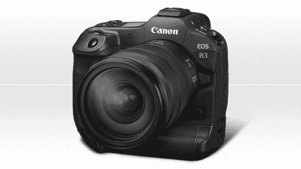

# 佳能获得 5 项 TIPA 奖 2022

> 原文：<https://medium.com/codex/canon-received-5-tipa-awards-2022-120a5d8edd65?source=collection_archive---------34----------------------->

佳能在今年的 2022 年 TIPA 奖上表现非常出色。它赢得了 5 个奖项，分别由两台 CSC 相机和两个镜头获得。照片打印机也没有被遗忘。EOS R3 被评为相机领域的最佳创新。这完全是通过取景器用眼睛控制自动对焦点。评审团还对跟踪对象时的自动对焦性能以及与 DIGIC X 处理器配合使用的快速分层 CMOS BSI 传感器表示赞赏。

资料来源:Canon.com