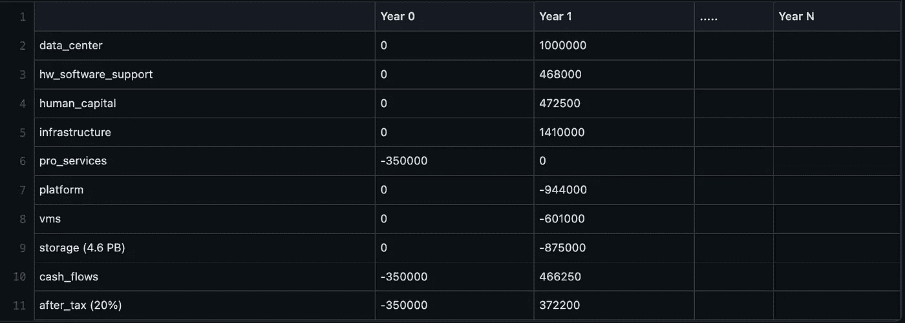
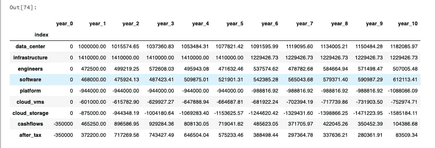
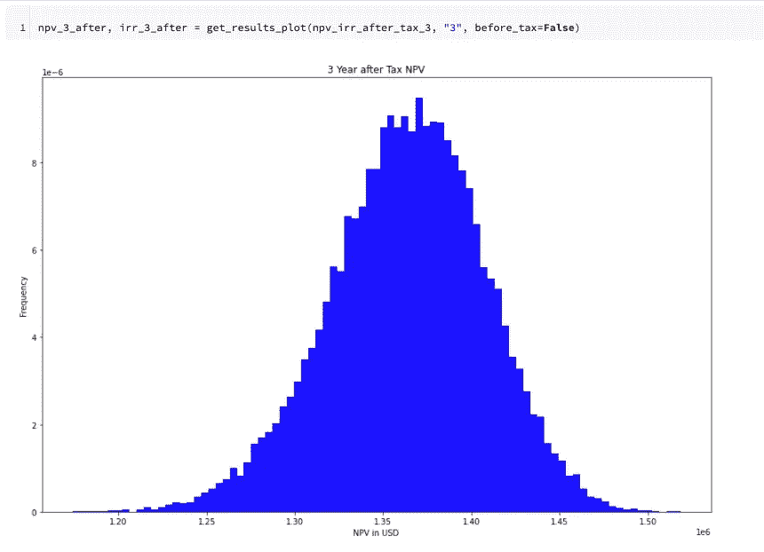
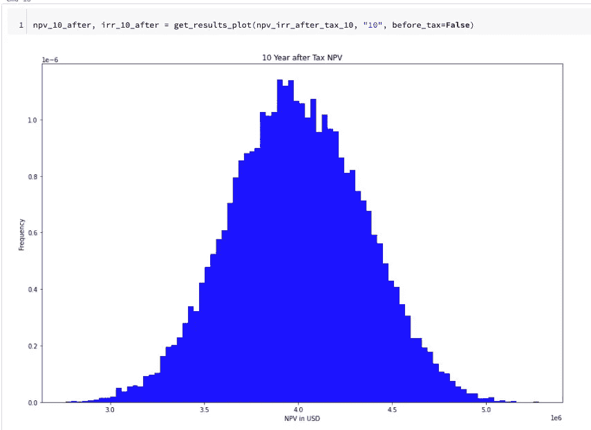

# Python 中蒙特卡洛模拟的资本预算

> 原文：<https://medium.com/codex/capital-budgeting-in-python-c51a19404a05?source=collection_archive---------9----------------------->

# TL；速度三角形定位法(dead reckoning)

通过资本预算，我们可以使用财务技术来评估与云迁移相关的项目和投资。

# 介绍

什么是资本预算？

> *资本预算是企业对潜在的重大项目或投资进行评估的过程[* [*1*](https://www.investopedia.com/terms/c/capitalbudgeting.asp) *]。*

资本预算是一种必要的罪恶；不幸的是，在分析领域，我们往往会忽略这种类型的分析。更糟糕的是，在 Google Sheets 或 MacOS Numbers 上运行蒙特卡洛模拟似乎完全不可能。虽然有一个方便的 Excel 执行蒙特卡洛模拟的插件，在这里找到了，但我似乎找不到类似的谷歌工作表或数字。

# 什么是资本预算？

既然我们有了上面的定义，让我们来分解一下什么是资本预算以及为什么我们需要这样做。我们将考虑许多老牌科技公司目前面临的一个共同难题——我们是否应该将内部工作负载迁移到云中？我们如何使用资本预算来帮助我们回答这个问题？通过资本预算，我们需要了解我们当前用于运行、维护和扩展本地集群的现金流，并根据我们迁移到云并在那里运行工作负载所产生的现金流来评估这些现金流。我之前展示的案例将着眼于与谷歌云和数据块相关的云成本。Databricks 团队非常友好地与我一起创建了这个示例，并验证了用于分析的过程。非常感谢[米沙尔·伊斯梅尔](https://www.linkedin.com/in/mishaal-ismeer-86140949/)、[维哈格·古普塔](https://www.linkedin.com/in/vihag/)和[普拉托什·戈赛因](https://www.linkedin.com/in/pratyush-gosain-04685646/)。

首先，让我们确定我们需要为本地集群考虑哪些现金流。根据您的设置，您将面临数据中心成本或托管成本。这里我们将简单地使用数据中心。此外，我们还有硬件成本、硬件/软件支持、人力资本和折旧。为了简化我们的案例，我们将假设数据中心已经完全折旧，并忽略硬件折旧，因为世界上并不是每个人都会遵循 MARCS 计划，但不要忘记在这里使用您的适当信息。对于所展示的云成本，我们要感谢数据块提供了这些内部迁移数据。对于此次迁移，我们需要考虑数据块单元(DBUs)、虚拟机(VM)、存储和迁移的专业服务成本。在运行和确定这些数字时，请咨询您的云供应商，以应用任何批量折扣或保证使用折扣。就硬件而言，我们将成本分摊到升级周期的时间范围内，在本例中为`5`年。至于人力资本成本，我们将使用`7`全职工程师专门从事迁移可替换任务。由于迁移不是瞬时的，我们将有共同的成本损失。假设它是`50%`。因此，作为我们的初步计算，我们将不得不面对云服务的`1/2`成本加上本地服务的`1/2`成本。

Gist 不渲染:[https://gist . github . com/dws mith 1983/ea 04525 f 17086436 cf9 f 0783 e 529 ea 4c](https://gist.github.com/dwsmith1983/ea04525f17086436cf9f0783e529ea4c)

由于过渡，我们第一年的现金流只有`50%`来自内部部署和云，因此用星号标出。在这里，我们对任何正现金流收取`350,000`千美元的专业服务费和`20%`的公司税率。如果我们在 Excel、Numbers 或 sheets 上这样做，我们会想要确定`N`年的年增长百分比。这将是一个静态资本预算分析(不包括 Excel 插件)。每个公司和其中的业务单位都应该有一个最低回报率，这是投资可行的最低回报率。有了我们的最低预期回报率和我们预测的现金流，我们现在可以确定未来现金流的净现值(NPV)以及内部收益率(IRR)。IRR 是高于盈亏平衡点的回报率。当净现值为`0`时，内部收益率将等于我们的最低预期收益率。也就是说，只要 NPV 大于等于`0`，项目就是可行的。

用预期回报率估算公司未来现金流的过程，允许我们使用资本预算作为工具来确定一个项目或投资对我们公司是否可行。不幸的是，估算资本流动随时间的增长并不是一个简单的过程。每年都可能有不同的通货膨胀率和原材料工艺的变化，这将影响我们的供应商以及他们下一年可能向我们收取的费用。我们如何解释这一点？

# 蒙特卡洛模拟

现在我们已经了解了什么是资本预算以及为什么我们应该使用它，让我们看看如何通过使用蒙特卡洛模拟来建立一个更好的分析。

> *蒙特卡洛模拟(Monte Carlo simulation)是一种模型，用于预测存在随机变量干预时不同结果的概率[* [*2*](https://www.investopedia.com/terms/m/montecarlosimulation.asp) *]。*

看看我们当前的例子，我们的随机变量是什么？

1.  硬件成本，
2.  软件成本，
3.  数据中心(托管)成本，
4.  工程师基于云的任务，
5.  汇率，
6.  如果这项投资的风险溢价不稳定，
7.  数据增加(云存储成本)，以及
8.  由于更多的数据、更多的用户、更多的管道和/或更多的模型，DBUs 增加了。

对许多人来说，改变最低预期回报率似乎并不直观；然而，确定合适的最低预期回报率可能会很棘手。有几种方法可以计算这个比率，每种方法都会返回不同的结果。我们如何处理所有这些变化？我们应该选择好的、坏的和一般的极端情况吗？如果我们这样做，我们只能说明 3 种极端情况，而不能真正理解这些变量的进一步相互作用。

通过使用蒙特卡罗模拟，我们可以为这些变量中的每一个设置分布，并对分布进行采样以确定要使用的值。如果我们这样做，数万次或十万次，我们可以看到我们项目的净现值结果的分布。这将使我们对我们的投资表现有一个更强有力的看法，并允许我们对这个项目在任何潜在情况下的可行性做出明智的决定。在提供的 Github 链接中，您会发现一个演示该模拟的样本笔记本，您可以使用它进行自己的分析，或者运行一些结果来看看它是如何工作的。

# 模拟结果

从[资本预算笔记本](https://github.com/tdg-analytics-platform/capital-budgeting-python)中，我们可以通过多次调用`create_data()`来查看迭代，以了解单个样本是如何完成的。下面可以看到一个这样的例子。

图片取自[https://tech.trueanalytics.ai/posts/capital-budgeting/](https://tech.trueanalytics.ai/posts/capital-budgeting/)

我选择这个迭代来证明即使 NPV 总是正的，我们也可以看到从第`2`年开始我们的`after_tax`现金流开始下降。也就是说，随着我们使用云的时间越长，有一组参数会开始对我们不利。这绝不意味着不应该考虑这种迁移。但是，企业可能希望研究更长的时间范围，并与供应商合作，以获得有保证的使用折扣以及其他好处。此外，我们在此分析中错过了一些增值收益，因此这不是全部，而是一个检查您的数据和结果的警告。

接下来，让我们考虑我们生成的两个图，`3`年和`10`年的税后净现值。

图片取自[https://tech.trueanalytics.ai/posts/capital-budgeting/](https://tech.trueanalytics.ai/posts/capital-budgeting/)

图片取自[https://tech.trueanalytics.ai/posts/capital-budgeting/](https://tech.trueanalytics.ai/posts/capital-budgeting/)

我们可以从以下现金流看出，我们从内部迁移到云的决定是明智的，并为我们的组织提供了价值。

# 参考

[1]肯顿，威尔 2022，*资本预算*，investopedia.com，2022 年 3 月 11 日访问，[https://www.investopedia.com/terms/c/capitalbudgeting.asp](https://www.investopedia.com/terms/c/capitalbudgeting.asp)
【2】肯顿，威尔 2021，*蒙特卡洛模拟*，Investopedia.com，2022 年 3 月 11 日访问，[https://www . investopedia . com/terms/m/montecalosimulation . ASP](https://www.investopedia.com/terms/m/montecarlosimulation.asp)
【资本预算笔记本】史密斯，达斯汀 2022，*资本*

*原载于 2022 年 3 月 24 日*[*https://tech . true analytics . ai*](https://tech.trueanalytics.ai/posts/capital-budgeting/)*。*