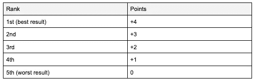

# 卡尔达诺，索拉纳，波尔卡多特，凡托姆和泰勒斯 vs 时钟！

> 原文：<https://medium.com/codex/cardano-solana-polkadot-fantom-and-telos-vs-the-clock-d439aa73e4a2?source=collection_archive---------0----------------------->

[Unsplash 上](https://unsplash.com/photos/mf-o1E7omzk) [CHUTTERSNAP](https://unsplash.com/@chuttersnap) 拍摄的照片

我们将通过性能来比较一些最相关和最受欢迎的区块链平台。该指标可以分为许多其他子指标，因此我们将深入研究每个子指标，并从结果中获得一些有趣的见解。

# 介绍

说到加密，性能和速度是两个最重要的考虑因素。因此，我们将分析趋势，以了解市场的走向，以及哪个平台对于开发者、内容创作者、学生和投资者来说是理想的合作平台。

在本文中，我将简要解释我为什么选择这些平台，它们是进行比较的关键指标，以及为什么速度如此重要。

尽管所比较的一些平台在分散化和稳定性方面存在问题(如 Solana)，但这些区块链在社区、受欢迎程度、价值和性能方面是最有前途的。所有这些都可能对未来市场产生巨大影响，投资者应该密切关注它们。

# 要比较的关键指标

**每秒事务数(**[**TPS**](https://cryptowallet.com/glossary/transactions-per-second-tps/)**)**:顾名思义，这是指网络每秒可以执行的事务数。

**Blocktime** :它决定了在区块链网络中产生一个新块需要多长时间。时间越短，交易越快。

**编程语言**:这是指用来构建平台的编程语言，以及开发者可以用来在网络之上构建 dApps 的编程语言。

# 并排比较

现在，我们将深入研究这些指标，并在每个指标下比较不同的产品。

我们将通过在三个指标下对平台进行排名来比较它们。因此，我们将根据最终排名获得一个分数。

# 每秒事务数(TPS)

TPS 会随着时间的推移而变化，并且有很多方法可以伪造结果。例如，一些区块链网络通过采用错误的统计数据，如最大值而不是平均值，改变指标以获得更好的结果，或直接虚构数字以显得更有效，来伪造更高的 TPS。

在本文中，我们将尝试获得尽可能准确的值。对于一些更高容量的链，很难产生足够的网络需求来清楚地建立它们的阈值。此外，最有可能的是，所有这些第 1 层链理论上可以使用未来的汇总和分片来扩展(除了 Solana，他们已经明确表示这不是他们的计划)。也就是说，这种比较是未来前的汇总和分片。这是严格的基础协议对基础协议，我们的总结利用现有的现实世界的数据来描绘画面。

**卡尔达诺:**根据关于[卡尔达诺](https://cardano.org/)网络的不同来源，他们已经达到了 257 TPS 的峰值潜力。需要注意的是，即使这个平台极其受欢迎，但它从 2015 年开始就一直生活在它的白皮书中，仍然没有处于竞争状态。

**索拉纳:**索拉纳通过其历史共识证明宣称拥有 65k TPS 的产能；但是，它在 TPS 中添加了共识消息。共识信息不应包含在 TPS 中。索拉纳海滩仪表盘显示了大约 3000 个 TPS 的数字，其中 80%或更多是典型的共识信息。此外，这个仪表板还显示，在实际用户事务负载大约为 300 TPS 时，Solana 网络崩溃了 17 个小时。此外，同一个仪表盘还显示了 2021 年 9 月 17 日崩溃前后发生的多个瓶颈事件。

Polkadot 声称通过未来分片，Polkadot 理论上每秒能够执行超过 100 万次交易，但这从未得到证实。数据显示[波尔卡斯坎](https://polkascan.io/polkadot)仪表盘从未达到 166 TPS 以上的稳定值。尽管如此，他们在测试时显然已经能够达到 1,000 TPS 的最大值。

**Fantom:** 同样，不同的消息来源称，这种网络可以达到数十万 TPS 的理论水平，但没有数据支持这些说法。Fantom 基金会发布了一条推文，声称他们的“共识引擎”达到了 10，000 TPS，这对 DPOS 共识网络来说绝对是可能的。然而，我们不确定 Fantom 是否像 Solana 一样，将共识信息包括在总数中。添加共识信息显然会大幅提高他们的 TPS。10，000 TPS，没有分片，是一个真正的挑战，因为 Solidity 不是一个非常有效的语言。此外，根据来自 [ftmscan](https://ftmscan.com/) 页面的数据，他们通常平均只移动 10 TPS 左右。这很好，但应该注意的是，他们的网络在 2021 年 2 月 25 日崩溃了 7 个小时，当时的 TPS 仅为平均水平。很明显，这是一个集中化/标桩问题，他们声称已经通过治理解决了这个问题。

**Telos:** 这个基于 Eosio 的平台使得收集数据变得更加容易，因为多个 Eosio 网络已经进行了几次有记录的压力测试。在 Eosio Jungle Testnet 和其他 Eosio 网络上执行的测试的实际数据表明， [Telos](https://telos.net/) 能够通过 C++智能合约达到甚至超过 10，000 TPS。很可能他们的 EVM 数更少，因为如前所述，Solidity 不如 C++高效。由 Telos 核心开发人员进行的测试证实，该链可以保守地持续保持 6，000 以上的 TPS，不包括共识消息传递。还值得注意的是，根据阻塞活动数据，Eosio 协议链已被记录为通过真实世界的需求在 24 小时内平均执行 945 TPS。在所有的 Eosio 链中，我们选择了 Telos，因为它是唯一一个能够通过 EVM 生成实体的 Eosio 链。

# 摘要

# 封锁时间

Blocktime 是指在一个链中创建下一个块所需的时间。正如 TPS 一样，块时间会随着时间的推移而变化，并取决于许多因素。一些网络借此机会显示虚假或有偏见的结果，假装更快。实数通常会显示不同的结果。

Cardano:最小的阻塞时间大约是 20 秒。

索拉纳:索拉纳声称有 0.4 秒的封锁时间。然而，来自 Solana Beach 的数据显示平均阻塞时间接近 0.6 秒。

波尔卡多特:波尔卡多特网络目前的阻塞时间大约为 6 秒。

Fantom:从 [ftmscan](https://ftmscan.com/chart/blocktime) 页面，我们看到阻塞时间大约为 1 秒。

Telos:这个网络已经有了 0.5 秒的持续阻塞时间记录。

# 摘要

# 程序设计语言

编程语言定义了开发人员和用户的体验以及应用程序的总体性能。每种语言中可用的现有区块链码的数量是决定 dApps 在区块链网络中部署范围的关键指标。

首先，我们来看看每个平台都支持哪些编程语言。

从上面的概述表中，我们看到 Telos 是唯一一个直接为开发人员提供多种语言选项来构建应用程序的软件。也就是说，应该注意的是，尽管其他链只提供对一种编程语言的直接支持，但其中一些链构建了支持其他语言的第三方第 2 层平台。

现在，让我们比较每种编程语言，以确定哪种语言在效率和智能合约开发方面是最好的。我们将跳过坚固性进行比较，因为没有太多关于这种编程语言速度的信息。

可以从知名度入手。根据 [Stackshare](https://stackshare.io/stackups/cplusplus-vs-haskell-vs-rust) 投票，我们可以知道 C++是表中提到的语言中最受欢迎的。

流行在这里是一个关键因素，因为这意味着技术背后有一个更大的社区来照顾开源应用程序，并为每个问题提供更好的解决方案。

就区块链特有的代码库而言，Solidity 拥有最大数量的开源 dApp 和区块链代码可供使用。

但是编程语言的速度呢？

比较编程语言速度的方法是通过编写算法，比较每种编程语言完成任务所需的时间。通过这种方式，您还可以比较内存使用和 CPU 使用。

我们拿一个复杂的算法来比较一下性能。对于这篇文章，我们将采取 [Fannkuch-redux](https://benchmarksgame-team.pages.debian.net/benchmarksgame/description/fannkuchredux.html#fannkuchredux) 。

*   取{1，…，n}的一个排列，例如{4，2，1，5，3}。
*   取第一个元素，这里是 4，颠倒前 4 个元素的顺序:{5，1，2，4，3}。
*   重复此操作，直到第一个元素为 1，因此翻转不会再改变任何内容:{3，4，2，1，5}、{2，4，3，1，5}、{4，2，3，1，5}、{1，3，2，4，5}。
*   数数翻转的次数，这里是 5 次。
*   保持校验和:
    -校验和=校验和+(如果 permutation_index 是偶数，则翻转 _count 否则-翻转 _count)
    -校验和=校验和+ (toggle_sign_-1_1 *翻转 _count)
*   为所有 n 人这样做！排列，并记录任何排列所需的最大翻转次数。

# 摘要

值得注意的是，Telos 运行智能合约(通过其本地和 EVM ),最终编译到 WASM (WebAssembly)。WASM 运行时专为速度和确定性执行而构建。Telos EVM 正是以太坊 2.0 努力构建的:一个 WASM 运行时执行环境。

只有当运行时执行环境的速度等于或大于运行时执行环境的速度时，编写契约的语言的速度才是相关的。就 Telos 而言，它的标记语言和运行时执行环境都非常高效，比其他任何东西都要快。

# 总结

根据本文开头描述的评分系统，结果如下:

让我们将该数据表转换成图表，以便更好地理解结果:

因此，我们可以得出结论，在速度和性能方面最先进的平台是 Telos。在每一项指标上，它似乎都明显领先于竞争对手。

非常感谢你的阅读。如果你认为你对这个话题有什么有趣的补充或问题，请不要犹豫，留下你的评论。