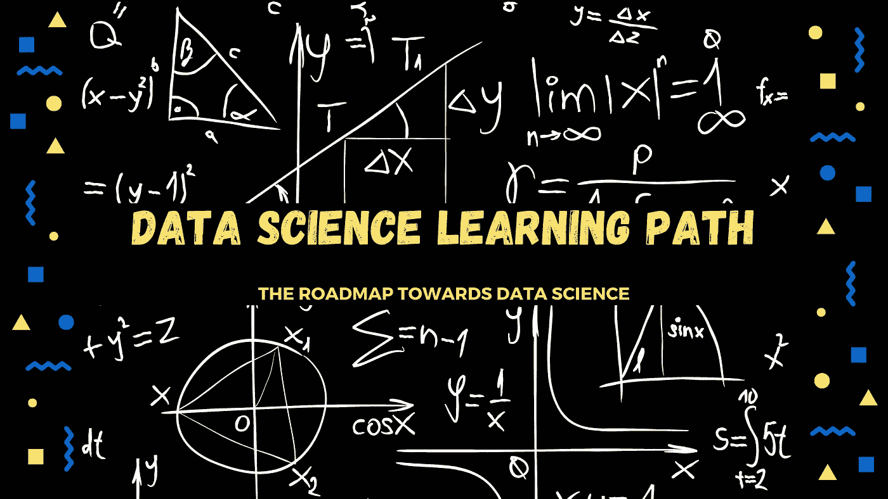
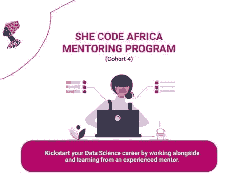
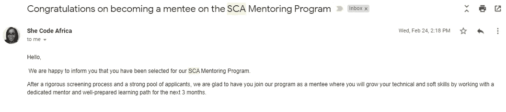
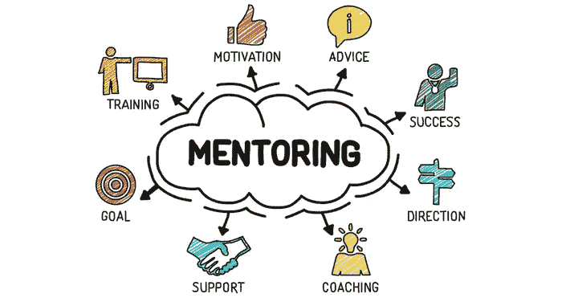

# 走向数据科学的新手职业路线图

> 原文：<https://medium.com/codex/career-switch-to-data-science-b319bffe871?source=collection_archive---------7----------------------->

## 从业务开发到数据科学的智能职业转型之旅

毫无疑问，数据科学现在是当今世界上要求最高的工作之一。然而，对于新的数据爱好者来说，加入这条道路已经变得越来越困难和势不可挡。别担心，我也去过那里，哦，天哪！！

我知道你想知道这篇文章与你屏幕上弹出的无数文章和你已经读过的文章有什么不同。好吧，继续听我解释。我在这里不是要给你一个最终的学习路径列表，以及你必须掌握的资源，以成功地将你的职业生涯转变为数据科学。我在这里分享我旅途中的一种方法，这种方法帮助了我，希望它也能帮助你。

> **简要背景**

我第一次接触数据科学是在一家培训和咨询公司担任客户经理。我有机会领导新 ICT 培训课程的产品开发。当我在研究第四次工业革命(4IR)技术时，我偶然发现了大数据模块，这激起了我对该领域的兴趣。作为一名业务发展专家，我接触了大数据的一些方面，主要是销售分析、预测和报告。此时，我唯一依赖的工具是 Excel 和 Salesforce。

经过研究，很明显，我在业务发展方面的进步受到了我缺乏更有效的数据分析工具的知识的阻碍。这成了我职业生涯转向数据科学的基础。

> **学习经历**

> “世界是你的。要靠你去找珍珠。”― **克里斯·加德纳**

互联网确实是你的牡蛎。但是对于像我这样的初学者来说，关于从哪里开始，读什么，以及如何建立一个作品集的资源数量和信息量可能会令人不知所措。为了克服这些障碍，我报名参加了[预测分析实验室](https://www.masterclass.predictiveanalytics.co.ke/)的[大数据职业辅导项目](https://masterclass.predictiveanalytics.co.ke/course/switching-to-big-data-career-coaching-program#description)。在这里，我经历了一个月的辅导计划，让我了解了这个领域以及我的职业生涯将会是什么样子。有了清晰的结构后，我报名参加了[数据科学入门](https://www.masterclass.predictiveanalytics.co.ke/course/introduction-to-Data-science#description)课程，后来又报名参加了 Udemy 和 Coursera 的一些 MOOCs 课程，以完善我已经学到的东西。

增长数据科学技能的一部分也需要网络。成为一个技术社区的一部分和志同道合的人的团体是很好的。我目前是[编写数据科学代码的女性](https://www.womenwhocode.com/datascience)、[机器学习领域的内罗毕女性&数据科学](https://www.meetup.com/Nairobi-Women-in-Machine-Learning-Data-Science/)和[她编写非洲代码](https://medium.com/shecodeafrica)社区的成员。

> **导师指引路线图**

作为 [She Code Africa](https://medium.com/shecodeafrica) 技术社区的一员，我的数据科学之旅获得了巨大的发展。该社区提供分级会员计划，允许人们在与其他成员互动的同时提高他们的技能和职业发展。

2021 年 1 月，我向申请 SCA 导师计划迈出了一步。该计划非常有竞争力，但我很幸运地被选为 2021 年 3 月启动的群组四(数据科学轨道)的一部分。你可以在这里阅读更多关于导师制项目的内容。

我的电子邮件截图

当我写这篇文章时，我刚刚结束了在 She Code Africa 作为数据科学家学员的第一个月。你可以在这里阅读到目前为止我的所有经历。旅程充满挑战，但总的来说，结构化的每周学习路径很有见地，是一种新鲜空气，尤其是如果你是一名数据科学新手。

[辅导&导师制的好处](https://www.google.com/url?sa=i&url=https%3A%2F%2Ftenshey.com%2Fstudies-show-mentors-are-essential-for-success-yet-many-struggle-to-find-them-2%2F&psig=AOvVaw3QtrxX0y57ued3ek1dRXAQ&ust=1616933489630000&source=images&cd=vfe&ved=2ahUKEwi9_7vjuNDvAhXkEGMBHbC8CQwQr4kDegUIARCYAQ)

作为一名新手，在数据科学之旅中，有专门导师指导的学习路径可能是最佳选择吗？嗯，我认为这种导师和学生之间的新探索是一种成功的学习曲线，许多人都应该尝试一下。原因如下:

✵导师会引导你走上最适合你职业目标和市场需求的学习道路。

✵导师帮助你制定相关技能和资源的路线图，专注于给你的旅程带来最佳结果。

✵:通过导师计划，你可以获得关于你的优势领域以及如何解决需要改进的薄弱领域的建设性反馈。

✵An 与导师的接触使你能够寻求答案，获得建议，并与零判断分享想法或想法。

✵导师是免费的。你会有一个专门的导师在你的旅程中支持你。多酷啊。

> **总之**

事实是，开始向数据科学职业的转变可能会令人畏惧、紧张和不知所措。到目前为止，我发现除了数据科学资源之外，与导师合作是建立实现这一目标的基础。这是因为一个专业的数据科学家一直站在你的立场上，了解就业市场，知道怎样才能达到目标，同时避免他们可能犯的一些错误。通过他们的专家意见，你很容易策划你自己的“最终”学习路径，成为一个行业就绪的专业人士。

这个月，我正式标志着我开始这个职业转换旅程一周年。的确，这很艰难，有几次我几乎要放弃了。我一路走来学到的一些东西是，有些人可能会说，任何旅程都没有捷径可走。我同意基于一个人需要覆盖的资源或一个人需要获得的技能。但是当谈到避免陷阱和建立基础时，导师可能就是你的关键。

我还没有掌握这个领域，但我现在感到欣慰的是，我知道自己在不断进化，我现在离实现我的梦想又前进了一步。

感谢[她编码非洲](https://www.linkedin.com/company/she-code-africa/mycompany/)和[预测分析实验室](https://www.linkedin.com/company/predictive-analytics-lab/)的指导和给我的机会。感谢你在我的职业转变旅程中的参与。

我希望这篇文章成为你新的数据科学职业旅程的敲门砖。请记得鼓掌，并与任何在旅途中发现此内容有用的人分享。请随时在 [LinkedIn](https://www.linkedin.com/in/mapenzi-supaki/) 或 [Twitter](https://twitter.com/Mapenzi_Supaki) 与我联系。

☲☲☲☲☲☲☲ ***为成功的职业转换干杯！*** ☲☲☲☲☲☲☲