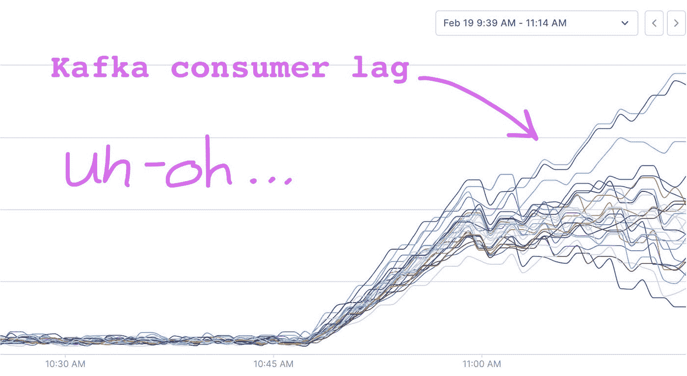
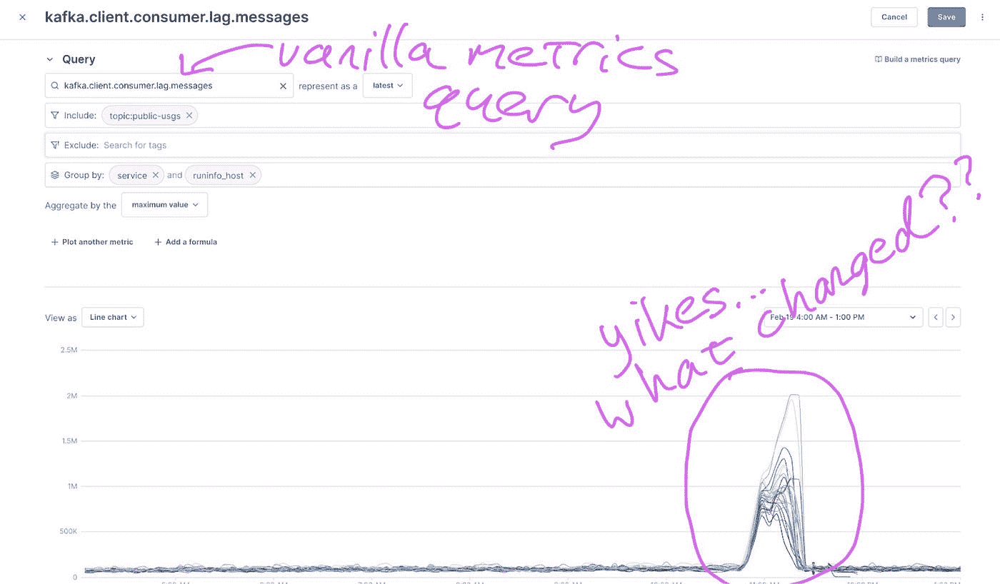
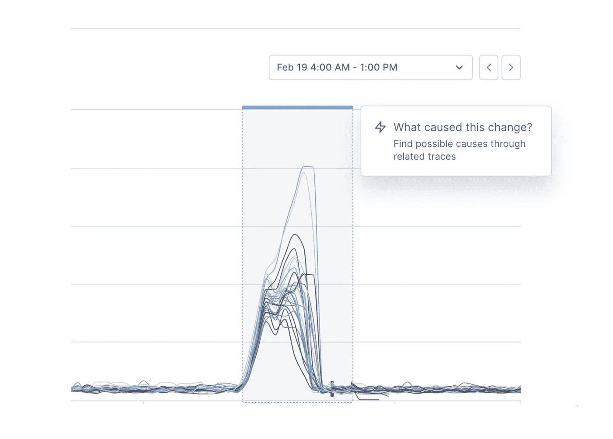
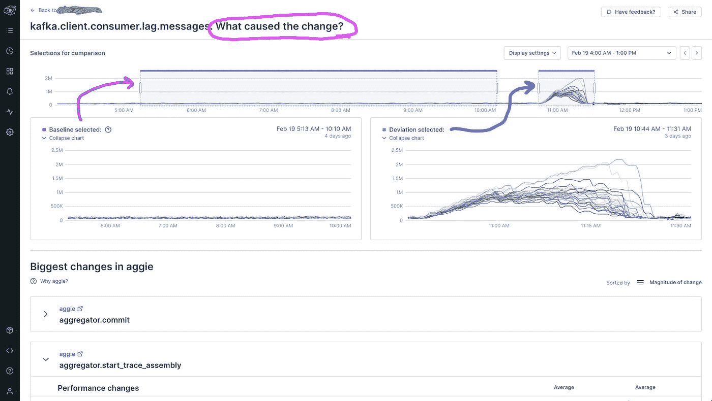
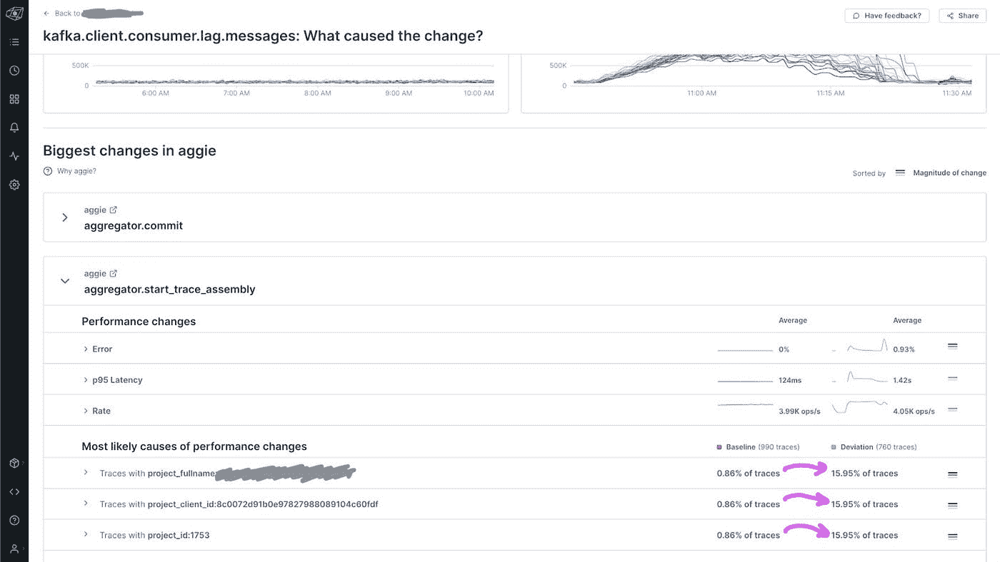
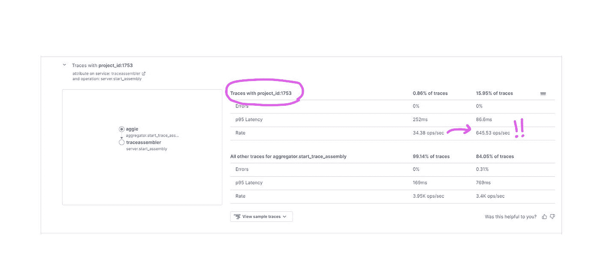
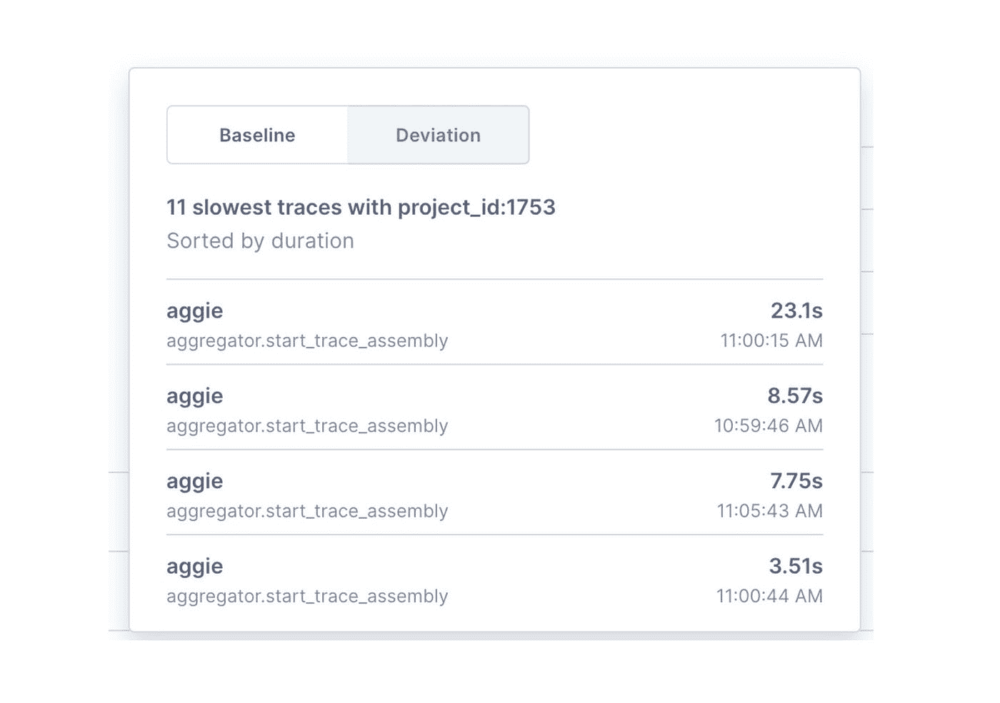

# 灾难性的 Kafka 中断、资源争用以及可观察性如何有所帮助

> 原文：<https://medium.com/codex/catastrophic-kafka-outages-resource-contention-and-how-observability-can-help-c84b400f4112?source=collection_archive---------0----------------------->

## [法典](http://medium.com/codex)

*原贴为本* [*碎碎念*](https://twitter.com/el_bhs/status/1364282343196827650) *。*

0/如果你或你爱的人在作品中使用卡夫卡，我敢肯定，当一个制片人淹没一个话题并造成一连串失败时，会有一些情绪上的痛苦。这是一个关于监控和可观察性如何使这远不那么痛苦的线索。

👇

1/在某种程度上，Kafka 就像您系统中的任何其他资源一样:例如，您数据库的 CPU、您的 NIC 或您的 RAM 预留。所有的资源都是有限的，当它们参与事务时，它们的数量会比不参与事务时少一点。

2/Kafka 失败如此惊人的原因并不全是 Kafka 的错:只是它承担了一个几乎与网络本身一样重要的角色，因此当它崩溃时，它可以带走你的应用程序。新的故障模式被艰难地发现，所有人都失败了。📉

3/(旁注:我记得在 21 世纪初，网络故障比今天更“常见”——就可靠性疤痕组织而言，也许卡夫卡真的是新网络？)

4/在任何情况下，当卡夫卡超负荷时，每个人脑海中的直接问题实际上是可观察性的中心问题:“是什么导致了这种变化？”(补充说明:关于这个主题的更多信息，请点击这里→ [可观察性不会取代监控](https://twitter.com/el_bhs/status/1349406414138003457))

5 虽然这很难，因为我们在这里调查的“变化”是在这些相当不透明的 Kafka 滞后指标中，但“原因”(或至少是主要因素)与*工作量*有关:即 Kafka 的*使用*的一些实际变化。

6/我接下来要展示的是 [@LightstepHQ](https://twitter.com/LightstepHQ) 产品的一部分，但这与其说是一个推介，不如说是一种使所有这些更加具体的方式。沿着这些思路，让我们以我们自己的 SaaS 的一个真正的卡夫卡问题为例:

7/为了设置上下文，这个图表来自 Lightstep 自己的自托管元监控中的一个完全“无聊”的指标查询。我们采用 Kafka 消费者滞后，通过感兴趣的特定 Kafka 主题进行过滤，进行分组，并可视化结果。

8/这些结果也大多是“无聊”的——除了一段大约 45 分钟的时间，不幸的是，它们一点也不无聊！咦——又是“什么变了？”

9 在国际海事组织看来，这是正常/常规监测工具让我们失望的地方。事实上，到目前为止最重要的问题(关于变化)是，在任何孤立的度量产品中，基本上是无法回答的。但是如果你可以点击异常点呢？

10/因此，在这里我们*可以*只点击异常，即使是在这样一个普通的旧指标图表中。也就是说，Kafka 异常本身变得*可操作*，我们可以直接过渡到 Kafka *工作负载*的引导式分析。

11/点击“发生了什么变化？”按钮，我们被带到一个专门“改变情报”的 UX。在文件夹上方，我们看到了正在讨论的指标 Kafka 消费者滞后——以及偏差(我们点击的位置)和为我们预先选择的自动化基线:

12/然后，几乎没有其他打字或用户输入，也没有系统本身的任何特殊配置，真正的面向变化的可观察性可以*向我们显示 Kafka 工作负载在偏差*期间如何变化，如下所示:

13/我们在这里看到的是*一个客户*突然从工作负载的 0.86%增加到 15.95%。这就是消息延迟增加的原因。我们刚刚开始调查，已经有了确凿的证据——而且是高基数的证据！

14/使用传统的工具，诊断 Kafka 资源争用是非常具有挑战性的，特别是当它是由于像这个真实世界例子中的工作负载变化引起的时候。但在这里，它并不那么令人畏惧，即使是在事情发生几天后。

15/如果我们想知道这些单客户交易在做什么，我们只需查看:

16/原来如此。卡夫卡是有用和有价值的，但它总是一种共同的依赖，并可能以惊人的方式失败——借助现代的可观察性，至少我们有一个清晰的机会来理解为什么，而且很快。

*在 twitter 上关注我(* [*el_bhs*](https://twitter.com/el_bhs) *)以获得更多类似的帖子。*