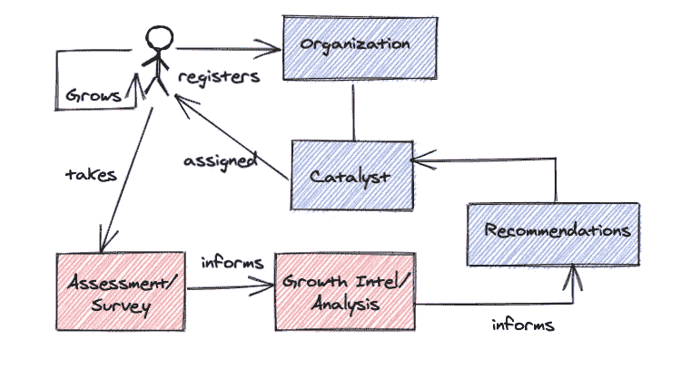
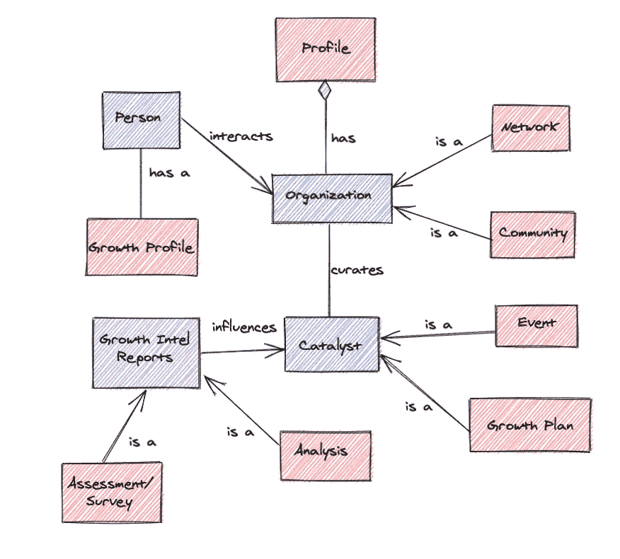
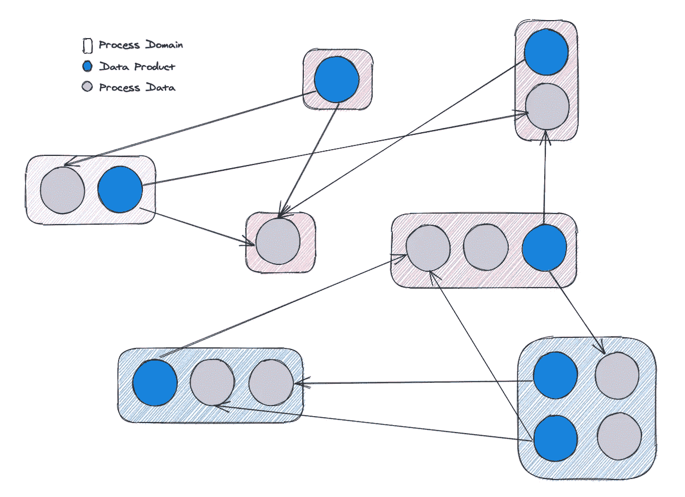
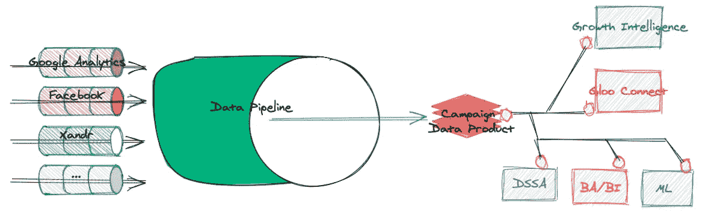
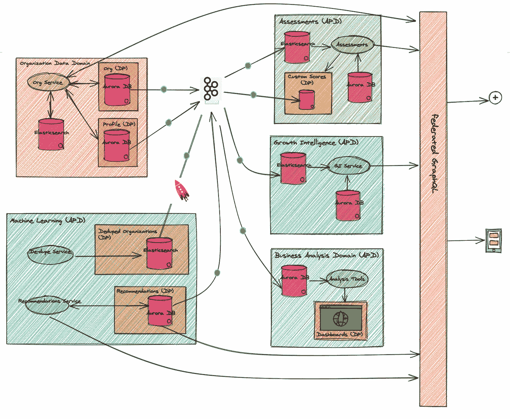

# 在数据网格中捕捉数据:应用(第二部分)

> 原文：<https://medium.com/codex/catching-data-in-a-data-mesh-applied-part-ii-114cae4d139a?source=collection_archive---------6----------------------->

## [法典](http://medium.com/codex)

## 本系列将深入探讨数据网格范式如何帮助 Gloo 构建一个支持个人成长的平台。[第一部分](https://thickideas.medium.com/catching-data-in-a-data-mesh-principles-part-i-2b2e11e9e33a)探讨了我们如何思考 Gloo 的核心网格原则。第二部分强调了这些原则的应用，获得组织支持的途径，以及利用 Kafka 生态系统来实现的架构模式。

# 概观

在 [Gloo.us](http://Gloo.us) ，我们正在开发技术，将希望开始成长之旅的个人与他们寻求的资源、导师、精神团体和康复中心联系起来。我们有许多服务于不同需求的应用程序，需要后端服务的独特组合。为了支持这一点，我们创建了一个由许多异构流程、微服务、管道和数据存储组成的平台。可以说，该系统最重要的方面是数据，尤其是纵向数据跟踪和为种植者规划路径。挑战在于使平台数据可访问且可靠，消除访问争用，避免高延迟 ETL，并对我们的应用程序团队保持一致。此外，我们希望将数据划分到团队拥有的安全域中。这些域必须仍然支持使用它们的进程的粒度交互。我们通过采用数据网格原则并利用 Kafka、Kafka Connect 和 Kafka streams 解决了这个问题。数据网格方法有助于我们避免资源争用、管道特性蔓延，或者担心引入数据湖或大数据管道方法中常见的突破性变化。

这篇文章的目的是讨论我们作为一个工程团队向数据网格的文化转变，展示一个架构示例，并讨论我们用来实现网格的技术。

# 搭建舞台

虽然这个讨论强调的是架构模式，但是如果不为我们在 Gloo 上构建的平台提供一些上下文，那将是我们的失职。下一张图为我们的系统设置了一个非常简单的用例。

在这个视图中，一个用户——一个种植者——向一个组织注册。该组织提供了一套精心策划的催化剂，引导用户通过他们的个人成长目标。种植者被分配了一套催化剂，随着时间的推移而成长，并把评估作为跟踪进展的一个因素。这些数据，当与许多信号结合时，为情报报告提供信息，从而为种植者的旅程提供更好的建议。

# 获得牵引力

我们构建网状文化的方法从创建术语、定义初始领域和所有权、阐明团队章程以及关注长期团队支持开始。

## 创建术语

最重要的一步是让每个人都认同一种共同的语言，并在他们自己的环境中应用它。一旦组织将我们的数据视为产品，它就有了新的含义——服务于系统内特定需求的更强、更有目的的意图。数据的管理更加谨慎，并且更关注它在系统中的作用。我们的术语可以在本系列的第一部分中找到。

## 定义数据域和数据产品

一旦团队转向将数据视为服务于更广泛生态系统需求的产品，数据网状文化就会自然形成——康威定律。产品所有者考虑的是数据的最大利益，而不是为了满足下游用例的需求而塑造数据。换句话说，它引发了一场关于业务逻辑归属的辩论——在数据领域还是在流程领域。范式的第一个原则是，数据产品是为产品服务的，而不是为流程域中所需的下游用例服务的。这是一场逻辑归属的辩论，然而，结果应该基于这一原则。遵循这个原则会导致很大程度的组织规模，因为开发团队能够在不依赖其他团队的情况下解决他们的用例。在接下来的部分中，我有一个例子来说明这是如何工作的。

我们决定从最低的、原子级别的细节开始定义我们的产品，让我们的开发和产品团队定义起来简单明了。团队可以利用现有的微服务和实体关系图来快速识别产品和领域。目前还不清楚这是我们的长期计划还是启动我们数据网格之旅的一种方式，因为最底层的细节并不总是能传达给一些业务利益相关者。结构*可能*类似于左图。

## 阐明团队章程

数据网格思维方式的一个关键是组织的结构。必须有明确的数据域所有者，并明确区分数据产品和应用程序使用情形。定义这种结构并改变思考工作的方法，会导致很多问题，特别是当一个组织有坚定的信念或实践时。例如，团队可能会抵制“大数据”技术的大众化，抵制使用事件流进行开发，和/或将数据定制从产品中移出。幸运的是，我们的方法在这些领域没有遇到太多的阻力，我将其归因于应用我们的网格术语/规则并组建了一个新团队:数据网格工程(DME)。这个团队的目的是使团队能够非常容易地连接到网格，以便提供或使用数据。DME 团队构建了基础，并在解决方案成为自助服务之前解决了几次问题。输入数据网格工程

# 输入数据网格工程

对于网格两端的团队来说，数据网格的实现可能是令人生畏的:一方提供数据，另一方消费数据。为了帮助团队利用网格，我们组建了一个 DME 团队，专注于连接、实现和架构。建立这样的支持团队需要明确的目标和章程，以区别于数据科学、数据工程(DE)和应用程序团队。该团队的职责包括:

*   支持与事件、数据源和流的无摩擦集成
*   使用网格技术实施、指导和设计解决方案
*   为使用网格构建的团队提供监控和可见性的工具和无缝集成，例如普罗米修斯度量
*   为事件驱动和数据网格架构创建、维护和传播跨职能原则
*   推动团队实现自助连接和数据网格的使用

相反，团队不负责:

*   构建或维护用于从外部数据源获取或丰富数据产品的数据管道
*   管理数据产品
*   从我们的数据产品中获取商业价值
*   为数据产品或衍生数据集提供业务分析、数据科学分析、机器学习模型或报告

这种方法仍然展示了技术孤岛，直到我们遵循自助服务原则。mesh 团队正在构建自助工具，如框架和示例，以使连接变得简单和无缝。此外，DME 团队提供持续部署工具来管理主题、配置、数据源/接收器连接器、流定义和模式。

# 使能技术

用于实现我们的数据网格的工具需要支持中心主题:访问单一的真实来源(数据产品)，将数据产品消费到流程数据存储中，以及支持事件流优先的理念。我们选择 Kafka 工具来实现我们网格的核心结构，尽管有些域为我们的应用程序提供了 REST 接口——一个数据端口——以及联邦 GraphQL。所有数据端口都利用模式注册表来跟踪数据产品的版本化模式。我们的 Kafka 基础架构托管在 [Confluent.io](http://Confluent.io) 上，该平台通过快速构建基础架构、提供最佳实践以及尽全力丰富我们的知识，成为我们交付数据网格的优秀合作伙伴。下面是我们用来解决数据网格需求的 Kafka 工具的概述:

*   卡夫卡。流式事件连接的核心组件。在内部，我们在服务中使用 Java 和 NodeJS 客户端。由于对测试框架的支持不足、不完整的客户端配置和其他实现问题，使用节点库带来了一些挑战。Java 库是生态系统中的一等公民。
*   卡夫卡连线。数据存储之间直接无缝连接的主力。我们使用 S3 接收器、e S 源/接收器、JDBC 源/接收器、红移接收器、http 源、通用文件系统源/接收器和一些自主开发的连接器。例如，我们可以使用 JDBC 源连接器来检测数据变化，并发出供多个流程域使用的事件——通常直接发送到它们的数据存储中，如 Postgres、Elasticsearch 或 Redshift。大多数都很容易使用，并且高度可配置。我们自己托管 Kafka Connect 集群(AWS ),尽管我们也在评估向融合的迁移。虽然这种方法可能导致最终一致的数据副本，但是它支持我们让过程域拥有它们的用例的愿望。
*   KSQL(数据库服务器)。该工具用于对流事件执行较小到中等程度的转换。例如，当我们没有支持流程来构建专门的索引时，创建一个 ES 文档。一些用例在 KSQL 中蔓延，但是简单性、易用性以及我们不会污染数据产品的事实使它成为一个可靠的选择。

# 概念建筑

我们的数据网格体系结构的基础可以绘制成一个高级概念视图。在我们的设计中，数据产品是数据提供者，而不是网状消费者。流程域负责将状态更改事件消费到它们自己的数据存储中。这允许一个域负责任何复杂的数据转换、丰富和增强，以满足特定的用例。流程拥有这些需求，而不是数据域。虽然这种方法允许伸缩性和灵活性，但这意味着系统必须支持最终的一致性、共享数据产品和数据转换。我们可以通过使用事件驱动的架构来缓解任何一致性问题，这种架构可以根据需要尽可能快地保持数据同步，从几秒钟到几分钟不等。

网格的概念视图

该图展示了假设和一般的架构模式。流程域由彩色矩形表示。他们可能由零个或多个数据产品消费者组成。他们还可以提供一种或多种数据产品。蓝色圆圈代表的数据产品仅提供网格数据。灰色圆圈表示的流程数据存储可以消耗内部使用的数据产品。这些数据最终将与源数据产品保持一致。

# 示例:数据管道的角色

在我们的系统中，我们使用大数据管道来规范化、转换、丰富和增强来自各种外部来源的大数据集。IPaaS 层通过处理不同的数据速率来管理集成，控制认证，并提供数据管道。管道的输出是一个数据产品，它是我们网格上的一个提供者节点。一个应用的用例是从几个来源(如谷歌分析、脸书、Xandr 等)获取(广告)活动数据。实施可能包括创建一个主*活动数据，代表所有外部数据源的标准化视图。最终的数据产品是从源数据及其为平台提供的价值的角度形成的。它代表了最好的、完整的画面，而不是被服务于许多下游用例之一的聚集或派生属性所膨胀。请注意，给定数据的规范化和完整视图，外部用例是隐式支持的。例如，如果一个应用程序需要一个活动数据的汇总视图，那么它的本地数据将拥有满足这个用例所需的一切；操作不在数据产品或数据域本身。*

在下图中，几个数据源被吸收到一个大数据管道中，以产生一个数据产品。在我们的模型中，我们声明了一个带有关联模式的“活动数据产品”。该基础设施足够灵活，能够在需要时提供更细粒度的(数据)产品，如“脸书竞选数据产品”。流程如下所示:

1.  数据被接收到管道中，并形成数据产品。数据通过一个充满数据事件的 Kafka 主题在网格上可用。
2.  Kafka 连接器(橙色圆圈)— S3 源连接器—检测状态变化并发出关于某个主题的事件。这个流可以通过几种方式使用，但是，我们在这里使用的是接收器连接器。
3.  我们为这个流使用了几个不同的接收器连接器，比如 S3、弹性搜索和 JDBC。例如，我们在 Elasticsearch 中使用该流来创建增长智能图。

要点是:*拥有数据产品的团队不关心应用程序的图形，只关心源数据的完整性。*

总之，数据管道在创建将在数据网格上可用的数据产品中起着核心作用。下一个例子更加复杂，因为它集中在一个反馈循环中，消费过程提供的结果可以通知或改进源数据产品。

# 示例:数据产品的反馈回路

前面的例子介绍了如何从数据管道中创建数据产品，以及如何使其可访问。同样的模式和原则也适用于我们的网状架构。在这个例子中，重点是消费领域如何执行分析、改进数据以及向源数据产品提供反馈。有人可能会说，如果一个过程正在影响数据产品的质量，那么它应该存在于同一个域中，然而，在我们的模型中，消费域正在做大量的相关任务，我们认为最好留给它自己的域。我将重点介绍网格在连接参与域以形成事件驱动的反馈回路中的作用。这个例子的细节部分是假设的，但是它完全代表了我们在系统中使用的真实模式。

用例回顾了由组织、位置和服务组成的数据是如何在网格上获得的，其中消费域执行的操作会影响源数据产品的质量。由于这些质量检查，原始数据可能会得到改进，并且这些更改必须对所有感兴趣的过程可用。再次执行分析，并重复工作流程。在这种情况下，由于添加组织详细信息的多种机制，我们会遇到组织可能存在或包含重复数据的情况。一些流程领域依赖于获取没有重复的组织数据，例如客户支持、商业智能、机器学习和核心服务。从高层次来看，网格提供了一个“实时”的组织数据流，供重复数据消除过程使用。该过程识别重复并产生重复组织的数据集，形成可用于帮助通知原始组织数据产品的派生数据产品，从而形成反馈循环。接下来，我们可以回顾解决这个用例的架构模式。

如前所述，我们的网格架构严重依赖于 Kafka 工具，如 Kafka、Kafka Connect 和 KSQL。反馈循环的工作流涉及组织变更，这导致产品被传达给对组织的事件感兴趣的过程域。Kafka Connect 连接器(JDBC 源连接器)被配置为监视组织数据库，并在发生更改时生成事件。连接器配置允许控制轮询速率、身份验证和事件主题。对组织感兴趣的领域包括:

*   评估—处理用户反馈
*   BA —生成内部仪表板
*   成长智能—跟踪成长
*   机器学习-分析重复的组织

评估和 BA 域使用 JDBC 接收器连接器连接到网格，这有助于我们更新其内部数据存储。这些是域进程用来构建定制数据集以驱动其各自应用程序的副本。增长智能和机器学习(ML)的消费使用 Elasticsearch (ES)接收器连接器，因为它们需要真正快速的查询。在 ML 域的情况下，我们使用 KSQL 来组合、子选择事件流，并对事件流执行较小的转换，从而生成一个 ES 文档。下图显示了这一点。

我们认为 KSQL 的这个应用程序位于消费端，是消费域的责任。我们不认为 KSQL 流的输出是数据产品，因为它可以被认为是现有数据流的消费者端转换。我可以预见在生产者端的 KSQL 上引入创建一个更高阶的数据产品，但我们仍在考虑这一点。最酷的是，当消费节点最终成为接近 1:1 的源数据副本时，它们作为事件流进行更新，因此一致性延迟非常低。

ML 领域中的过程是工作流中的主力。它包含应用模型来识别数据中的重复项的过程。当检测到重复时，我们通常需要合并实体。今天，我们希望这个合并过程非常谨慎，所以我们依赖 REST(数据端口)调用来更新数据产品——而不是另一个事件流。当合并发生时，会发生新的状态变化，从而触发组织数据产品的事件。所有消费域几乎立即获得反映在其本地数据存储中的更改。ML 域应用重复数据删除模型，重复该过程，完成反馈循环并保持数据一致。

总之，依赖于由另一个域管理的数据产品的域通过本地数据存储间接访问数据。这些存储通过使用连接到网格的通用工具来保持同步。如果使用事件流模型，任何一致性延迟都非常小；我们使用卡夫卡工具作为移动事件的支柱。我们已经建立了连接基础设施、工具和模式，团队可以自助使用网格。

# 挑战和经验教训

我们的数据网格之旅包括挑战、学习以及成为学习的挑战。这一愿景的实现从公司文化中获益匪浅，这种文化关注个人成长。公司的支持包括授权、实验和新思想的培养。我承认，许多其他组织在试图获得想法支持时遇到了变革阻力和障碍，但是，我们的文化允许行动和迭代来展示价值，并促进组织的完全认同。主要的挑战或学习包括创建一种通用语言，应用新技术(对我们)，监控网格健康，从原子数据产品开始，以及网格组件可发现性的需求。

## 数据网格术语

[创始文章](https://martinfowler.com/articles/data-monolith-to-mesh.html)给了我们一个良好的开端，我很欣赏它如何很好地解决了数据科学的观点。然而，我们有差距。我们的内部定义需要更高的、非技术的和更低层次的实现视图的细节。这是最重要的一步，需要认同和参与。本系列的下一篇博客将介绍我们是如何被采用的。

## 技术学习

几年来，我们一直在向事件驱动架构发展，因此引入更多事件是很自然的。卡夫卡作为我们的信息经纪人为我们工作得很好。虽然我们没有很大的负载或要求很高的吞吐量，但拥有多个使用者的好处，比如能够将数据从一个事件主题发送到多个地方，是主要的好处。我们在应用其他 Kafka 工具时遇到了一些挑战，比如 Kafka Connect。

Kafka Connect 对我们来说比较新，我们在连接网格时已经解决了相当多的问题。一些例子:

*   我们使用的红移接收器连接器性能很差，导致方向发生了重大改变。有了更多的经验，我们就可以自己写了。
*   当实现利用专有或非标准类型时，我们很难找到 JDBC 连接器的解决方法。

在这一点上，我们在生产中使用了一组广泛的连接器，使自助服务成为现实，因为团队可以从一组连接器中提取并引用大量的示例。在这一点上没有太多的代码，所以它可以被广泛地访问。我们有相当坚实的 CICD，所以充满信心的部署是常见的，只需要有限的参与。触发事件流数据的回放可能会很棘手，但这种需求主要是在我们开发的时候。KSQL 的使用对我们的团队来说是新的，我们已经将部署集成到我们的 CICD 工作流中，但在未来，我们将重新审视如何使这一过程更好。我们遵循一种“迁移”模式，类似于 Rails 之类的东西，但是我们还没有完全实现它。CD 过程大多需要愉快的路径部署，没有回滚。网格是动态的，当数据事件在我们的系统中发生时，我们会移动它们。

## 监视

我个人的信念是，好的软件需要对系统性能、趋势和瓶颈的可见性。网状网络使这一要求变得至关重要。我们使用了 [jmx_exporter](https://github.com/prometheus/jmx_exporter) 来监控我们所有的组件，并与 prometheus/Grafana 图表配合使用，为我们提供见解。出口商是可靠的，我们每天检查结果。

## 起始原子

我们开始在非常低的级别定义我们的数据产品，这使我们能够非常快速地建立一个网格。由于我们的微服务架构处理我们的基本概念对象，如组织、催化剂和人员，我们得到了一个飞跃。这对工程师来说很容易理解，但缺点是暴露了太多的 ERD。有了坚实的连接基础，接下来的步骤将会根据需要关注更好的业务对象。此外，这将反映在 GraphQL 层中，该层将由集成合作伙伴使用。

## 需要可发现性

数据网格架构遵循面向服务架构的原则，例如契约、可重用性、自治性和可访问性。自治的一个重要方面是*可发现性*。

随着网格的扩展，我们需要一个全面的数据产品、模式、连接和事件的目录。手动更新集中式文档或存储库会很快变得难以管理，或者成为开发的障碍——这从来都行不通。提供错误或过时的文档往往比没有文档更有害和令人沮丧。这就需要提供一种方法来自动生成数据域、模式、数据产品、事件流和配置的目录。

我们正在评估能够帮助我们提供该目录的工具和系统

# 摘要

我们在 Gloo 的旅程得益于我们对数据的重视和尊重。公司的愿景是一致的——将寻求发展的个人与擅长指导和帮助他人的人联系起来。一个人的旅程和他们发现有价值的东西不一定与另一个人相同，即使他们的目标是一致的。这些数据形成了领导者、催化剂(促进增长的行动)、种植者、资源和项目的图景。数据表单社区。在未来，网状网络需要更强有力的治理来继续维护关系、个人独特的道路以及个人旅程的反馈循环。我们还将继续开发合适的数据产品—更高级别的？原子的？—我们的成长会指引我们。

网格的未来将会看到更好的同意管理、联合删除、主题权限控制和催化剂链的管理。对我来说，这感觉像是区块链的一个好申请。具有数据网格的区块链…如果有人有经验，我总是在寻找导师。

数据网格系列的这一部分主要关注应用程序、架构和示例。它也略微涵盖了方法。在与 Gloo 的同事和合作伙伴交谈时，许多人认为这种方法很有趣，并可能对其他人有所帮助。我的合作伙伴、产品负责人和朋友 Alex 将在下一部分向我们介绍这一点！