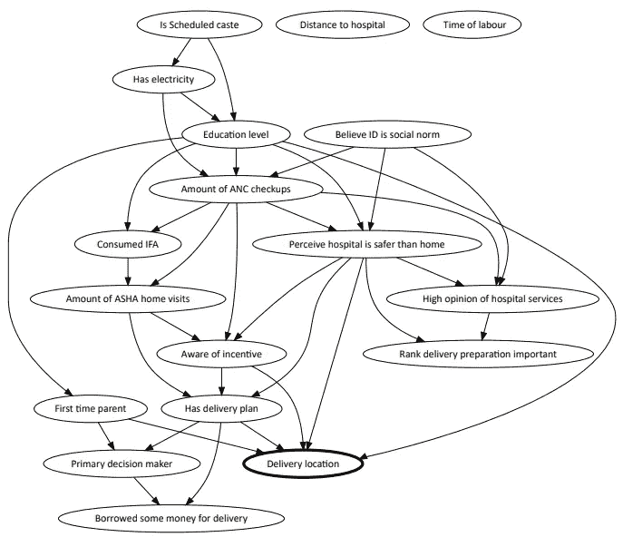

# 因果人工智能:将数据转化为有效健康干预的新途径

> 原文：<https://medium.com/codex/causal-artificial-intelligence-a-new-way-to-turn-data-into-effective-health-interventions-babf6c54cdbe?source=collection_archive---------10----------------------->

印度北方邦的 Surgo Ventures 使用了一个因果人工智能模型的例子——贝叶斯网络。它显示了在设计干预措施以说服更多母亲选择在医院设施而不是在家分娩时必须考虑的变量。

*以下是我们在《人工智能前沿》一文中原创文章的简化版:* [*数据集的因果数据表:使用贝叶斯网络进行真实世界数据分析和数据收集设计的评估指南*](https://www.frontiersin.org/articles/10.3389/frai.2021.612551/full) *。*

在人口超过 2 . 3 亿的印度北方邦农村地区，母亲和婴儿在分娩期间或分娩后死亡的数量是美国的 10 倍。证据显示，在医院分娩对降低孕产妇死亡率至关重要。但是，尽管有政府激励计划和社区卫生工作者来传播这一信息，20%的孕妇仍然在家分娩。我们想知道，我们怎样才能改变他们的决定？

**这是许多中低收入国家正在试图解决的复杂问题:他们如何确定最佳干预措施来推动行为改变，从而带来更好的结果？**

数据是解决这些问题的第一步，政策决策越来越依赖数据优先的方法来提供必要的见解。这种数据第一的思维模式催生了众多的数据收集项目，从次国家和国家层面的特定主题，使地方或国家政府和国际机构能够监测整个卫生项目领域的趋势，并为卫生政策、干预和项目资金设定优先顺序。

不幸的是，全球卫生领域通常使用这种数据爆炸的方式并没有实现其革命性的潜力，以一种实质性的精确方式为健康干预设计提供信息。

## **为现实世界设计干预措施，无需昂贵繁琐的试验**

由于全球卫生和发展问题十分复杂，因此需要深入了解实地的复杂性——什么影响人们的选择，他们听谁的，什么因素阻止他们，等等——以确保正确的人得到正确的干预。这就是所谓的**精准公共卫生方法。**

为了找到正确的干预措施——或正确的“按钮”——来改变健康结果，我们必须确定干预选项和结果之间的因果关系。传统上，为了确定因果关系并为人群的干预设计提供信息，随机对照试验(RCT)是黄金标准。RCT 氏症可以通过在一群人中比较干预的结果和没有干预(控制)的结果来检验假设。然而，由于费用、缺乏基础设施、伦理考虑和其他实际原因，RCT 并不总是可行的。重要的是，仅凭观察数据无法做到这一点。

没有 RCT，确定一系列特定行为的因果关系对全球卫生从业者来说仍然是一个挑战。此外，RCT 的设计是为了测试一组狭窄的假设，而不是探索未知的因果驱动因素，这错过了更精确地针对公共卫生解决方案的机会。

即使 RCT 是可能的，它也只能在人群层面而不是在个体层面为干预措施提供信息，因为它是许多个体的平均值。这一点尤其重要，因为介入设计的“圣杯”是个性化的。由于情况因人而异，干预绝不应该是“一刀切”。

因此，由于 RCT 的结果是观察性的和以人群为中心的，我们无法理解驱动个体行为的确切原因。这与精确的公共卫生相去甚远。

## **进入因果人工智能:一种将数据转化为干预的更有效方式**

因果人工智能通过在不进行试验的情况下基本上重建 RCT，揭示了许多变量之间复杂的因果关系，从而绕过了这一挑战。为此，我们可以首先执行一个称为“因果发现”的过程，提取数据中的所有因果联系。然后，我们可以分离出干预对个体的特定因果影响。此外，因果发现允许我们探索传统方法中可能忽略的因果关系。

这是因果人工智能背后的基本前提——在广泛的场景中探索潜在健康干预的理想工具。

在 Surgo Ventures，我们对一种叫做因果贝叶斯网络的因果人工智能特别感兴趣(见标题图片)。因果贝叶斯网络是数据集中一组变量之间所有复杂条件依赖的表示。它的视觉本质使它很容易说明和解释原因和结果之间的复杂关系。

## **那么，为什么因果人工智能模型还没有流行起来呢？**

尽管有许多因果人工智能产品，但我们还没有看到现实世界问题的广泛采用，主要是因为与预测人工智能方法不同(在预测人工智能方法中，预测错误，如将一个橙子误分类为一个苹果，可以告诉我们模型有多好)，我们通常没有有效的方法来验证因果人工智能发现的因果关系。

以因果贝叶斯网络为例。我们通常没有办法告诉我们对结果有多自信——相反，因果关系的结果模型只是代表了算法可以从我们现有的数据中学习到的“最佳”结果。但我们不知道“最好”是否意味着；该算法可以揭示 90%或 10%的因果关系。

这使得因果人工智能结果在与先前的信念或学说相矛盾时有些难以辩护，即使这些信念或学说本身没有因果证据的支持。因此，贝叶斯网络结果通常被呈现为技术的概念证明，以表明该方法可以恢复已知的洞察力，而不是作为用于发现、改变或干预的可操作模型。

## **一个可能的解决方案:因果数据表**

然而，并没有失去一切:计算机科学家以前已经开发了使用“合成”数据集来估计贝叶斯网络模型准确性的方法。合成数据集是指变量之间的所有因果关系都是已知的数据集。因为关系是已知的，计算机科学家可以估计算法在恢复相同的因果网络方面有多好。然而，由于合成数据集的特征(如变量数量、样本大小或其他特征)可能不同于真实世界的数据集，我们仍然不知道算法在真实世界数据中的表现如何。

为了解决这一难题，并使从业者能够估计因果结构的不确定性水平，我们创建了工具，允许从业者在“因果数据表”中生成合成数据，这些数据具有模拟现有或预测的真实世界数据的一系列属性。我们称之为“数据表”，因为它类似于任何产品(如汽车和电子元件)随附的数据表，用来告知客户产品的预期性能。

创建因果数据表有两个主要目标和好处。

1.  给定数据集的基本、可观察的特征，您可以提供一些性能预期。
2.  您可以提供指导，说明需要多少样本才能达到期望的性能水平。

因果数据表可用于研究和分析的不同阶段。出于规划目的，我们可以使用因果数据表来计算样本大小或变量数量，以获得可信的答案。对于现有的数据集，我们可以使用因果数据表来了解我们对使用因果人工智能模型生成的因果关系有多大信心。

## **因果数据表如何帮助支持印度的生殖健康**

为了提供额外的背景，以下现实生活中的例子向机器学习科学家和实践者展示了使用因果数据表来设计更有效的健康干预措施的好处:

***一项性与生殖健康研究的调查设计***

2019 年，我们有机会使用因果数据表来确定我们在印度中央邦进行的大规模性健康和生殖健康调查的样本量。确定这项研究的样本量很重要，因为它对我们项目的总体预算和时间表有影响。通常，我们希望一项调查用尽可能少的样本获取尽可能多的变量(前提是调查不要太长)。

我们的调查试图量化围绕计划生育决策的各种因果驱动因素。这些变量包括人口统计、知识和信念、风险认知、过去的经验和结构性决定因素，如可及性。

我们估计，我们将有 30-60 个变量，这些变量将是性健康和生殖健康决策的关键因果驱动因素。根据之前的工作，我们估计因果变量平均有三个层次。我们的项目预算允许 5，000 到 15，000 个样本，但是我们不知道哪个样本大小对于因果贝叶斯网络模型有足够的性能。

在比较模型性能指标时，我们确定正确的平衡是大约 15，000 名受访者和 50 个变量的样本，以便对我们的贝叶斯网络模型有信心。

因此，利用因果数据表方法，我们建立了印度十年来最全面的性健康和生殖健康调查。我们与克林顿健康获取倡议和中央邦政府合作，调查了 15，300 多名已婚妇女、她们的丈夫和她们的社区卫生工作者，以全面探索影响计划生育决策的所有因素和人员。要了解更多关于这项工作的结果，请看我们的案例研究:[获得关于计划生育选择的 360 度视角](https://surgoventures.org/portfolio/action-areas/getting-a-360-degree-view-on-family-planning-choices)。

***计划生育使用率研究数据分析***

现在，回到本文开头的问题:在北方邦，我们如何找到正确的干预措施，让怀孕的母亲选择在医院生孩子，而不是在家分娩？

2016 年，我们调查了 5000 多名女性的各种生殖、孕产妇、新生儿和儿童健康(RMNCH)行为和结果。由此，我们初步确定了 41 个变量，我们认为这些变量代表了 RMNCH 结果和行为的直接因果驱动因素，如分娩地点和早期母乳喂养开始，或者医疗保健设施太远？

北方邦政府已经在考虑在离村庄更近的地方建造设施，我们对观察数据的初步分析(使用基于相关性的预测模型)支持了这一想法。这表明，除其他因素外，设施的距离与最终交付地点密切相关。

令我们惊讶的是，在相同的数据上使用因果人工智能揭示了到设施的距离并没有驱动母亲使用医院的决定。相反，直接的因果驱动因素主要是交通便利、有预定的分娩计划，以及孕妇相信医疗机构会比她家提供更安全的分娩。

我们怎么能对这些令人惊讶的结果有信心呢？当我们在具有相似特征的合成数据集上生成因果数据表时，我们看到它表现良好；它能够始终如一地捕捉变量之间大多数正确的因果关系。

这些结果具有重要的政策和财务影响:

*   政府最好投资于加强现有设施的救护车系统，而不是在靠近村庄的地方建造新的设施；
*   社区卫生工作者通常只宣传医院分娩的经济回报。现在很明显，他们还应该关注医院安全，帮助妇女在产前制定分娩计划。

如果北方邦政府依赖于基于相关性的预测模型，它将错失节省宝贵资源和实施潜在更有效干预的机会。要了解这项工作的更多信息，请查看我们的案例研究:[让更多的妇女在医院分娩](https://surgoventures.org/portfolio/action-areas/getting-more-women-to-deliver-their-babies-in-hospitals)。

**这两个例子说明了因果数据表可以为机器学习科学家和实践者提供的价值。**因果数据表有助于规划以因果发现和推断为分析目标的研究，以及在收集现有数据后对研究进行分析。当数据特征不适合数据驱动的学习时，这种方法尤其重要，不幸的是，中低收入国家经常出现这种情况。

**我们希望因果人工智能继续获得关注，因为它在设计改善健康结果的有效干预措施方面具有巨大的潜力。**

*关于 Surgo Ventures 因果数据表的材料和方法、数据集特征、结构学习算法以及相关指标的详细信息，请参见我们发表在《人工智能前沿》(Frontiers in Artificial Intelligence)上的论文:* [*数据集因果数据表:使用贝叶斯网络进行真实世界数据分析和数据收集设计的评估指南*](https://www.frontiersin.org/articles/10.3389/frai.2021.612551/full) *。*