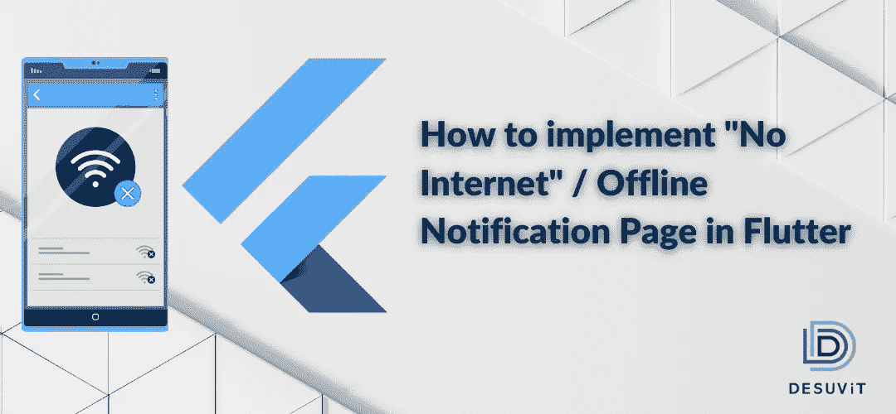

# 如何在 Flutter 中实现“无互联网”/离线通知页面

> 原文：<https://medium.com/codex/centralized-no-internet-implementation-in-flutter-cf99d20a8895?source=collection_archive---------10----------------------->

互联网是任何 App 工作的基本需求。当用户打开应用程序时，更好的做法是发现互联网是否活跃，并在没有互联网连接时通知用户。有许多方法可以通知用户应用程序之间的变化。以下是几种可以使用方法:

*   通过简单的推送通知。