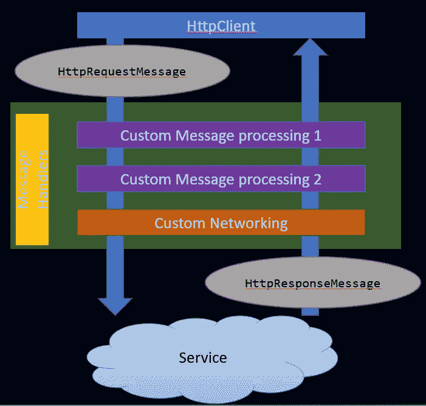

# 开发人员中的证书验证。网

> 原文：<https://medium.com/codex/certificate-verification-in-dev-for-net-87f310dc5a3c?source=collection_archive---------5----------------------->

证书的主要功能是向其他人验证证书所有者的身份。web 服务器证书基本上是颁发给 web 服务器**的 SSL 证书，用于向客户端**验证其身份。

英寸当我们向服务器发送 web 请求时，证书验证由操作系统和安全支持提供者接口(SSPI)共同完成。SSPI 为安全的分布式应用程序提供了通用的行业标准接口。

但是有时(主要是在开发和测试中)我们想忽略这个验证，跳过它，不要让证书验证错误的请求失败。

我将向您展示实现这一目的的两个选项:

## ServicePointManager

此选项仅推荐用于。net 框架(不要在。网芯)。

> 我们不建议您使用`ServicePointManager`类进行新的开发。而是使用[系统。Net.Http.HttpClient](https://learn.microsoft.com/en-us/dotnet/api/system.net.http.httpclient?view=net-6.0) 类。

`[ServicePointManager](https://learn.microsoft.com/en-us/dotnet/api/system.net.servicepointmanager?view=net-6.0)`是一个静态类，用于创建、维护和删除`[ServicePoint](https://learn.microsoft.com/en-us/dotnet/api/system.net.servicepoint?view=netframework-4.7.2)` 类的实例。

请注意，这将影响所有通过设置了`[ServerCertificateValidationCallback](https://learn.microsoft.com/en-us/dotnet/api/system.net.servicepointmanager.servercertificatevalidationcallback?view=netframework-4.7.2#system-net-servicepointmanager-servercertificatevalidationcallback)`的应用程序完成的 web 请求。

## HttpClientHandler

该选项与我们注入处理程序的特定`HttpClient`相关，而不是与应用程序中的所有 web 请求相关。但是首先，让我们理解一个`HttpClient`请求流的架构。



当一个`HttpClient` 发送一个 HTTP 请求时，它通过消息处理器被处理。*消息处理器*是一个接收 HTTP 请求并返回 HTTP 响应的类。通常，一系列消息处理程序被链接在一起。第一个处理程序接收一个 HTTP 请求，进行一些处理，然后将请求交给下一个处理程序。在某些时候，响应被创建并返回到链上。**这种模式被称为*委托*处理程序。**

`HttpClient`类使用消息处理器来处理请求。默认的处理程序是`**HttpClientHandler**`，它通过网络发送请求并从服务器获得响应。

创建`HttpClient`时，有两个构造函数:

```
public HttpClient();public HttpClient(HttpMessageHandler handler);
```

第一个构造函数创建了一个默认的`HttpClientHandler`(从`HttpMessageHandler`继承而来)，在第二个构造函数中我们可以注入一个`HttpClientHandler` **。**

使用`HttpClientHandler`，我们可以设置一个回调方法来验证服务器证书，并通过返回`true`来忽略验证。

这将只影响这个`HttpClient` 实例发出的请求，而不是所有没有注入这个`MessageHandler`的客户端。

## 其他用途

我们可以使用所给出的每一个选项来不忽略验证，而是通过查看 [SslPolicyErrors](https://learn.microsoft.com/en-us/dotnet/api/system.net.security.sslpolicyerrors?view=net-6.0) 参数并记录它，或者只是调试它，来获得关于证书验证失败原因的更多信息。请注意，验证失败的原因可能不止一个。

我将再次警告您，不建议在生产中干扰验证，您应该仅在开发阶段使用它。