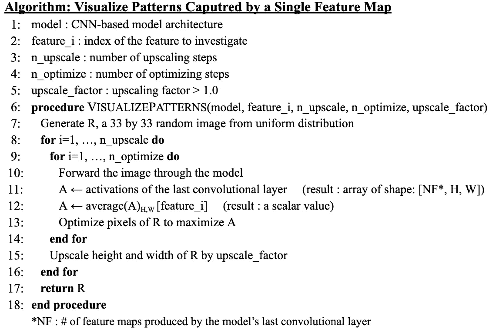
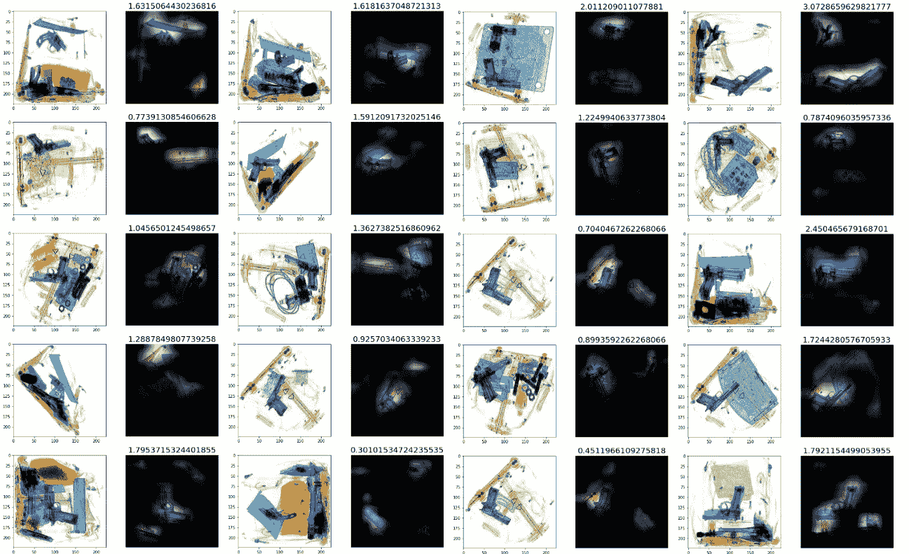

# 第七章。使用特征映射可视化解码 CNN 的黑盒

> 原文：<https://medium.com/codex/ch-7-decoding-black-box-of-cnns-using-feature-map-visualizations-45d38d4db1b0?source=collection_archive---------3----------------------->

## 如何向 CNN 架构提出有用的问题，以深入了解他们的行为

* * 2020 年 2 月 10 日编辑:我已经用 PyTorch 发布了这篇文章中涉及的可视化工具的开源库，可以用`pip install FeatureMapVisualizer`安装。您还可以查看:

*   [**Colab 笔记本**](https://nbviewer.org/github/lukysummer/FeatureMapVisualizer/blob/main/Colab_notebook/Feature_Map_Visaulizations.ipynb) 示例(分步说明)
*   [**Github** 资源库](https://github.com/lukysummer/FeatureMapVisualizer)
*   [**PyPi** 页面](https://pypi.org/project/FeatureMapVisualizer/1.0.3/)为 FeatureMapVisualizer **包**

我们怎样才能找到钥匙🔑进入 CNN 架构的黑匣子？

# 动机:CNN 不是固有的黑匣子

你曾经想问动物一个问题吗？🐈由于我们还没有想出一种精确的方法来与其他动物交流，他们经常感觉像一个黑匣子。人与人之间的交流感觉更加透明，因为我们可以问问题和交换想法。因此，某样东西不可能*固有地*是黑盒；我们只是还没有找到一种以可理解的方式提问和获得答案的方法。

那么为什么深度学习模型经常成为[黑箱问题](https://en.wikipedia.org/wiki/Black_box)的目标呢？因为由于*人机* *的语言障碍，*我们不知道如何问他们合适的问题。在本帖中，我将讨论如何使用**功能图可视化**向 CNN 架构提出有用的问题，以便深入了解他们的行为。以下是我在问答环节中向 CNN 提出的五个问题:

1.  为什么你用肌肉来识别每个目标类别？
2.  你能给我画一把小刀吗？
3.  你在看图像的哪个部分？
4.  你真的不知道枪是什么样子吗？
5.  一个类的顶级特征地图对于那个类真的是唯一的吗？

# Q1——你用哪块肌肉来识别每个目标类别？

## *翻译*:当模型看到特定类别的图像时，最后一个卷积层的哪些特定特征图被激活得最多？

## (1.1)动作的专门肌肉💪

从很小的时候，我们就训练我们的肌肉来控制不同的身体部位，以产生各种各样的运动。当我们学习一项新的体力任务时，我们会有选择地使用和训练该特定任务所需的肌肉。例如，如果一个成年人正在学习弹钢琴，手指、手腕和手臂的肌肉将被激活。如果这个人在弹钢琴时感到疼痛或僵硬，对手指或手腕进行检查比做一般的健康检查更有意义。

## (1.2)一个类的专用特征图

CNN 架构的情况类似，即:

*   在包含 [1000 个类别](https://gist.github.com/yrevar/942d3a0ac09ec9e5eb3a)的 ImageNet 数据集上进行预训练(广泛的运动范围)
*   在包含少于 1000 个类的新数据集上进行微调(新的物理任务)

当输入图像通过 CNN 架构传播时，每个卷积层会产生数百甚至数千个特征图(即输出激活)。我们可以研究 ***特殊化*特征地图的子集，而不是查看所有这些地图，这些地图的激活对于每类** 图像的*来说是最大化的。这比一些流行的可视化技术更有效，例如 [Grad-CAM](https://arxiv.org/abs/1610.02391) 采用所有特征地图激活的*平均值*。*

## (1.3)来自最后一个卷积层的特征图

特别是，我从模型的**最后一个卷积层**、**、**中找到了最活跃的特征图，因为我对最后几层捕获的**高级特征**(例如物体部分或形状)更感兴趣。早期图层捕捉边缘和纹理等低级特征。

## (1.4)程序

以下是从最后一个卷积层中查找特征映射的过程，对于每个目标类，该卷积层的激活最大化。我将把它们分别称为 ***【顶级特征地图】*** 用于每个职业。

1.  设置`N1` : #顶特征图为每张图像选择**，设置`N2` : #顶特征图为每类**图像选择**。**
2.  按类别组织图像。
3.  对于每个类，将每个类图像逐个通过一个模型，并为每个图像聚合一个带有`N1`顶部激活特征映射的列表。例如，如果类别*类别*具有 3 个图像，`N1`是 3，并且每个图像的前 3 个激活的特征映射的列表是[1，2，4]，[1，3，4]和[1，5，6]，则聚集列表变成[1，1，1，2，3，4，4，5，6]。
4.  从每个类别的汇总列表中，选择`N2`最常见的特征地图。同样的例子，如果`N2`是 2，类别*类别*的顶部特征映射的列表变成[1，4]。这一步的输出是顶部特征地图的`n_classes`列表，每个长度为`N2`。
5.  从每个类的顶级要素地图列表中移除同时出现在另一个类的顶级列表中的任何要素地图。如果类别*狗*的顶部特征映射列表为[1，10]，则*猫*和*狗*的列表将减少为[4]和[10]，因为 1 在两个列表中都存在。

## (1.5)伪代码

以下是该算法的伪代码:

为每个类查找前 N 个特征图的伪代码

我使用了`N1 = 25`和`N2 = 25`，这意味着我查看了每张图片和每个目标类别的 25 个独特的顶级特征地图。在 ResNet50 针对二进制分类进行微调的情况下，要研究的特征图的数量从 2，048 个(ResNet50 的最后一个卷积层中的过滤器数量)减少到 50 个(= 25*2)。

# Q2——你能给我画一把小刀吗？

## 翻译:刀类的顶级特征图捕捉到了什么样的图案或形状？

## (2.1)基本思想

在缩小了每个类别的特定特征图之后，我调查了**每个单独的顶部特征图**捕捉了哪些突出的形状或物体部分。受[这篇文章](https://towardsdatascience.com/how-to-visualize-convolutional-features-in-40-lines-of-code-70b7d87b0030)的启发，这个想法是首先使用如下所示的`np.random.uniform`生成一个小的随机图像(我使用了 33 乘 33 像素)，然后**在最大化所选特征图激活的方向上迭代调整它的像素**。这是通过最小化等于特征映射激活总和的负值的损失来实现的。在每次迭代中，在优化之后，图像还会使用`cv2.resize`以一个小的因子放大。重复这些优化和升级步骤，直到某些图案在图像中变得可见。

一个小的随机图像

## (2.2)伪代码

以下是该算法的伪代码:

用于可视化由单个特征图捕获的模式的伪代码(灵感来自:[https://towardsdatascience . com/how-to-visualize-convolatile-features-in-40-line of-code-70b7d 87 b 0030](https://towardsdatascience.com/how-to-visualize-convolutional-features-in-40-lines-of-code-70b7d87b0030))

我使用了 20 个优化步骤，20 个升级步骤，以及 1.2 的升级系数。我将使用 ImageNet 上预先训练的模型分享一些生成的图像，并针对**枪与刀的二元分类**进行微调。他们很有趣，很像概念派的[AI 艺术](https://ai.googleblog.com/2015/06/inceptionism-going-deeper-into-neural.html)。

## (2.3)给我画一把刀。

该图像显示了由 ***刀*** 类的顶部特征图捕获的图案:

“刀”类的顶级特征图捕获的模式

很酷吧。有趣的是，这张特征图反复捕捉到了刀片的尖三角形。如果你仔细观察，会发现一些微小的重复的方形形状，里面有一些看起来像眼睛的东西👁。根据猜测，这可能是与 ImageNet 数据集的动物类别相关的工件，这意味着对于 ImageNet 的 1000 个类别的分类，该特征图可能专门用于通过观察动物的眼睛来识别动物类别。

该图像显示了由 ***刀*** 类的另一个顶部特征图捕获的图案:

类别“刀”的另一个顶部特征图捕获的模式

这一张也捕捉到了尖尖的刀尖的图案，但这次比上一张更长更弯曲。可能这个特征图更专门识别有曲线刃的刀。

## 给我画一把枪。

现在，这里有一个图像显示了由 ***枪*** 类的顶部特征图捕获的模式:

“gun”类的顶级特征图捕获的模式

这张特征图似乎捕捉到了枪管的圆柱形状。我还猜测，类似翅膀羽毛的重复圆形可能是枪图像中经常出现的子弹形状。

该图像是用 ***枪*** 类的另一个顶部特征图生成的:

类别“gun”的另一个顶级特征图捕获的模式

这张特征图捕捉到了整支枪更多的直角形状，可能还有双筒的形状。值得注意的是，不同方向和大小的重复枪形状反映了**模型在** **检测对象时的鲁棒性，而不管其在图像中的方向或大小**。

下图显示了 ***枪*** 和 ***刀*** 类的其他顶级特征地图捕获的图案:

由“gun”类的其他顶级特征地图捕获的模式

“刀”类的其他顶级特征图捕获的模式

## (2.5)人类与 AI 的视觉感知

通过这种可视化方法，模型似乎在回答“你能给我画一把刀(枪)吗？”。生成的图像与我们将要绘制的图像大不相同，很可能是单个物体的整个形状，而不是特定部分的重复。但是当我们给一个物体拍照时，我们确实记得上面一些顶级特征地图捕捉到的它的轮廓或突出的形状(刀片，桶)。因此，关于广为流传的神经网络是为了模仿我们的大脑而发明的概念，值得思考人类和 CNN 的视觉感知是如何接近的。

# **Q3——你在看图像的哪个部分？**

## 翻译:当将图像分类为特定类别时，特征图关注图像的哪些部分？

## (3.1)单个图像，多个特征地图

另一个有用的技术是找到对于一个**单个图像**激活最大化的特征地图，并通过将其激活地图覆盖在图像顶部来突出显示每个地图最受关注的图像区域。前面提到的 [Grad-CAM](https://arxiv.org/abs/1610.02391) 可视化算法回答了一个类似的问题，即*整个最后一个卷积层*正在关注图像的哪些部分，但它不会像查看每个单独的特征图那样具体。

## (3.2)程序

1.  通过模型转发图像。
2.  使用:`torch.nn.modules.module.register_forward_hook(hook_function)` (PyTorch)保存来自最后一个卷积层的*所有*特征图的正向传播激活。
3.  挑选 N 个具有最大激活的特征地图(也称为前 N 个特征地图)。
4.  使用`cv2.resize`放大前 N 个特征图(通常类似于 7×7)以匹配输入图像大小(例如 224×224)。
5.  将 N 个放大的特征地图中的每一个叠加在图像的顶部，并按照从最大到最小的激活顺序绘制它们。

* **重要提示**:步骤 3 中的前 N 个特征图(针对单个图像)与第 1 节中的前 N 个特征图(针对整个类别)不同。这里，我们正在寻找对于单个****图像**** *其激活最大化的顶级特征图，而在第 1 部分中，我们从属于那个类别的所有图像的顶级特征图的聚集列表中找到了对于单个类别*的顶级特征图。**

## **(3.3)刀图像的顶部特征图**

**在这里，我使用相同的枪与刀二元分类模型，可视化了包含刀和其他对象的图像的前 60 个特征映射的激活:**

********

****刀图像的前 60 个特征图。**红色方框中的两个特征图表示使用第 1 节中的算法找到的刀具类别的前两个特征图。**

**一些特征地图会高亮显示图像中的刀，而另一些则会高亮显示胡萝卜、土豆或砧板。两个红色的方框(第 4 和第 9 个最上面的特征地图)表示在第 1 部分中找到的 ***刀*** 职业的最上面的两个特征地图。这两张特征图都在突出刀，尤其是顶端尖的部分，这一事实证实了它们确实对刀尖的形状很敏感。**

## **(3.4)具有大的白色背景的图像的顶部特征图**

**在这里，我使用相同的枪与刀二元分类模型可视化了顶部特征地图，这次是针对具有大型白色背景的图像:**

********

****刀图像的前 90 个激活特征图。**红色方框中的两个特征图表示使用第 1 节中的算法找到的刀类的前两个特征图。**

********

****枪械图像的前 60 个激活特征图。**包围在红框中的顶部两个特征图也是使用第 1 节中的算法找到的枪类的顶部两个激活的特征图。**

## **(3.5)刀图像的顶部特征图的奇怪性**

**在查看刀图像的热门特征地图的关注区域时，我发现了一些奇怪的事情。它们中的许多**突出了白色背景的部分而不是刀**，而大多数枪图像的顶部特征地图突出了枪而不是白色背景。此外， ***刀*** 类的第 1 部分的前两个特征图(用红框包围)在图中更靠下(前 53 和 90 个特征图)，相比之下 ***枪*** 类的前两个特征图(也用红框包围)与该枪图像的前两个特征图重合。这是怎么回事？**

## **(3.6)为什么你把一个篮球的图像归类为高置信度的刀？**

****

**枪对刀二元分类模型有把握地将大多数不包含任何类别的图像分类为刀。**

**在我之前的[第四章的帖子](/@lucrece.shin/chapter-3-2-transfer-learning-with-resnet50-from-performance-analysis-to-unexpected-riddle-abe2da3b4e8f)中，我提到了枪与刀二元分类模型的不直观行为，它自信地将大多数不包含任何类别的图像归类为刀，如上所示。我很难理解为什么在分类一幅完全不相关的图像时，模型会如此倾向于刀。**

**我相信 3.5 节的观察为这种奇怪的行为提供了一种可能的解释。**模型可能已经学会将固体背景感知为*刀类的典型特征之一*** (可能不一定是人类所知的“刀对象”的特征，而是“1 类”的特征。我在 [my Ch.5 post](/@lucrece.shin/chapter-4-using-t-sne-plots-as-human-ai-translator-c5ef9c2f2fa4#7ebb) 中讨论过这个黑白二元决策边界。因此，当它看到一个不包含枪并且具有大的实心背景的图像时，它将其分类为刀。**

**那么为什么纯色背景被公认为 ***刀*** 类的特色特征之一呢？让我们考虑一下数据，即刀和枪的训练图像之间会有什么不同。可能是**刀图像一般包含较大的背景空间**。因为所有的输入图像都具有正方形尺寸，所以正方形图像使得细长形状的刀比较粗的弯曲形状的枪更少地填充图像空间。这是一个特定于特征地图的可视化如何为我们提供一些关于 CNN 如何感知图像的线索的例子:从字面上，像素方面，并对背景和前景给予公平的关注。**

# **你真的不知道枪是什么样子吗？**

## **翻译:当给定一组相同类别的图像时，该类别的顶部特征图能在所有图像中找到该对象吗？**

## **(4.1)多个图像，单个特征地图**

**这种方法与前一种方法(第 3 节)相似，但这次我们将一个**单一特征图**的激活图叠加在一组**同类图像上。**我在第 1 节中为每个类使用了顶级特征地图。**

## **(4.2)目标域混淆矩阵**

**在进入可视化之前，这里是为枪与刀二元分类训练的 VGG16 模型的目标域混淆矩阵:**

****

**目标(x 射线)域混淆矩阵**

**这个“目标域”混淆矩阵显示了模型**在源域上训练并在目标域**上测试的性能。在这种情况下，源域指的是枪和刀的正常相机图像(“网”图像，因为它们是从网上刮下来的)，而目标域指的是包含枪和刀的行李的 x 光图像。**

****

**包含刀和枪的 Web 图像(源域)和 x 射线图像(目标域)**

**由于从网页图像到 x 光图像的明显的 ***纹理****偏移，混淆矩阵表现不佳:***

*   ***枪支召回率只有 24%。***
*   ***刀召回率是 100%，但是该模型将 100%的良性 x 射线图像(既不包含枪也不包含刀)和 87%的 x 射线枪图像分类为刀。***

***因此，如果我们只看混淆矩阵，我们最有可能得出的结论是**模型未能很好地学习枪或刀的形状。*****

## ***(4.3)用于枪图像的枪类顶部特征图的激活图***

***我使用第 1 节中的过程中的源域(web)图像找到了 ***枪*** 类的顶部特征图。下图显示了一组 x 射线枪图像中 ***枪*** 级的顶部特征图。有趣的是，这张特殊的特征地图在突出图像中的枪支方面做得很好！***

****

**为 x 射线枪图像激活一个枪级的顶部特征地图**

**如果我们仅通过查看显示 24%枪支召回率的混淆矩阵来判断该模型，我们会怀疑该模型是否能够在 x 射线图像中检测到枪支。然而，这个可视化说明**存在一些来自模型的最后一个卷积层的非常具体的特征图，这些特征图对枪的形状特别敏感。**这个特征图几乎充当了枪的对象识别器。**

**这是另一个改进了枪支召回的模型的相同可视化。你可以看到这个模型是如何在 x 光图像中比之前的模型更清晰地突出了枪。**

****

**为另一个具有改进的枪支召回的模型激活一个枪支级别的 x 射线枪图像的顶部特征地图**

## **(4.4)替代预测算法**

**通过以上观察，一个灯泡💡关于一种可能的新预测算法。为了将 x 射线图像分类为枪支，而不是在最后一个卷积层之后通过完全连接层和 softmax 层，我们可以检查该枪支检测特征图是否在某个阈值以上被激活。这个想法让我想到了第五种可视化技术。**

# ****Q5—一个类别的顶级特征地图对该类别来说真的是唯一的吗？****

## **(5.1)绘制每个图像的顶级特征映射的激活总和**

**这里，对于每个类别，我**将每个测试图像**的所有 25 个类别方式的顶部特征图(在第 1 节中找到)的激活相加，并在相同的图中用不同的颜色表示不同的类别。我使用了从第一节的网络图像中找到的顶级特征地图，并添加了它们对 x 射线图像的激活以进行绘制。这有助于检查每个类别的顶部特征贴图是否仅针对该类别最大化激活**，即使有 web→x 射线纹理偏移**。**

**我将展示三种不同型号的图进行比较。所有三个模型都用三种不同类别的图像进行了测试:良性、枪和刀。对比剧情后我会揭晓模特的身份。这些图的轴代表以下内容:**

*   ****x 轴**:每个类别的图像数量(示例中为 300 个良性图像、100 个枪图像和 30 个刀图像)**
*   ****y 轴**:特征地图激活总数**

## **(5.2)型号 1**

****

**使用**型号#1** 的**枪类(左)**和**刀类(右)**的顶部特征图激活总和图**

**左图为 ***枪*** 类顶级特征地图，显示蓝色线条(枪 x 射线图像)高于红色和粉色线条(刀和良性 x 射线图像)。相比之下，右图为 ***刀*** 类顶级特征图，在所有三种颜色中显示了较大的重叠。也许这个模型对枪的记忆比对刀的记忆更好。**

## **(5.3)型号 2**

****

**使用**型号#2** 绘制**枪类(左)**和**刀类(右)**的顶部特征图激活总和图**

**模型#2 显示了对 ***刀*** 类的改进，右图显示红线(刀 x 射线图像)高于蓝线和粉线。左图；但是，显示了蓝色(枪 x 射线图像)和其他线条之间的一些重叠。**

## **(5.4)型号 3**

****

**使用**型号#3 绘制**枪类(左)**和**刀类(右)**的顶部特征图激活总和图。**虚线表示可能的阈值，如果总和超过该阈值，则该模型可以对威胁对象的可能存在发出警报。**

**对于 ***枪*** 和 ***刀*** 这两个类别，模型#3 显示出具有明显更高激活总和的两个图的巨大改进。这款车型一定是两个级别中召回率最高的。**

## **(5.5)三种模型的同一性**

**以下是三款车型的身份:**

## **型号# 1**

*   **VGG16 在 ImageNet 上进行了预培训**
*   **针对枪与刀的二元分类进行了微调**

## **型号#2**

*   **ResNet50 在[风格化的 ImageNet](https://arxiv.org/abs/1811.12231) 上进行了预培训**
*   **微调为良性对枪对刀[多标签分类](/@lucrece.shin/ch-6-optimizing-data-for-flexible-and-robust-image-recognition-23f4dcce3af7)**

## **型号 3**

*   **ResNet50 在[风格化的 ImageNet](https://arxiv.org/abs/1811.12231) 上进行了预培训**
*   **微调为良性对枪对刀[多标签分类](/@lucrece.shin/ch-6-optimizing-data-for-flexible-and-robust-image-recognition-23f4dcce3af7)**
*   **用[对抗性判别域适应(ADDA)](https://arxiv.org/abs/1702.05464) 用网络图像(源域)&x 光图像(目标域)训练**

**您可以看到数据或模型调整(如使用多标注和域自适应)如何使最终图层要素地图对每个类对象的独特特征更加敏感，从而增强模型的分类能力。**

## **(5.6)替代威胁检测算法**

**这些图还为枪和刀提出了另一种威胁检测算法。给定一个测试图像，我们可以首先计算每个威胁类别的顶级特征映射激活的总和。然后，如果总和高于某个阈值(例如由模型#3 图中的虚线指示的阈值)，则模型可以对威胁对象的可能存在发出警报。**

# **结束语:ML 研究是一个反复的过程**

**问答环节怎么样？特征地图可视化有助于你更好地理解 CNN 架构的内部工作吗？他们为我做了很多。他们成为了 ML 问题解决中*迭代过程的一部分，让我*思考*关于:***

*   ****如何 *I* 识别图像中的物体**——通过视觉线索:形状、轮廓、纹理、颜色和非视觉线索:思考物体的物理用途，无意识地应用物理定律(桌子上方的浮动刀很奇怪，而白色背景的浮动刀是可以的)**
*   ****如何设计数据、模型架构和损失函数**以训练模型有效检测视觉线索(即缩小人类和 CNN 视觉感知之间的差距:在 [my Ch.6 post](/@lucrece.shin/ch-6-optimizing-data-for-flexible-and-robust-image-recognition-23f4dcce3af7) 中讨论)**
*   ****查看可视化效果后如何改进设计**可视化效果有助于理解模型用于图像分类的机制**

**[在做硕士](/@lucrece.shin/ml-masters-research-project-history-a4823a1411b5)之前，我比较注重结果，每隔几周就完成一个又一个深度学习项目。但是当我在硕士期间整整一年致力于一个研究项目时，我对模型的行为产生了好奇，并花了更多的时间研究 ***为什么*** 模型给出了好或坏的结果。我的钥匙是什么🔑进入 CNN 架构的黑匣子？正是这种**好奇心**和**坚持不懈地去探究我对模型**不了解的地方。**

**同样，这篇文章中讨论的方法的分步说明和代码(PyTorch 中)在我的 [**Colab 笔记本**](https://nbviewer.org/github/lukysummer/FeatureMapVisualizer/blob/main/Colab_notebook/Feature_Map_Visaulizations.ipynb) 和[**Github 资源库**](https://github.com/lukysummer/FeatureMapVisualizer) 中。如有任何问题或反馈，您可以[联系我](mailto:lucrece.shin@mail.utoronto.ca)😊。感谢阅读！🌸**

**-☾₊˚.**