# 挑战大数据:Apache DolphinScheduler 在数十亿数据中的实际应用

> 原文：<https://medium.com/codex/challenging-big-data-apache-dolphinscheduler-applied-in-practice-with-billions-of-data-c54e76ec2cb5?source=collection_archive---------6----------------------->


> 近日，Churinga 大数据开发工程师钟在网络社区 Meetup 上举办了主题为“Apache DolphinScheduler 在实践中应用数十亿数据”的主题演讲
> 
> 在分析和选择了数千亿数据的数据同步需求后，中国 Churinga(CNCR)最终决定使用 DolphinScheduler 进行任务调度，并且还需要定期调度 DataX、SparkSQL 等方法进行海量数据迁移。他们在日常大数据工作中使用 DolphinScheduler，减少日常运维工作量。


演讲人|中国 Churinga 大数据开发工程师钟

议程:

1.  背景资料
2.  大数据处理
3.  应用场景
4.  未来计划

# 背景资料

## 自行开发的任务调度

我们公司一开始一直使用自主开发的任务调度框架。随着开源软件在这一领域的发展，出现了许多像 DolphinScheduler 这样优秀的任务调度应用。此外，我们的需求已经到了必须引入新的解决方案的地步——调度系统级别以确保技术的更新和迭代。

## 需求分析

1.多租户权限控制在我们的日常工作中，R&D 等业务部门或厂商可能会在 DS 上运行一些任务。有了多租户访问权限控制，整个集群将更易于使用。

2.易用性和对可视化任务管理的支持很容易上手，因为在我们的团队中，很多时候仓库/业务团队会使用开发。如果任务调度很难开始，如果需要大量的配置或编码，相对成本会高得多。我相信很多大数据团队都会有这个需求，有些项目需要快速迭代，所以工具的选择一定要好用。

3.任务和节点的状态监控对于任务调度的本地监控，我们有两个主要需求。第一个是服务器监控，必须直接在任务调度 web 应用程序上查看。第二个是任务调度监控，要一目了然的显示一个任务是否成功，执行时间，以及其他相关信息和状态。

4.支持更方便的重新运行和补充我们的数据有三个部分:实时，定期和离线。数据特征产生了这种需求。比如每 15 分钟或者每小时的数据任务，如果不能很好的支持重运行和补充，对我们的影响还是比较大的。

5.支持高可用性 HA、灵活扩展和容错，还需要支持集群操作、维护和错误管理。

6.支持时间参数有时可能需要根据时间参数对数据执行 ETL 定期操作。

## 任务计划程序比较

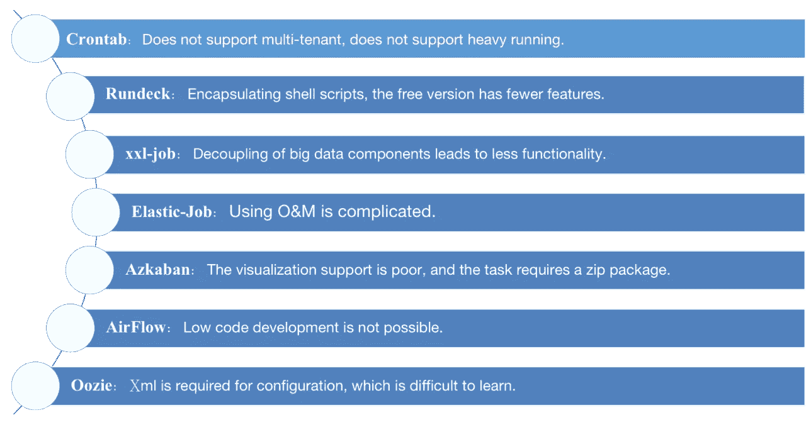

Crontab 在 Unix 或类 Unix 系统中定期执行指令或脚本，用于在 Linux 上直接执行脚本，但只能运行脚本。它不支持多租户访问权限管理、平台管理、分发执行和其他功能。我们公司的应用是在一些特色服务器上运行一些临时脚本。而且原生 Crontab 只支持分钟级调度，不支持重新运行。

Rundeck Rundeck 是一款基于 Java 和 Grails 的开源运维自动化工具。它为管理操作、命令行工具和 WebAPI 访问控制方法提供了一个 Web 界面。Ansible 和 Rundeck 等工具可以帮助开发人员和操作人员更好地管理各个节点。Rundeck 有企业版和免费版。免费版为了我们的目的，在一些功能上还是需要改进的。

Quartz Quartz 是一个开源的、功能丰富的任务调度库。它是一个基于 Java 的框架，可以与任何 Java 应用程序集成。任务调度必须用 Java 编写，非 R&D 团队无法使用。

这是一个由中国开发的轻量级分布式日程安排工具。然而，它的功能比 DolphinScheduler 少。它不依赖于重要的数据基础，而是依赖于 MySQL，这与 DolphinScheduler 是相同的依赖关系。

Elastic-Job It 是一个灵活的分布式任务调度应用，基于 Quartz 的进一步发展。它的初衷是处理高度并发和复杂的任务。设计概念是分散的。主服务器是通过 ZooKeeper 选举机制选出的。如果主服务器出现故障，将选择新的主服务器。因此，弹性作业具有良好的可扩展性和可用性。但是使用和操作起来比较复杂。

Azkaban 也是一个轻量级的任务调度框架，但是它的缺点是可视化功能。除此之外，该任务必须通过键入 zip 包来实现，这可能更方便。

AirFlow 是一个用 Python 编写的任务调度系统。界面很优质，但需要符合国人的使用习惯。用 Python 画 DAG 图很有必要。此外，低代码任务调度是不可实现的。

Oozie 它是一个广泛的数据任务调度框架，集成了 Hadoop。任务创建必须在 XML 中执行。

## 选择 DolphinScheduler 的原因

1.  部署非常简单。主人和工人都各司其职。可以线性扩展，不依赖大数据集群。
2.  任务和节点的直观监控；每个结局都一目了然。
3.  有许多类型的支持任务，DAG 图决定了可视化配置和可视化任务的沿袭。
4.  甘特图和版本管理对于大量的任务都很方便。
5.  它很好地满足了所有工作的要求。大数据平台架构

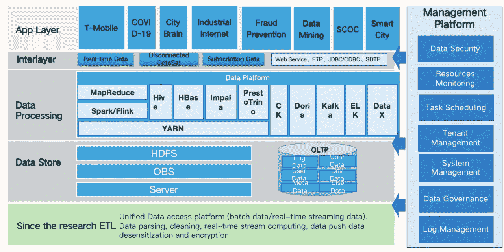

**大数据平台架构**

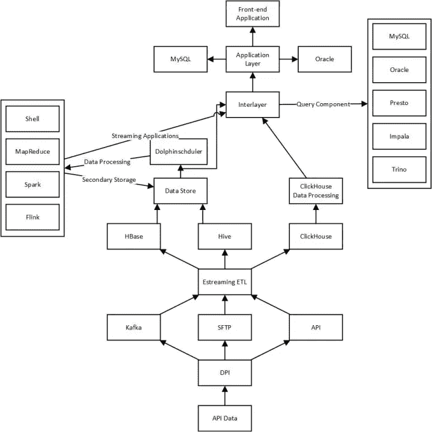

**数据流图**

# 海量数据处理

## 数据要求

数据量:每天数千亿条数据记录字段数:数百个字段，主要是字符串类型数据流:在数据存储中处理，处理后的数据放入 CK，之后应用程序直接从 CK 查询数据存储周期:21 到 60 天查询响应:特定字段需要二次响应

## 数据同步工具选择

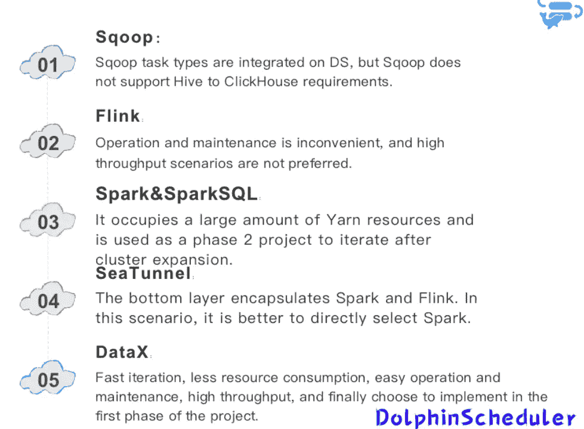

**Sqoop**

Sqoop 是一个开源工具，主要用来在 Hadoop (Hive)和传统数据库(MySQL，PostgreSQL……)之间传输数据。DolphinScheduler 还可以集成 Sqoop 的任务调度。但是对于从 Hive 到 ClickHouse 的数据传输需求，Sqoop 是无法支持的。

**弗林克**

通过 DS 调度 Flink 任务或者直接搭建一套基于 Flink 的实时流计算框架。应该为这个需求建立一套计算框架，Kafka 作为消息队列。此外，额外的资源开销。

其次，程序必须重写，给运维团队带来不便。

最后，我们的中心场景是离线。比较吞吐量，使用 Spark 效率更高。

**火花&火花 SQL**

不考虑环境和资源，Spark 是最好的选择，因为我们也使用 SparkSQL 作为我们的数据处理器。我们目前有两种方法来进行数据同步。

**第一种方法不是持久存储处理过的数据。**但是，通过网络 IO 直接写入 ClickHouse。这种方法在服务器资源上的开销最小，但是它的风险也最大。这是因为考虑了处理过的数据。假设在数据同步或 ClickHouse 存储中发现异常。所以必须重新处理，但是后面 dws 和 dwd 的数据每 14 天清理一次。这意味着如果磁盘没有被丢弃，就必须重新考虑它。

**第二种方法是将处理后的数据放入 Hive，使用 SparkSQL 进行同步。**然而，这需要更多的纱线资源。所以在项目的第一阶段，由于资源的限制，我们没有使用 SparkSQL。在项目的第二阶段，扩展后的集群完全可以取代 SparkSQL 的所有数据处理和数据同步。

**海底隧道**

SeaTunnel 是 Spark 和 Flink 上的一层包装。它将其配置文件转换为 Spark 和 Flink 在 Yarn 上运行的任务。它的实现也是通过各种实现文件来完成的。

对于这种选择，海底隧道必须消耗纱线资源。

**DataX**

经过各种研究，我们选择 DataX 作为数据传输工具，这是项目的第一阶段。此外，我们决定使用 DolphinScheduler 进行周期性调度。

## 点击屋优化

ClickHouse 需要在数据传输和同步架构之后进行优化。

*   写入本地表

Nginx 在整个集群初期用于负载均衡。在这个过程中，我们意识到结果本可以更好。我们还尝试用分布式表进行编写，但是结果并没有显著改善。在第二种情况下，我们的解决方案是调整对本地表的写入。整个集群有多个设备，这些设备都直接写入每个 CK 节点的本地表，然后在查询操作期间检查分布式表。

*   使用合并树表引擎系列

ClickHouse 的一个核心功能是 MergeTree 表引擎。社区也将基于 MergeTree 表引擎的优化视为一项关键工作。在 CK，我们使用 ReplicatedMergeTree 作为数据表的本地表引擎。而且我们使用 ReplicatedReplacingMergeTree 作为从 MySQL 迁移过来的数据字典的表引擎。

*   二级索引优化

优化的第一点是二级索引。我们用 bloom_filter 替换了 min-max 中的二级索引，并将索引粒度切换为 32768。关于二级索引，我们尝试过 min-max、intHash64、halfMD5、farmHash64 等。但是，对于我们的数据量来说，查询很慢，或者传入的数据不够好。换成 bloom_filter 后书写也很平衡。

*   小文件优化

经过数据处理，有很多小文件。处理的小文件大小都在 5M 左右。这些参数加载到 SparkSQL 中，重新处理后的文件大约 60M~100M。

```
set spark.sql.adaptive.enabled=true;
set spark.sql.adaptive.shuffle.targetPostShuffleInputSize=256000000;
```

*   参数最优化

CK 有许多优化参数。除了基本参数之外，在二级索引被调整到布隆过滤器之后，写入 CK 的部分的数量比最初更多。这时，我们需要调整 CK 的零件参数，使其正常运行。但是，该参数会稍微影响 CK 查询的性能。如果数据加载不进去，那么再给我们查询就没用了。还激活了 background_pool_size 参数(我们没有使用它)。

```
parts_to_delay_insert：200000parts_to_throw_insert：200000
```

*   动物园管理员优化

对于 ClickHouse 的多分片多副本集群模式，Zookeeper 是性能的最大瓶颈。

在不改变源代码的情况下，我们进行了以下优化:

1.调整 MaxSessionTimeout 参数以增加每个 Zookeeper 会话的最大超时。

2.在 Zookeeper 中分离数据记录器和数据目录。

3.已经为 ClickHouse 部署了一个单独的 CK 集群。如果磁盘选择超过 1T，SSD 磁盘将被激活。

## 海量数据处理体系结构

*   第一阶段技术架构

HiveData 仓库结构--Hive--spark SQL--DataX--DataX Web--dolphin scheduler--click house

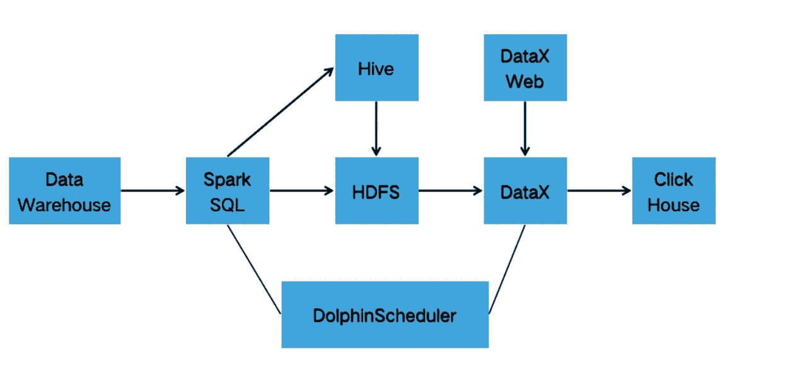

*   第二阶段架构 1

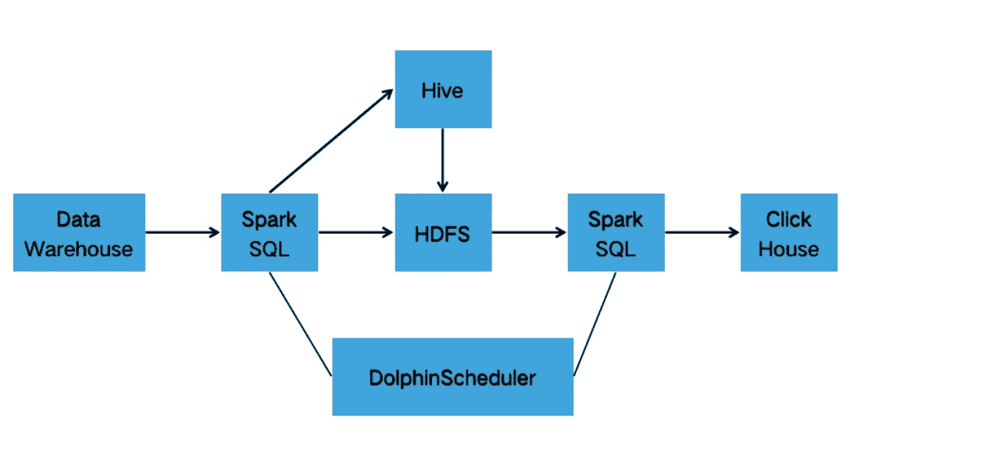

*   第二阶段架构 2

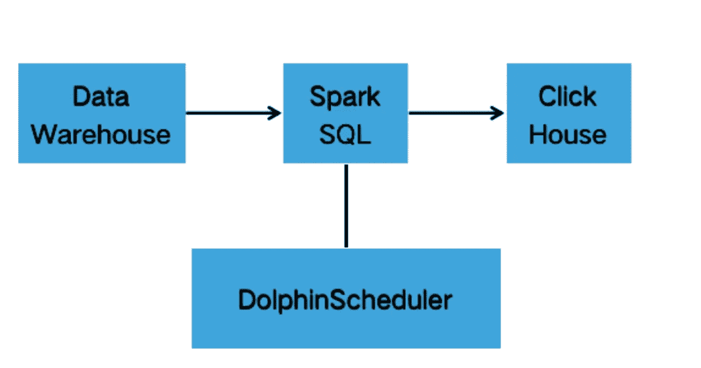

## 数据同步操作

*   DataX 技术原理

DataX 是阿里巴巴开源的异构数据源离线同步工具。旨在实现各种异构数据源之间稳定高效的同步，包括关系数据库(MySQL、Oracle 等。)，HDFS，Hive，ODPS，HBase，FTP 等。

数据同步功能。

DataX 使用起来相对简单。有两个模块，一个阅读器和一个编写器。配置设置主要针对这两个模块。DataX 支持许多插件。除了官方插件，可以直接使用，还可以从 GitHub 下载源代码进行 Maven 编译。这是 ClickHouse 和 Starrocks 的 writer 插件所必需的。

## DataX 在 DS 中的应用

要使用 datax，必须在 dolphinscheduler_env.sh 文件中指定 DataX 的路径。

```
export DATAX_HOME=${DATAX_HOME:-/opt/module/datax}
```

之后，DataX 可能有三种用途。第一种方法是创建一个“自定义模板”,然后将 DataX JSON 语句写入该自定义模板:

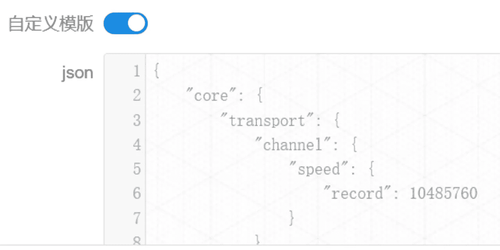

第二种方式是使用 DS 的模型，写 SQL 使用 DataX。可以通过 DS 中的 GUI 配置的插件包括 MySQL、PostgreSQL、ClickHouse、Oracle 和 SQLServer:

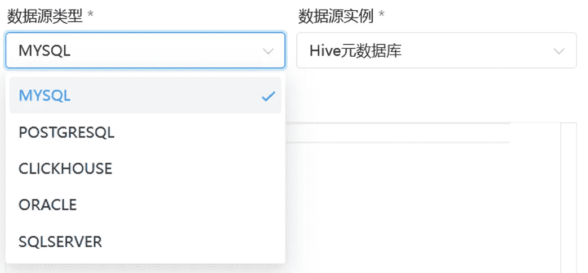

第三种方式是在 DS 中创建一个 shell 任务，然后通过 shell 调用部署在服务器上的 DataX 脚本，将脚本放在 DS 的资源中心:

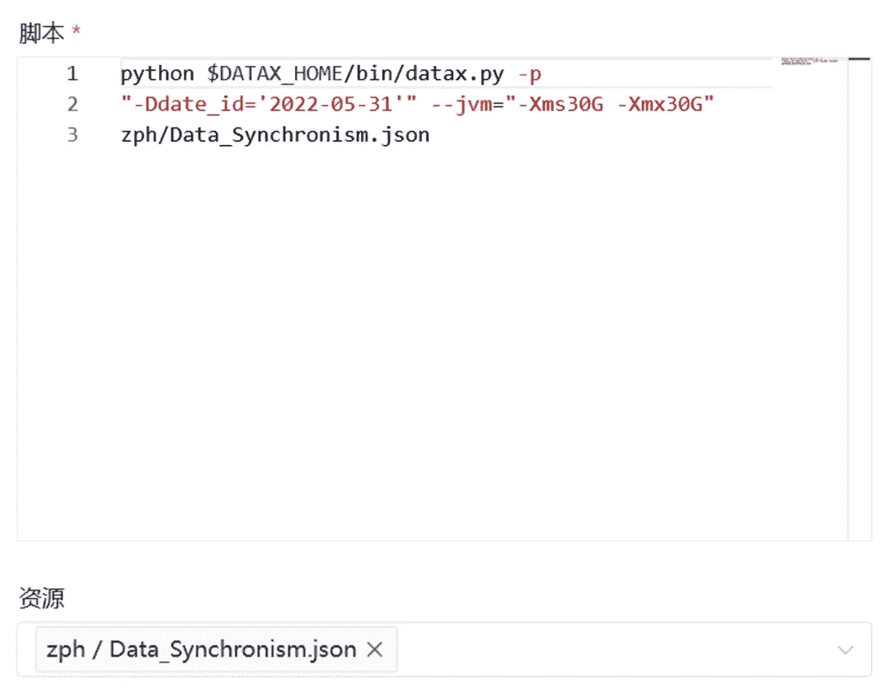

第一种方法对我们来说是最方便、最适应的方法，第二种和第三种方法要视情况而定。

## DataX 的使用

DataX 中每个通道有两种速度控制。第一个是控制每秒同步的记录数，另一个是控制每秒同步的字节数。默认的速度限制是 1MB/s，这个字节速度或者记录速度限制可以根据具体的硬件情况来设置，字节速度设置为固定的标准。

我们的通道是根据每个任务的数据数量和大小经过多次调整后获得的。这需要根据我们的数据情况进行调整。我的任务的最大数据量是由数据总量配置的。记录限速 300M/s，单通道记录限速 10M/s，第一种方法对我们来说是最方便最适应的方法，第二种和第三种方法要视情况而定。

```
{
"core": {
"transport": {
"channel": {
"speed": {
"record": 10485760
}
}
}
},
"job": {
"setting": {
"speed": {
"record": 314572800
},
"errorLimit": {
"record": 10000,
"percentage": 0.1
}
},
```

但并不是越大越好。如果通道太大，会影响服务器的性能。它将不断向 GC 报告。一旦报告了 GC，性能就会下降。

一般在我们的服务器上配置好以上参数后，一个任务就顺利运行了。如果多个 DataX 任务同时在一台服务器上运行，并且 JVM 设置得太小，那么每 5 分钟就会报告一次 GC。

根据控件，很明显，DataX 任务中的通道数量增加了，这意味着占用的内存也将增加。使用 DataX，数据交换通道将在内存中缓存更多的数据。

DataX 中有一个缓冲区用于临时内存交换。读取器和写入器中还有一个缓冲区来缓存数据。如果 JVM 报告 GC，主要是在那里报告，所以我们需要根据配置进行调整。JVM 参数。

一般我的任务参数都是由 DS 的参数控制的。如下图所示，主要设置为 4G~16G，具体取决于硬件的性能。

```
$DATAX_HOME：/opt/beh/core/datax/pybin/datax.py --jvm="-Xms8G -Xms8G" -p"-Da=1"
```

在调优了内存和 CPU 之后，下一步就是读取器和写入器的基本配置，比如 HDFS 路径、Kerberos 相关的设置、字段映射、CK 库表等。

最后一部分是我们在使用的时候发现，即使优化了 CK，各个部分还是会有太多的误差。经过进一步调查，DataX 的 ClickHouse 编写器通过 JDBC 远程连接到 ClickHouse 数据库。然后将 ClickHouse 公开的用于写数据的插入接口插入到 ClickHouse 中。根据 ClickHouse 特性，每个插入都是一个部分，所以不可能一次插入一段数据。必须海量插入 ClickHouse，这也是官方推荐的。

因此，我们优化了 DataX batchSize，优化参数如下:

```
"batchSize": 100000,                          
"batchByteSize": 268435456,
```

# 应用场景

## 元数据备份

使用 DS 定期备份 Hive 元数据、CDH 元数据、HDP 元数据和 DS 自己的元数据，并上传到 HDFS 进行存储。

## 任务调度

计划任务，如 Shell、SparkSQL、Spark、DataX 和 Flink。当前任务主要分为新任务和旧任务迁移。任何新添加的任务都是新项目之一。我们正在推动业务部和其他 R&D 中心将任务上传到 DS 调度平台。旧任务迁移的话，阻力比较大。以前的离线、流和 shell 任务将迁移到 DS。一些旧的 MR 代码在迁移过程中被改成 Spark 或 Flink，放到 DS 上运行。

## 甘特图表

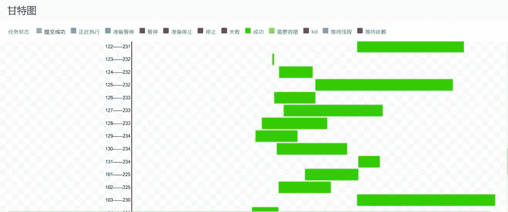

## 数据清理

这主要是针对有存储期的数据，Hive、HDFS 和一些服务器上的日志也需要定期清理。

# 未来规划

1.  开发一个系统，将特定任务调度系统中的任务迁移到 DS 中。它将是半自动化的，有助于促进 DS 在任务调度领域的应用。
2.  DS 集群部署和升级工具减少了运维工作量。
3.  从定制监控到插件监控，从高代码到低代码，时间监控和告警更加灵活，节点、工作流、数据库、任务等问题。被及早发现。
4.  二次开发，增加只读场景，回收站功能，增加判断条件和功能，资源批量上传等。，来帮助大数据。
5.  集成 API 网关功能，对协议适配、服务管理、限流和融合、认证和授权以及接口请求执行一站式操作。

这就是我的分享。谢谢！有兴趣的话欢迎加入社区和我一起讨论添加社区助手添加进中文用户群~

最后，欢迎大家加入 DolphinScheduler 大家庭:

我们鼓励任何形式的社区参与，最终成为 PMC 的委托人，例如:

*   在 GitHub 上以问题的形式报告遇到的问题。
*   回答其他人遇到的任何问题。
*   帮助改进文档。
*   项目帮助和添加测试用例。
*   向代码添加注释。
*   提交 PR 以修复 bug 或特性。