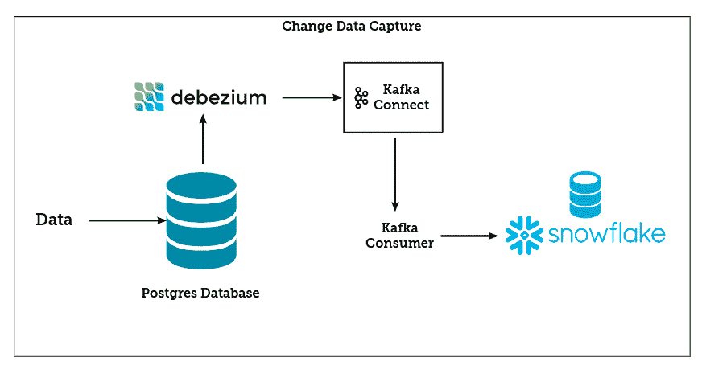
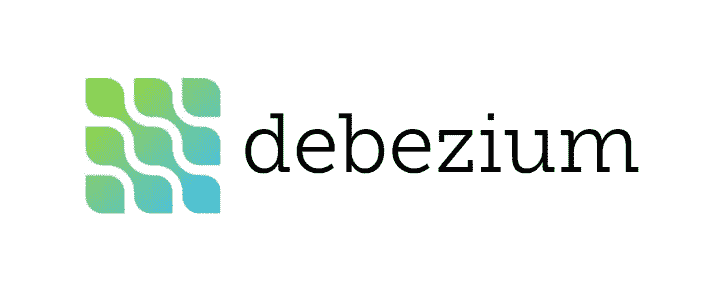
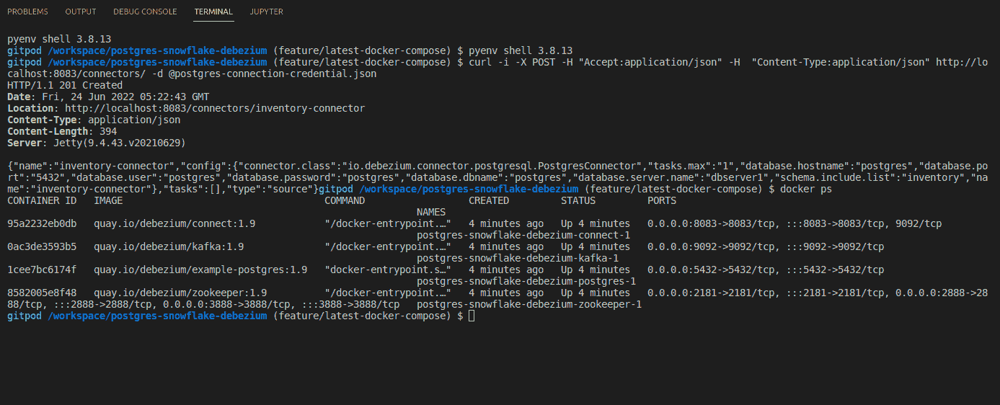
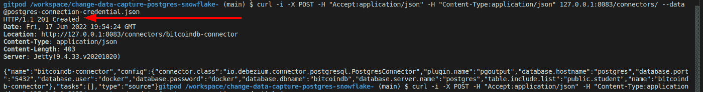
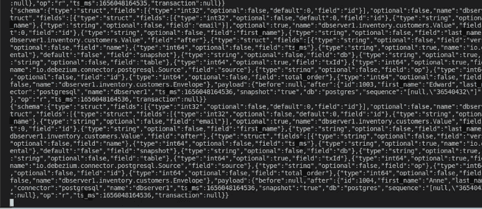
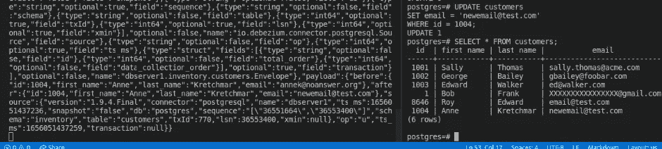
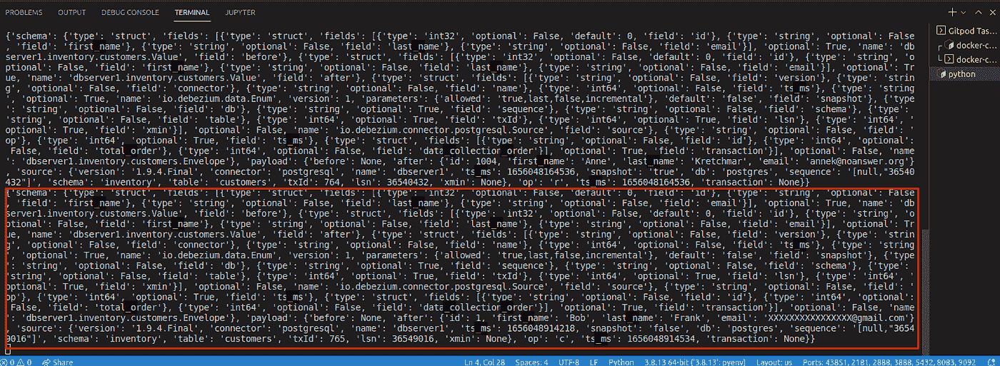
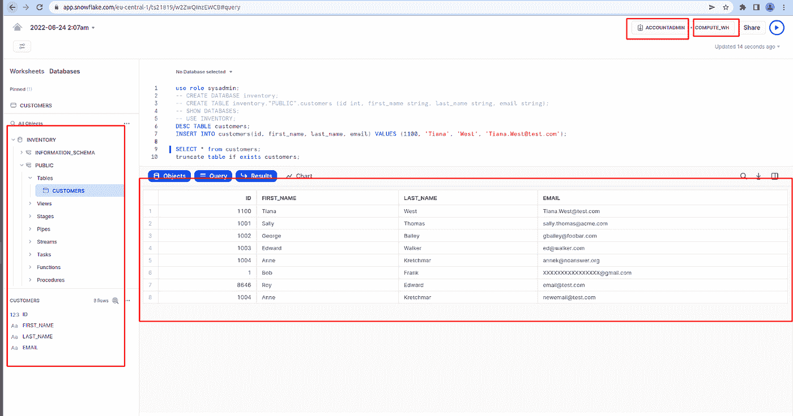

# 将数据捕获(CDC)从 Postgres 更改为雪花

> 原文：<https://medium.com/codex/change-data-capture-cdc-from-postgres-to-snowflake-60c9c577fb87?source=collection_archive---------2----------------------->

## 如何在 Postgres 数据库上执行变更数据捕获


布莱克·康纳利在 [Unsplash](https://unsplash.com?utm_source=medium&utm_medium=referral) 上的照片

改变数据捕获传统旨在开启许多数据驱动的用例。在某些情况下，组织更喜欢近乎实时地获得可操作的见解，许多下游应用程序正在等待消费和整合业务用例。这一点非常重要。在这篇文章中，我们将设计并实现一个 Postgres 表上的变更数据捕获，我们将把这个数据放入雪花表中。有趣的是，您可以将本文中使用的方法应用于任何数据库或任何关系数据库。但需要注意的是，CDC 针对不同数据库的内部工作方式是不同的，针对这些数据库的 CDC 实施也是不同的。

但是，在我们走得太远之前，让我们看一下变更数据捕获(CDC)。CDC 是识别源系统中数据何时发生变化的过程，以便下游流程或系统可以处理并捕获该变化。例如，一个常见的用例是在不同的目标数据库或系统中填充变更，以便系统中的数据保持同步。



更改数据捕获(图片由作者提供)

此外，在您的源系统上实现 CDC 时，一定要注意在您的数据库上启用 CDC 对性能的影响，这可能会以不同的方式来捕获生产中更改的数据。在数据库上启用 CDC 之前，我们可能希望增加 vCores 的数量或提高性能水平来进行补偿。我们可能需要密切监控空间利用率，并保持较短的保留期。

这里要注意的一件有趣的事情是，您可以利用 CDC 的能力在不同的数据库或下游系统之间同时移动数据。在这篇文章中，我们将只讨论一个数据库(雪花),但是您可以使用这里提供的方法为许多数据源实现它。幸运的是，Debezium 是一个基于 Apache Kafka 的开源工具，它允许我们使用事件流轻松地在不同的数据库/系统之间移动数据。

首先，我们将介绍 CDC，并了解最常见的变更数据捕获方法。然后，我们将设计部署所需的 docker 映像，设置一个雪花帐户，并设计一个雪花数据库，以随时使用 Postgres 数据库中的数据。我们将向 Postgres 发送几行数据，并期望 Postgres 数据事件流消息由 Debezium 和 Kafka Connect 监控。这里的最终目标是将数据从 Postgres 数据库近乎实时地放入雪花表。

## 变更数据捕获(CDC)简介

使用 Debezium，您可以捕获 MySQL、MongoDB、Postgres、SQL Server、Oracle、Db2、Cassandra 和 Vitess 中的数据变化。它通过使用 Debezium 来监控数据库，以查看不同的操作正在发生。您可以监视数据库的操作插入、更新、删除等。其中一个有趣的部分是，Debezium 可以将一个现有的数据库快照放入一个事件流中，这样您的下游应用程序就可以根据更改进行操作，或者使用事件流，并对向前移动的事件流执行一些操作。



Debezium(图片由作者提供)

Debezium 构建在 Apache Kafka 之上，它提供了 Kafka Connect 兼容的连接器来监控特定的数据库系统。Debezium 监控这些数据库系统的方式是不同的，因为每个数据库的开发策略是不同的。Debezium 在 Kafka 日志中记录数据更改的历史，从那里，您的应用程序可以使用它们。有趣的是，Debezium 配置为与这些数据库一起工作的方式在内部是不同的，因为不同的关系数据库和 NoSQL 数据库是以不同的方式创建的。因此 Debezium Postgres 的设计实现将与 MySQL 不同，与 Cassandra 也不同。你可以在这里阅读更多关于这个[的内容。](https://debezium.io/documentation/reference/stable/tutorial.html)

我喜欢 Debezium 的一点是，即使你的应用程序意外停止，它也不会错过任何东西；一旦应用程序重新启动，它将从停止的地方继续使用事件。出于这篇博文的目的，我们将设计并实现一个 CDC 管道，以近乎实时的方式插入到雪花数据库中。在此之前，我们将了解最常见的变更数据捕获方法。

## 最常见的变更数据捕获方法

有不同的 CDC 方法可用，选择这些方法完全取决于您的应用程序要求以及 CDC 在为源系统启用时可能导致的性能开销。我们将看看两种最常见的 CDC 方法，基于查询的和基于日志的变更数据捕获。

*   **基于查询的变更数据捕获:**基于查询的方法使用常规的数据库查询从数据库中提取信息。关于这种方法需要注意的一点是，流程和执行需要大量资源来计算第二个数据库中的数据和流出数据库的数据之间的差异。此外，资源消耗至少随着数据量的增长而线性增长。
*   **基于日志的变更数据捕获:**执行数据库变更数据捕获的最强大的方法是基于日志的变更数据捕获。这是因为数据库将所有更改存储在事务日志中，以便在数据库因任何原因崩溃时恢复数据库的提交状态。基于日志的 CDC 利用事务数据库的这一方面从日志中读取更改。基于日志是强大的，因为它可以给出所有关于历史的信息，以及针对数据库将会发生什么。所有的变化都记录在事务日志中，在我们的例子中，我们将实现基于日志的 CDC。就这样，让我们把手弄脏。

## **第一步:克隆代码为**的 GitHub repo

该存储库包含启动和运行开发所需的所有文件。我已经提供了您的环境变量的样子，还提供了一个 GitHub Readme 页面来指导您的开发。有了这些，我们现在可以开始开发了。

```
git clone https://github.com/yTek01/CDC-postgres-snowflake.git
```

## **步骤 2:设计部署所需的 Docker 映像**

## **第三步:在终端上指定 Debezium 版本**

```
 export DEBEZIUM_VERSION=1.9
```

## **第四步:启动所有资源**

```
docker-compose -f docker-compose-postgres.yaml up -d
```

一切准备就绪，我们可以开始了。输出应该如下所示。使用命令确认这一点。

```
docker ps
```



运行 Docker 容器(图片由作者提供)

## **步骤 5:启动并创建 Postgres 数据库连接器**

```
curl -i -X POST -H "Accept:application/json" -H  "Content-Type:application/json" http://localhost:8083/connectors/ -d @postgres-connection-credential.json
```

您应该会看到类似下面的截图。



数据库连接(图片由作者提供)

## **第六步:启动 Debezium 和 Kafka 连接**

值得注意的是，Debezium 内部重用 Kafka 和 Kafka Connect 来实现其耐用性、可靠性和容错性。但是请注意，我们已经将主题指定为“dbserver1.inventory.customers ”,当您想要配置应用程序以从 Kafka 消费时，将需要该主题。下面的命令执行 Kafka 容器，并启动 Kafka 消费者开始监听来自 Postgres 数据库的事件流。

```
docker-compose -f docker-compose-postgres.yaml exec kafka /kafka/bin/kafka-console-consumer.sh \
   --bootstrap-server kafka:9092 \
   --from-beginning \
   --property print.key=true \
   --topic dbserver1.inventory.customers
```



卡夫卡消费输出(作者图片)

## **第七步:建立雪花账户和雪花数据库**

为了帖子的目的，我建立了一个免费试用的雪花账号，来建立一个免费的数据库。雪花提供了 40 天的免费试用，以尝试他们的资源，这很酷。你可以在这里注册[而不用信用卡，有了这个账号，你就可以为你的工作量建立一个免费的雪花数据仓库、数据库和表格。](https://signup.snowflake.com/)

在我的例子中，我只建立了一个简单表的数据库，一个有四列的表。我将写入 Postgres 表，正如预期的那样，我们应该能够看到雪花表中的数据，如果 CDC 设置在任何时候出现故障，我们的设置应该能够恢复并继续进行近乎实时的数据捕获。在开始启动应用程序之前，请确保安装了必要的库，将您的数据库凭证附加到环境变量，并按照下面提供的时间顺序启动应用程序。

成功创建雪花帐户后，转到工作表选项卡，为来自 Kafka Consumer 的数据创建数据库和表模式。我们的数据库模式如下所示:

```
CREATE TABLE inventory."PUBLIC".customers (id int, first_name string, last_name string, email string);
```

## **步骤 8:将数据插入 Postgres**

```
docker-compose -f docker-compose-postgres.yaml exec postgres env PGOPTIONS="--search_path=inventory" bash -c 'psql -U $POSTGRES_USER postgres'
```

```
INSERT INTO customers (id, first_name, last_name, email) VALUES (1, 'Bob', 'Frank', 'XXXXXXXXXXXXXXXX@gmail.com');
```



消费者产出和 Postgres 数据库中的产出(图片由作者提供)

## **第 9 步:安装所有必要的库**

在我的例子中，我已经在 requirements.txt 文件中指定了我将使用的所有 Python 库:然后我们的 Python 应用程序可以使用来自 Kafka Connect 的数据

```
python -m pip install -r requirements.txt
```

## 步骤 10:在 ENV 中包含所有雪花数据库凭证

```
USER=XXXXXXXX
PASSWORD=XXXXXXXXX
ACCOUNT=XXXXXXXX.eu-central-1
ROLE_ACCOUNT=XXXXXXXXXXXX
WAREHOUSE=COMPUTE_WH
DATABASE=INVENTORY
```

## **步骤 11:打开另一个终端，启动 Python 消费者**

此时，我们的应用程序已经准备好开始监听、获取和处理数据，因为数据已经从 Debezium 发布到我们的下游应用程序。

```
python consumer.py
```



来自消费者应用程序的数据(图片由作者提供)

## **步骤 12:转到雪花确认所有数据都可用**

正如你在截图中看到的，我们所有的数据现在都在雪花中。



雪花数据库中的数据(作者图片)

## **结论**

变更数据捕获允许下游应用程序近乎实时地使用来自上游数据源的数据。多年来已经开发了不同的方法，但最常用的 CDC 方法是基于日志的变更数据捕获。如前所述，如果在数据库上启用 CDC 后没有考虑性能影响，CDC 可能会导致数据库在生产中出现问题。在将实现部署到生产环境之前，请确保对数据库和数据工作负载进行了适当的测试，并确保为数据库分配了足够的资源。

对于将数据发送到雪花表中的应用程序，请确保您设计的应用程序不会在每次将一行数据发送到数据库时都命中数据库，只对所有插入使用会话对象，并将数据库凭据放在应用程序之外。

**来源和进一步阅读**

[1] [Debezium — github 回购](https://github.com/debezium/debezium-examples/tree/main/tutorial) (2022)

**感谢您的阅读。**