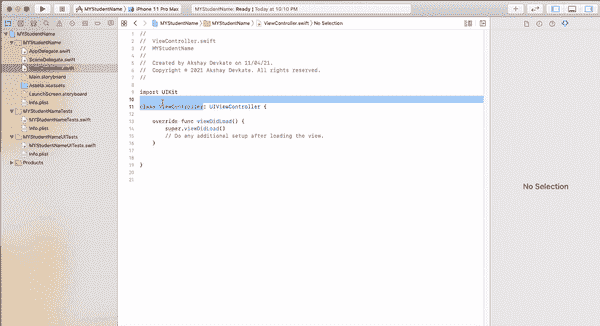

# 如何在 iOS 中更改 ViewController 的名称

> 原文：<https://medium.com/codex/change-name-of-viewcontroller-in-storyboardui-d5c1acd22335?source=collection_archive---------7----------------------->

帕特里克·沃德在 [Unsplash](https://unsplash.com?utm_source=medium&utm_medium=referral) 上的照片

您可能想要根据项目需求更改默认视图控制器的名称，以便更好地理解该视图控制器的确切需求。为了跟踪应用程序的进度并理解特定的视图控制器执行什么，它们必须被唯一地命名。要更改视图控制器的名称，请遵循简单的步骤。

**第一步:**右击鼠标，选择 viewController 的现有名称，在下面的例子中是 ViewController

**第二步:**按住键盘上的控制键，按下鼠标右键。

**步骤 3:** 将出现一个下拉菜单，然后在下拉菜单中选择重构。选择 refactor 后，将出现另一个下拉菜单，在其中选择 Rename。

**步骤 4:** 现在根据您的方便，为现有的 ViewController 命名(在下面的例子中，我们将 ViewController 从 ViewController 重命名为 AViewController ),并选择 Rename 按钮(Xcode 右上角的蓝色)

重命名 ViewController