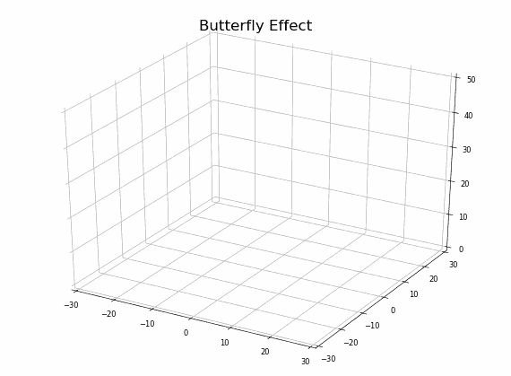
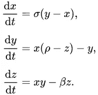
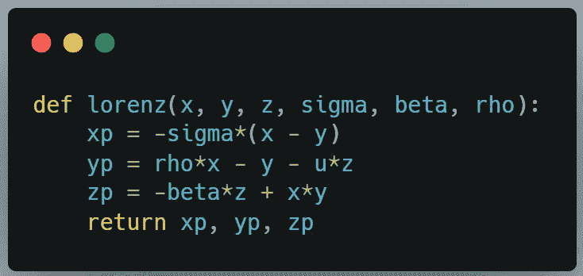
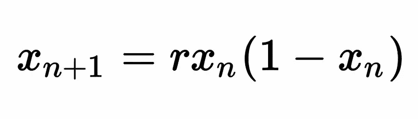
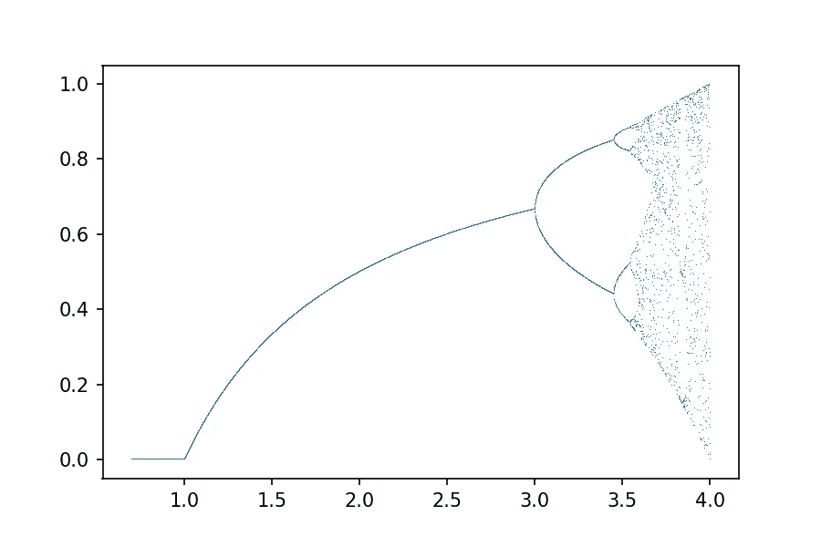
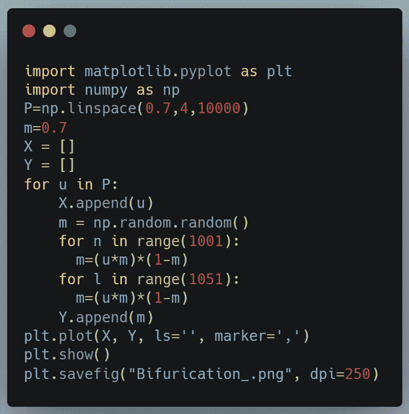
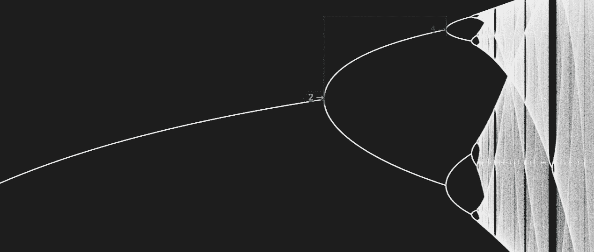
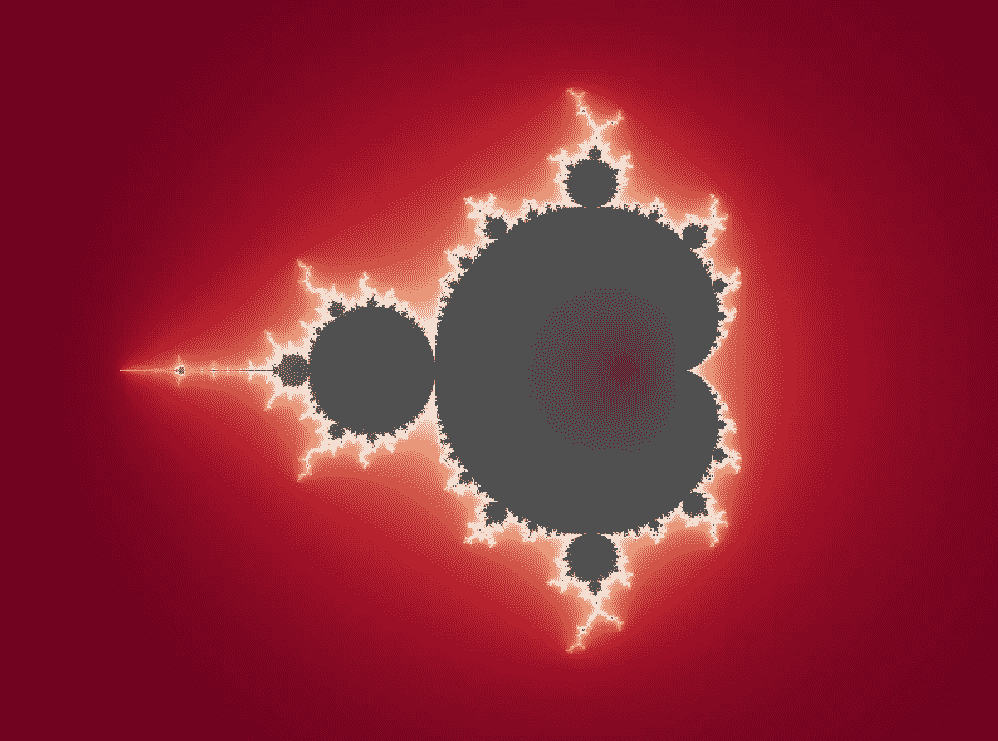
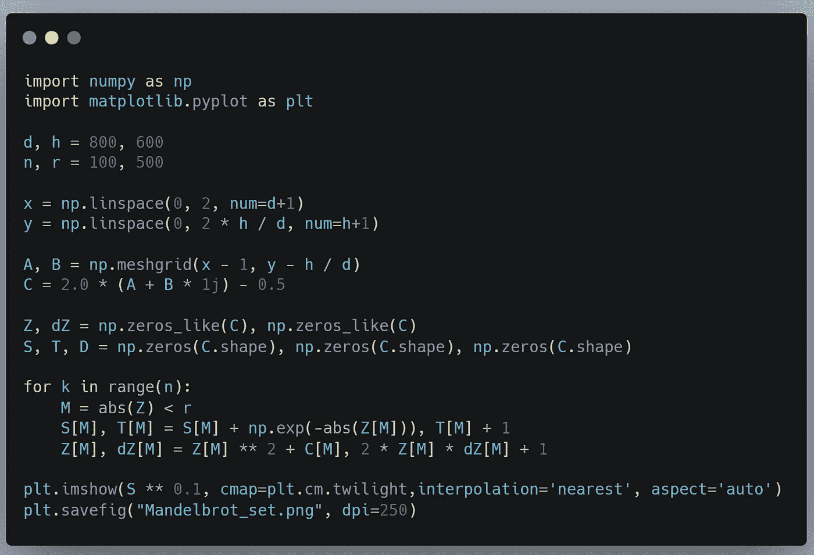
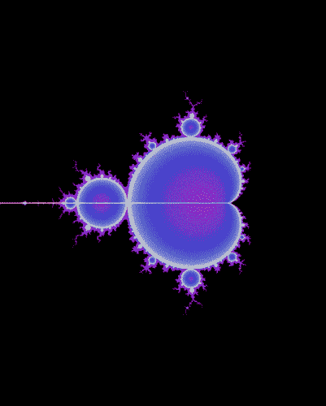

# 混乱

> 原文：<https://medium.com/codex/chaos-b1544ad03948?source=collection_archive---------2----------------------->

## 混沌理论遇上 Python 编程

自然界中的分形(图片来源:cyclone bill/维基百科)

我最近读了詹姆斯·格雷克写的令人惊叹的书 [***【混沌:创造一门新的科学***](https://www.amazon.com/Chaos-Making-Science-James-Gleick/dp/0749386061/) ，它向我介绍了混沌的科学和美丽。理解蝴蝶效应、奇怪的吸引子、曼德尔布洛特集合等概念是一种启示。此外，用 Python 再现书中呈现的精彩视觉效果非常有趣，下面我将介绍其中的一些。

## 蝴蝶效应

蝴蝶效应是混沌理论中最流行的概念，也是最容易被误解的概念。大多数人对蝴蝶效应的一般看法是，它象征着导致后来巨大变化的小因素(就像一只蝴蝶在北京扇动翅膀，你会在纽约遇到龙卷风)。但这个想法实际上谈论的是大型复杂系统中对初始条件的敏感依赖，这意味着初始条件的微小变化也可能导致后来的巨大变化。一只蝴蝶的拍动可能会引起一场龙卷风，甚至可能会阻止一场龙卷风。这个系统太复杂，太纠缠不清，以至于即使我们做了一点小小的改变，我们也永远无法知道会发生什么。

洛伦兹吸引子

有一些简单的机械系统，如水轮或双摆，表现出这种行为。把上面的图像想象成我们正在追踪的系统的不同参数(比如一个双摆的位置，速度等等。).动画实际展示的是系统从不重复同样的状态。最终的图形类似于蝴蝶的翅膀，我认为这个效果的名字来自于这个视觉效果，而不是其他流行的龙卷风的概念。即使看起来曲线可能相交，但如果仔细观察 3D 图形，您会发现它们从未相交。对洛伦兹吸引子进行编码是非常容易的，因为在核心处，它只是一组 3 个微分方程，描述了 3 个量相对于时间的变化率。

洛伦兹方程

洛伦兹方程的 Python 代码

## 分歧

在混沌理论中，分叉是我最感兴趣的概念。它处理人口增长问题。假设我们有一个蝴蝶数量为 ***x*** ，增长率为 ***r*** 。 ***x*** 是介于 0 和 1 之间的数字，表示假设的最大可能人口的比率。我们需要模拟种群增长，我们知道如果种群增长失控，蝴蝶将会饿死。因此，模型必须能够自我调整(用数据科学的术语来说)。在这种情况下，逻辑图可以完美地工作。

模拟人口增长

这个等式显示了明年蝴蝶的数量如何依赖于今年的数量。乘以括号中的项可以确保人口不会不受控制地增长。如果我们用上面的等式，从一个特定的值 ***r、*** 比方说 2 ***、*** 开始，种群波动，多年后最终稳定在一个稳定值。

如果我们增加 ***r*** 的值呢？稳定的人口也增加了。如果我们进一步增加 ***r*** 呢，比如说 3？你会发现人口永远不会收敛到一个单一的数字。相反，它在 2 个数字之间波动。从视觉上看，该图一分为二，因为有两个稳定的群体。如果进一步增加 ***r*** ，图形再次分裂。这是混乱的开始！

分叉图——混沌始于 x = 3

使用下面的代码可以很容易地在 Python 中创建分叉图。

分叉图的 Python 代码

## 分形

分叉图有一个有趣的性质。如果你放大图中的混乱区域，你会看到模式在重复。

照片: [jonnyhyman](https://github.com/jonnyhyman/Chaos)

分形是在不同尺度上自相似的模式。有许多自然发生的分形，如雪花、树木、血液循环系统、照明等。格雷克在书中认为，由于自我重复模式只需要较少的信息来编码，我们在复杂的生物器官中常见，如人类的肺，因为 DNA 只需要编码很少的信息来告诉身体如何创建该器官。

## 曼德尔布罗集合

Mandelbrot 集合是迭代函数 *x + c，*其中 c 是常数*，*不会增长到无穷大的数的集合。让我们以 ***x = 2* 和 *c=-1*** 为例来理解这一点。迭代地应用该函数，我们得到 ***x1= 2 - 1= 3，x2 = 3 - 1 = 8，x3 = 8 - 1 = 63*** *，*，并且它继续增长到无穷大，因此它不可能是我们集合的一部分。让我们取 ***x=1，*** 我们得到 ***x1= 1 - 1= 0，x2 = 0 - 1 = -1，x3 = 1 - 1 = 0。它在 0 附近波动，永远不会增长到无穷大，因此成为集合的一部分。如果我们写一个代码来找出集合中所有的复数，并把它们画出来，我们会得到下面这个美丽的视觉效果。***

曼德尔布罗集合

用于创建上面显示的 Menlbrot 集合图像的 Python 代码

## Mandelbrot 集与分叉图的关系

Mandelbrot 集和分叉图之间有一种隐藏的关系。如果我们画出 Mandelbrot 集合中的数字在 z 轴上收敛的值，我们实际上得到了分叉图！很神奇，不是吗？

来源:[维基百科](https://upload.wikimedia.org/wikipedia/commons/8/8e/Buddhabrot_logistic_map_animation.gif)

## 最后的想法

多亏了格雷克的书，混沌理论的科学和美丽给了我一个启示。它改变了你看待世界的方式，你开始在日常生活中看到分形和非线性系统。我也对它对试图预测系统未来状态的机器学习领域的影响感兴趣，在这里我们发现混沌系统的状态永远无法预测，至少不能超过一段时间！