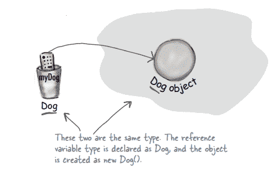

# 第 07 章

> 原文：<https://medium.com/codex/chapter-07-386544fd71fd?source=collection_archive---------23----------------------->

## **遗传和多态性**

当子类需要修改继承方法的行为时，它会重新定义被继承的方法。

# **-传承-**


子类通过继承来继承其父类的方法和实例变量。方法可以根据子类的特定需求被重写，但是实例变量不能被重写，因为它们不指定任何行为。


# **-创建代码继承-**

*   第一步:寻找具有相似属性和行为的人。
*   第二步:把那些共同的特征和行为放入它们自己的类别中。
*   第三步:检查是否有任何子类被允许使用特定的行为。
*   第四步-:找到其他具有相似功能的子类，并抽象地将它们连接到父类。
*   第五步-:完成类的层次结构。

在具有继承关系的多个类型中调用方法时，必须使用点运算符。当您在类层次结构中向上移动时，应该调用这些方法

```
Dog dog = new Dog();
dog.sound();
dog.eat();
```

当我们谈论 IS-A 和 HAS-A 关系时，我们谈论的是两个不同的概念。当两个类之间有继承时，我们可以使用 IS-A 关系。例如，圆是一种形状，而猫是一种动物。但是，我们不能在继承中创建 HAS-A 连接，但是我们可以使用它作为告诉实例变量的引用。在本例中，浴室有一个浴盆意味着浴室有一个浴盆实例变量。

如果类 B 扩展了类 A，那么类 B 是-A 类 A，如果类 C 扩展了类 B，那么类 C 是-A 类 B，例如，类 C 同时扩展了类 B 和类 C 的行为。C 类具有与 A 类和 b 类相同的能力。

您应该使用 super 关键字在您的类中同时应用超类方法和重写方法。


在这里，您可以稍后使用超类方法 roam 和覆盖方法 roam。

当子类从父类继承时，它可以从父类的实例变量和方法中访问，但是如果实例变量和方法是私有的，则不能直接继承。私有成员是唯一可以继承的成员。

*   当一个类是超类的特定类型时，应用继承。延伸之后，应该就说得通了。
*   当你有一个行为应该被许多相同类型的类共享时，考虑继承。
*   只有在需要重用另一个类的代码时，才使用继承。IS-A 连接应该在父类和子类之间。
*   如果子类和超类之间没有 IS-A 连接，就不要应用继承。

**继承中的利益**

您可以利用继承来防止重复代码。您将所有的公共代码放在一个类中，让其他子类从超类继承它。如果您希望更新公共代码，您必须只在超类中进行；否则会影响所有子类。

这种继承也确保了超类下的所有子类都可以访问超类的所有特性。

**多态性**

当我们谈论没有应用多态性的普通对象声明时，对象类型和引用类型是相同的。



当使用多态性时，对象类型和引用类型可以改变。


当您定义一个具有多态性的引用变量时，您可以将它赋给任何一个对象，该对象为引用变量的指定类型传递 IS-A 关系。


我们可以有多态的参数和返回类型。


**压倒一切**

*   当重写时，参数和返回类型应该与超类相同。
*   您不能重写方法并使其成为私有方法。超类应该有相同的公共访问修饰符。


示例 01


示例 02

**超载**

重载一个方法指的是拥有一个或两个以上的同名但参数不同的方法。

*   可以根据传入的输入调整返回类型。
*   仅仅改变返回类型是无法实现重载的。
*   访问级别可以以任何方式更改。

