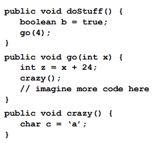

# 第 09 章

> 原文：<https://medium.com/codex/chapter-09-a86ad4ede4cc?source=collection_archive---------25----------------------->

**构造函数和垃圾收集**

**-栈和堆-**

T 应用程序不断地需要 Java 堆空间，但是栈只用于当前正在运行的函数或者方法。所有对象都是在堆空间中创建的，而对这些对象的任何引用都存储在堆栈中。堆上的对象可以从程序中的任何地方访问。

栈顶的方法总是当前正在运行的方法。

如果一个局部变量是对一个对象的引用，那么只有该变量在堆栈中，而对象在堆中。

实例变量存在于属于对象的堆中。

Duck()不是引用构造函数的方法，如下面的代码所示。通过调用构造函数，一旦正确地启动了代码，就可以运行它。

> Duck myduck =新鸭()；

***-对象创建-*-**

这里我们没有使用 Duck()函数；相反，我们使用 Duck 构造函数。当我们说新 JVM 时，我们的意思是它接收构造器代码并执行它。实例化对象时执行的代码在构造函数中。

我们可以使用 setter 方法来允许程序员设置实例变量的大小，如下所示。

如果这个类有不止一个构造函数，那么它就是一个重载的构造函数。

**-关于构造函数要记住的四件事-**

如果你创建了一个带参数的构造函数，但是想要一个不带参数的构造函数，你必须自己写。

重载的构造函数必须有单独的参数列表，不支持两个构造函数具有相同的参数列表。参数的顺序和类型包含在参数列表中。

*   当您在类类型上键入 new 时，将调用构造函数。
*   它必须与类同名，但是没有返回类型。
*   如果你没有给类添加构造函数，编译器会给你添加一个无参数的构造函数。
*   有可能有许多带有不同参数列表的构造函数。

**输出为**

*   ***首发…***
*   ***制造动物***
*   ***制作河马***

**超类和继承。**

当在构造函数中调用 super()时，超类构造函数被推到堆栈顶部，后面是对象构造函数。当 object()完成时，它从堆栈中移除，并插入下一个子类构造函数。

此()可用于从另一个类的重载构造函数中调用构造函数。This()必须是构造函数中的第一条语句，并且只能在构造函数中使用。可以在构造函数中调用 super()或 this()，但不能同时调用两者。

局部变量只存在于声明它的方法中，但实例变量在对象的整个生命周期中都存在。如果对象仍然存在，则对象的实例变量仍然存在。

只要局部变量的堆栈帧在堆栈上，局部变量就是活的。

**杀人对象。**

1.一旦对象超出范围，就对其进行引用。'

2.然后将引用分配给另一个对象。

3.将引用设置为 null。