# 第十章

> 原文：<https://medium.com/codex/chapter-10-ddcd4eea2749?source=collection_archive---------22----------------------->

**数字&静态**

数学类中的方法是静态的，你不能创建该类的实例，它们不需要实例变量。

使一个类成为静态的允许它在不需要任何实例的情况下执行。术语“静态”是指独立于实例变量的行为。

> 使用类名(Math.min(88，86))调用静态方法
> 
> 使用引用变量名调用非静态方法
> 
> Song t2 =新歌()；
> 
> T2 . play()；

当一个方法或构造函数被声明为私有时，这意味着只有该类中的代码才能调用它。

使用静态方法连接的是类，而不是实例。因此，它无法访问其类的任何实例变量值。

因为非静态方法处理实例变量，所以静态方法不能访问它们。

不能通过将使用静态方法的类的构造函数设为私有来创建实例。

静态变量是一个类的所有成员都可以访问的变量。在类中，不是每个实例变量都有一个副本，而是只有一个静态变量。静态变量可以通过静态方法来访问。

在 Java 中，你可以通过声明一个变量 static 和 final 来生成一个常量。作为名称标准，Constant 应该全部使用大写字母。不能更改 final 实例变量的值，不能修改 final 方法，也不能扩展 final 类。

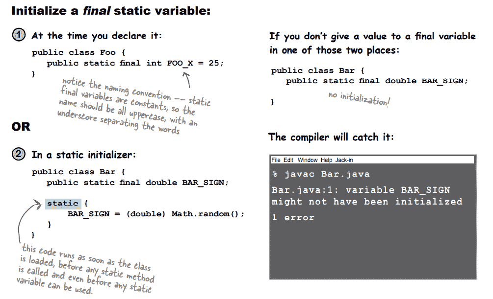

**-数学方法-**

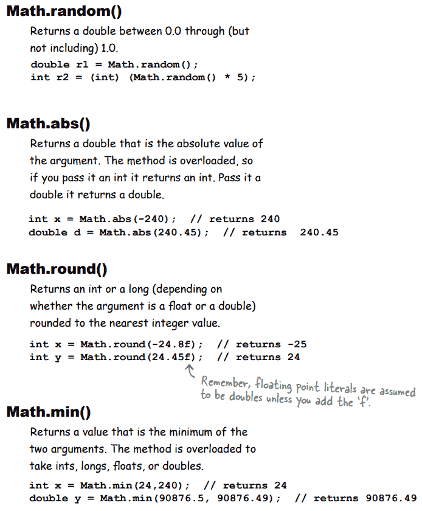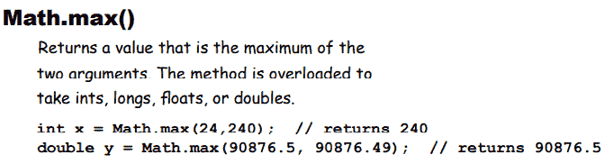

**包装图元**

当你需要像对待一个对象一样对待一个原语时，把它包装起来。

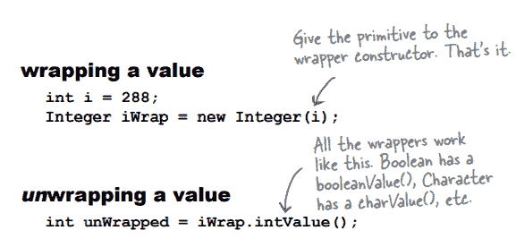

在 Java 5.0 中，有一个叫做自动装箱的特性，它可以自动完成从原语到包装对象的转换。

**-自动装箱的乐趣-**

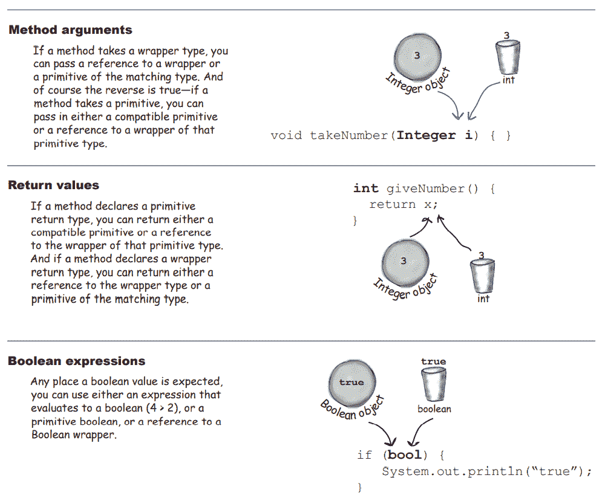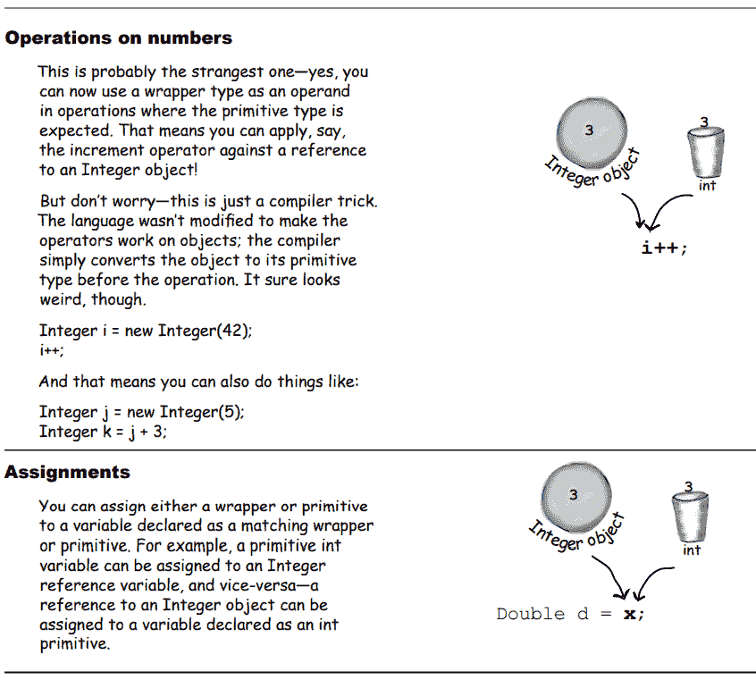

**还有更多！包装材料**

**也要有静态的实用方法！**

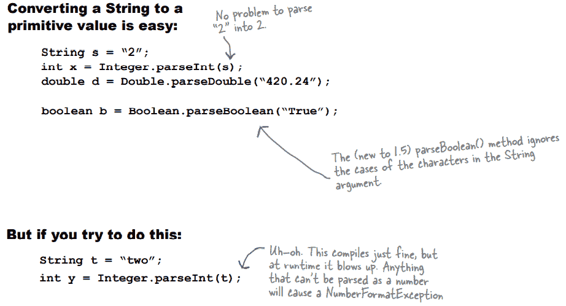

**格式化一个数字要用逗号**

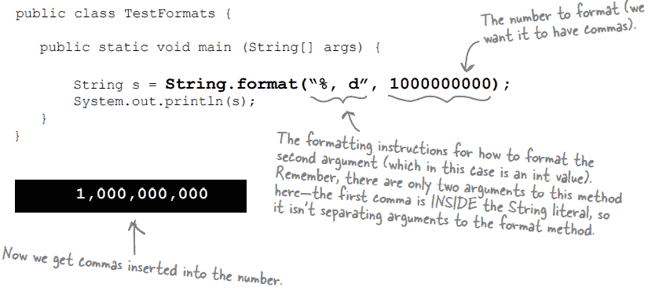

**格式解构…**

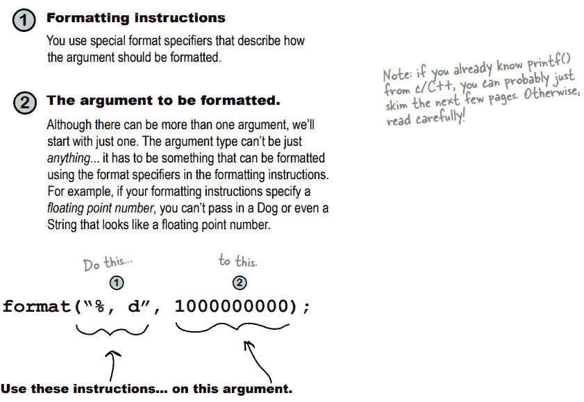

**-格式说明符-**

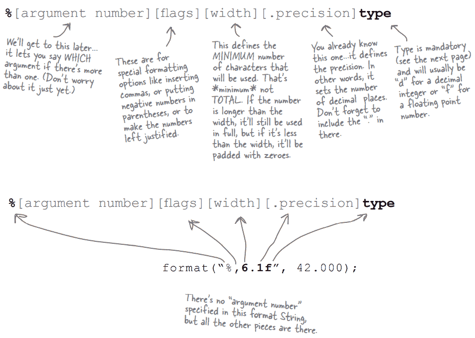

唯一需要的说明符是用于类型

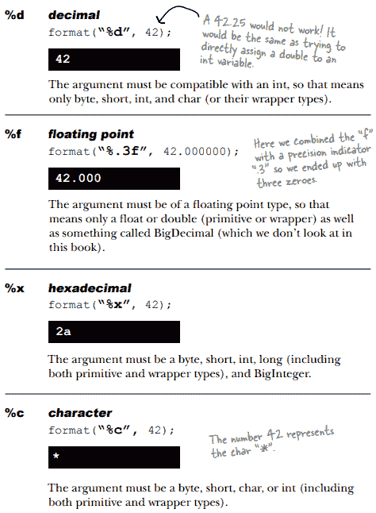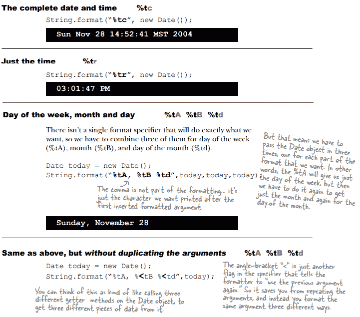

**日历 API 的亮点**

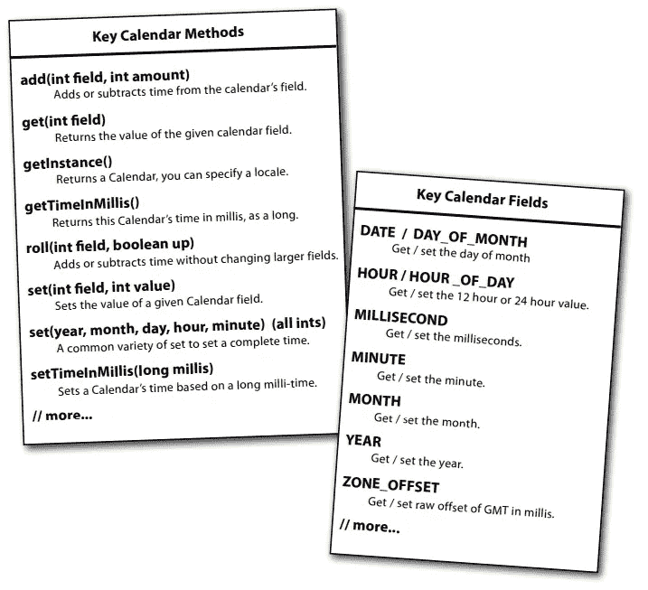