# 破产重组保护

> 原文：<https://medium.com/codex/chapter-11-f8f81a223d58?source=collection_archive---------18----------------------->

**异常处理**

**-Java 声音 API-**

这是一个由两部分组成的类和接口的集合，比如 MIDI 和 samples。乐器数字接口(MIDI)是一种数字接口，它包含有关应该如何播放歌曲的信息。它包含如何播放音乐的说明，而不是声音文件。

Sequencer 对象收集所有 MIDI 数据，并将其发送到允许您演奏音乐的乐器。

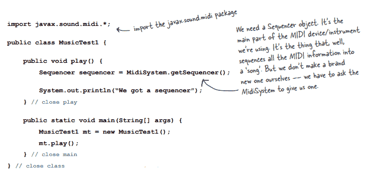

异常处理是 Java 中的一种方法，可用于在运行时管理异常。

try/catch 块告诉编译器，在调用特定函数时，您知道可能会出现运行时异常，并且您已经准备好处理它。您可以向编译器保证，您将通过使用 try/catch 块来处理它。

例外是一种对象。

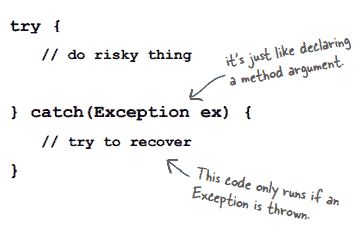

**try/catch 模块中的流量控制**

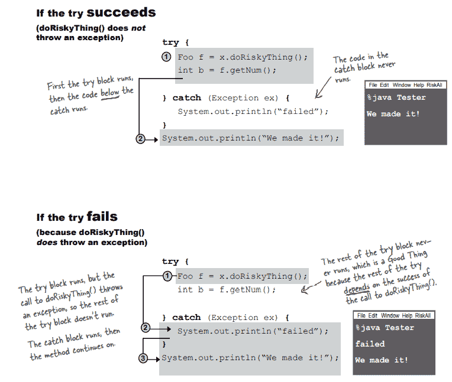

当我们调用一个有风险的方法时，它会抛出一个异常。是危险的方法将异常返回给你(调用者)。

编译器不检查运行时异常，因此它们可以在没有声明或 try/catch 块的情况下被抛出。

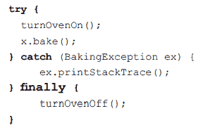

必须独立于异常运行的代码放在最后一个块中。

*   如果 try 块失败，该方法转到 catch 块，然后是 finally 块，最后是该方法的其余部分。
*   如果 try 块成功，它将跳过 catch 块，直接进入 finally 块，在那里方法继续进行。
*   如果 try/ catch 包含 return 语句，Finally 仍将执行，流程将跳转到 finally，然后返回。

检查异常是由编译器处理的异常。

一个方法可以引发多个异常。

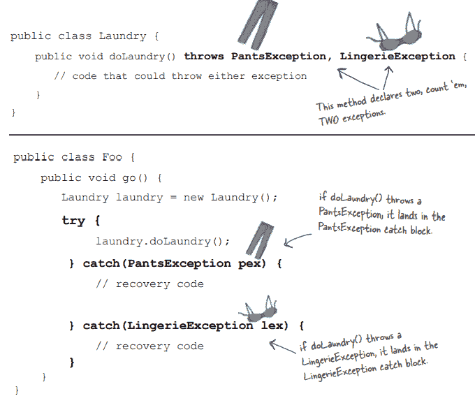

异常的超类型可以用来声明异常。如果我们抛出一个服装异常，我们可能抛出一个牛仔服异常，t 恤异常，等等。多态异常就是它们的名字。

如果你应用了一个超类型异常，你永远不会知道代码中哪里出错了。因为超类型异常捕获所有异常，所以它们非常有用(Exception ex)。

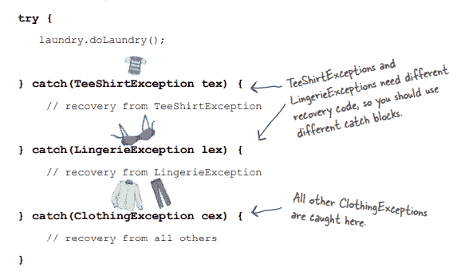

如果我们这样做，我们可以对 t 恤例外和内衣例外使用单独的恢复代码。最后一个 catch 块捕获所有其他服装异常。

## **必须订购多个制动块**

## **从最小到最大**

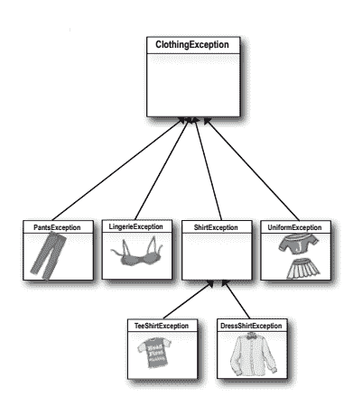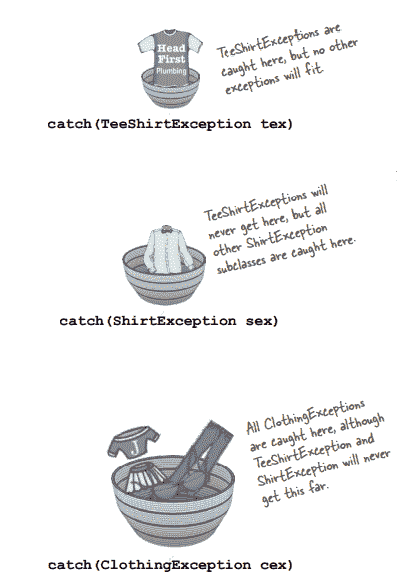

*   所有 t 恤例外都由 t 恤例外标识，而不是其他。
*   所有其他衬衫例外都由衬衫例外标识，但 t 恤例外没有标识。衬衫例外的子类在这里被捕获。
*   服装例外抓住了所有服装例外，但 t 恤例外和衬衫例外永远不会走这么远。

在 try catch 块中，不要在衬衫和内衣异常上面添加服装异常，因为服装异常处理所有服装，而它下面的另外两个异常是不需要的。不要将较大的篮子放在较小的篮子上。

如果你不想处理异常，就忽略它。

*   声明你将抛出一个异常。
*   如果您在回避异常时不使用 try/catch，抛出异常的方法将被推出堆栈，该异常将被抛出到堆栈中的下一个方法。因为没有 catch，如果调用者是 ducker，调用者就跳出堆栈。
*   之后，异常被发送到下一个函数。

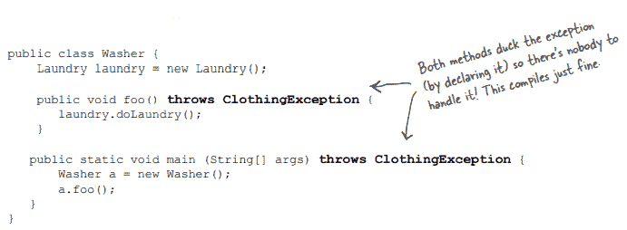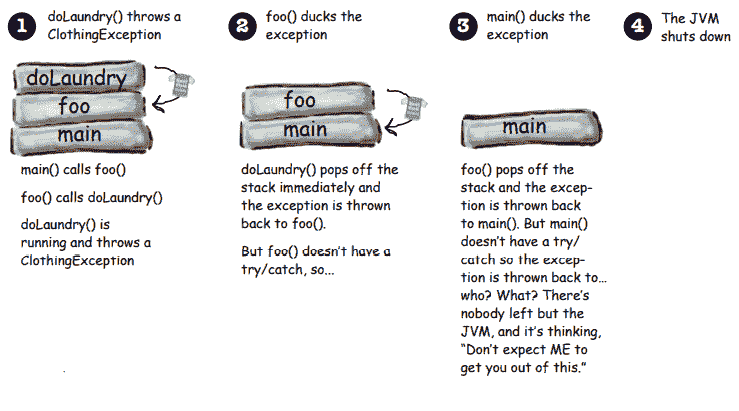

处理或宣布。这是法律。

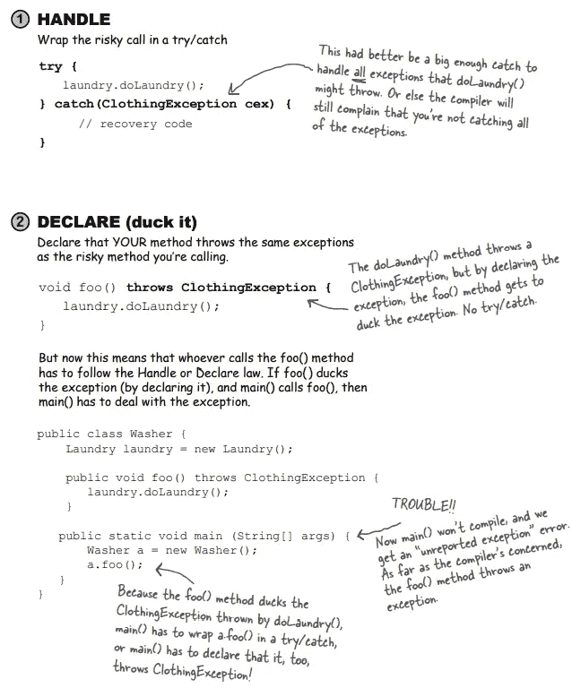

**例外规则- :**

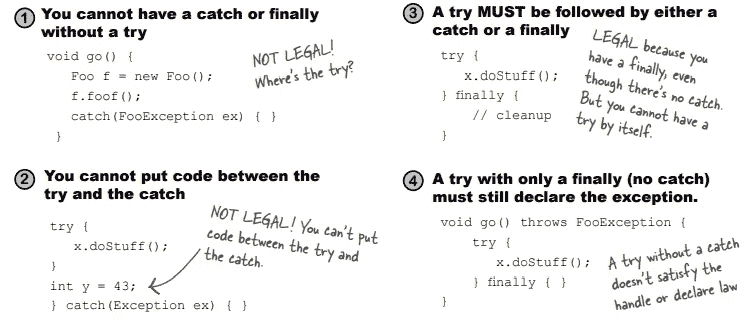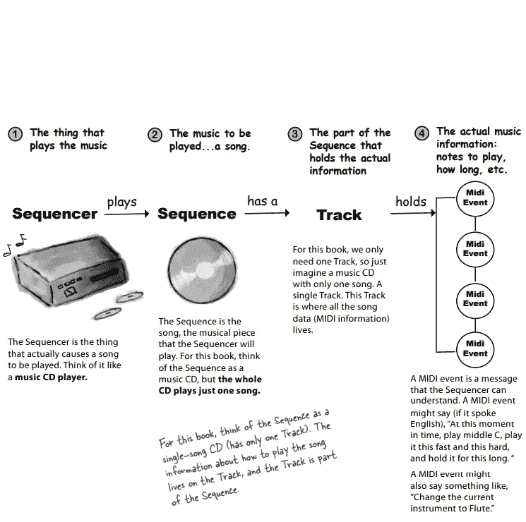

**发出声音**

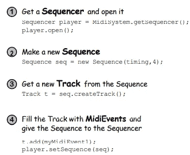

**MIDI 事件说做什么，什么时候做。**

1.制作消息(short message a = new short message()；)

2.在消息中放置指令(a.setMessage(144，1，44，100)；)

3.使用消息创建一个新的 MIDI 事件(MidiEvent noteOn = new MidiEvent(a，1)；)

4.将 MIDI 事件添加到音轨(track . add(noteOn))；)