# 第十二章

> 原文：<https://medium.com/codex/chapter-12-b51dc048f002?source=collection_archive---------15----------------------->

**—获取 GUI—**

**做一个 GUI 很简单:**

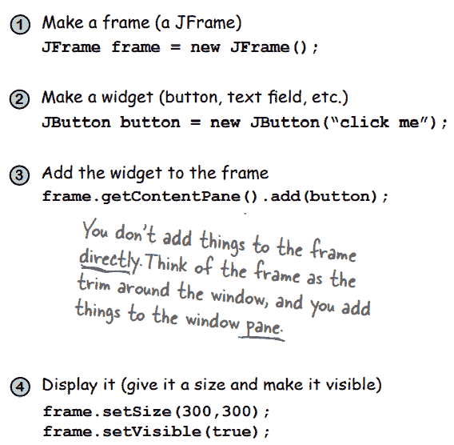

**获取按钮的动作事件**

1.实现 ActionListener 接口

2.用按钮注册(告诉它你想监听事件)

3.定义事件处理方法(从 ActionListener 接口实现 actionPerformed()方法)。

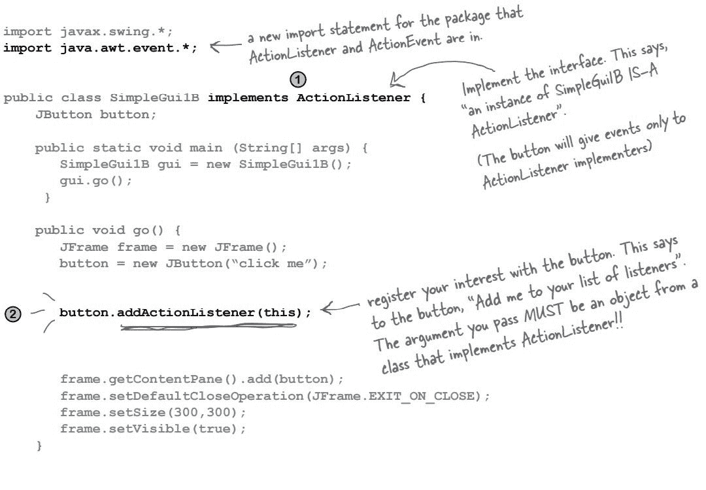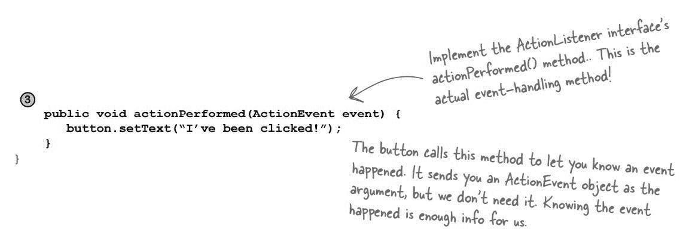

**在你的 GUI 上放置东西的三种方式:**

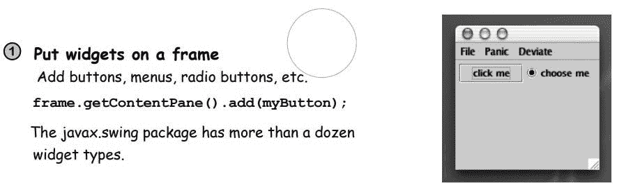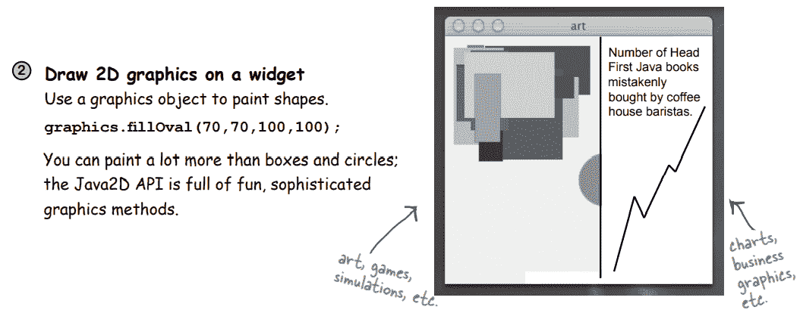

**制作自己的绘图工具**

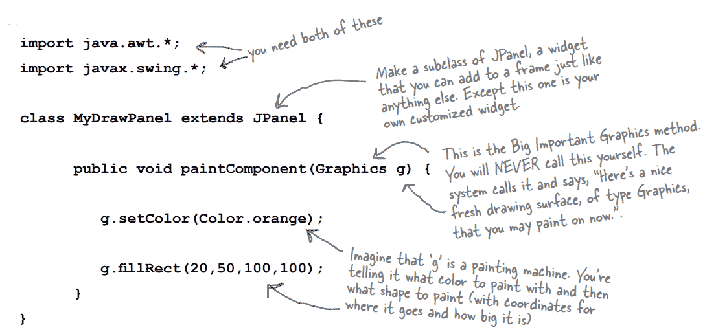

**显示一个 JPEG**

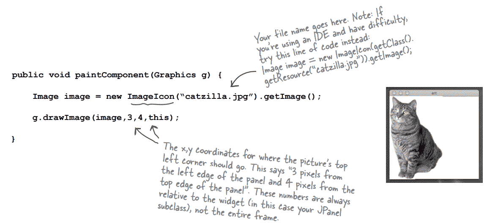

**在黑色背景上画一个随机颜色的圆圈**

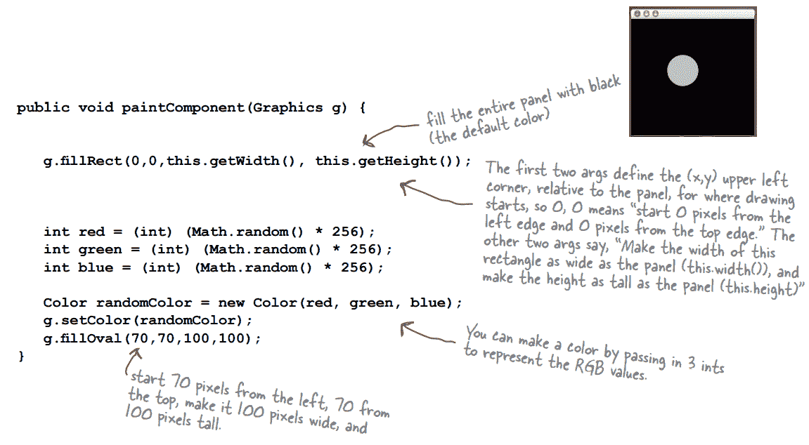

如果一个方法以 add 开始，以 listener 结束，并接受一个侦听器接口参数(addKeyListener(KeyListener k))，则包含此方法的类是一个键事件源。

Jframe 不允许您直接向内容窗格添加组件；相反，您必须将它们添加到 jframe 的内容窗格中。

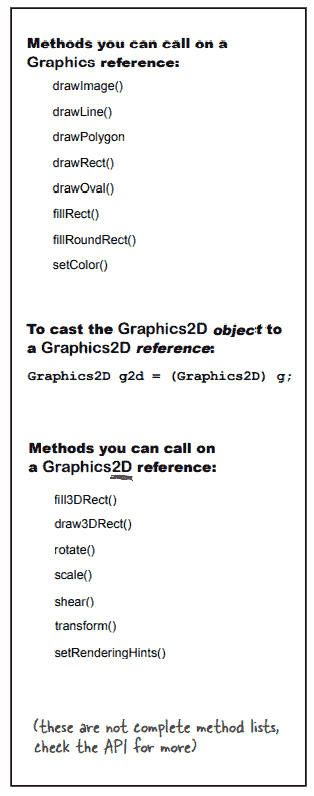

**当每个按钮需要做不同的事情时，如何获得两个不同按钮的动作事件？**

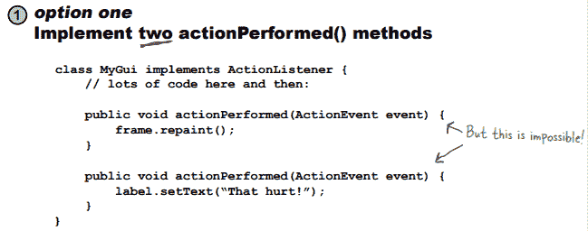

**破绽:**不能！你不能在一个 Java 类中实现同一个方法两次。它不会编译。

即使可以，事件源如何知道调用这两个方法中的哪一个呢？

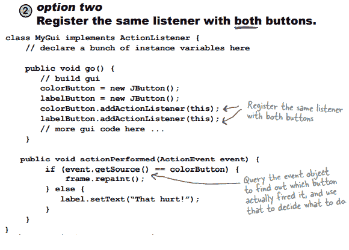

缺陷:这确实有效，但在大多数情况下，它并不是很 OO。一个事件处理程序

做许多不同的事情意味着你有一个方法做许多不同的事情。

如果你需要改变一个源的处理方式，你必须打乱每个人的事件

处理程序。有时这是一个很好的解决方案，但通常会损害可维护性和可扩展性。

当每个按钮需要做不同的事情时，你如何获得两个不同按钮的动作事件？

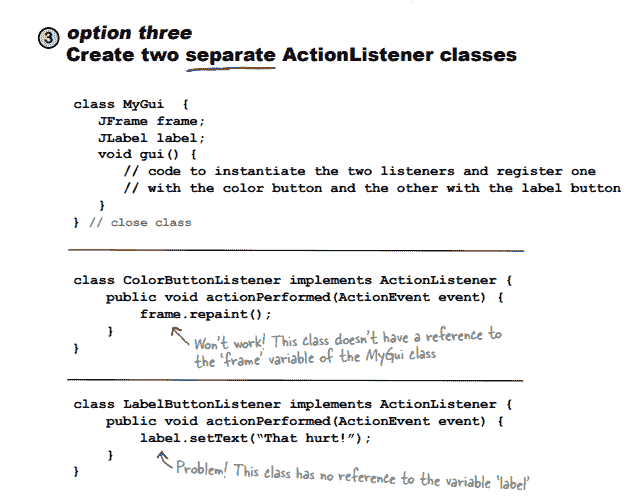

缺陷:这些类不能访问它们需要的变量

作用于“框架”和“标签”。你可以修好它，但是你必须给每个

listener 类引用主 GUI 类，以便在 actionPerformed()中

方法侦听器可以使用 GUI 类引用来访问 GUI 的变量

班级。但是这破坏了封装，所以我们可能需要创建 getter 方法

对于 GUI 小部件(getFrame()、getLabel()等)。).你可能需要添加一个

构造函数传递给侦听器类，以便您可以将 GUI 引用传递给侦听器

实例化侦听器的时间。而且，事情变得更加混乱和复杂。

一定有更好的方法！

内部和外部类实例必须链接在一起。

*   创建外部类的子类。
*   使用外部类的实例，创建内部类的实例。

之后，连接外部和内部项目。

如果方法中的代码块实例化内部类，内部对象将附加到其方法正在执行的实例。外部类的内部类之一可以被实例化。

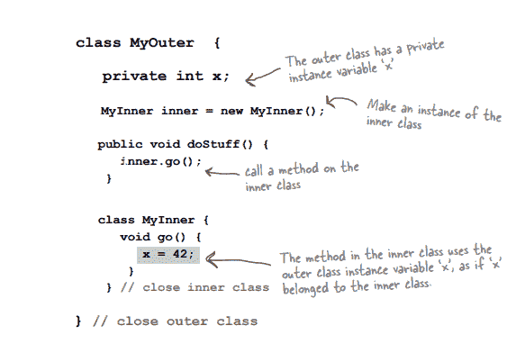

内部对象允许你在一个类中多次实现同一个接口。当你需要一个单独的类，但仍然希望它的行为像是另一个类的成员时，内部类是最好的选择。

如果外部类有三个按钮，那么事件必须由三个内部类来处理。