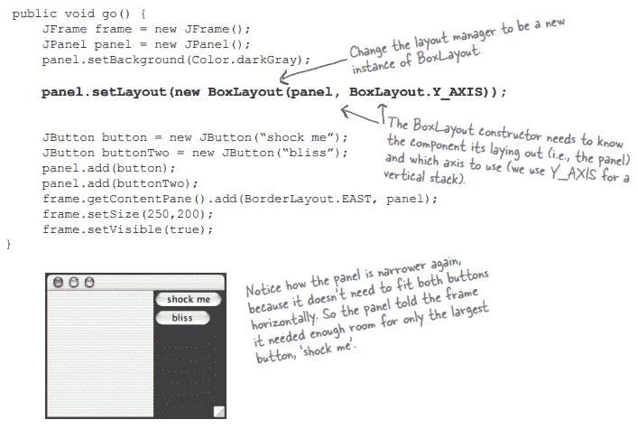

# 第十三章

> 原文：<https://medium.com/codex/chapter-13-e008000dfd7d?source=collection_archive---------10----------------------->

# 使用 Swing

一个 swing 组件是一个小部件。从 javax.swing.Jcomponent 扩展而来的组件包括文本字段、按钮、可滚动列表和单选按钮。

布局管理器链接的组件中包含的组件由布局管理器控制。框架的布局管理器控制面板的大小和位置。

**版面设计经理如何决定？**

**一个布局场景:**

**让我们给东部区域添加一个按钮:**

使用边框布局将背景分为五个部分。每个区域可以有一个组件。北部和南部的组件优先考虑高度而不是宽度。东部和西部的组件优先考虑宽度而不是高度。剩下的部分会进入中间的部分。使用边框布局将背景分成五个部分。每个区域可以有一个组件。北部和南部的组件优先考虑高度而不是宽度。东部和西部的组件优先考虑宽度而不是高度。剩下的部分会进入中间的部分。使用边框布局将背景分为五个部分。每个区域可以有一个组件。北部和南部的组件优先考虑高度而不是宽度。东部和西部的组件优先考虑宽度而不是高度。剩下的部分会进入中间的部分。使用边框布局将背景分成五个部分。每个区域可以有一个组件。北部和南部的组件优先考虑高度而不是宽度。东部和西部的组件优先考虑宽度而不是高度。剩下的部分会进入中间的部分。

**流程布局:**按照组件引入的顺序，从左到右，从上到下排列组件。如果组件在水平方向不合适，将它们换行。

**箱型布局:**组件可以使用箱型布局垂直堆叠。你可以用它来创建一种组件返回键，强制组件开始一个新行。即使有空间，您也可以强制组件在新行中。

**BoxLayout 强制使用“换行符”使组件换行到下一行。**

**摆动组件**

## **JTextArea**

## **JCheckBox**

## JList

