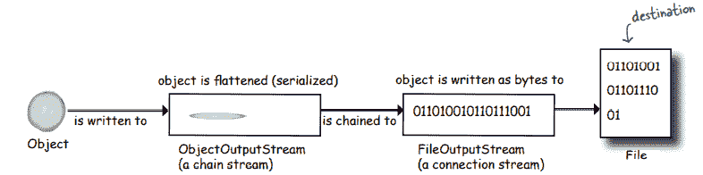
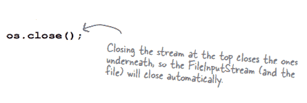

# 第十四章

> 原文：<https://medium.com/codex/chapter-14-d54f1e7eb9df?source=collection_archive---------19----------------------->

**序列化和文件 I/O**

**-捕捉模式-**

**如果您的数据只是被创建它的 Java 应用程序使用:**

**01。使用序列化**

创建一个包含展平(序列化)对象的文件。然后让您的软件从文件中读取序列化的对象，并将它们膨胀回驻留在堆中的对象。

**如果您的数据将被其他程序使用:**

**02。编写一个纯文本文件**

创建一个带有其他应用程序可以解析的分隔符的文件。例如，可以由电子表格或数据库程序读取的制表符分隔的文件。

**将序列化对象写入文件**

**1。制作文件输出流**

**2。制作一个对象输出流**

**3。写对象**

**4。关闭对象输出流**

数据以流的形式从一个地方移动到另一个地方。

*   堆中的对象有一个状态和一个对象实例变量的值。因此，同一类的实例是不同的。
*   实例变量的值保存在序列化对象中。因此，可以将相等的对象添加到堆中。
*   当一个项被序列化时，它引用存储在实例变量中的对象。这些对象以及它们引用的对象都是序列化的。

我们可以通过在其中实现 serializable 来创建一个 serializable 类。

如果超类是可序列化的，子类将被序列化或自动实现可序列化。

*   如果由于整个对象图被正确序列化或序列化失败而导致某些对象的状态没有被正确存储。
*   如果因为实例变量不可序列化而无法保存，请使用 transitory 关键字。通过使用可序列化的进程，您可以避免处理该变量。

**反序列化:恢复一个对象**

**1。制作文件输入流**

**2。制作一个对象输入流**

**3。阅读物体**

**4。投掷物体**

**5。关闭对象输入流**

当一个对象被反序列化时，JVM 试图通过在堆上创建一个新对象来重新序列化它，这个新对象的状态与原始序列化对象的状态相同。

1.从流中读取对象

2.JVM 确定对象类类型

3.然后，它会尝试查找并加载对象类，如果没有，jvm 会抛出一个异常

4.一个新对象在堆上被给予空间。

5.如果一个对象在继承树中有一个不可序列化的类，那么它的构造函数将和它上面的构造函数一起运行。构造函数链接发生后，所有未序列化的超类将重新初始化它们的状态。

6.对象实例变量被赋予序列化状态的值。

静态变量不序列化。

**-Java . io . file 类-**

**测验卡生成器(代码大纲)**

磁盘上的文件由 Java.io.file 类表示。它表示文件目录的名称和路径，并防止访问该文件中的数据。下面是我们可以用文件对象执行的一些事情。

**将字符串写入文本文件**

**1。制作一个代表现有文件的文件对象**

**2。制作一个新目录**

**3。列出一个目录的内容**

**4。获取文件或目录的绝对路径**

**5。删除文件或目录(如果成功则返回 true)**

*   我们可以通过使用文件读取器连接流来开始读取文本文件。
*   要将字符串拆分成单独的标记，请使用 String split()函数。
*   当对象被序列化时，对象的类被分配一个版本 id 号。串行版本 UID 是该 ID 的名称。