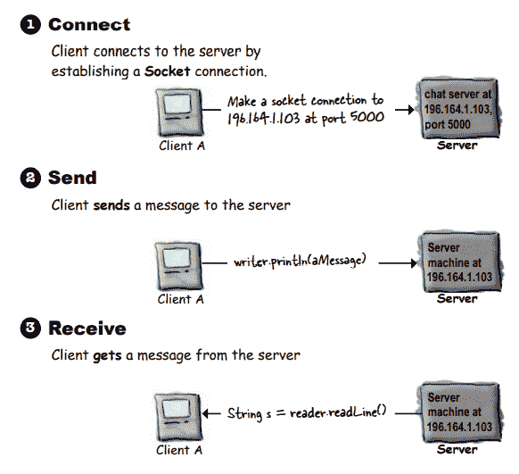
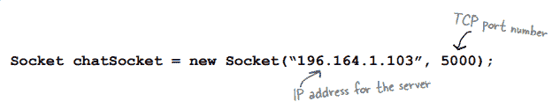
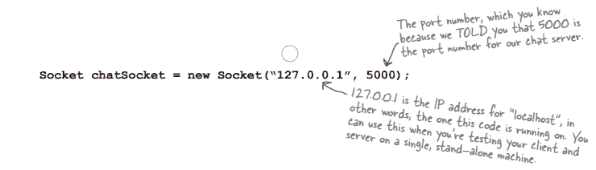
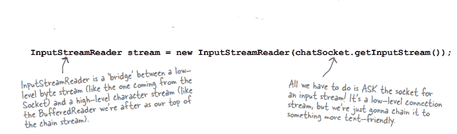
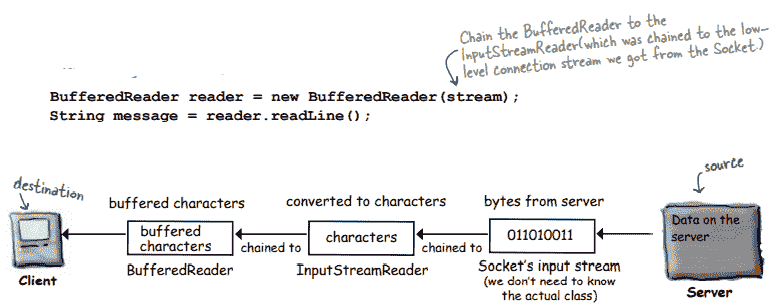
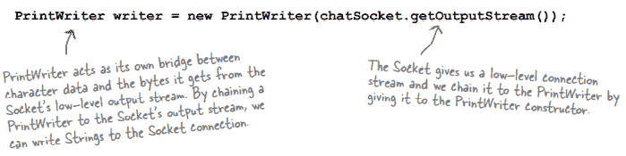
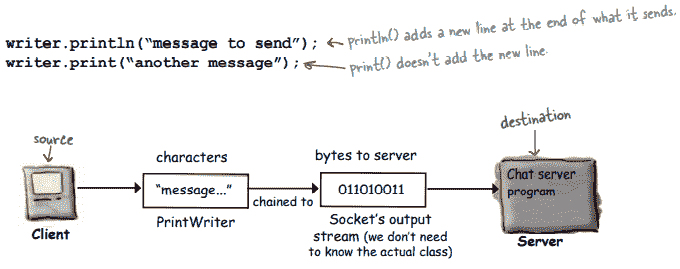
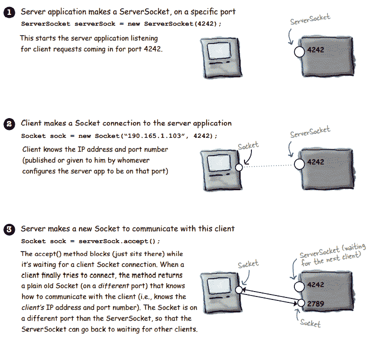
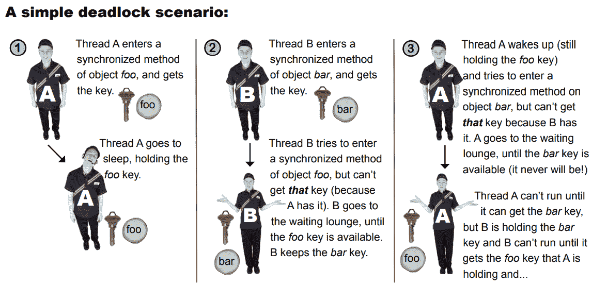

# 第十五章

> 原文：<https://medium.com/codex/chapter-15-3fc57dde2a58?source=collection_archive---------42----------------------->

**联网和线程联网和线程**

**-连接、发送和接收-**

我们需要一个插座来连接两台电脑。套接字是代表两台计算机之间连接的网络对象。这个类是 Java.net.socket。要建立一个套接字连接，我们需要知道两件事:IP 地址，它告诉我们正在与谁通话，以及 TCP 端口号，它告诉我们正在与哪个端口通话。

1.客户端与服务器建立套接字连接。

2.客户端与服务器通信。

3.客户端从服务器接收消息。

TCP 端口号是一个 16 位数字，用于标识特定的服务器软件。一些关键服务使用 TCP 端口 0 到 1023。作为聊天服务器，我们可以使用 1024 到 65535 之间的任何端口号。

**从套接字读取数据。**

**1。与服务器建立套接字连接**

**2。将输入流读取器链接到套接字的低级(连接)输入流。**

**3。做一个缓冲阅读器读！**

输入流读取器的作用就像一座桥，它接收字节并将它们转换成文本数据。

**向套接字写入数据。**

**1。与服务器建立套接字连接**

**2。将打印写入器链接到套接字的低级(连接)输出流**

**3。写(打印)东西**

写一个简单的服务器

**-工作流程-**

**Java 中的多线程**

多线程嵌入到 Java 语言的结构中。启动新的执行线程也很简单。

> **线程 t =新线程()；**
> 
> **t . start()；**

**除了一个问题。**

因为线程实际上不执行任何事情，所以它几乎一创建就“死”了。当一个线程死亡时，它创建的新堆栈就消失了。故事到此结束。

对线程来说，Runnable 表示完成任务的可能性。一个线程被期望做的工作被称为可运行的。位于新线程堆栈底部的方法存储在 Runnable 中。

线程调度器的工作是决定哪些线程应该运行，哪些不应该运行。之后，一个线程将被允许运行，而另一个线程则处于饥饿状态。

如果一个线程被置于睡眠状态，其他线程可以获得运行的机会。当线程返回到可运行状态时，线程调度器将选择它再次运行。

synchronized 关键字表示线程访问同步代码需要一个密钥。

锁和键都存在于 Java 对象中。对象经常在无人知晓的情况下被解锁。如果一个对象有同步的方法，如果对象的键是可访问的，线程只能访问这些方法中的一个。如果密钥被另一个线程占用，它将不起作用。

set name 方法可用于命名线程。

当两个或多个线程访问同一个项目时，就会发生数据损坏。这可以通过使用同步关键字来避免。

即使一个对象包含几个同步的方法，也只有一个键。一旦在同一对象上输入了同步方法，任何线程都不能在该对象上输入另一个同步方法。这种限制允许您通过同步任何数据操作方法来保护您的数据。