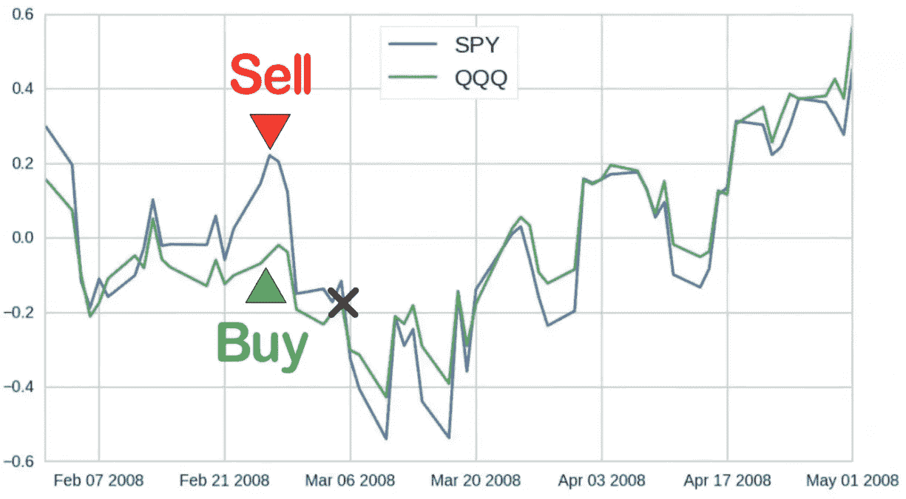

# 常见的算法交易策略&均值回归

> 原文：<https://medium.com/codex/chapter-2-1-common-algorithmic-trading-strategies-mean-reversion-772160cb4fad?source=collection_archive---------7----------------------->

算法交易的世界既令人兴奋又让人不知所措。因此，有如此多的方法来开发你自己的算法策略。尤其是对新来的人来说，这可能会很吓人。

为了帮助你更好地理解量化交易，我想给你一个所有不同的算法交易策略的概述。除了提高你的理解，这也可以帮助你决定你想深入学习什么样的算法交易策略。

不管你的风险承受能力、偏好的时间框架和喜爱的资产类别，总有一种策略适合你。不再赘述，这里列出了大多数算法交易策略的六大类别:

1.  平均值回复
2.  统计套利
3.  动力
4.  趋势跟踪
5.  证券市场为调整供求或价格而进行的买卖
6.  感情

我现在将尽我所能分解每一个交易策略，注意不是所有的策略都是纯粹的算法交易策略。有些可以，并且被全权交易者使用。

# 1.平均值回复

先说一个最常用的算法交易策略，即“均值回归策略”。

均值回归策略是基于这样的假设:随着时间的推移，股票价格会回归到平均价格。均值回归是一种广泛存在的现象，除了交易以外，它还存在于许多领域。例如，如果你出去散步，看到一个特别高的人，你看到的下一个人很可能比你矮，因此更接近平均水平。

S&P500 信托:2008 年每日分布

在均值回归策略中，我们试图将这一概念应用于股票价格。例如:

如果市场在一周内大幅反弹，我们可能会打赌下周市场不会上涨这么多。换句话说:我们预计下周的走势将更接近平均水平。最简单的均值回归形式是使用股票价格的一个或多个移动平均线，并围绕这个平均线和股票价格之间的差异进行交易。这显然是一个非常简单的均值回归策略，就像你不会导致一个理想的结果。因此，除了只看一种证券，流行的替代方法是看多种不同的证券及其相关性。这种均值回归策略被称为“配对交易”。

## 1.1 —成对交易(均值回归策略的衍生工具)

让我举一个具体的例子来说明这一点:

SPY 和 QQQ-ETF 的价格变动(2008 年)

此图显示了 SPY 和 QQQ 的交易所交易基金在 2008 年初的价格变动。如你所见，这两种证券密切相关。这意味着它们经常彼此同步移动。当 SPY 向上移动时，QQQ 趋于相同，反之亦然。但由于这两者仍是独立的证券，它们有时确实会相互分离。这些分散中的每一个都是一个机会，因为它们大多相对较快地恢复到正常状态。例如:

集会

2008 年 2 月底，SPY 出现了较大的反弹，而 QQQ 的价格变化不大。这就创造了出售 SPY 的机会，同时购买等量的 QQQ。不久之后，它们的价格应该再次彼此接近，你可以平仓获利:

买卖信号

第二张图显示了同一时期 SPY 和 QQQ 价格之间的差异。如您所见，在这段时间内，差异总是在一段时间后回落至零:

因此，如果图表足够高，卖出 SPY 并买入 QQQ 是有利可图的，如果图表足够低，则相反。每次当它再次到达零点时，你可以平仓获利。

## 1.2 —销售选项

除了配对交易，另一个流行的均值回归策略是当隐含波动率(IV)高时“卖出期权”。

> 隐含波动率可以认为是从期权价格中提取的预期未来波动率。

因此，当投资者预期价格会出现额外波动时，他们倾向于购买更多期权，这将提高期权的价格，从而也提高隐含波动性。

最著名的跟踪 S&P500 期权隐含波动率的指数之一是 CBOE 波动率指数，简称 VIX。

这里你可以看到 VIX 的长期图表:

S&P500 期权的 VIX(CBOE 波动率指数)

它的价格略低于 20 美元，但偶尔 VIX 的价格会飙升，每一次飙升都代表着期权价格的大幅上涨:

卖出期权可以从每次价格上涨的收缩中获利，因为隐含的波动性，因此期权价格往往会相对较快地回落到正常水平。

下一章将讨论“统计套利”。