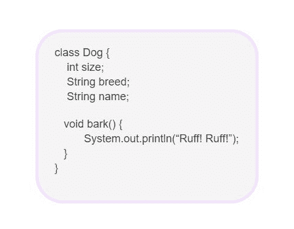
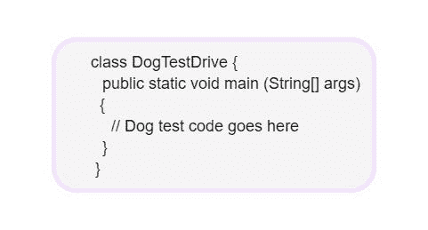
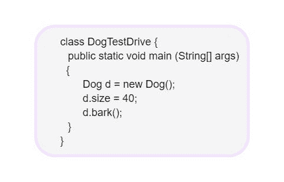

# 第 02 章

> 原文：<https://medium.com/codex/chapter-2-d2a3afebd049?source=collection_archive---------17----------------------->

## ***类和对象***

类是对象的蓝图。它告诉 VM 如何创建一个特定类型的对象。

***制作物件。***

**1。编写类。**

**2。编写一个测试类(TestDrive)。**

**3。在测试类中，创建一个对象并访问该对象的变量和方法。**

## ***Java 拿出垃圾***

用 Java 创建的对象进入堆。Java 堆实际上被称为“垃圾收集堆”。当您需要回收该空间时，会发生什么情况？当你使用完一个对象时，如何把它从堆中取出来呢？JVM 可以“看到”一个对象再也不能被使用，这个对象就有资格进行垃圾收集。如果内存不足，垃圾收集器将运行，丢弃不可到达的对象，并释放空间，以便可以重用空间。

## 如果我需要全局变量，并且所有的东西都必须放在一个类中，那该怎么办？

Java OO 程序中没有“全局”变量和方法的概念。Phrase-O-Matic app 中的 random()方法；这是一个可以从任何地方调用的方法。作为公共和静态的方法使它的行为更像一个“全局”方法。应用程序的任何类都可以访问公共静态方法。public、static 和 final 这样的变量实际上是一个全局可用的常量。

## ***如果还能做全局函数和全局数据，这怎么是面向对象？***

pi 的常量和 random()的方法，虽然都是公共的和静态的，但都是在 Math 类中定义的。静态(类似全局)的东西在 Java 中是例外而不是规则，代表一种非常特殊的情况，它没有多个实例/对象。

## ***什么是 Java 程序，你实际交付的是什么？***

Java 程序是一堆类，必须有一个 main 方法。如果最终用户没有 JVM，那么您也需要将它包含在您的应用程序的类中，这样它就可以运行程序。有许多安装程序将类与各种 JVM 捆绑在一起，并把它们都放在 CD-ROM 上。然后，最终用户可以安装正确版本的 JVM。

## ***有几百个类怎么办？还是一千？交付所有这些单独的文件不是很痛苦吗？它能把它们捆绑成一个应用程序吗？***

将所有应用程序文件放入一个 Java 档案——一个. jar 文件——它基于 pkzip 格式，在一个 jar 文件中，包含一个简单的文本文件，格式为一个叫做 manifest 的东西，它定义了 jar 中的哪个类包含应该运行的 main()方法，

*   一个对象知道的关于它自己的事情叫做实例变量。它们代表一个对象的状态。
*   一个对象做的事情叫做方法。它们代表一个对象的行为。
*   一个类可以从一个更抽象的超类继承实例变量和方法。