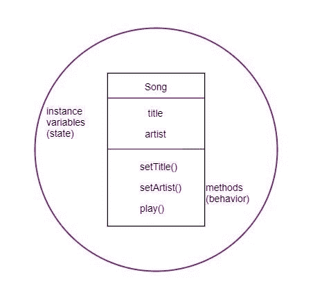
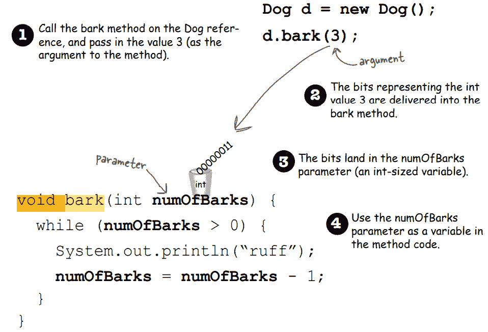
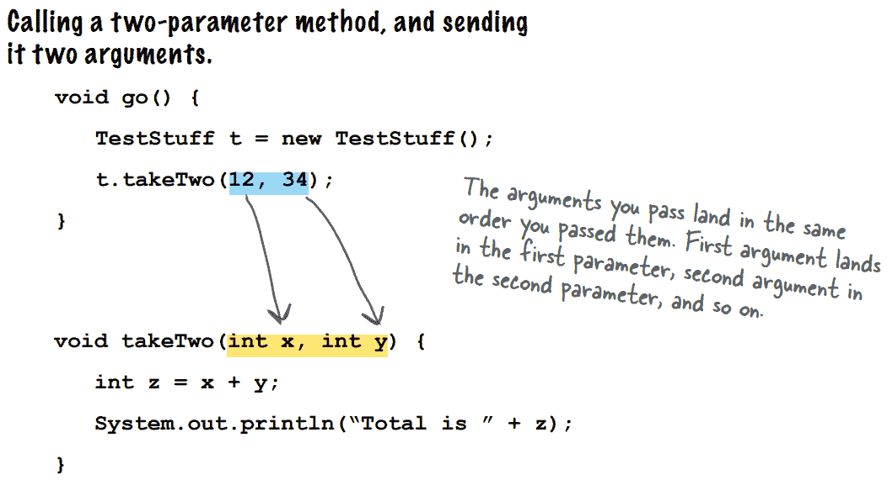
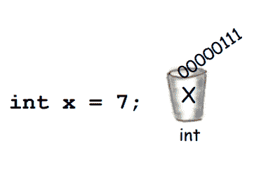
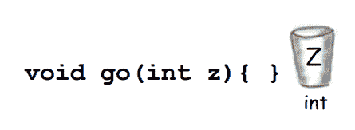
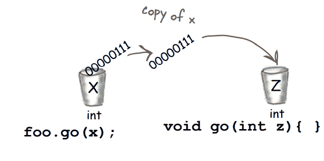
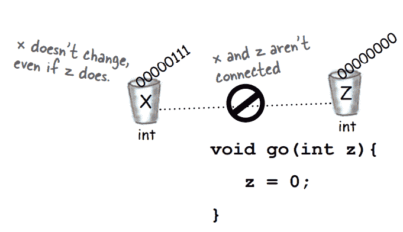
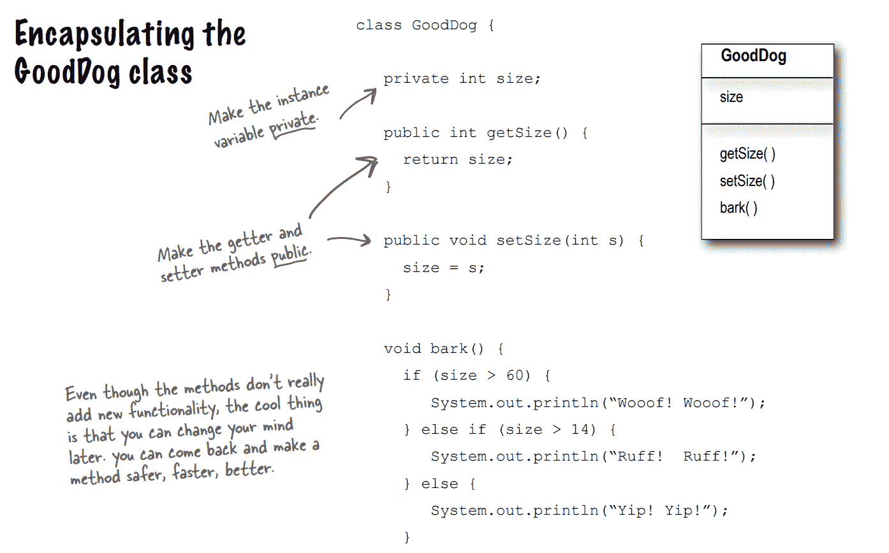

# 第四章

> 原文：<https://medium.com/codex/chapter-4-813fe3beba5c?source=collection_archive---------21----------------------->

## **方法使用实例变量**

*   状态和行为，由实例变量和方法表示。
*   方法使用实例变量值。
*   为了将值传递给方法，程序员使用参数和实参。参数是传递给方法的东西。
*   参数就像一个具有类型和名称的局部变量，可以在方法内部使用。

方法返回结果。如果有返回类型为 void 的方法，这意味着它们不返回任何东西。如果声明一个方法来返回一个类型，该类型必须由该方法返回；否则，将出现一条错误消息。

在方法中，您可以传递几个参数。您必须传递正确种类和顺序的参数，并且必须用逗号分隔它们。

如果变量类型与参数类型匹配，就可以将变量传递给方法。

## **Java 是传值的。**

## **这意味着复制传递。**

1.声明一个 int 变量，并给它赋值 7。7 的位进入一个名为 x 的变量。

2.用名为 z 的 int 参数声明一个方法。

3.调用 go 方法，将变量 x 作为参数传递。x 中的位被复制，副本到达 z。

4.更改方法中 z 的值。x 的值没有改变，传递给 z 的参数只是 x 的副本。该方法不能改变调用变量 x 中的位。

如果要返回几个值，请将返回类型声明为类型数组。

隐式提升到该类型的内容可以被返回。当返回类型定义为 int 时，可以返回 byte。因为 byte 比 int 小，所以有效。

## **吸气器和设置器**

*   访问器和赋值器是 getters 和 setters 的术语。
*   getter 用于返回 getter 应该得到的返回值。
*   如果实例变量没有 setters，可以用点运算符访问它们。这种能力是有害的。可以使用 Setters 来避免这种情况。如果我们希望访问一个实例变量，我们使用它。然后，我们应该调用它们，而不是直接访问 setters。

## **封装**

基本上，这意味着隐藏数据，这样我们就可以利用 private 这样的访问修饰符来隐藏数据。访问控制是通过将变量私有并提供公共的 getters 和 setters 来实现的。

封装在实例变量周围创建了一个屏障，迫使其他代码通过 setter 方法。这避免了对实例变量的直接访问。

*   将实例变量标记为私有。
*   将 getters 和 setters 标记为 public。
*   如果你不初始化(赋值)一个实例变量并为它们调用 getter 方法，它将返回 null，因为它们总是有一个默认值。

## **实例变量和局部变量的区别**

1.在类中而不是在方法中声明的实例变量。

2.方法中声明的局部变量。

3.局部变量必须在使用前初始化。这些没有默认值。如果你在初始化之前调用它们，那么它将抛出错误。

如果要比较两个原语的相等性，可以用==。这将检查这两个引用是否指向同一个对象。

如果我们想检查两个对象是否相等，那么我们可以使用 equals()方法。