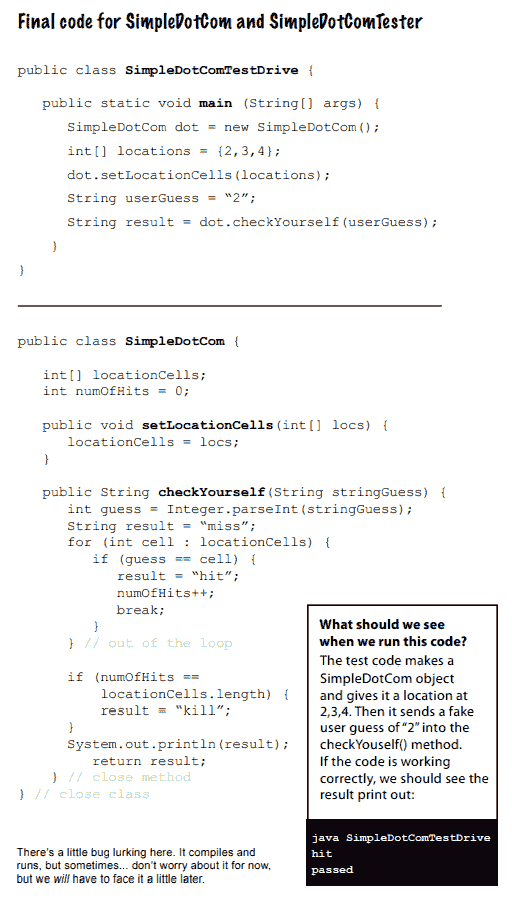

# 第五章

> 原文：<https://medium.com/codex/chapter-5-9b9dc3fe950f?source=collection_archive---------15----------------------->

## **编写 Java 程序**

**要创建一个 Java 类，遵循下面的说明。**

1.理解我们必须在一个类中声明什么。

2.应该列出实例变量和方法。

3.通过准备代码准备方法。(prep 代码—一种伪代码，可以让人们专注于逻辑而不是语法)。

4.方法应该用测试方法来测试。(测试代码—检查程序是否正常工作的类或函数。)

5.实现类(真正的代码——我们在这里编写真正的 java 代码)。

6.分析技术。

7.如有必要，调试并实施。

**-备考代码-**


极限编程是编程(XP)的一种

当事情发生变化时，从小处着手，定期释放。应该开发迭代周期。如果规范中没有，就不要包含它。

*   首先，创建测试代码。
*   当你发现有机会改进代码时，就去做吧。
*   在通过所有测试之前，不应该发布任何东西。
*   保持简单，并向其他开发人员展示如何使用代码。

**-测试代码-**


创建测试代码和实现来验证测试是否通过。为了通过测试，您需要开发额外的测试代码和更多的实现。通过这种方法，您可以证明您当前的代码并没有真正破坏任何早期的代码。

**-真实代码-**


**更多详情…**


**-最终代码-**



如果字符串代表一个数字，则 Integer.parseInt()有效。

**-主方法-**


**-random()和 getUserInput()-**


**-用于循环-**

初始化、布尔测试和迭代表达式是三个部分。我们在初始化阶段创建一个变量，以便在循环中使用它。然后，在布尔测试中，我们做一个条件测试，调用一个返回布尔值的方法。我们让这个表达式在迭代表达式中延续几次，以观察会发生什么。这发生在循环结束时。

While 循环没有初始化或迭代表达式。它只有一个布尔测试。如果你不知道循环应该迭代多少次，那么这个循环是理想的。

> X++ —将 x 的当前值加 1 或将 x 增加 1
> 
> ++X —首先将 X 增加 1，然后使用 X 的新值

**增强型 for 循环**


*   创建一个名为 name 的字符串变量，并将其设置为 null。
*   将名称数组中的第一个值赋给名称变量。
*   运行循环的主体。
*   将下一个名称数组值赋给 name。
*   重复此操作，直到数组包含元素。

迭代变量声明和实际的集合都包含在这个循环中。我们在迭代变量声明中声明并初始化一个变量，对于循环的每次迭代，该变量包含来自集合的不同元素。这必须是对标识事物部分中的数组或其他集合的引用。

包含强制转换会指示编译器将 y 的值降低到 int 大小，并将剩下的值设置为 x。如果 y 的值大于 x 的最大值，结果会很奇怪。

```
Int x = (int) y;
//40002 goes above a short’s 16-bit maximum.
Long y = 40002;
//x has become -25534.
Short x = (short) y;
```