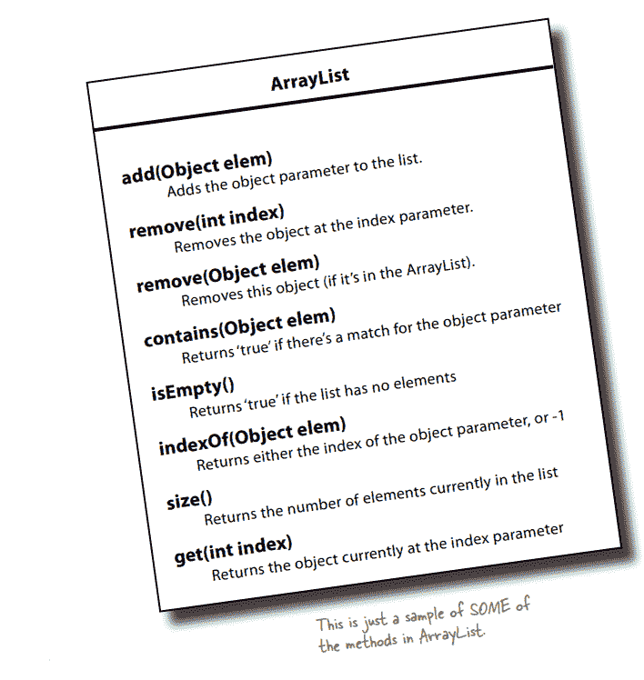
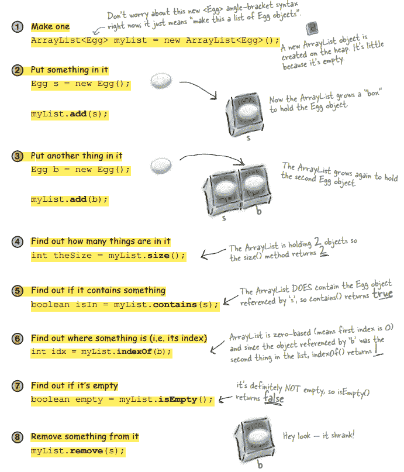
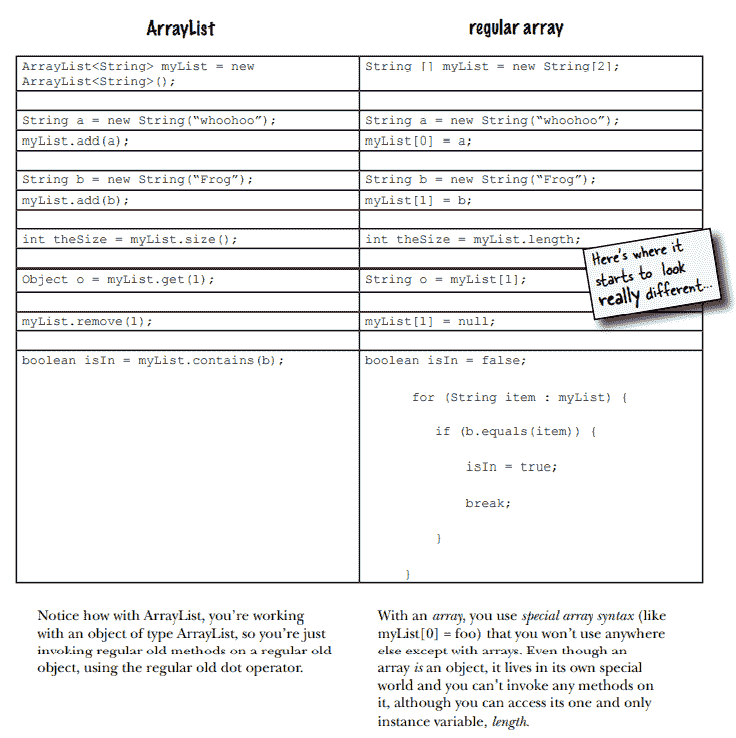
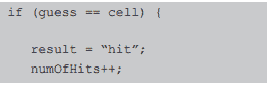
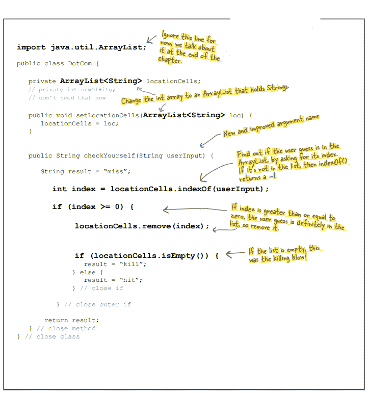
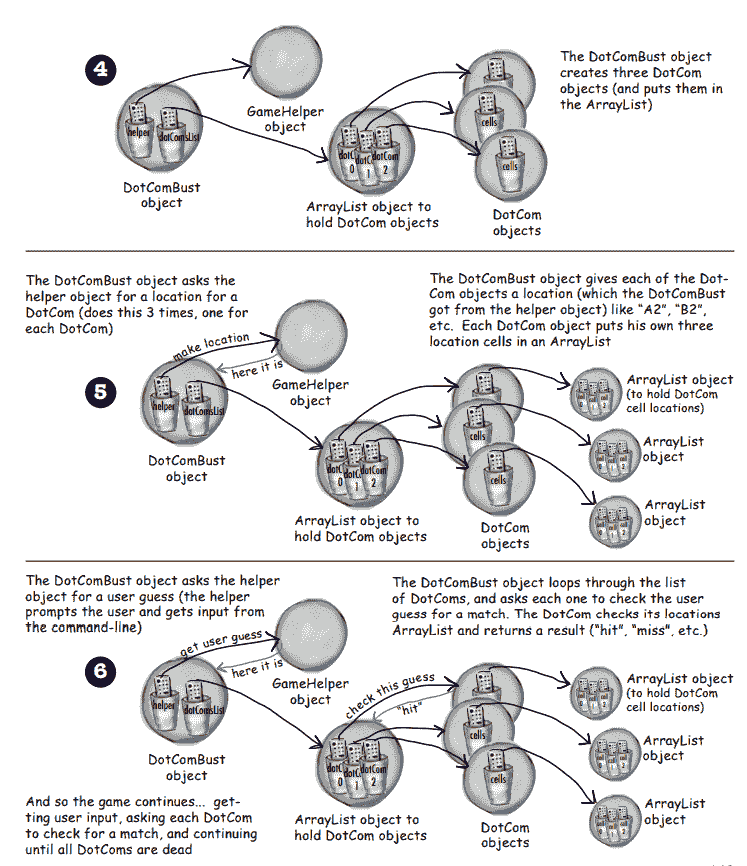
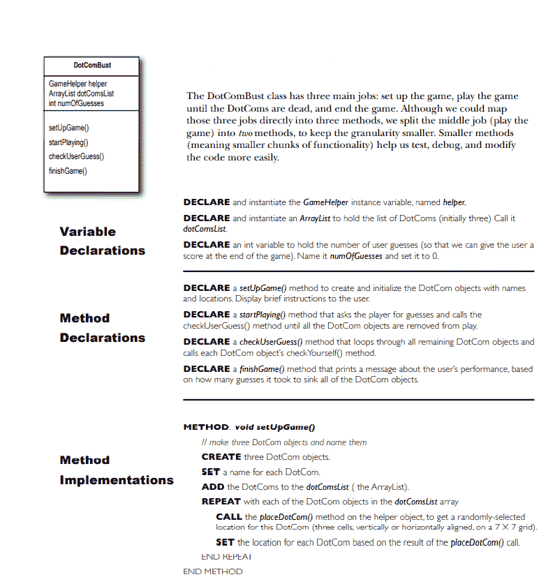
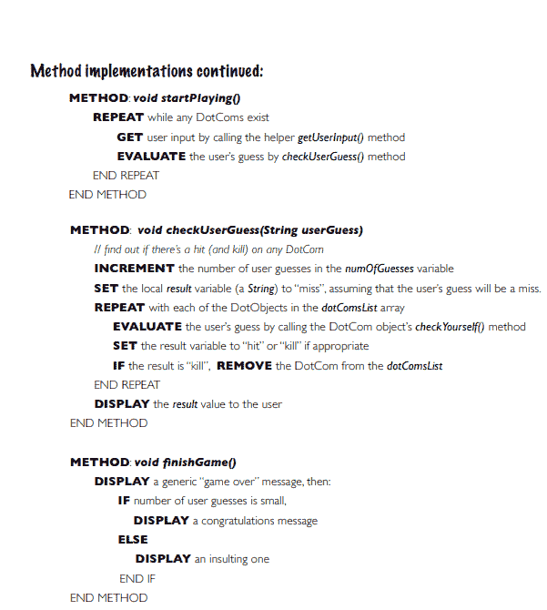

# 第六章

> 原文：<https://medium.com/codex/chapter-6-de6f61673be0?source=collection_archive---------22----------------------->

## **使用 Java 库**

在 Java 中，有几个内置的库。因此，使用这种预构建的库可以简化应用程序的构建。

**阵列列表方法**

对象是一个数组列表。这是 Java 库核心的一部分。因此，该库具有大量的函数。他们是，

**你可以用数组列表做一些事情**

**比较数组列表和常规数组**

*   数组应该有一个大小，即使数组列表没有大小，它也会随着成员的增加而不断扩大。
*   数组需要像[ ]这样的语法，这在 Java 中是没有的。
*   在 Java 5.0 中，数组列表是指定的，这意味着如果在创建数组列表时指定了类型，那么也应该指定应该添加到数组列表中的组件的类型。因为如果您不识别类型，您可以添加许多数据类型，这被称为“异构”。

**让我们修复网络代码**

那是在哪里发生的？每一个假设都被认为是命中，而没有检查该单元是否已经受到影响。

**新的和改进的 Dotcom 类**

在网络游戏中使用网格而不是单个数组。为此，我们必须首先向 dotcom 类添加一个新变量，然后构建一个 dot combust 类。

**在互联网泡沫破裂的游戏中，谁做什么？**

**为真正的网络泡沫准备代码**

这个类负责安排游戏，执行游戏直到网络公司倒闭，然后结束游戏。

*   **布尔表达式-**

为真或为假的逻辑语句称为布尔表达式。只要表达式的两部分具有相同的基本数据类型，布尔表达式就可以比较任何类型的数据。数据可以与其他数据进行比较，以检查它是否等于、大于或小于它。

**“与”和“或”运算符(&、&、|| )**

短路运算符包含&&和||。只有&&语句两边都为真，它才会为真。如果表达式的左侧为 false，则整个短语为 false。如果|中两边都为真，则整个语句为真，如果只有左边为真，则整个语句为真。

**非短路操作人员(&，|)**

非短路运算符&和|是最常见的。它随时检查一个短语的所有方面。

**Java API**

Java API 中的类被组织成包。要访问 API 中的类，您必须首先知道它引用的是哪个包。javax.swing 包包含 Swing GUI 类。java.util 包包含 Arraylist。

在这种情况下，Java.util. Array list 是类名，Java.util 是包名。完整的名称是包名和类名的组合。

> 1.通过输入 import java.util 来导入 java.util 包。
> 
> 2.每次使用代码时，您可以在中输入全名。