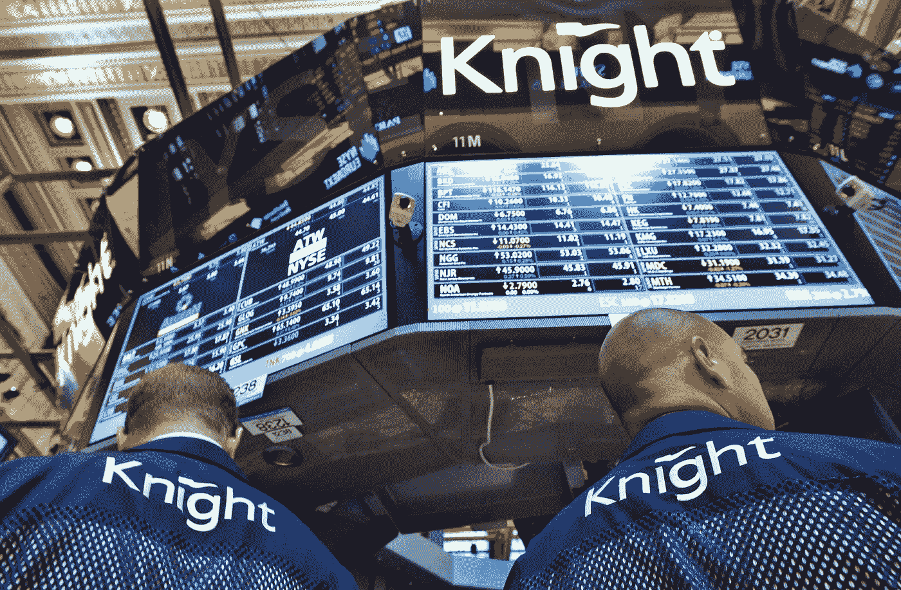

# 交易故障让骑士资本损失了 4.4 亿美元

> 原文：<https://medium.com/codex/chapter-7-the-trading-glitch-which-cost-knight-capital-440-million-f397a0241401?source=collection_archive---------13----------------------->

软件测试从骑士资本 2012 年的惨败中吸取的教训—第 1 部分

骑士资本@纽约证券交易所

八月一日

美国东部时间上午 08:01—Knight Capital 的员工收到 97 封电子邮件，描述 8 号服务器禁用了一个特定的交易算法。这些电子邮件提到 SMARS 是一个问题。

> SMARS 代表 Smart Market Access Routing System，它每秒能够执行数千个订单，在不到一秒的时间内比较几十个不同交易事件的价格。

这些内部消息既不是为高优先级警报设计的，工作人员通常也不会实时查看它们。因此，Knight Capital 错过了在开市前发现并解决这一问题的机会。

美国东部时间上午 9:30——美国证券交易所(NYSE & Nasdaq)准时开盘，Knight Capital 开始收到来自经纪自营商的大量每日订单。SMARS 将接下来的工作分配给了总共 8 台服务器。前七个服务器正确地处理了订单。然而，发送到第 8 台服务器的订单有这个有缺陷的交易算法，这导致了一个小时前的警报。

上午 9 点 32 分——8 号服务器立即开始为每个传入的母订单发送大量子订单，而没有检查其他交易场所的确认执行情况。

> **子订单&母订单:**SMARS 的一个核心特点是从 Knight 交易平台的其他上游组件接收订单(“母”订单)，然后根据可用流动性和价格的需要，将一个或多个代表性(“子”)订单发送到下游的外部地点执行。

结果是灾难性的:对于 8 号服务器的 212 个带有错误代码的母订单，SMARS-router 在大约 45 分钟内对 154 只股票的超过 3.97 亿股执行了 400 万次。这些交易量占 Knight 交易量的 50%以上。

> 交易量——公司/私人用于日常交易的流动现金量。对于低风险，交易员建议接近安全的风险敞口为 10%。

上午 9:34——纽约证券交易所的计算机分析师注意到市场交易量是平均水平的两倍，并追踪交易量飙升到骑士资本。纽约证券交易所的主席试图给奈特公司的首席执行官乔伊斯打电话，但乔伊斯仍在家中从膝盖手术中恢复。

纽交所随后通知了 Knight 的首席信息官，后者召集了该公司的顶级 IT 人员；大多数交易店会在算法中触发一个关闭开关，或者干脆关闭系统。但是，Knight 没有记录事件响应的程序。因此，他们继续在黑暗中摸索了 20 分钟，下一步决定问题是 8 号服务器上的不同代码

Knight 在讨论中误导性地将服务器上受损的代码恢复为旧版本，并将其重新安装在其他服务器上。事实证明，这是最糟糕的决定，因为现在所有八台服务器都激活了有缺陷的代码，并且在没有节流的情况下执行。

直到上午 09:58，Knight 工程师才确定了根本原因，并关闭了所有服务器上的 SMARS 然而，损害已经很严重了。154 只股票的 400 万笔交易总计超过 3.97 亿股，其中 80 只股票的净多头头寸约为 35 亿美元，74 只股票的净空头头寸约为 31.5 亿美元。

> **多头&空头:**多头是对股票的正面押注。如果股票价格上涨，人们就会获利。空头头寸是对股票的负面押注。如果股价下跌，一方获利。

高盛介入，以骑士**4 亿美元**的价格收购了骑士不想要的位置——这是一个惊人的打击，但其中一家公司可能会吸收。如果 Knight 破产，除了 Knight 的股东，唯一的受害者将是高盛自己。

到 2013 年夏天，Knight Capital 被其竞争对手 Getco LLC 收购。

> LLC——有限责任公司，是美国特有的私人有限公司形式，提供合伙企业的转嫁税模式，并保护公司提供的个人资产。

是什么导致了这次惨败？下一章再查！

*参考文献:*

[*https://www . henrico dolfing . com/2019/06/project-failure-case-study-knight-capital . html*](https://www.henricodolfing.com/2019/06/project-failure-case-study-knight-capital.html)