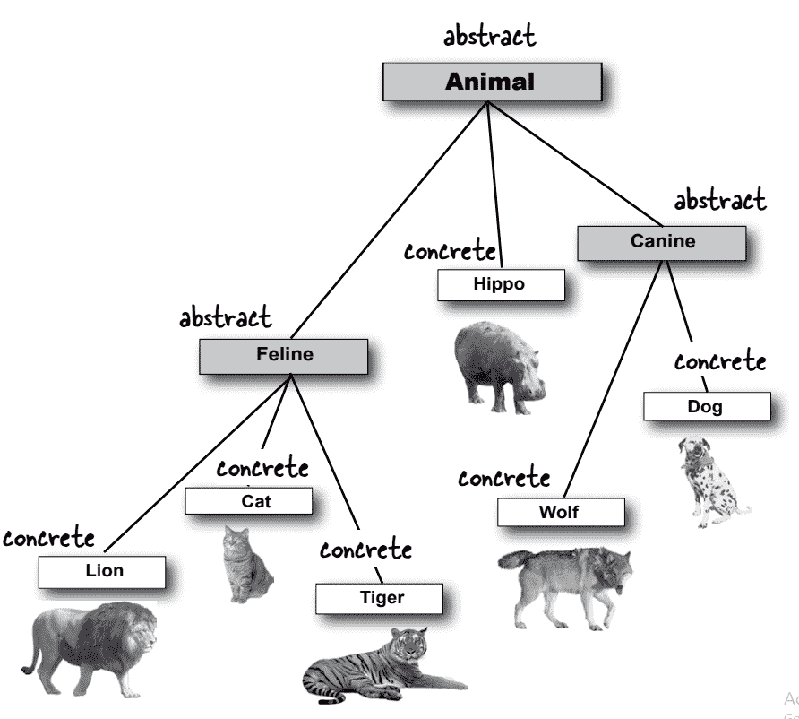
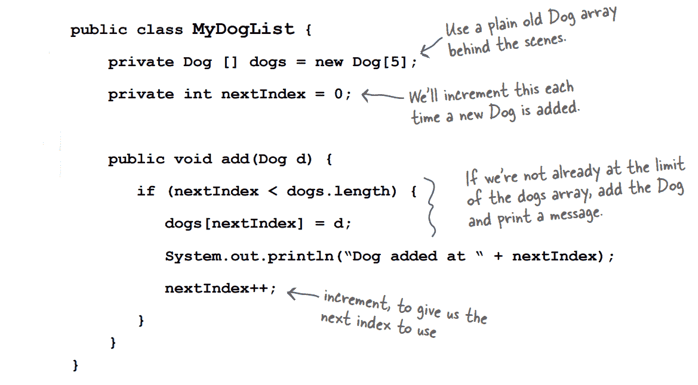
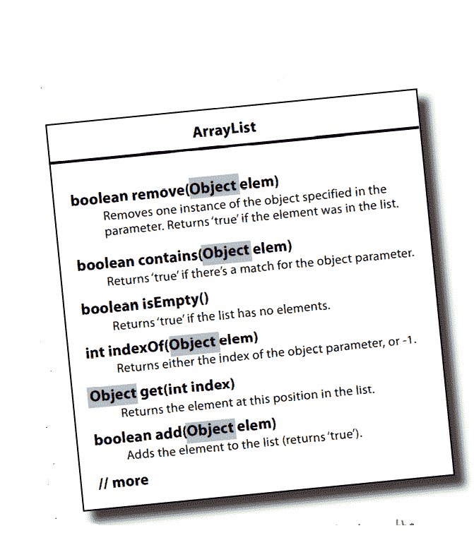
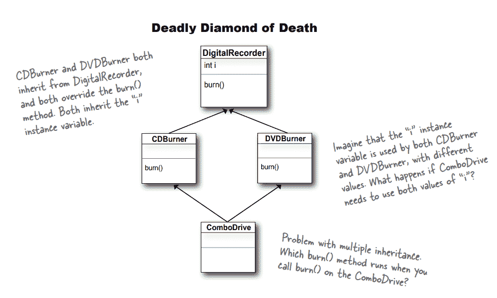

# 第八章

> 原文：<https://medium.com/codex/chapter-8-71b28a3ec228?source=collection_archive---------24----------------------->

## **接口和抽象类**

我们应该通过使类抽象来防止类的形成(Animal anim = new Animal()；).在这种情况下，动物是指动物对象。

尽管编译器不允许我们构建抽象类的实例，但我们可以将它用作多态的声明引用类型。

如果你不扩展一个抽象类，它就没有价值，没有用。在运行时，抽象类是你的抽象类的子类的实例。

当我们查看 GUI 组件时，它包含按钮、文本字段和滚动条等类，我们可以看到它有许多不同的类。当我们生成一个按钮时，我们不会创建该组件的一个实例并将其放在屏幕上。我们只是实例化组件的一个特定子类，而不是整个组件。

**行动中的多态性**

**-摘要-**

没有主体但必须在另一个类中重写的方法称为抽象方法。只有抽象类才能有抽象方法。抽象类有可能同时获得抽象和非抽象方法。

使用抽象方法时，必须在第一个实际的子类中实现它们。当子类实现抽象方法时，子类方法应该有一个主体和与抽象方法相同的返回类型。

我们不能构建不同的抽象类型实例，但是我们可以声明一个数组对象来包含它。

在 Java 中，每个类都是从类对象扩展而来的。对象由任何不显式扩展另一个类的类隐式扩展。

因为 Java 中的每个类都是 object 的子类，所以许多数组列表方法都利用了最终的多态类型对象。任何东西都可以被发送到这些数组列表函数中。

对象出现在数组列表中，并作为类对象的一般实例运行。编译器不能暗示生成的对象与 object 的类型不同。

当一个对象被指定为 object 类型的变量引用时，不能将该对象赋给用实际对象类型声明的变量。因为任何类都通过了 IS-A 对象测试，所以我们可以将任何东西赋给引用类型对象。在 Java 中，每个对象都是 object 类型的一个实例。

如果引用变量的类包含方法，则只能调用对象上的方法。

**多重继承**

Java 编程语言中允许类型的多重继承，这意味着一个类可以实现多个接口。一个对象可以有许多类型，包括它自己的类的类型和它实现的所有接口的类型。

一个叫做接口的解决方案给了这个死 java 的致命钻石。它克服了与多重继承相关的问题。接口中的所有方法都应该是抽象的，并且必须在具体的类中实现。所以 JVM 不会混淆在运行时应该使用两个继承版本中的哪一个。

所有的接口方法都应该是抽象的，每个具体的类都必须实现接口方法。

当将一个类实现为多态类型时，可以留在那个类型中的对象必须来自同一个继承树，而不仅仅是任何一个继承树；它们必须来自多态类型的子类。然而，当接口被用作多态类型时，对象可以来自继承树中的任何地方。只要求对象来自实现接口的类。

**类、子类、抽象类、接口**

*   创建一个不以任何方式扩展的类。如果一个新类没有通过 IS-A 测试。
*   只有当你需要重写或添加新的行为到一个更具体的类版本时，才创建一个子类。
*   当你计划为一个子类集合构建一个模板，并且你至少有一些所有子类都可以使用的实现代码时，使用一个抽象类。当你想确保没有人能创建这种类型的对象时，就把这个类变成抽象的。
*   当你希望创建一个其他类可以完成的角色，而不管它们在继承树中的位置，使用一个接口。

1.对象参数和/或返回类型可用于声明方法。

2.不管实际的对象类型如何，只有当方法位于用作引用变量类型的类(或接口)中时，才能调用对象上的方法。因此，不管引用所引用的对象是什么类型，object 类型的引用变量只能用于调用 class Object 中指定的方法。

3.没有强制转换的类型引用变量，不能将对象赋给任何其他引用类型。强制转换可用于将一种类型的引用变量赋给子类型的引用变量，但如果堆上的对象不是与强制转换兼容的类型，则强制转换将在运行时失败。

4.例如:Van Van =(Van)Van . getobject(aVan)；

5.数组列表中的所有对象都属于 Object 类型(也就是说，除非使用强制转换，否则它们只能被对象引用变量引用)。作为类型对象(意思是，它们只能被一个对象引用变量引用，除非你使用强制转换)。