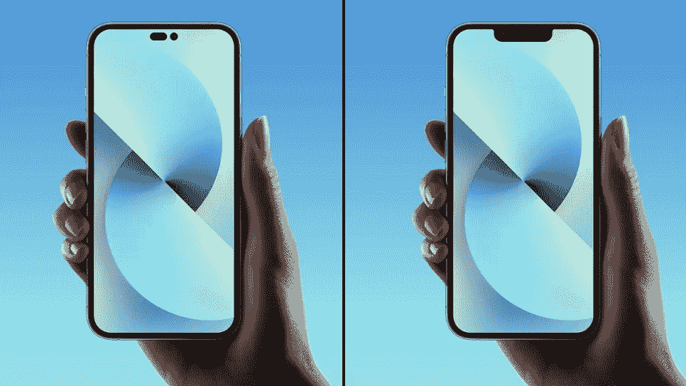
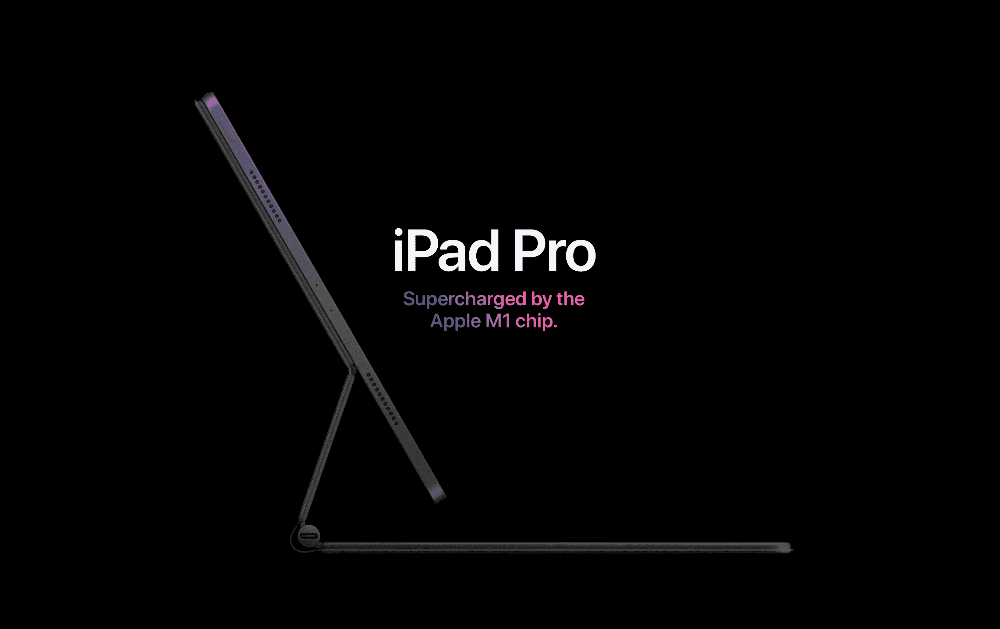
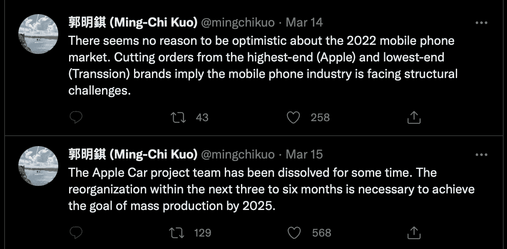
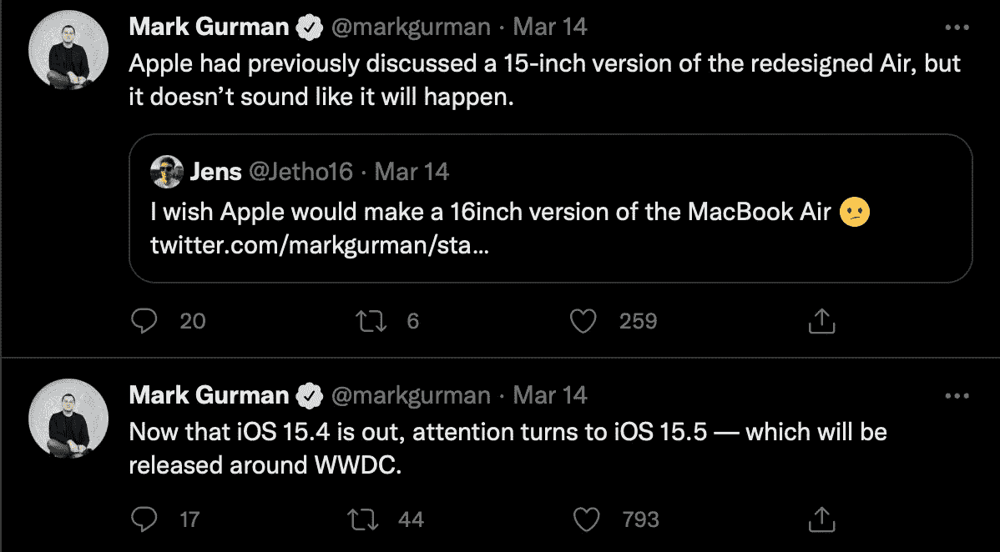
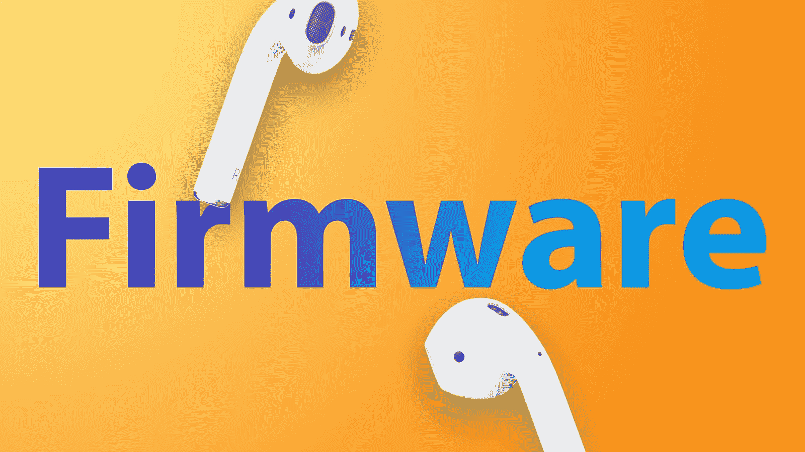
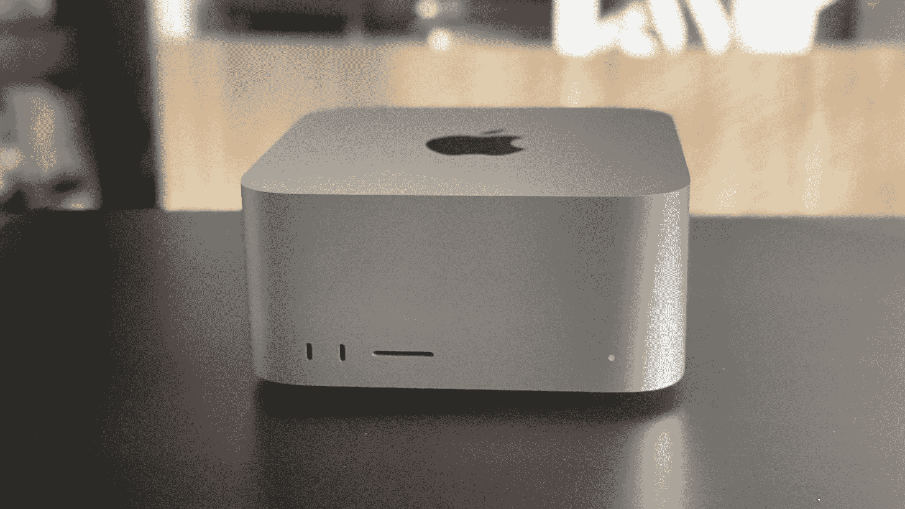
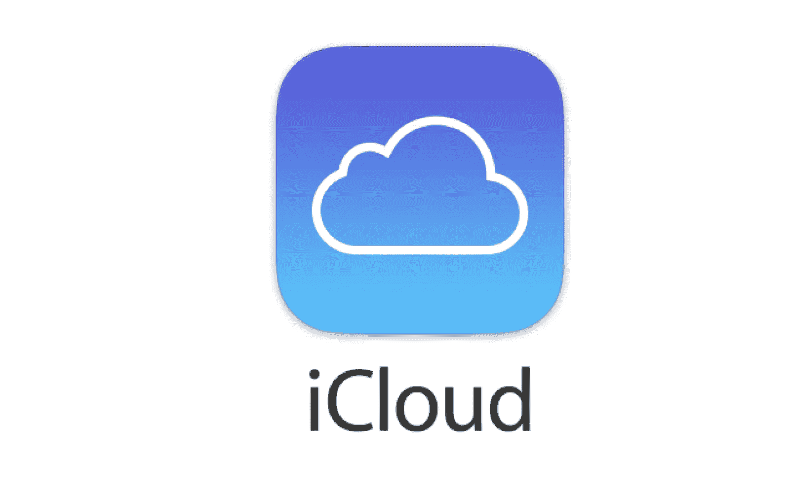

# 廉价的 iPhones、糟糕的网络摄像头和色彩缤纷的 MacBook Airs

> 原文：<https://medium.com/codex/cheap-iphones-bad-webcams-colourful-macbook-airs-2a14a842bd7e?source=collection_archive---------6----------------------->

## 苹果视图综述

## 2022 年 3 月 14 日至 3 月 18 日

## 工作室展示

随着苹果全新 5K Studio 显示器的首次评论登陆，大多数消息都是积极的，但内置网络摄像头似乎确实存在一些质量问题。这款相机是一款 12 MP、超宽、f/2.4 光圈的设备，带中央舞台，当然引起了华尔街日报、T2、The Verge 和 T3 等人一些不值得称赞的评论。奇怪的是，会有任何问题，因为这是在该公司的 iPad 中发现的相同的经过考验和信任的相机。*The Verge*的尼莱·帕特尔写道，“这部相机在光线充足的情况下看起来很糟糕，在光线不足的情况下更糟糕。”苹果公司对此做出了回应，发布声明称软件更新即将到来。然而，我们不确定什么时候会发行。**要尴尬了！**

## 运营商和 iPhone 的更改

美国消费者购买下一代 iPhone 的方式正面临着变化。从今天上市的低端新机型 iPhone SE 开始。选择美国电话电报公司公司或 T-Mobile 美国公司作为其无线运营商的买家在购买时不需要提供他们的个人信息。到目前为止，在美国，当从苹果网站或他们的商店购买运营商支持的手机时，客户必须提供他们的电话号码和社会安全号码。这使得手机运营商可以进行信用检查。然而，现在这些数据将由客户自己添加到设置中。人们希望这将加快整个过程。有意思——当美国着凉时……就像老话说的那样。

 [## iPad 丢了吗？

### 有这么多可选择的，真不知道该挑哪一个

medium.com](/codex/is-ipad-lost-31e14f61c1d6) 

## 等级

简单问一下——你在哪个队？团队丸洞还是团队缺口？**真的重要吗？**

## iPad 显示屏—无变化

根据 Ming-Chi Kuo 最近的一条推文，由于对成本的持续担忧，苹果将不会发布需要新显示屏尺寸的迷你 LED 设备。这一消息将直接影响 11 英寸 iPad Pro，甚至是新工作室显示器的 Pro 版本的任何计划。但是，在分析师的战斗中，可靠的 Ross Young 不同意，他在推特上说他相信苹果仍然计划在今年晚些时候进行专业工作室展示。有趣的是，两个如此可靠的来源应该有完全不同的观点。

## 更多来自明

回到非常直言不讳(至少在 Twitter 上)的郭明志，以及我本周从他那里看到的其他几条推文的更新。开/关汽车项目似乎又一次受挫，这次是因为大规模生产的问题。他还认为，整个手机行业都会有麻烦。这个人的话是值得听的！

 [## iPhone 怎么了？

### 在上周发布了另一款 iPhone 之后，让我们来看看今年晚些时候会有什么

medium.com](/codex/whats-up-with-iphone-307a15caac26) 

## 还有更多来自古尔曼的

与此同时，我们另一个可靠的苹果产品来源，彭博的马克·古尔曼告诉我们，15 英寸的重新设计的 MacBook Air 在可预见的未来不再是苹果的计划之一。他还告诉我们，另一个 iOS 更新 15.5 将于今年夏天在 WWDC 发布。**你开始玩 iOS 15.4 了吗？**

## 第二代 AirPods

去年年底，苹果商店获准使用固件更新工具。MacRumours 本周报道称，这款工具现在可以在第二代 AirPods 上运行固件更新。该工具允许技术人员对客户的 AirPod Pros 和第二代 AirPods 进行更新。客户无法自行更新该固件。此更新可以解决某些基于用户的问题。最新的第三代 AirPods 还不在这个名单上。**我必须承认，我确实喜欢一双 AirPod Max。**

## 廉价的 iPhone 12——合法！

打破传统，苹果现在在其官方翻新商店出售去年的 iPhone 12。目前只有两款中档手机在售，但有可观的折扣。现在看看网站，有一款 64 GB 12 的 mini 在促销，节省了 90 英镑，还有一款银色的 256 GB Pro Max，售价 889 英镑，节省了 160 英镑。**现在就去翻新店了解更多详情。翻新店是个宝库！**

 [## 我们看到了最后一台大型 iMac 了吗？

### 这些伟大的机器现在已经成为历史了吗？

medium.com](/codex/have-we-seen-the-last-of-the-big-imacs-5d63bb4bf839) 

## 智能手机在战争中扮演的角色

智能手机技术正在当前的乌克兰战争中发挥作用。到目前为止，简单的任务，无论是检查所爱的人还是发送现场视频来展示正在发生的事情的真实情况，都在事件中发挥了至关重要的作用。尽管遭到大规模破坏，移动服务仍在继续运行。虽然有些人对俄罗斯没有瞄准通信网络感到惊讶，但其他人声称这是故意的，以便他们可以亲自观看报道。**战争从来没有赢家。**

## MacBook Air 新闻

虽然可能不会有 15 英寸的机型推出，但新设计的 MacBook Air 将于今年第三季度上市。预计它将在 Q2 进入量产阶段，但我们认为它不会有迷你 LED 显示屏。我们认为它将采用 MacBook Pro 系列的设计风格，并失去其锥形外观。此外，为了与他们的消费者产品线保持一致，我们预计 MacBook Air 将首次出现彩色。它也将是第一批运行下一代苹果芯片——M2 芯片的设备之一。仍然是最有价值的机器之一。事实

## 会吗，不会吗？

现在，这一个可能是任何一种方式。目前有太多的猜测围绕着苹果是否会再次发布更大的 27 英寸 iMac。MacRumours 肯定不这么认为。据报道，他们从接近苹果渠道的消息来源处获悉，苹果无意推出更大的 iMac。上周，Mac Studio 发布后，大尺寸 iMac 从网站上撤下。*屏幕分析师罗斯·杨*曾以为会有一款新的 iMac 问世，但事实证明他可能听说的是新的工作室显示器。该显示屏与 27 英寸 iMac 上使用的面板相同。**罗斯罕见失误？**

## 保证它的安全

你刚买了新的 Mac 工作室吗？想知道如何确保它不会从你的办公桌上溜走？苹果公司计划很快销售第三方锁或锁适配器。苹果旨在帮助客户“在不修改或损坏的情况下，物理保护他们的 Mac Studio”。几年前，垃圾桶 Mac 上也出现了类似的设备。

## 我们都讨厌密码

嗯，可能，我们离不用再想他们更近了一步。苹果公司称这项新技术为 iCloud 钥匙扣中的*Passkeys*。有人提议，在未来，你不需要使用密码进入网站，你只需要随身携带第二台苹果设备。你甚至不需要点击你的平板电脑或手表。不，这个想法的工作方式和苹果手表目前解锁你的 Mac 是一样的。因此，在未来，你只需输入你的用户名，你的 Mac 就会向你注册的设备发送认证请求以获得批准。**别出心裁**

## 点击并收集

上周发布的所有产品现在都可以在指定的苹果商店当天购买。目前，只有美国有售。Studio Display、Mac Studio、绿色 iPhone 13 和新款 iPad Air 现在可以在同一天订购和领取。虽然手机和平板电脑有多种配置，但 Mac Studio 仅提供基本型号。因此，要在同一天领取，你必须订购 1999 美元的 M1 Max 版本或 3999 美元的 Ultra 版本。该显示器仅适用于标准玻璃和可调节倾斜度的支架。向前迈出的真正一步。

## 最后

如果你有一个可爱的新 5K 工作室显示器，你知道运行完整的 iOS 15.4 吗？在系统信息中，在*图形/显示器*下，可以看到 Studio Display 的软件，显示运行*版本 15.4 (Build 19E241)* 。这与 iOS 15.4 和 iPadOS 15.4 的 build 号相同，说明 Studio Display 运行的是完整版的 iOS。人们不禁要问为什么？

***出发前***

你订阅媒体了吗？我只是高端博客网站 Medium 上众多作家中的一员。它是如此的超值，你可以在这里加入[[https://medium.com/membership](https://medium.com/membership)]

***加入我的幕后邮件列表！***[***https://www.talkingtechandaudio.com***](https://www.talkingtechandaudio.com/blog)

***原载于 2022 年 3 月 18 日***[***https://www.talkingtechandaudio.com/blog***](https://www.talkingtechandaudio.com/blog)***。***