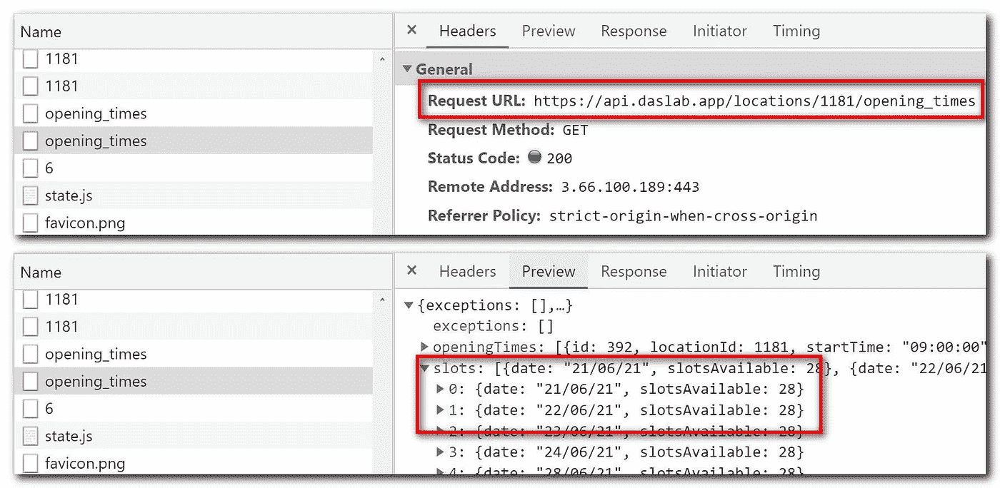
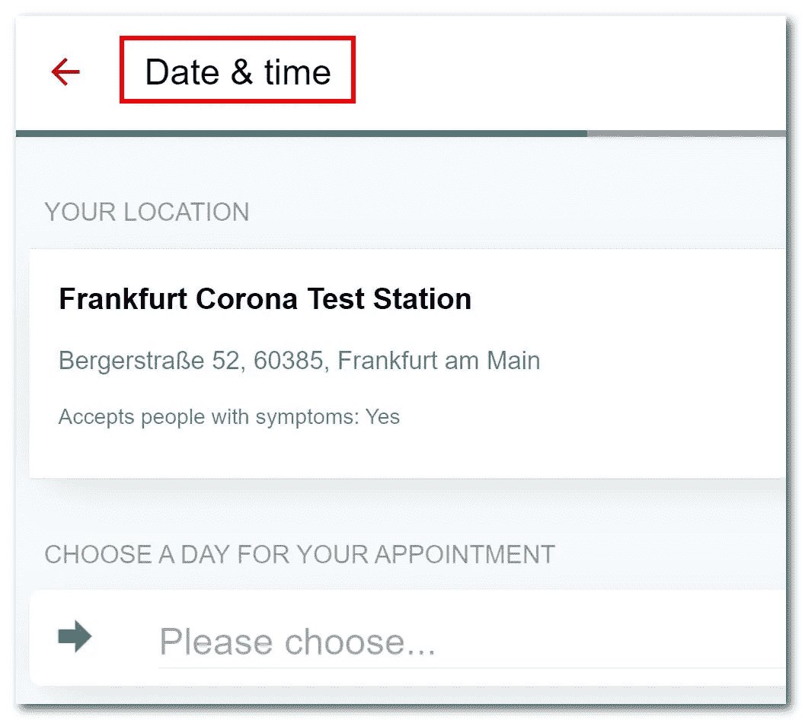
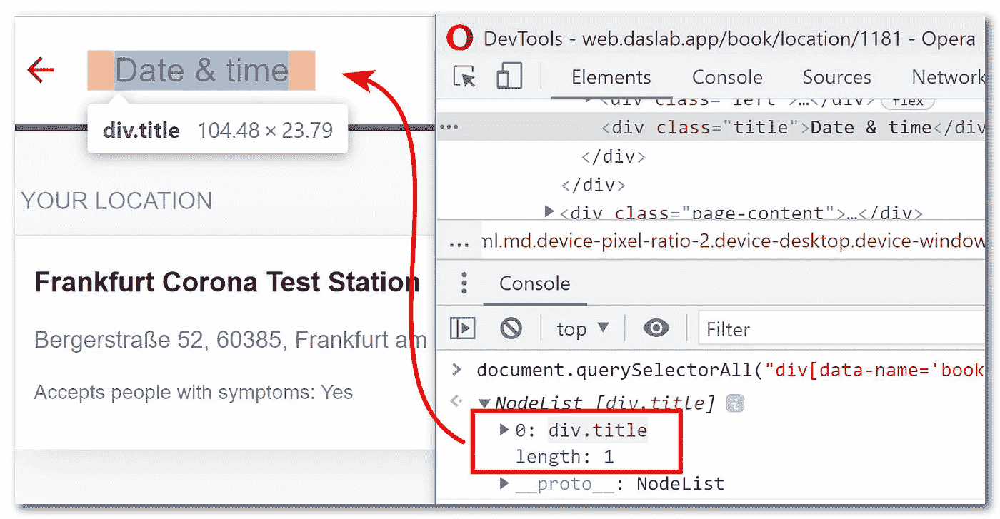

# 互联网服务的检查和预订。自动地。

> 原文：<https://medium.com/codex/checking-and-booking-of-internet-services-automatically-a5163395aec9?source=collection_archive---------5----------------------->


```
**Table of Contents**
-[Motivation](#b5cc)
-[Technique Design](#71b2)
---[Checking for available slots](#e7ec)
---[Booking the slot automatically](#3f79)
-[Features](#a538)
-[Limitations](#ad53)
-[Conclusion](#5d70)
```

# 动机

如果在德国居住的时间比游客停留的时间长，我们很快就会意识到，我们将需要访问一个德国机构，如[*bürger AMT*](https://de.wikipedia.org/wiki/Bürgeramt)*(“公民办公室”)，办理类似[*Anmeldung*](https://allaboutberlin.com/glossary/Anmeldung)*(居住地登记)的文书工作。许多地方要求我们在网上预约，通常情况下，几个月之后才有空位，而你仍然必须在[前两周](https://www.gesetze-im-internet.de/englisch_bmg/englisch_bmg.html#p0184)注册。然而，好消息是在白天，一些机构开放一些新的位置；或者某人，已经有一个时间段，不能去，所以他们必须取消约会；因此，相应的空位可再次预订。**

**问题是你不知道如此宝贵的时间窗口何时会出现，而且必须在其他人之前立即预订。如果有一个机器人持续查看预约网站 *24/7* 并开始快速预约时段*就好了* : *先看*和*先预约*。没有人愿意浪费时间去做这种无聊的任务。**

**然后 Python 和 [Selenium](https://en.wikipedia.org/wiki/Selenium_(software)) 出现在我的脑海里，提出了一个可能的解决方案。我们开始吧！**

# **技术设计**

**任何网站应用程序都可以被分解到前端——用户在浏览器中看到的；后端——接收来自前端 javascript 的 Restful API 调用，并提供数据或执行命令。我们会 ***多半是*** 尽量模仿用户的典型动作:**打开一个浏览器，在网站上看到 X，相应地做 y** 。这种重复的步骤会一直重复，直到用户满意为止。(尽管有一种*更有效的方法*，例如拦截并理解*正确的* Restful API 调用，但这种方法被认为容易出错，因为这些调用背后的逻辑很复杂，而且可能会频繁更改。尽管如此，我们还是有选择地使用*这一招*。)**

**我将在这个网站上演示这个实验，而不是为安梅尔登预约一个时间段:https://web.daslab.app/和 T2，在这里可以预约一个检验或疫苗接种。在我的*个人案例*中，特定一天的特定时间，接种槽快速可用；然后“[先到先得](https://www.merriam-webster.com/dictionary/first%20come%2C%20first%20served)”。不用多说，槽位可惜有限！**

**我的 Github 代码可以在这里[查看](https://github.com/ThachNgocTran/AutomaticWebsiteBooking)。**

## **正在检查可用的插槽**

**我们来考虑一下订票站:[法兰克福电晕测试站](https://web.daslab.app/book/location/1181)。**

****

**当访问这个网站时，在 Chrome 开发者工具的网络标签中，一个 Restful API 被调用来获取可用的日期和日期的预定时段。所以理论上，*每隔 10 秒定期调用这个 API，我们就知道是否有可用的槽*。**注意**:在[刮网](https://en.wikipedia.org/wiki/Web_scraping)时要有礼貌；否则，冒着你的 IP 被禁的风险！我觉得 1 秒太咄咄逼人，而 60 秒可能太长了。**

## **自动预约时段**

**在一个网站上，我们如何知道这是我们想要访问的网站？我们经常寻找“签名”——在特定网站上独一无二的东西，比如标题，或者特定 Web 元素的外观。例如，在这个网站上，这个标题表示页面内容:**

****

**“检查”这个 web 元素，我们希望通过使用 [CSS 选择器](https://developer.mozilla.org/en-US/docs/Web/CSS/CSS_Selectors)来识别这个独特的元素。这通常要求我们使用 CSS 选择器，并使用开发人员工具控制台仔细检查:**

****

**有时，我们无法找出一个 CSS 选择器来精确定位 Web 元素；相反，只有一个相关 Web 元素的列表，*其中一个*是我们的目标元素。在这种情况下，需要进一步的用户定义操作来缩小到一个 Web 元素。(代码中是`action_filter`参数)。**

**在识别出想要的页面后，我们进入*查看-这-做-那步骤*。例如，用这个 CSS 选择器找到一个 Web 元素，然后单击。**

```
**{
    "css_expected": "div[data-cy='confirm-and-pay-button'] > a",
    "action": "click"
}**
```

**另一个例子，用这个 CSS 选择器找到一个 Web 元素，然后输入。**

```
**{
    "css_expected": "input[type='text']",
    "action": "enter",
    "enter_what": "UYUHFHFSU75"
}**
```

**这意味着在前进的道路上不应该有未知的一步。一个登录对话框通常做*一次*；所以最好提前登录网站*。所以下一次，当浏览器访问网站时，一切都以直截了当和预期的方式顺利进行。***

***最后但并非最不重要的一点是，假设可用插槽的检查是一个长时间的持续过程，需要日夜运行。相比之下，预订一个可用的位置是一次性的，这意味着当在最后按下“确认”按钮时，如果有人已经预订了该位置怎么办？程序不会自动*开始预订*另一个可用的*空位。用户必须停止脚本并重新启动。****

# **特征**

*   **该计划捕捉屏幕截图时，错误和完成。**
*   **出错和完成时，程序会发出声音。当事情出乎意料时尤其有用，它会立刻引起你的注意。**
*   **自动化就像人类互动一样:*打开一个(Chrome)浏览器，访问一个网站，看这个，做那个，重复*。然而，整个过程很快，*轻松超过任何真实的人类互动*。**

# **限制**

*   **没有复杂的[流量控制](https://en.wikipedia.org/wiki/Control_flow)逻辑 if-then-else。**
*   **用户必须掌握一些关于 HTML/Javascript 和 Python 的知识。**
*   **这不是面向未来的。也许后来，网站设计者决定改变他们的 HTML 代码，例如，网页元素 id，网页元素层次结构。**
*   **不支持[验证码](https://en.wikipedia.org/wiki/CAPTCHA)。但这种情况可以通过定义一个新的动作来解决，除了“点击”和“输入”，例如“获取 _ 人类 _ 注意”，它会发出警报，显示一个消息框，等待人类手动完成该动作，然后继续。**
*   **插槽可用性检查是持久的；预约是一次性的。**

# **结论**

**该计划帮助我预订了一个 Covid 疫苗接种的可用位置，而没有让我从日常工作中分心。我知道这有点不公平。但这种做法并不新鲜，股票交易机器人就是一个例子。在日常生活中，我们越来越多地将许多事情自动化，最终提高了我们的整体生产力；只有在绝对必要的时候，人类才会介入。**

**然而，让我夜不能寐的是“机器的战争”。事情可能发生得如此之快，以至于人在回路中可能是一种负担，而不是一种优势。在这一点上，我们只是让机器做它们应该做的事情，记住它们可能会造成灾难。**