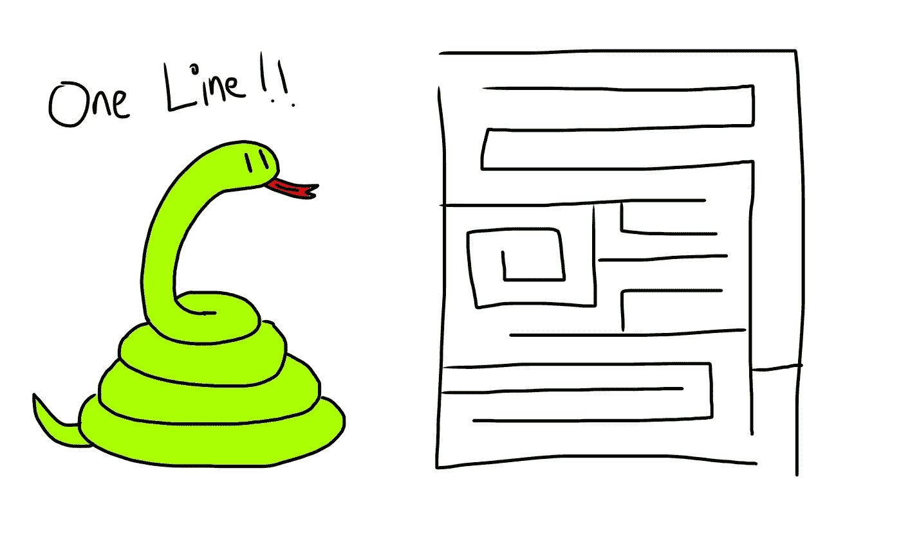

# 用一行 Python 代码检查迷宫是否可解

> 原文：<https://medium.com/codex/checking-if-maze-is-solvable-in-one-line-of-python-e4340204f655?source=collection_archive---------3----------------------->



假设给我们一个代表迷宫的字符串列表:

```
maze = [
    "P---#",
    "###--",
    "----#",
    "-###-",
    "----X"
]
```

*   `P`代表玩家，总是从左上角开始
*   `X`代表奖励，总是在右下角
*   `-`代表一条道路，玩家可以在上面行走