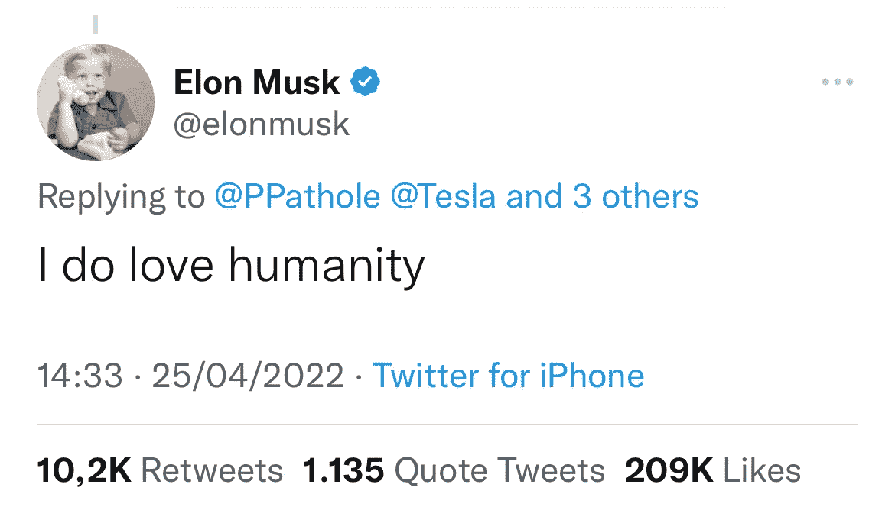

# 第二周

> 原文：<https://medium.com/codex/chief-twit-week-2-a53a37d51fb3?source=collection_archive---------10----------------------->

来源:[推特](https://twitter.com/elonmusk/status/1518584068555919360)

## 在经历了一个堪称最扣人心弦的法律惊悚片的夏天后，一周前出现了重大新闻。尽管困难重重，埃隆·马斯克现在确实拥有 Twitter。虽然不是最赚钱的，但可以肯定地说，Twitter 是世界上最有影响力的社交媒体平台之一