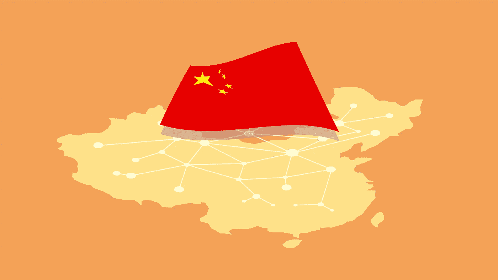

# 中国:新的人工智能霸主

> 原文：<https://medium.com/codex/china-the-new-ai-hegemon-f271e3ed40ea?source=collection_archive---------9----------------------->

## [法典](http://medium.com/codex)

图片作者:Atsutaka Odaira

中国对美国现在是一个热门话题。这也适用于另一个热门话题，人工智能研究。二十年前，中国和美国在人工智能研究水平上有很大差异。尽管美国公共机构和私营企业的研究工作稳步增长，但中国仍在为世界制造廉价的塑料产品。但近年来，中国已经开始快速追赶。从科学的角度来看，中国已经成为人工智能出版物和专利的全球领导者。这一趋势表明，中国也准备成为人工智能产业的先驱，如语音和图像识别应用。

根据《中国人工智能发展报告 2018》项目，中国人工智能研究论文的国际份额从 1997 年的 4.26% (1.086)上升到 2017 年的 27.68%(37.343)，超过了世界上任何其他国家，与美国并列。中国也经常申请比其他任何国家都多的人工智能专利。截至 2019 年 3 月，中国人工智能公司的数量超过 1189 家，仅次于拥有 2000 多家运营人工智能公司的美国。与国际同行相比，这些公司更依赖语音(如语音识别、语音合成)和感知(如图像识别、视频识别)。

你可能想知道中国是如何赶上的？AI 研究的本质是领导者的技术优势不是特别强；中国广阔的市场如何对增强人工智能尤为关键；以及该国有利的监管环境如何必然与人工智能投资和采用相关。这是各种因素的混合。

人工智能技术在许多领域与其他技术有着显著的不同。尽管研究推动了该领域的发展，但研究往往是公开共享的，专利研究并没有提供太多东西，创新往往来自消费者产生数据、企业根据从数据中获得的东西改进产品的良性循环。人工智能的开放科学性质对于新来者赶上先行者至关重要，因为它有助于前者在短时间内缩小与后者的信息差距，这不同于医药或汽车行业。

人工智能与传统行业不同的第二个领域是创新产生收入。简单来说，AI 科学中数据和能力胜过专利。在制药和电子媒体等传统市场，专利在维持公司角色和捍卫收入来源方面发挥着关键作用。人工智能的开放科学本质意味着，公司的比较优势还来自于它们能够比其他任何人更快地建立一个庞大的数据库——并在数据库中增长特定领域的信息或软件——的程度。

This suggests that there are two main assets in the AI era: data and engineering talent. China is very rich for all of them. Its vast population has advantages in producing and using big data, and its decades-long efforts to support science and innovation offer it a rich supply of high-quality computer scientists and engineers.

Government plays a huge part for China being number one in AI Research. Under President Xi Jinping, China has made great strides in many fields, which also includes especially in A.I. Companies and the government have agreed on a far-reaching strategy to make China the world’s largest A.I. innovation center by 2030 and are now making serious strides against that target. A new government is unlikely to repeal the plan; China removed Xi’s term limits and would essentially allow him to remain in office for life. This gives China an amazing edge over the West.

It also has three of China’s largest companies — Baidu, Alibaba, and Tencent — superpower. Collectively, they’re known as the BAT, and have profitable and organized A.I. strategy. Influence of BAT does not stop within China. That’s because BAT is now well known in Seattle and around San Francisco and is investing heavily in United States startups. That’s appealing to startups, since a BAT contract usually involves entering the lucrative Chinese industry, which may otherwise be difficult to reach.

China’s pace in AI progress needs the full attention of the world, but it is unhelpful to limit all the multiple innovations to a single story about China as a challenge against the West. Observers outside China need to participate seriously in the dialogue and make more effort to consider and learn from the complexities of what is actually going on.

*If you are interested in our blogs, please register your email address in the following link to get notifications through our newsletter:*

[http://eepurl.com/hmgmN1](http://eepurl.com/hmgmN1)

Written by Wanonno Iqtyider