# 中国联通改造了 Apache DolphinScheduler 资源中心，用于计费环境中的跨集群呼叫和对数据脚本的一站式访问

> 原文：<https://medium.com/codex/china-unicom-revamps-apache-dolphinscheduler-resource-center-for-cross-cluster-calls-in-billing-2dac460f99f?source=collection_archive---------20----------------------->

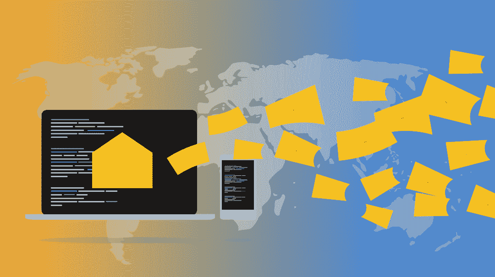

到 2022 年，中国联通的用户群达到 4.6 亿，占中国人口的 30%。随着 5G 的普及，运营商的 IT 系统普遍面临海量用户、海量话单、多样化业务、网络组织模式等一系列变革的冲击。

目前，中国联通每天处理超过 400 亿份语音订单。面对庞大的数据量，提高服务水平，为客户提供更有针对性的服务，已经成为中国联通的最终目标。中国联通已经成为大规模数据聚合、处理、脱敏和加密技术和应用的领导者，这有助于它成为数字经济发展的推动者。

在 Apache DolphinScheduler 4 月 Meetup 上，我们邀请了中国联通软件的白雪松，他给我们分享了 Apache dolphin scheduler 在中国联通计费环境中的应用。

介绍由三部分组成。

*   Apache DolphinScheduler 在中国联通的一般使用
*   中国联通计费业务话题分享
*   规划的下一步

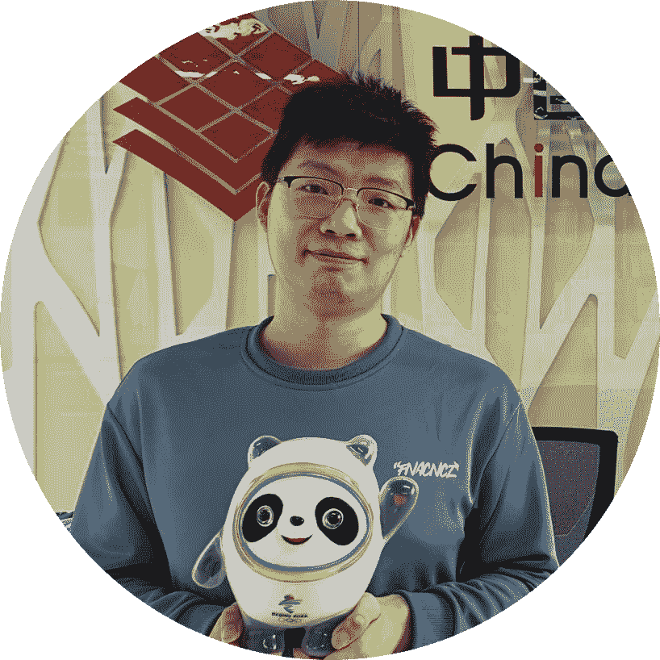

白雪松|大数据工程师，中国联通软件，毕业于中国农业大学，从事大数据平台搭建和 ai 平台搭建，为 Apache DolphinScheduler 贡献 Apache SeaTunnel(孵化)插件，为 Apache SeaTunnel(孵化)分享 Alluxio 插件

# 01 中国联通 Apache DolphinScheduler 的一般用法

我先给大家介绍一下中国联通对 Apache DolphinScheduler 的整体使用情况。

*   目前，我们主要在 3 个地点的 4 个集群中运营我们的业务
*   任务流的总数大约为 300
*   平均每日任务运行次数约为 5000 次

我们使用的 Apache DolphinScheduler 组件包括 Spark、Flink、SeaTunnel(以前叫 Waterdrop)，以及 Presto，还有一些存储过程的 shell 脚本，涵盖审计、收入分成、计费以及其他需要自动化的操作。

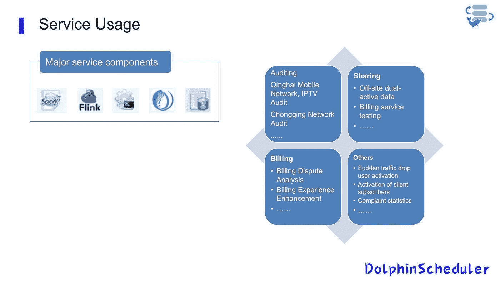

# 02 业务介绍

## 01 跨集群双活服务呼叫

如上所述，我们的服务运行在 3 个位置的 4 个集群上，这不可避免地导致集群之间的相互数据交换和业务调用。如何统一管理和调度这些跨集群的数据传输任务至关重要。我们的数据在生产集群中，它对集群网络带宽非常敏感，必须以有组织的方式进行管理。

另一方面，我们有一些操作需要跨集群调用，例如，集群 B 必须在集群 a 中的数据可用后开始统计任务，我们选择 Apache DolphinScheduler 作为调度和控制系统来解决这两个问题。

我们使用 HDFS 进行底层数据存储。在跨集群 HDFS 数据交换中，我们将使用的数据分为小批量和大批量、结构表、配置表等。根据数据的大小和使用情况。

对于小批量，我们直接放到同一个 Alluxio 上进行数据共享，这样就不会出现数据同步不及时导致的版本问题。

*   对于时间表和其他大文件，我们混合使用 Distcp 和 Spark。
*   对于结构化表数据，使用 Spark 上的 SeaTunnel。
*   通过纱线队列设置速度限制。
*   非结构化数据通过 Distcp 传输，通过自含参数带宽限制速度。

这些传输任务都运行在 Apache DolphinScheduler 之上，整体数据流主要是集群 A 的数据可用性检测，集群 A 的数据完整性验证，集群 A 和 B 之间的数据传输，集群 B 的数据审计和可用性通知。

我们主要使用 Apache DolphinScheduler 的补充重新运行来修复失败的任务或不完整的数据。

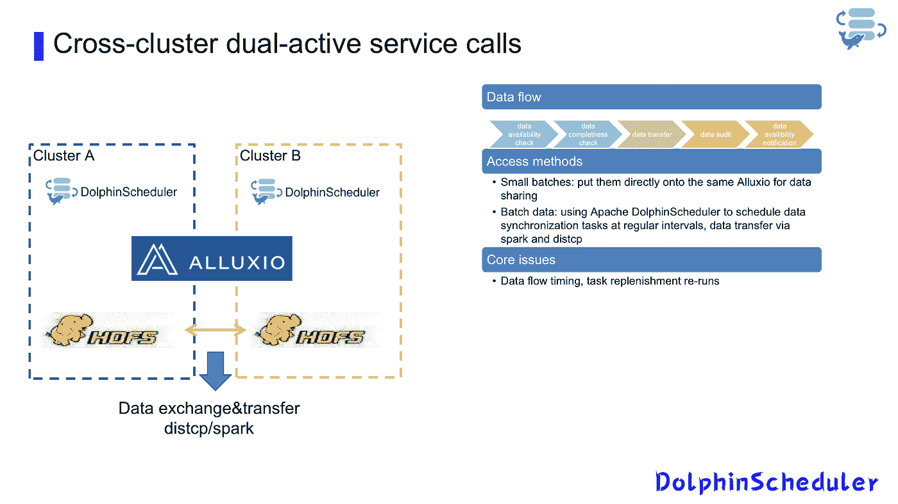

一旦我们完成了跨集群的数据同步和访问，我们还可以使用 Apache DolphinScheduler 跨地域和集群进行任务调用。

我们在位置 A 有两个集群，即测试 A1 和生产 A2，在位置 b 有一个生产 B1 集群。我们将在每个集群上拿出两台带有内部网 IP 的机器作为接口机器，并通过在六台接口机器上构建 Apache DolphinScheduler 来构建一个虚拟集群，以便可以在一个统一的页面上操作三个集群的内容。

问:我如何从测试走向生产？

答:在 A1 测试上开发任务，通过测试后，直接把工人节点改成 A2 生产。

问:如果我在 A2 生产中遇到问题，例如数据不可用，该怎么办？

答:我们可以直接切换到 B1 生产环境，进行手动双活灾难恢复切换。

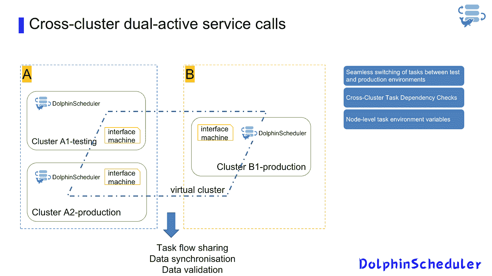

最后，我们还有一些相对较大的任务，需要使用两个集群同时计算以满足任务时间表，我们将把数据分成两部分，分别放在 A2 和 B1 上，然后我们将同时运行这些任务，最后将结果传回同一个集群进行合并。这些任务流程是通过 Apache DolphinScheduler 调用的。

请注意，在这个过程中，我们使用 Apache DolphinScheduler 来解决几个问题。

*   跨集群项目的任务相关性检查。
*   在节点级别控制任务环境变量。

# 02 任务运行的 AI 开发同步

## 1.统一数据访问方法

我们现在有一个简单的 AI 开发平台，主要为用户提供一些 TensorFlow 和 Spark ML 计算环境。由于业务需要将用户培训的本地文件模型和集群文件系统联系起来，并且能够提供统一的访问和部署方法，我们使用了工具 Alluxio-fuse 和 Apache DolphinScheduler。

*   Alluxio-fuse 连接本地和集群存储
*   Apache DolphinScheduler 共享本地和集群存储

由于我们建立的 AI 平台集群和数据集群是两个数据集群，所以我们在数据集群上存储数据，使用 Spark SQL 或 Hive 做一些数据预处理，之后我们在 Alluxio 上传输处理后的数据，最后通过 Alluxio fuse 跨级集群映射到本地文件，这样我们基于 Conda 的开发环境允许我们直接访问这些数据，从而通过访问本地数据来统一我们访问集群数据的方式。

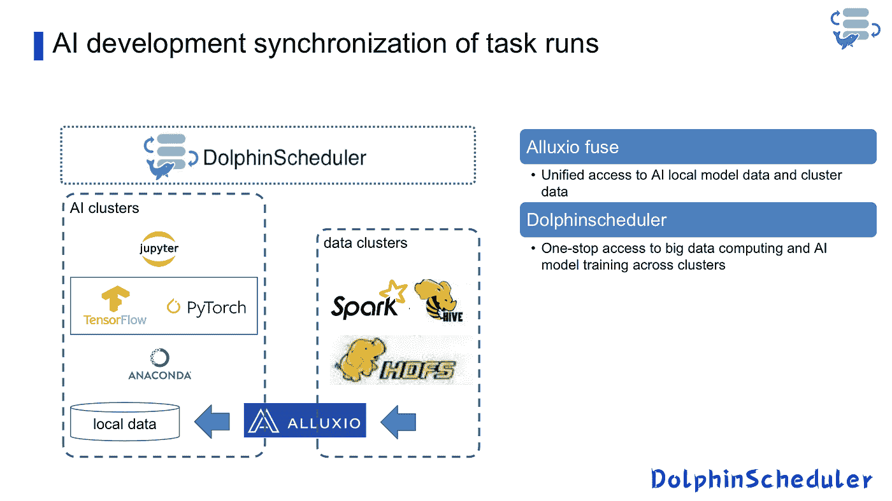

## 2.一站式访问数据脚本

在分离资源之后，通过数据集群预处理大数据内容，我们通过我们的 AI 集群处理训练和预测模型。这里，我们使用 Alluxio-fuse 对 Apache DolphinScheduler 的资源中心进行更改。我们将 Apache DolphinScheduler 资源中心连接到 Alluxio，并通过 Alluxio-fuse 挂载本地和集群文件，以便 Apache DolphinSchedule 可以访问本地训练推理脚本和存储在 hdfs 上的训练推理数据，从而实现对数据脚本的一站式访问。

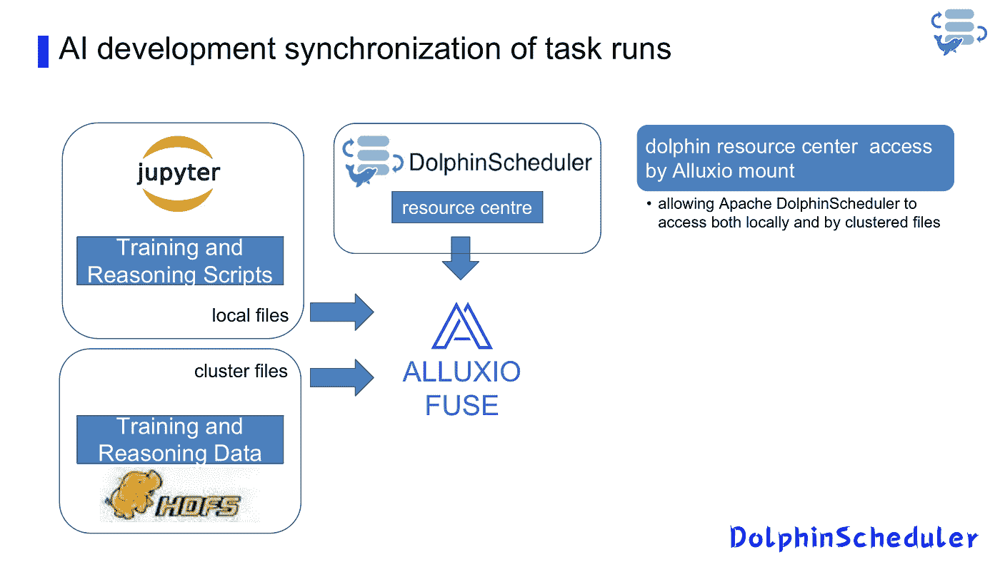

# 03 服务查询逻辑持久性

第三个应用场景是我们使用 Presto 和 Hue 为测试完成后需要通过前端写 SQL 定期运行一些处理逻辑和存储过程的用户提供一个前端即时查询接口，这样我们就打通了从前端 SQL 到后端定期运行任务的流程。

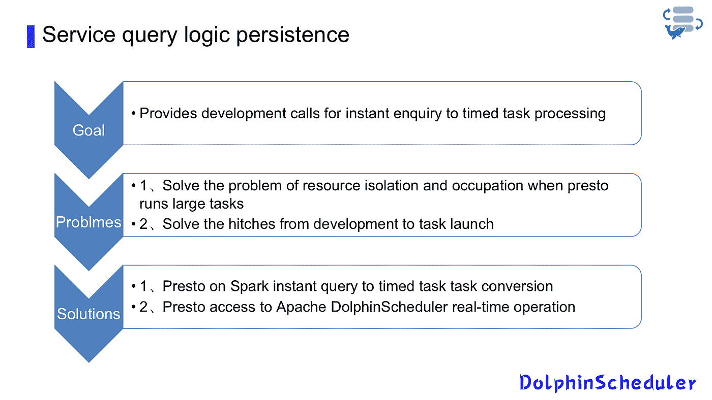

另一个问题是 Presto 没有租户之间的资源隔离。我们做了几个方案的比较，最后结合实际情况选择了 Presto on Spark 方案。

在这个多租户平台上，我们向用户提供的最初解决方案是在前端使用 Hue 接口，并使用 Presto 在物理集群上直接运行后端，这导致了用户资源的争用问题。当存在某些大型查询或大型处理逻辑时，会导致其他租户操作长时间搁置。

为此我们对 Presto on Yarn 和 Presto on Spark 进行了全面的性能对比，发现 Presto on Spark 在资源使用方面效率更高，你可以选择适合自己需求的方案。

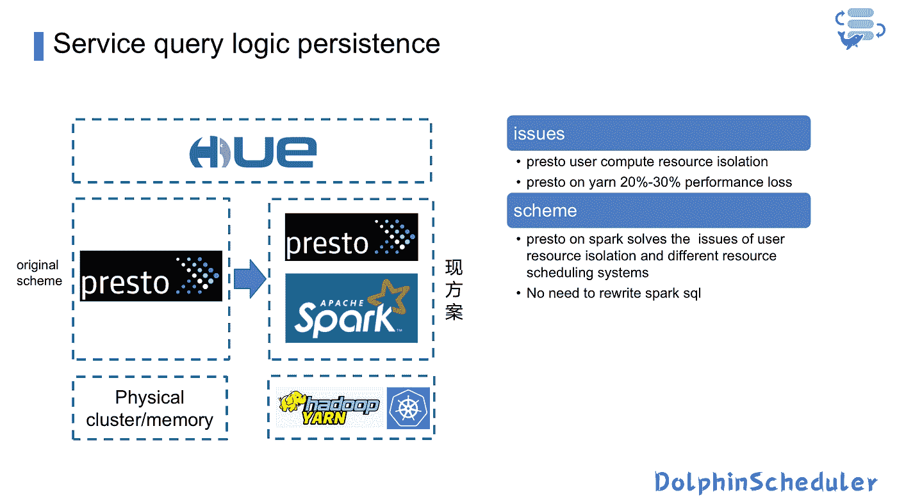

另一方面，我们让 native Presto 和 spark 上的 Presto 并存，对于数据量小、处理逻辑简单的 SQL，我们直接在 native Presto 上运行，而对于处理逻辑更复杂、运行时间更长的 SQL，我们在 Spark 上的 Presto 上运行，这样用户就可以用一套 SQL 切换到不同的底层引擎。

此外，我们还将 Hue 与 Apache DolphinScheduler 定时任务调度流程联系起来。在 Hue 上调整 SQL 开发之后，我们通过将它存储在本地 Serve 文件中，将其连接到 Git 进行版本控制。

我们将本地文件转移到 Alluxio fuse 作为 SQL 的同步挂载，最后使用 Hue 通过 Apache DolphinScheduler 的 API 创建任务和定时任务，控制从 SQL 开发到定时运行的过程。

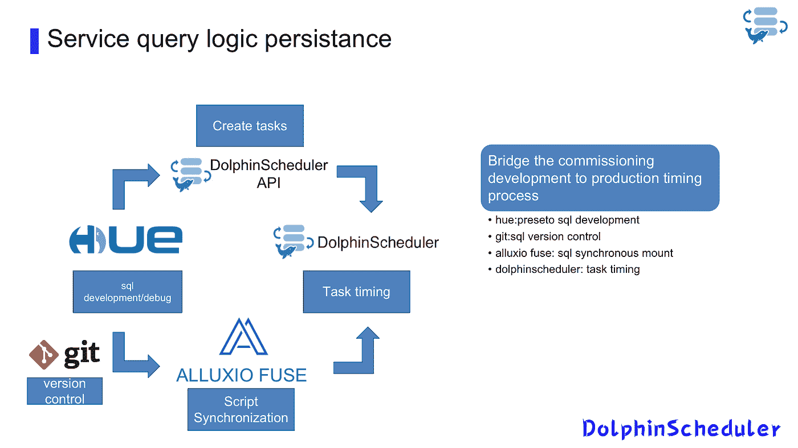

# 04 数据湖数据的统一治理

最后一个场景是数据湖中数据的统一治理。在我们自主开发的数据集成平台上，我们使用分层治理方法来统一数据湖中数据的管理和访问，其中 Apache DolphinScheduler 用作入站调度和监控引擎。

在数据集成平台中，我们使用 Apache DolphinScheduler 进行批处理和实时任务，如数据集成、数据输入和数据分发。

底层运行在 Spark 和 Flink 上。对于需要即时反馈的数据查询和数据探索，我们使用内嵌的 Hue 来 Spark 和 Presto 来探索和查询数据；对于数据资产登记和数据审计，我们直接查询数据源文件信息，直接同步底层数据信息。

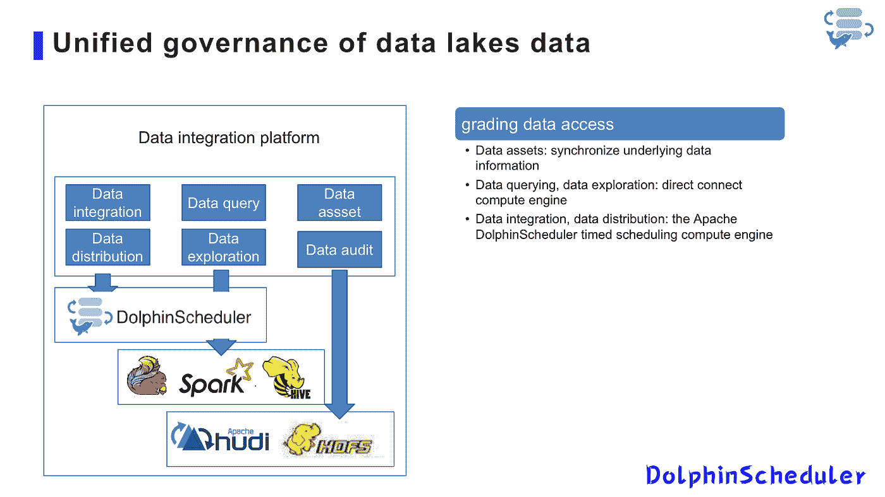

目前，我们在集成平台上运行 460 个数据表的质量管理，提供数据准确性和及时性的统一管理。

# 05 下一步措施和发展需求

## 01 资源中心

在资源中心，为了促进用户之间的文件共享，我们计划为所有用户提供资源授权，并根据共享文件所属的租户在租户级别分配共享文件，使其对多租户平台更加友好。

## 02 用户管理

第二个计划是关于用户管理，我们只提供租户级管理员帐户，后续用户帐户由租户管理员帐户创建。

## 03 任务节点

最后，我们的任务节点有计划，现在正在进行中:一方面，完成 SQL 节点的优化，以便用户可以选择一个资源中心 SQL 文件，而不必手动复制 SQL；另一方面，允许 HTTP 节点提取字段判断，以便对返回的 JSON 进行自定义解析，并提供对复杂返回值的更友好的处理。

# 加入社区

参与 DolphinScheduler 社区并为其做出贡献的方式有很多，包括:

文档、翻译、Q & A、测试、代码、文章、主题演讲等。

我们假设第一个 PR(文档、代码)是简单的，应该用来熟悉提交过程和社区协作风格。

所以社区整理了以下适合新手的问题列表:【https://github.com/apache/dolphinscheduler/issues/5689

非新手问题列表:[https://github.com/apache/dolphinscheduler/issues?q = is % 3A open+is % 3A issue+label % 3A % 22 volunteer+wanted % 22](https://github.com/apache/dolphinscheduler/issues?q=is%3Aopen+is%3Aissue+label%3A%22volunteer+wanted%22)

如何参与投稿:[https://dolphin scheduler . Apache . org/en-us/community/development/contribute . html](https://dolphinscheduler.apache.org/en-us/community/development/contribute.html)

【https://github.com/apache/dolphinscheduler】GitHub 代码库:

**官方网站:**https://dolphinscheduler.apache.org/

**邮件列表:**dev@dolphinscheduler@apache.org

**推特:**@海豚时间表

https://www.youtube.com/channel/UCmrPmeE7dVqo8DYhSLHa0vA

**松弛:**https://s.apache.org/dolphinscheduler-slack

**投稿指南:**https://dolphin scheduler . Apache . org/en-us/community/index . html

你的项目之星很重要，不要犹豫，点亮阿帕奇海豚调度❤️之星