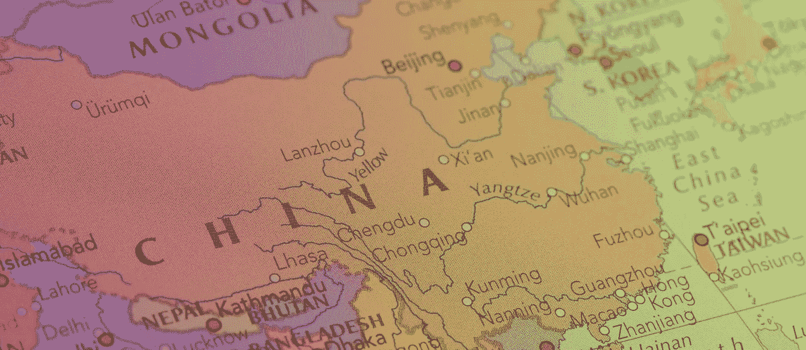

# 中国的巨大飞跃

> 原文：<https://medium.com/codex/chinas-quantum-leap-e349ebff2700?source=collection_archive---------9----------------------->

## 关于中国量子计算现状的长篇阅读

照片:歌德学院/ Canva

在这篇长篇阅读中，你会找到一些问题的答案，比如:量子计算的显著特征是什么，目前发展到了什么阶段？企业和政治家采用了什么策略来推动发展——尤其是在中国？谁是研究领域的超级明星？他们在研究什么，量子计算在哪里会有实际的应用机会？

由*乔西-玛丽·珀库恩，塔尼亚·贝克尔，南希·威尔姆斯和斯文·帕比斯*

*本文作者是一群来自德国多所大学的科学家，他们正在合作创办在线杂志《chinnotopia——中国设计的未来》，该杂志介绍了中国创新文化的高度多元化的各个方面。这份对量子计算的深入描述让我们对一项可能彻底改变世界的发展有了一些了解。*

量子计算机的发展目前在世界范围内的科学和政治中占据中心位置，也是公众普遍感兴趣的问题。研究领域的全球参与者主要在美国、中国和欧洲。因为在这个研究阶段，他们还没有标准化行业规范的开发和实施，所以不会有一个单一的通用量子计算机，而是基于不同技术和应用领域的多种方法将同时出现。现在还不可能预测我们什么时候能拥有一台可行的量子计算机。量子飞跃还没有发生。[jom1]鲁棒性和稳定性是确保量子计算机适用于尽可能广泛的应用的基本要求。潜力是巨大的，然而缺乏稳定的硬件和可靠的软件，加上允许精确使用量子计算机的算法仍然需要编写。

# 量子计算机的研究现状和特点

基于量子物理学的矛盾性，量子计算机通过微电子学应用量子力学原理来解决复杂的数学问题。这些问题要么是当今最强大的超级计算机无法解决的——例如日本的 Fugaku，它具有近 50 万万亿次的处理能力——要么它们需要非常长的时间才能解决。量子计算机还可以找到迄今为止我们仍然无法获得的解决方案，尽管经典计算机的能力很高，这将是数字化新维度的开始。处理能力随着量子位的数量呈指数增长。

> ***什么是量子位？***
> 
> *量子比特是量子比特的通用缩写，是量子计算机的基本信息单位。经典计算机是基于比特的，比特只能呈现两种状态(0 或 1)。举例来说，一个量子位元可以由原子或光子构成，它不仅可以呈现 0 和 1，也可以同时呈现每一个 1 的向量状态，换句话说，就是一个叠加态。*

量子计算机的开发已经在美国的科技实验室进行了一段时间。总部设在那里的大公司，如微软、亚马逊、谷歌、苹果、Meta(脸书)、IBM 和英特尔，正在支持各种项目，目标是创造一台功能完美的量子计算机。研究竞赛正在如火如荼地进行:私营企业——以及麻省理工学院(MIT)等许多学术机构——目前正在开发越来越强大的计算机，这些计算机已经能够挖掘数百量子位规模的巨大潜力。许多风险投资资金充足的初创企业也在致力于应对量子技术挑战。2021 年底，IBM 宣布新的“老鹰”量子芯片是世界上第一个拥有 127 个量子位的量子处理器。这将使 IBM 量子计算机成为量子技术实际应用道路上的一个重要里程碑。事实是，它的处理能力超过经典超级计算机一百万倍。IBM 已经计划将“系统二”作为新的更强大的处理器的基础设施，大约有 300 个量子位。于利希研究中心；FZJ)提供了一个欧洲量子计算方法的例子。他们在这里创建了新一代量子计算机作为一个开创性的项目，名为 Jupsi(ju lich 自旋干涉的先驱)。科学家们已经在讨论建造一台拥有几百万量子位的量子计算机的技术潜力。由如此强大的计算机塑造的未来景象超出了我们的想象范围。

# 中华人民共和国与人力资本

The USA’s advantage over China has been shrinking recently. This is apparent from the thriving presence of the Chinese internet industry. The “Big Three”, Baidu, Alibaba and Tencent (BAT), have increasingly been investing in research relating to quantum technology of this nature, and are constantly on the look-out for innovative minds. Alongside these and other large-scale business investors, fully or partially state-funded institutions are also working hard to recruit the right kind of talent within the home market, as well as overseas in the Western world. For instance spin-offs of Chinese think-tanks, innovation hubs, accelerators and incubators are becoming established. In this respect a clearly defined focus and rigorous implementation policy are emerging as one of China’s comparative strengths:
The “High-Level Talent Recruitment Program”, also known as the “Thousand Talents Plan” (Qianren jihua 千人计划), started back in late 2008 against the backdrop of the global financial crisis. The idea was to recruit leading international experts systematically, and at the same time exert influence overseas to encourage the top Chinese scientists educated at Western elite universities to return to their home country. These measures imposed by the government and the favourable proposals of being able to find good jobs in their native country seem to be successful: plenty of tech talents, especially in the fields of Artificial Intelligence, machine learning, software development and quantum computing, are coming to China. This trend cannot be overlooked: according to the Chinese Returnees from Overseas Study, over 70 per cent of Chinese undergraduates and researchers who had relocated overseas are now returning. In line with the proverbial government directive “Picking flowers in foreign lands to make honey in China” (Yiguo caihua, Zhonghua niangmi 异国采花，中华酿蜜), China’s government specifically encourages the acquisition of intellectual property for the purpose of strategic advantage. The expertise of the returnees helps China. And that befits a strategy designed to achieve global superiority in the application and creation of Artificial Intelligence (AI), in which quantum technology is a key element.

# 政治策略

在中国，量子技术长期以来一直是政治战略的焦点。这也从政府的严格规划中清晰可见:在当前的第十四个五年计划(2021-2025)中，他们宣布了“重大突破”。这些应该出现在科技领域，如量子信息技术、人工智能、半导体和太空旅行。人们希望，由于这种系统性的人才引进，以及众多的国家创新项目、培训实验室和国家资助，量子技术将取得重大发展进步——这将使中国科技产业走上成为世界市场领导者的道路。其意图是通过一项涉及国家和经济部门的协调战略来实现这一目标——这在西方是难以想象的——这意味着为私营和国营研究机构提供最佳的财务、研究和营销条件。

如何实现这个目标？中国主要投资于循证研究方法、科学出版物和战略专利。虽然欧洲在量子技术领域的专利注册量落后，但美国和中国的数字很高:2019 年发表的一份工作论文显示，美国和中国持有所有已注册量子技术专利的一半。这种成功可以归功于资金:在美国，主要是大型科技公司在积极的专利政策上花钱，而在中国，国家是主要的资金提供者，这些资金主要用于州立机构和大学的研究。巨额资金用于量子通信领域的量子技术商业化，以及量子密钥分配(QKD，一种量子密码过程)和冷原子干涉测量(用于量子传感器技术和计量学等应用)的开发。中国活动的另一个特别重点是量子力学过程的军事实用性，这与民用研究密切相关。尽管确切的数字并不透明，但有传言称，除了正在进行的政府资助之外，还有 11 位数的欧元。

一个耗资 100 亿欧元的研究中心正在中国安徽省省会合肥市建设，该中心将成为量子通信技术的国家实验室。中国东部的济南市也想建造一个量子谷，目标是到 2025 年启动价值数十亿美元的项目。

但不仅仅是国家资助，中国网络巨头也将大量资金投入量子技术研究。例如，阿里巴巴已经宣布，该公司将把计划研发预算的一部分，总计约 130 亿欧元，投资于量子计算的开发。

# Quantum Key Distribution, quantum cryptography and the QNet

Quantum Key Distribution (QKD) is the best-known process in quantum cryptography. The application of quantum-based cryptography makes it possible to transmit unhackable messages. At the moment the roll-out of terrestrial QKD networks in China is the most advanced in the world. China already operates a quantum cable 2000 kilometres long between the cities of Shanghai, Hefei, Jinan and Beijing. As quantum states have a maximum transmission length of around 100 kilometres through fibre-optic cables, messages have to be decrypted and re-encrypted at 32 trusted nodes and relayed to the next point. It was the discovery of quantum repeaters that made the quantum net (QNet) possible in the first place. The attractiveness of intrinsically secure quantum encryption makes its potential interesting not only to the military and governments, but also for a number of commercial applications. Virtual doctor’s appointments and even secret project meetings are already taking place on the QNet.

The QNet would be able to provide three applications that have not existed so far on the conventional internet: unhackable communication, secure quantum computing in the Cloud and traceless searching on the net. In the next few years China and the USA plan to develop large networks for quantum cryptography, which could become the start of a general QNet. Such ambitious infrastructure projects already include the planning of quantum-ready terrestrial fibre-optics, submarine cables — and in particular communication satellites.

# Quantum satellites and quantum computers

In August 2016, China launched the quantum-based satellite “Micius”. The satellite, which was named after Mozi 墨子, a philosopher from the Warring States period (480–221 BC), was the starting point for the first successful transmission of a quantum key and the encrypted communication based on it. The project leader, Chinese physicist Pan Jianwei 潘建伟, conducted a quantum-encrypted video chat with his former doctoral supervisor, Anton Zeilinger, who was in Vienna at the time. The distance between the two quantum physicists was around 8,000 kilometres. So they were successful in carrying out a key exchange via satellite between China and Austria, thereby creating a secure communication channel. The satellite acted as a trusted node here. The video conference encrypted in this way using QKD was then held over a standard internet connection. China plans to establish a blanket QNet by 2030.

Pan Jianwei is the leading quantum scientist in the country. He is referred to as “China’s Einstein” and ranks amongst the Chinese scientists who have been educated overseas. Pan completed his PhD in Vienna under Anton Zeilinger, one of the most highly reputed quantum scientists in the world. Pan founded a research group in Heidelberg and then returned to China, where he is now known as the “father of quantum”. He is so highly regarded that his laboratory at the University of Science and Technology of China (USTC) in the city of Hefei is visited from time to time by President Xi Jinping. Pan’s goal is to establish a long-distance, high-speed quantum communication system that will be compatible with classic communication technology and is up to ten billion times faster than Sycamore, Google’s quantum computer built in 2019.

In May 2021 Pan Jianwei’s research team developed a programmable superconducting quantum processor with 62 qubits and called it Zu Chongzhi 祖沖之 after a well-known 5th century Chinese mathematician and astronomer. The system’s core objective is to synchronously increase the number of integrated qubits and improve the performance of superconducting qubits, so as to achieve exponential acceleration in the processing speed of specific problems, and finally apply it in practice.

量子计算机的研究正在全速前进:在最初的祖冲之版本几个月后，潘建伟的团队与上海技术物理研究所(中国科学院)合作推出了 66 个量子位的后续版本。额外的四个量子位可以在质量和数量上实现处理能力的提高。这意味着祖冲之 2.0 比最快的常规超级计算机快一千万倍，比谷歌制造的超导量子计算机 Sycamore 强一百万倍。但另一台中国量子计算机 Nine Chapter 2 也值得一提:它于 2021 年底推出，是合肥、上海和无锡研究团队的产品。它的处理速度是为处理特定问题而定制的，比普通的超级计算机快 100 万亿次。因此，继美国之后，这使中国成为世界上第二个实现量子第一的国家。

# 量子首要性:未来的基础

由于量子技术是一项基础技术，未来技术革命的速度在很大程度上取决于这一领域的能力。欧洲工业已经痛苦地意识到这一点，因为目前它依赖从亚洲进口高科技，例如计算机芯片、医药化学品和用于制造其他高科技产品(如电池)的预制品。相对于迄今使用的传统生产工艺的技术优势对于欧洲未来的政治主权也是至关重要的。虽然这现在是政治和媒体讨论的主题，但获得必要的技术技能仍然没有取得很大进展。同样值得怀疑的是，欧洲消费者是否准备好支付不可避免的更高价格——例如移动设备、网络技术、汽车和娱乐电子产品。诚然，欧洲已经错过了数字化趋势的机遇。

当今的全球大公司完全由技术和基于互联网的商业模式组成。他们早就把大石油、大钢铁、航天这些“老工业”巨头甩在了身后。这些科技巨头的股票市值现在高于主要工业国家的国内生产总值。仅统计数据就显示了这种新的量子技术的巨大金融力量，迄今为止，这种技术主要是由互联网巨头开发的。得益于促进本土大型企业发展的明智政策，中国可以轻而易举地赶上这里的大企业。另一方面，欧洲远远落在后面。尽管中国共产党正在对阿里巴巴和滴滴等公司采取极端行动，但中华人民共和国仍未制定出一个概念来阻止互联网行业形成垄断。欧洲在电子商务经济方面依赖美国，但在高端技术产品的生产方面依赖中国，这些产品决定了我们的现在和未来。如果欧洲希望成为为消费者和行业提供这些产品和服务的巨大价值创造计划的一部分，除了加强欧洲量子技术领域的努力，别无选择。欧洲作为这一关键领域技术视角的影响者，唯一的生存之道就是谨慎地摆脱中国的控制。

量子技术的发展和可能的应用仍处于早期阶段。它的潜力之所以如此神奇，是因为在这门基本粒子科学中，时间和空间的界限变得模糊了。鉴于该领域迅速发生的变化，颠覆性创新的机会已经超出了经验预测的范围。由于量子力学效应的基本性质，生活的所有领域都将受到彻底创新的影响——类似于数字化和互联网引入后发生的事情。特别是复杂的过程要经过算法处理。这些包括病历、准备法律意见书、设计技术和建筑解决方案、物流和公共交通的控制和指导功能，以及最终的政治和军事战略的规划、计算和实施。任何文化传统、社会类别或专业团体都无法逃脱潜在的破坏。

但是，要让这种矛盾的魔力围绕着这个新的开始，就需要在技术和科学方面做出巨大的努力。即使是完全不可破解的量子密码术和基于此的量子网络的可能性，也需要具备只有少数国家和社会拥有的技术能力:尖端的科学和研究社区，发展到同等先进水平的高端电子工业和工程。从基于实验室的研究到量子纠缠的实际应用，只有在巨大的资金投入和知识转移的情况下才能实现。与标准计算机的发展相比，我们目前的水平大约相当于 1975 年。在不久的将来，开发完全纠错且通用的量子计算机仍然是一个巨大的挑战。

全球量子技术竞赛一天比一天艰难，社会未来的不确定性变得越来越重要。在这种情况下，许多问题仍然悬而未决:这种巨大的计算能力是用来做什么的？在不久的将来，研究的速度会使我们的生活看起来完全不同吗？量子计算领域的发展将把我们带向何方？这一地区的主要国家与世界其他国家之间的差距会进一步扩大吗？因此，量子计算时代大跃进的获胜者仍然没有确定；然而，有一点是肯定的——新技术有潜力极大地改变我们生活的世界的未来。

## 进一步阅读

Kagermann，H./Süssenguth，f ./krner，J./Liepold，A. (2020): [*创新潜力量子技术/第二代量子技术的创新潜力*](https://www.acatech.de/publikation/innovationspotenziale-der-quantentechnologien/)；慕尼黑。克劳斯(2020): Q *uantencomputer。量子计算机。从量子世界到人工智能)*；柏林斯普林格自然公园。
Meier Christian j .(2021):*Eine kurze Geschichte vom quanten computer(量子计算机简史)*；(特勒波利斯)，海德堡 2021。
Patel N.V. (2020): [*中国:überholmanver Bei der Quantenkryptographie(中国:量子密码学的超车动作)*](https://www.heise.de/tr/artikel/China-Uebe-rholmanoever-bei-der-Quantenkryptografe-4623639.html) ，载于:Technology Review。创新杂志。
张清/徐峰/李林`/刘恩林(2019):量子信息研究在中国，载:量子科学与技术 4，40503。

## 作者

2020 年，Josie-Marie Perkuhn 博士与她的联合创始人一起启动了 chinnotopia 项目。目前，她是特里尔大学的博士后，也是“台湾作为先锋”项目的首席协调员。塔尼亚·贝克尔博士是柏林工业大学中国中心的讲师和副研究员。南希·威尔姆斯博士是波鸿鲁尔大学的前副研究员。她目前在 GIZ 从事中德合作领域的工作。斯文·帕比斯是波鸿大学 CDHK 中德研究生院的本科生助理。他在那里学习销售工程和产品管理。

翻译:乔·贝克特

版权:知识共享

2022 年 5 月

*原载于*[*https://www . Goethe . de*](https://www.goethe.de/prj/lqs/en/art/chi.html)*。*