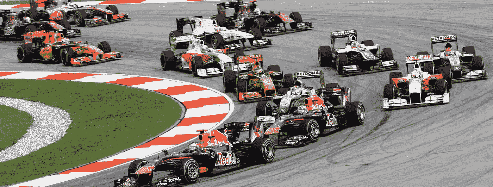
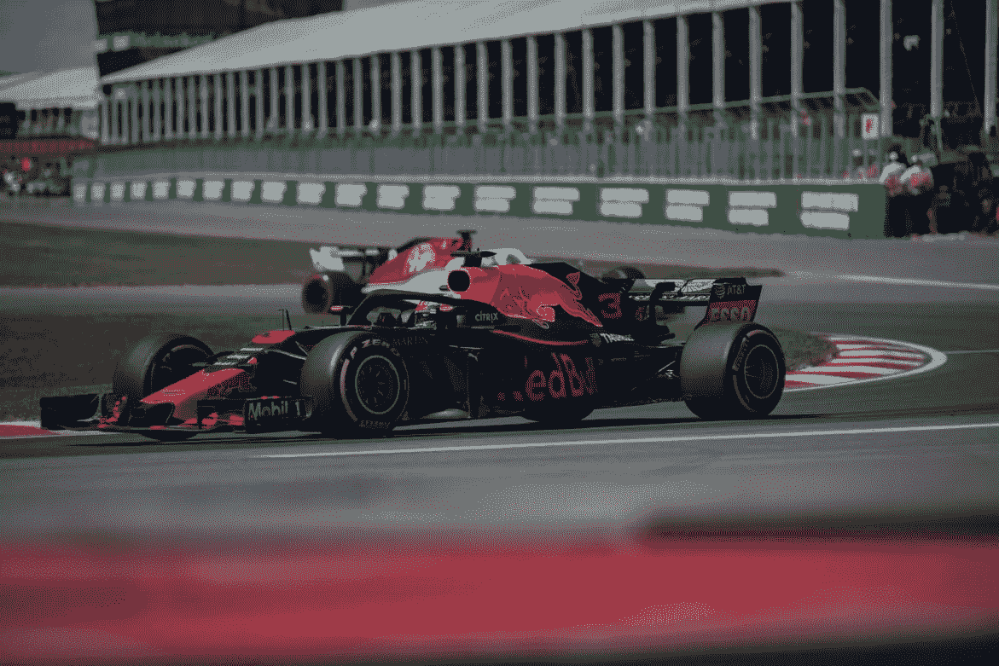
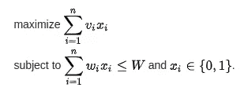
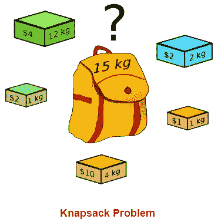
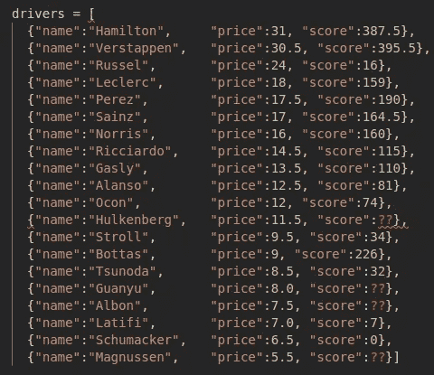
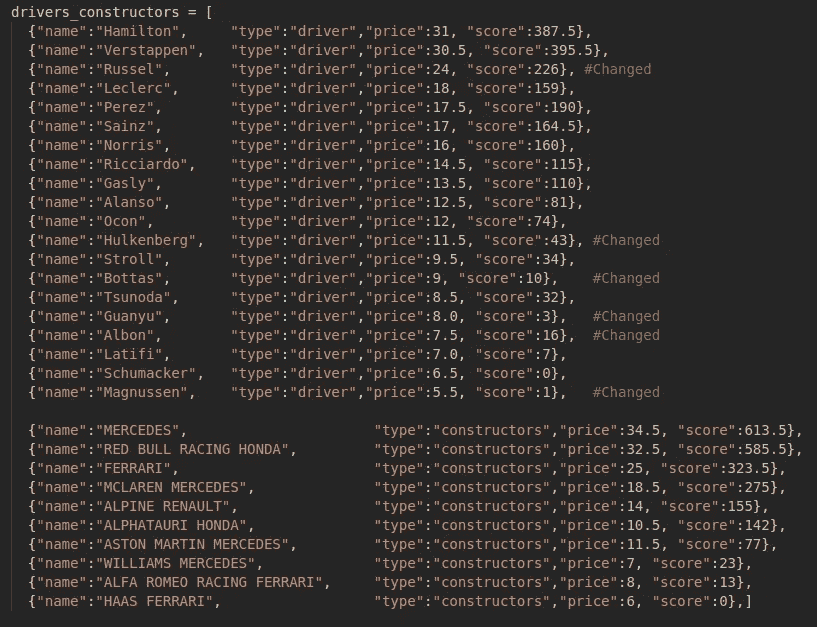

# 基于优化问题选择最佳 F1 梦幻车队。

> 原文：<https://medium.com/codex/choose-the-best-f1-fantasy-team-based-on-an-optimization-problem-f6c97bf3a00?source=collection_archive---------8----------------------->



【2010 年马来西亚 Formel 1。作者莫里欧。 [CC BY SA 3.0](https://creativecommons.org/licenses/by-sa/3.0/no/)

终于又到了一年中的这个时候了！本周末，一级方程式赛车在巴林海湾航空大奖赛上取得了一些令人兴奋的成绩，拉开了 2022 赛季的序幕。这也意味着 F1 幻想第一轮完了。

对于不熟悉 f1 的人来说，这是[单座敞篷方程式赛车](https://en.wikipedia.org/wiki/Formula_racing)的最高级别国际赛事。一级方程式赛季由一系列在全球范围内举行的比赛组成，这些比赛被称为[大奖赛](https://en.wikipedia.org/wiki/List_of_Formula_One_Grands_Prix)。一个赛季的比赛次数可能会有所不同，今年是 F1 破纪录的 23 场比赛。今年的赛季有 10 个车队参赛，每个车队有两名车手。下面的列表显示了车队和他们的车手。

施工人员和司机:

*   梅赛德斯:刘易斯·汉密尔顿 44 号乔治·拉塞尔 63 号
*   红牛:马克斯·维斯塔潘 1 号塞尔吉奥·佩雷斯 11 号
*   法拉利:查尔斯·勒克莱尔 16 号卡洛斯·赛恩斯 55 号
*   麦克拉伦:兰多·诺里斯第三，丹尼尔·里卡多第四
*   阿尔派因:费尔南多·阿隆索第 14 位，埃斯特班·奥康第 31 位
*   皮埃尔·加斯利 10 号由纪·常田 22 号
*   阿斯顿·马丁:塞巴斯蒂安·维特尔 5 号兰斯·斯特罗尔 18 号
*   威廉姆斯:尼古拉斯·拉蒂菲 6 号亚历克斯·阿尔邦 23 号
*   阿尔法罗密欧:周冠宇#24 瓦尔特利·博塔斯#77
*   哈斯:凯文·马格努森第 20 名，米克·舒马赫第 47 名

随着 F1 赛季的进行，有一个名为 F1 Fantasy 的游戏，让你选择一个有司机和建造者的团队与其他 Fantasy F1 球员竞争。您选择的车手和构造者将根据他们在真实世界 f1 赛事中的表现获得分数。赛季开始前，你必须在 1 亿英镑的预算内选择 5 名车手和 1 名建造商。当赛季开始时，球队就被锁定了。然而，你可以在下周比赛前做一些替换。更多关于 F1 幻想的规则[在这里](https://fantasy.formula1.com/game-rules)。在一个周末的比赛中你可以获得积分的方式在积分表[中显示。你的车队有很多方法可以获得积分，但主要是基于现实世界的一级方程式积分系统。继续，让我们看看优化问题。](https://fantasy.formula1.com/points-scoring)



照片来自 [Unsplash](https://unsplash.com/photos/VLqAp1oNTXQ)

如前所述，你需要选择一个有五名车手和一名车手的车队。你有 1 亿英镑的预算，每个驱动程序和建造者的成本在 9-35 万英镑之间。你要优化选择，以便让车手和车队在赛季中获得最多的积分。听起来很熟悉？如果你以前做过一些优化，你可能听说过[背包问题](https://en.wikipedia.org/wiki/Knapsack_problem)。维基百科将背包问题描述为:

> **背包问题**是[组合优化](https://en.wikipedia.org/wiki/Combinatorial_optimization)中的一个问题:给定一组物品，每个物品都有一个重量和一个值，确定集合中要包含的每个物品的数量，使总重量小于或等于给定的限制，总价值尽可能大。
> 
> 正在解决的最常见的问题是**0–1 背包问题**，它将每种物品的副本数 *x_{i}* 限制为零或一。给定一组从 1 到 *n* 的 *n* 个项目，每个项目都有一个权重 *w_{i}* 和值 *v_{i}* ，以及一个最大重量容量 *W* ，



定义 0–1 背包问题。[【1】](https://en.wikipedia.org/wiki/Knapsack_problem)

> 这里 *x_{i}* 表示要包含在背包中的项目 *i* 的实例数。非正式地说，问题是最大化背包中项目的值的总和，使得重量的总和小于或等于背包的容量。[【1】](https://en.wikipedia.org/wiki/Knapsack_problem)

简而言之，您希望在不超过重量限制的情况下挑选价格最高的商品。为了最大限度地提高价格，您会选择哪一件物品，并且您的包内重量不超过 15 公斤？有[很多](https://www.geeksforgeeks.org/0-1-knapsack-problem-dp-10/)算法可以解决这个问题。



照片由 [Zyousefi 拍摄。](https://commons.wikimedia.org/wiki/File:Knap_sack.png) [CC-BY-SA-4.0](https://commons.wikimedia.org/wiki/Category:CC-BY-SA-4.0)

把上图中的袋子想象成 F1 幻想中的预算极限，把每个砖块想象成一个驱动者或者构造者。在我们的优化问题中,“kg”类似于每个驱动程序或构造程序的价格，价格($)将由每个驱动程序或构造程序的点数代替。价格和预算限制我们都知道，但是如果赛季还没有开始，我们怎么能在赛季开始前被告知。一个可能的解决方案是使用 2021 年的 F1 结果，因为预计自去年的最终结果以来，车手或制造商没有太大的变化。如果我们包括 F1 幻想中所有可以选择的车手，他们的价格和上赛季的分数，我们会得到下面的列表。



驱动程序列表。代码由*作者编写。*

在我们深入研究这个问题之前，应该提到 F1 中不同的赛车之间有着巨大的差异。近年来，梅赛德斯一直统治着 F1。毫无疑问，他们有伟大的车手，但同样众所周知的是，默塞德的赛车一直比他们的竞争对手更快。这是竞争的一部分，拥有最好的赛车。在赛季之间更换车手并不罕见。如果我们看看名单，我们可以看到拉塞尔上赛季的低得分，他的价格很高。这是因为上个赛季 Russel 是威廉姆斯车队的车手，他们的赛车被认为是 F1 中最慢的赛车之一。今年 Russel 赢得了梅赛德斯车手的席位，因此预计 Russel 将在排名中名列前茅。这描述了 F1 中最慢和最快的赛车之间的区别。由于这个原因，对于一些车手来说，上赛季的分数可能并不能反映本赛季的预测分数。

上图中用红色问号突出显示了上赛季缺失的分数。有些车手之所以没有上赛季的积分，是因为他们是本赛季 F1 的新车手，或者他们从上赛季卷土重来。下面的项目符号列表描述了我如何替换列表中的一些分数，以便更好地估计本赛季的分数。我不会把自己描述成 F1 专家，所以我可能得出了一些不准确的结论。然而，解决这个优化问题仍然需要相同的过程。

*   拉塞尔:拉塞尔成为了梅赛德斯车队的新车手。把 Russel 的分数换成去年拥有梅赛德斯席位的人 Bottas。
*   胡肯伯格:由于新冠肺炎的原因，胡肯伯格在第一场比赛中取代了维特尔。将胡尔肯伯格的得分设定为维特尔的上赛季得分。
*   博塔斯:博塔斯在阿尔法·罗密欧获得了一个新席位。创下了去年基米·莱科宁阿尔法·罗密欧车手博塔斯的成绩。
*   关羽:关羽是阿尔法罗密欧加盟的新车手。作为阿尔法·罗密欧上赛季的另一位车手，安东尼奥·吉奥维纳齐创下了他的记录。
*   阿尔邦:阿尔邦为威廉姆斯车队重返 F1。阿尔邦之前为红牛车队效力，红牛被认为是速度更快的赛车。因此，我不会使用阿尔邦斯的成绩作为红牛车手。创下了他去年在拉塞尔威廉姆斯的成绩。
*   马格努森:马格努森本赛季作为哈斯的一名车手重返 F1。马格努森也参加了哈斯 2020 赛季的比赛。因此，我将从 2020 年开始使用马格努森的分数。

替换和插入新分数后，列表现在看起来像下图。我还插入了上个赛季的制造商和他们的分数。



车手和车队以及上赛季的分数。代码由*作者编写。*

如果我们现在回到这个问题，通过比较这个问题和最初的背包问题，我们可以看到一些不同之处。首先，在原始背包问题中，你可以只选择一个物品，如果这个物品给出最高的价格并且在重量限制下。在这个问题中我们**需要**选择总共六个项目(驱动和构造)，但是我们只能选择五个驱动和一个构造。这表明我们有一个*多约束背包问题*。还有，一些背包问题允许你多次拿一个物品，但是在我们的问题中这是不允许的。

为了解决这个多约束问题，我们将使用 OR-Tools 提供的 CP-SAT 求解器，这是一个用于*组合优化*的开源软件。CP-SAT 求解器是一个使用 SAT(可满足性)方法的约束编程求解器。[【2】](https://developers.google.com/optimization/cp/cp_solver)

首先我们需要申报物品的数量。在这种情况下，驱动程序和构造函数的数量。我们还定义了第一个约束条件:

```
# Preprocessing 
capacity = 6
budget = 100 #mill
n_drivers_constructors = len(set([entry['name'] for entry in drivers_constructors]))
```

现在是时候定义我们将要用来解决这个问题的模型了。

```
# Define model
model = cp_model.CpModel()
x_select = [model.NewBoolVar('') for i in range(n_drivers_constructors)]
```

定义模型后，我们必须设置约束。因为一些数值有小数，而这个求解器只允许整数问题，所以我们将数值乘以 10。

```
# Capacity constrain
model.Add(sum(x_select) == capacity)# Budget constrain
model.Add(sum([x_select[i] * int(round(drivers_constructors[i]['price']*10)) for i in range(n_drivers_constructors)]) <= budget * 10)# Constructor constrain
model.Add(sum([x_select[i] for i in range(n_drivers_constructors) if drivers_constructors[i]['type'] == 'constructors']) == 1)
```

在解决问题之前，我们必须让模型知道我们想要最大化哪个变量。

```
# Maximize sum of scores selected model.Maximize(sum([x_select[i] * int(round(drivers_constructors[i]['score']*10)) for i in range(n_drivers_constructors)]))
```

那么是时候解决问题了。我们还需要缩减价值。最后几行帮助我们打印一些结果。

```
#Solve the problemsolver = cp_model.CpSolver()
solver.parameters.log_search_progress = True
model.Proto().objective.scaling_factor = -1./10       
status = solver.Solve(model)if status == cp_model.OPTIMAL:
  selected = [i for i in range(n_drivers_constructors) if                      solver.Value(x_select[i]) == 1]
  print("\n".join([str(drivers_constructors[i]) for i in selected]))
```

如果我们看看结果，看起来这将是一个红牛车队。求解器还打印状态:最佳。这意味着找到了最优可行解。如果我们把这支球队的标价加起来，我们会得到 1 亿英镑。通过优化去年的积分，看起来最好是有一个最好和最差车手的组合(有车)，而不是一整支车队都有中等好的车手。

```
Results:
{'name': 'Verstappen', 'type': 'driver', 'price': 30.5, 'score': 395.5}
{'name': 'Perez', 'type': 'driver', 'price': 17.5, 'score': 190}{'name': 'Albon', 'type': 'driver', 'price': 7.5, 'score': 16}{'name': 'Schumacker', 'type': 'driver', 'price': 6.5, 'score': 0}{'name': 'Magnussen', 'type': 'driver', 'price': 5.5, 'score': 1}{'name': 'RED BULL RACING HONDA', 'type': 'constructors', 'price': 32.5, 'score': 585.5}
```

## 结论

本文通过将问题定义为优化问题，证明了基于上赛季积分找到最佳 F1 梦幻车队是可能的。如前所述，F1 幻想中的积分系统并不完全基于现实世界 F1 中的积分。例如，你会因为连续得分而得到额外的分数，因为被取消资格而得到负的分数。这个问题没有考虑到这一点。在一些比赛之后，这个解决方案将会过时，但是你可以用同样的方法用一些其他的变量来代替上赛季的积分。

领英:[https://www.linkedin.com/in/peder-ward-158b87b4/](https://www.linkedin.com/in/peder-ward-158b87b4/)

github:[https://github . com/pederw 455/Formula-1-Fantasy-team-optimization](https://github.com/pederw455/Formula-1-Fantasy-team-optimization)


图片来自 [Piqsels](https://www.piqsels.com/no/public-domain-photo-obani) 。

> [【1】](https://en.wikipedia.org/wiki/Knapsack_problem)维基百科—背包问题

[【2】](https://developers.google.com/optimization/cp/cp_solver)谷歌[或-工具](https://developers.google.com/optimization)-CP-SAT 求解器