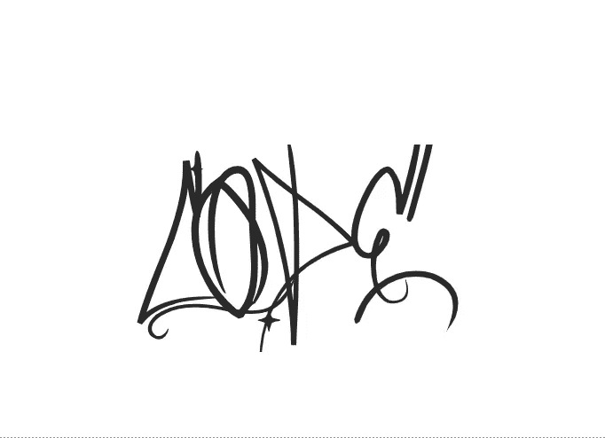
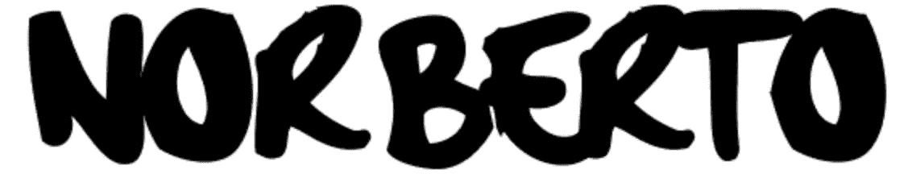

# 选择你的字体:顶级免费字体网站(以及我如何将我的字体添加到我的项目中)

> 原文：<https://medium.com/codex/choose-your-font-top-free-font-websites-and-how-i-added-mine-to-my-project-68acecabbf1e?source=collection_archive---------8----------------------->


布雷特·乔丹在 [Unsplash](https://unsplash.com?utm_source=medium&utm_medium=referral) 上的照片

自从“推销”我的 Myspace 个人资料以来，我一直喜欢玩字体。无论我们往哪里看，我们都能看到那些可识别的字母。即使这个词不正确，我们也能识别这个品牌。我们是视觉物种，吸引我们注意力的一切都取决于它有多醒目。为此，你需要好的字体。



这个“代码”引起你的注意了吗？

这就是字体发挥作用的地方。一年前我在一家多媒体公司工作时学到的一点是，我们要打造自己的品牌。作为专业人士(很像名人本身)，我们都创造和发展我们的品牌，作为软件工程师创造我们的投资组合，我们必须出色地描绘我们的品牌。毕竟，我们是在向潜在客户和招聘人员推销。

创建作品集可能会很有趣，因为你的作品集网站有各种各样的模板。以下是我的推荐。但是，我们不希望我们的网站是相同的模板必须添加我们的味道，我们的态度，我们的(我重复)品牌。

在我的例子中，我想在标题中加入一些有趣又酷的名字。也许，一些暗示我所参与的音乐场景或反映我个性的东西。就在那时，我的脑海里突然灵光一现。让我们做这个字体:



你好，我叫诺贝托。

硬核笔是我的选择。我的作品集仍在进行中，但让我们分享一点代码。为了导入字体，我将使用它来公开它。我必须做以下事情:

```
@import url(//fonts.cdnfonts.com/css/hardcore-pen);@import url(//fonts.googleapis.com/css?family=Source+Sans+Pro:400,600,700);@import url(//fonts.googleapis.com/css?family=Pacifico);.navbar-brand b {
   color: #fff;
   font-family: 'hardcore_pen';
   font-weight:400;
}
```

我在 styles.css 文件中使用了@import。我还引用了 index.html 文件中的链接，如下所示:

```
<link href=”//fonts.cdnfonts.com/css/hardcore-pen” rel=”stylesheet” type=”text/css” />
```

希望大家可以把代码作为参考。

以下是我最喜欢的在线查找免费字体的选项:

1.  [**达丰**](https://www.dafont.com/)
    我要从我自己找到的那支珍贵的硬核笔开始。在这个网站上，你可以为你的项目下载任何你想要的字体。从基本字体到您最喜欢的音乐类型或最喜欢的电视节目，您想要什么都有很多选择。你也可以在网站上测试字体。
2.  [**谷歌字体**](https://fonts.google.com/)
    这是谷歌网站。它与所有其他字体网站一样，但带有谷歌品牌(再次，品牌)。如果你正在寻找一个可靠和简单的网站，这是你最好的选择。
3.  [**字体空间**](https://www.fontspace.com/)
    这是一个如此有趣的网站。你不仅可以从 85，000 种字体中选择。你也可以写一些东西，得到一些很酷的 Unicode 选项，比如𝔟𝔩𝔞𝔠𝔨𝔩𝔢𝔱𝔱𝔢𝔯、𝚊ا𐌉 mⅈ𝓍e𝖽 𝛖𝗉和(p)(a)(r)(e)(n)(t)(h)(e)(s)(I)(s)。将 Unicode 标题粘贴到您的社交媒体帐户，准备成为下一个巨大的影响者。这是一个在你最喜欢的咖啡店或精酿啤酒厂探索和尝试的时髦网站。
4.  [**CDN 字体**](https://www.cdnfonts.com/)
    又一个选项无限的网站。您可以选择衬线、显示、手写和等宽。这是一个很好的选择，可以测试你的文本在每个选项中的外观。
5.  [**字体松鼠**](https://www.fontsquirrel.com/)
    他们让你知道这是 100%的商业用途。其中一个的特点是识别字体选项。它可以识别图片中的字体，并找到该字体的经销商。当然，这是某种广告设备，但至少你会免费知道字体匹配。

去任何一个网站，尝试一下，最重要的是，享受建立你的品牌的乐趣。