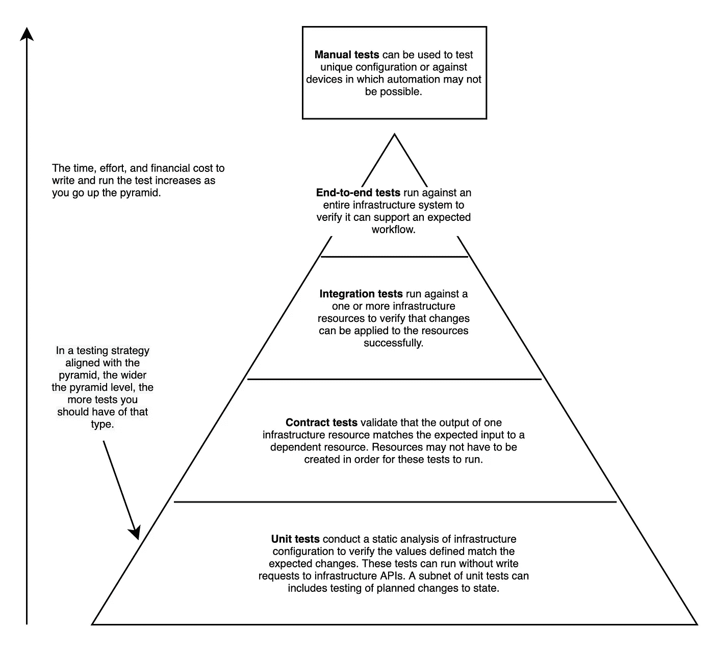
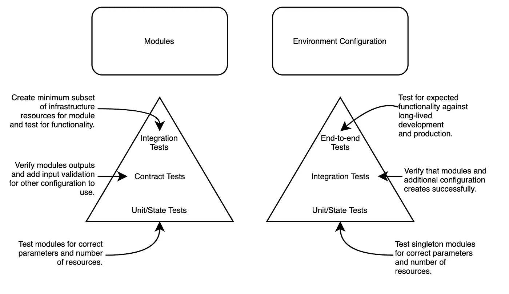

# 为基础设施选择测试

> 原文：<https://medium.com/codex/choosing-tests-for-infrastructure-80940603b8b5?source=collection_archive---------13----------------------->

## 引用

## *摘自* [*基础设施作为代码、*](https://www.manning.com/books/infrastructure-as-code-patterns-and-practices?utm_source=medium&utm_medium=referral&utm_campaign=book_wang_essential_5_14_21) *模式和实践作者 Rosemary Wang*

*本文讨论了基础设施的测试策略。*

*如果您是一名系统管理员或软件工程师，熟悉 Python、Terraform 等供应工具的基础知识，以及 Google Cloud Platform 等公共云提供商，并希望了解更多有关如何测试基础设施的信息，请阅读本书。*

通过在[manning.com](https://www.manning.com/books/infrastructure-as-code-patterns-and-practices?utm_source=medium&utm_medium=referral&utm_campaign=book_wang_essential_5_14_21)的结账处将 **fccwang** 输入折扣代码框，将*模式和* [*基础设施作为代码*、模式和惯例](https://www.manning.com/books/infrastructure-as-code-patterns-and-practices?utm_source=medium&utm_medium=referral&utm_campaign=book_wang_essential_5_14_21)打八五折。

从单元测试到端到端测试，是否需要编写基础设施中最常见的测试？你应该把时间和精力花在哪里？您的*基础设施测试策略*将根据您系统的复杂性和增长而发展。因此，您将不断评估哪些测试将有助于您在生产之前发现配置问题。

图 1 中的 ***测试金字塔*** 为不同类型的测试、它们的范围和频率提供了一个框架。金字塔最宽的部分表明你应该有更多的这种类型的测试，最窄的部分表明你应该有更少的。金字塔的顶端是端到端测试，这可能会花费更多的时间和金钱，因为它们需要主动的基础设施系统。金字塔的底部是单元测试，它在几秒钟内运行，不需要整个基础设施系统。我使用测试金字塔作为考虑基础设施测试策略的指南。

图一。基于测试金字塔，你应该有比端到端测试更多的单元测试，因为它在运行它们的时间、金钱和资源方面花费更少。

实际上，您的测试金字塔可能更像一个矩形或梨形，有时会缺少层次。你*不会也不应该*为每种基础设施配置编写每种类型的测试。在某种程度上，测试变得多余，维护起来不切实际。根据您想要测试的系统，坚持理想中的测试金字塔可能是不实际的。

我遵循图 2 中的指导方针来编写配置和模块的测试。总的来说，我写道:

*   使用工厂、构建器和原型模式对模块进行静态分析(单元和契约测试)和集成测试
*   单元测试和动态分析(集成和端到端),使用应用于环境的通用组合或单例模式进行配置

图二。根据您编写的是模块还是环境配置，您的测试方法应该有所不同。

当针对工厂、构建器或原型模块运行测试时，关注单元或契约测试，以强制执行正确的配置、正确的模块逻辑以及特定的输入和输出。根据开发环境的成本，您可以编写一些针对临时基础设施资源运行的集成测试，并在测试结束时删除这些资源。或者，如果您的模块单独处理一些最终用户功能，您可以为模块编写端到端测试。通过投入一些时间和精力为具有许多输入和输出的模块编写测试，您可以确保更改不会影响上游配置，并且模块可以自己成功运行。

与模块不同，应用于环境的复合或单一基础设施配置不涉及契约测试。相反，集成测试通常可以确定您是否正确地使用了工厂、构建器或原型模块。基础设施配置测试策略需要端到端测试，以确定最终用户是否可以使用基础设施系统。在将变更投入生产之前，您通常会针对长期开发环境运行集成和端到端测试。

这个节选就说到这里。

如果你想了解这本书的更多信息，你可以在曼宁的 liveBook 平台[这里](https://livebook.manning.com/book/patterns-and-practices-for-infrastructure-as-code?origin=product-look-inside)查看。