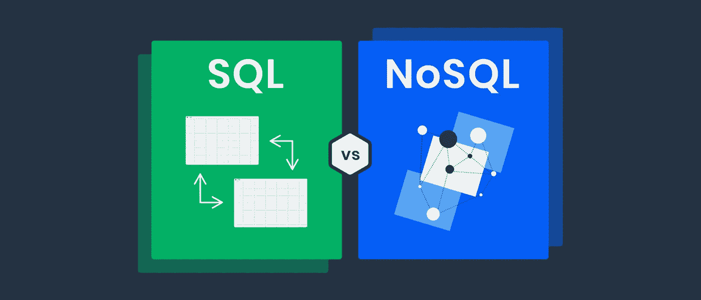
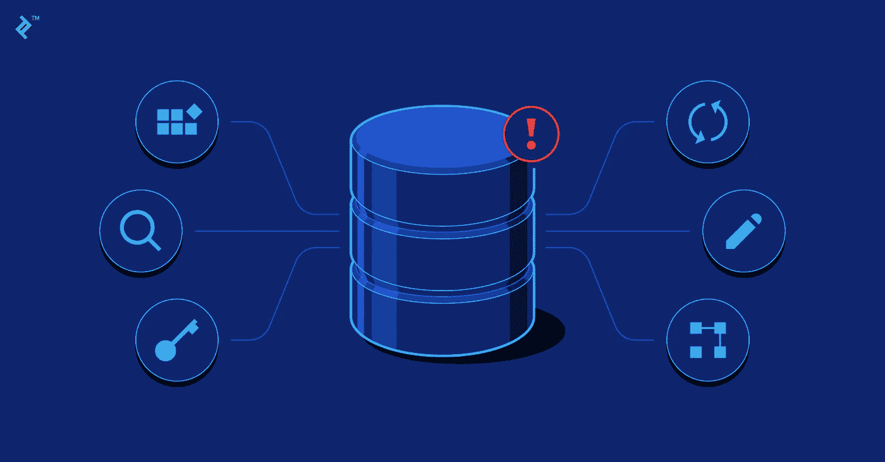
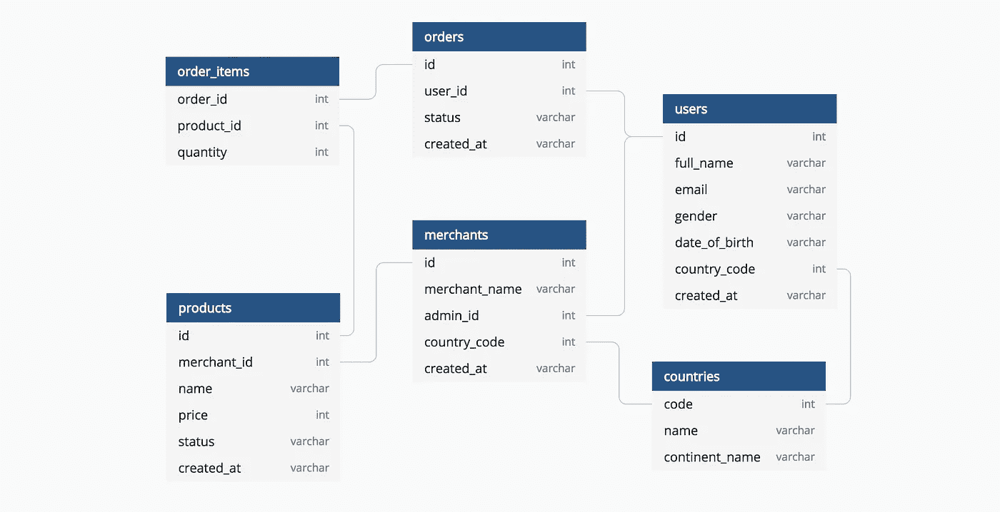
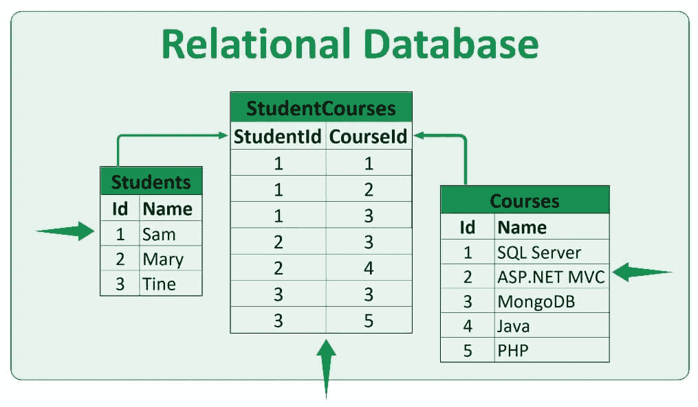
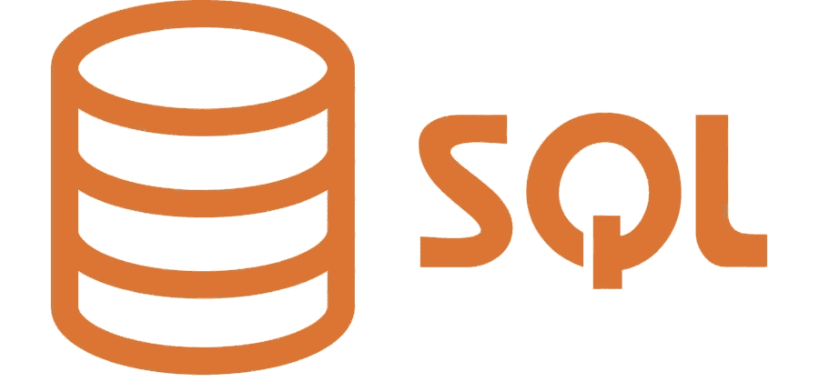
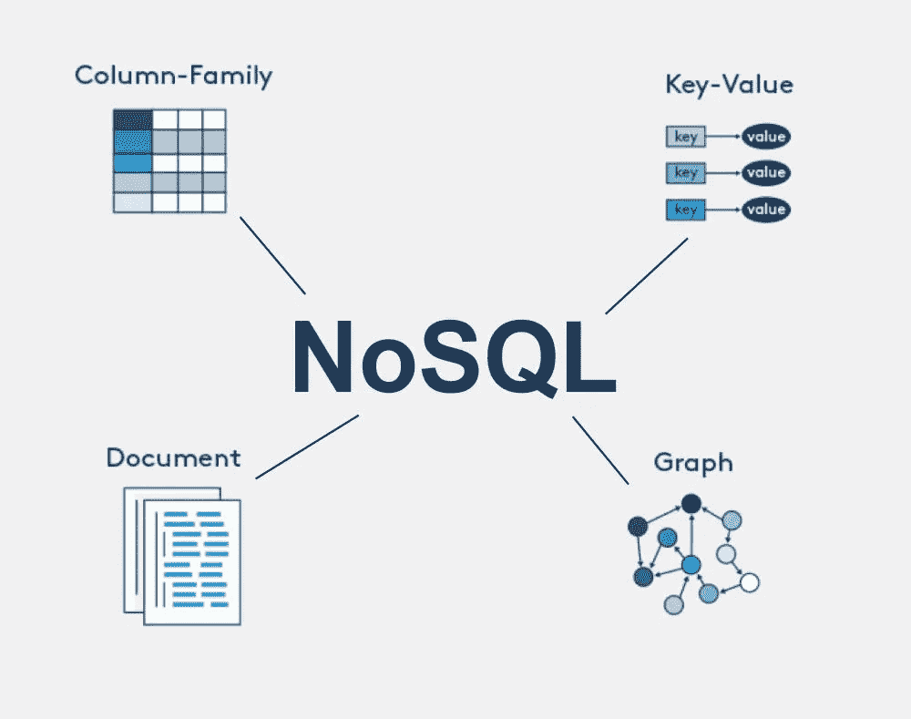

# 选择最佳数据库:SQL 与 NoSQL

> 原文：<https://medium.com/codex/choosing-the-best-database-sql-vs-nosql-a816a7ec09fc?source=collection_archive---------8----------------------->

作者:anshul vyas

# 介绍

就如何在组织中实施和维护数据密集型应用程序做出许多决策是非常重要的。作为应用程序数据存储和交付流程的一部分，最大的决策之一是确定最佳平台。过去，SQL 数据库保护和确保数据完整性的能力使大多数组织选择了 SQL 数据库。由于互联网和云技术的兴起，NoSQL 数据库越来越受组织的欢迎，这在很大程度上是因为它们可以更好地处理非结构化和半结构化数据。

尽管这种趋势已经出现，但许多 IT 团队仍然管理着传统的工作负载和他们的现代应用程序，而且并不总是清楚哪种类型的数据库系统是最好的— SQL 还是 NoSQL。就它们如何构建、如何存储数据以及应用程序如何访问数据而言，它们各有利弊。对这些差异有一个清晰的理解是一个组织在现在和未来做出正确选择的关键。

# 什么是数据库？

信息被组织成数据库或数据，它们通常作为结构化数据存储在计算机系统中。数据库通常由数据库管理系统(DBMS)控制。作为一个整体，数据和 DBMS，以及与之相关的应用程序，构成了一个数据库系统，或简称为数据库，通常简称为数据库。

一系列表格通常以行和列的形式建模，以便在当今运行的最常见类型的数据库中进行有效的处理和数据查询。大多数数据库使用结构化查询语言(SQL)来编写和查询数据，以便可以轻松地访问、管理、修改、更新、控制和组织它们。

# 数据库设计

如果您的数据库设计合理，您将可以访问最新的准确信息。因此，学习良好设计的原则是一项值得的投资，因为正确的设计对于在使用数据库时实现目标至关重要。最终，您更有可能拥有一个满足您需求且易于适应的数据库。数据库设计过程由一组原则指导。其中之一是重复数据(也称为冗余数据)是不好的，因为它浪费空间并导致错误和不一致。第二，信息要准确完整。

如果您的数据库包含不正确的信息，它将包含不正确的信息，因此它从中提取的任何报告也将包含不准确的信息。因此，基于这些报告做出的任何决定都是不正确的。为了减少冗余数据，良好的数据库设计将信息划分到基于主题的表中，它提供对必要信息的访问，以便可以将表中的信息连接在一起，满足您的数据处理和报告需求，同时支持信息的准确性和完整性。满足您的数据处理和报告需求，同时支持信息的准确性和完整性。

# 数据库管理系统

这个系统基本上是一个管理数据库的计算机化数据保存系统。用户可以通过多种方式操作或管理包含在这种数据库中的信息。他们可以操作数据库中包含的信息，或者从整体上管理数据库结构。数据库管理系统(DBMS)是根据它所包含的数据结构或类型来分类的。

有几种类型的数据库可供使用:层次数据库、网络数据库或关系数据库。

在大型机站点中，如果特定的数据结构(不是特定的数据值)相对静态，通常会使用分层模型。在物料清单(BOM)数据库结构中，通常有几个包含子组件的组件级别，以及高级组件零件号。该结构通常还包括组件预测、成本和定价信息。BOM 应用程序中的数据结构很少改变，新的数据元素(不是值)很少被识别。在应用程序中，组件零件号位于顶部，随后是组件详细信息。

层次数据库系统和关系数据库系统有许多共同的优点。除了 RDBMS 是不可导航的这一事实之外，层次数据库要求应用程序程序员知道数据库的结构是可导航的。程序必须包含将用户从根段引导到所需子段的逻辑，子段包含所需的属性或元素。

# 关系数据库

关系数据库存储并提供对彼此相关的数据点的访问。在关系数据库中，每一行都是一条具有唯一标识或键的记录，称为键。关系数据库基于关系模型，这是一种在表中表示数据的简单方法。数据属性存储在表的列中，每个记录的每个属性通常都有一个值，因此很容易确定数据之间的关系。关系数据库基于逻辑数据结构(数据表、视图和索引)与物理存储结构分离的概念。这样，数据库管理员能够管理数据的物理存储，而不影响对数据的逻辑访问。

此外，数据库操作是明确定义的操作，允许应用程序操作数据库的数据和结构，这也被定义为逻辑和物理概念。例如，重命名数据库文件不会重命名它所保存的表。应用程序用逻辑运算指定它们需要什么内容，用物理运算执行任务。为了确保数据总是准确和可访问的，关系数据库遵循某些完整性规则。为了消除错误信息进入数据库的可能性，完整性规则可以规定表中不允许出现重复行。

# 非关系数据库

非关系数据库(也称为 noSQL 数据库)不需要表、字段或记录。尽管 NoSQL 数据库早在 20 世纪 60 年代就已经存在，但 NoSQL 一词是在 20 世纪 90 年代末或 21 世纪初创造的。它们不同于 SQL 数据库，操作方式也不同。它们旨在处理半结构化和非结构化数据。与表不同，NoSQL 数据库由存储在文件夹中的文件组成。它们能够存储 JSON、XML 和其他类型的数据。因此，在 NoSQL 创建和管理数据更简单。使用非关系数据库管理系统来组织大量复杂多样的数据是很常见的。例如，一家大型商店可能有一个数据库，其中包含每个客户的所有信息，从他们的姓名和地址到他们的订单历史和信用卡详细信息。然而，所有这些信息都可以存储在同一个文档中，尽管它们的格式不同。

因为查询不需要像关系数据库经常做的那样查看大量的表来获得响应，所以非关系数据库管理系统通常比关系数据库更快。因此，非关系数据库适合于存储频繁变化的数据或处理许多不同类型数据的应用程序。除了允许快速更改和容纳大量复杂的非结构化数据，它们还可以用于支持快速开发的应用程序。

# 结构化查询语言(SQL)

通常，结构化查询语言用于关系数据库或数据流管理系统。它由 IBM 在 20 世纪 70 年代初推出，并被国际标准化组织(ISO)和美国国家标准协会(ANSI)认可为官方标准。多年来，SQL 一直是数据库用户的热门选择，因为它易于使用，并且在通过一系列方法查询、操作、聚集和转换大量结构化数据为有意义的信息方面非常有效。

除了 MySQL、Oracle、Sybase、SQL Server、Postgres 等众多商业数据库产品，也是因为这个原因被纳入其中。由于缺乏 SQL 编程，许多非关系数据库，包括 MongoDB 和 DynamoBD，都被称为 NoSQL 产品。不同 SQL 版本中用于关键操作的语法可能会有所不同，但 select、insert、update 和 create 等基本命令通常是相同的。以这种方式使用 SQL 允许对该语言有基本理解的个人在许多不同的环境中工作并执行广泛的任务。

# 无结构化查询语言(NoSQL)

NoSQL 数据库，最初称为非 SQL 或非关系数据库，提供了一种存储和检索数据的机制。数据的建模方式不同于关系数据库的表格关系。NoSQL 数据库自 20 世纪 60 年代末就已经存在，但直到世纪之交才开始流行。实时 web 应用程序和大数据使用 NoSQL 数据库，并且它们的使用正在增加。由于它们支持类似 SQL 的查询的能力，NoSQL 系统有时不仅仅被称为 SQL。除了设计简单之外，NoSQL 数据库还可以横向扩展到机器集群，并具有更好的可用性控制。

默认情况下，NoSQL 数据库使用与关系数据库不同的数据结构，这使得一些操作更加高效。有许多适合解决特定问题的 NoSQL 数据库。许多 NoSQL 存储为了可用性、速度和分区容差而牺牲一致性，为了 NoSQL 数据库使用的 NoSQL 数据库结构。它们有时被认为比关系数据库表更灵活。缺乏标准化界面、低级查询语言以及对现有关系数据库的巨额投资是 NoSQL 商店被更多采用的障碍之一。一些数据库，如 MarkLogic、Aerospike、FairCom c-treeACE、Google Spanner(虽然技术上是一个 NewSQL 数据库)、Symas LMDB 和 OrientDB，已经将真正的 ACID 事务作为其设计的核心。大多数 NoSQL 商店不提供真正的酸交易。

一旦更改传播到 NoSQL 数据库中的所有节点，数据查询就会导致向所有节点返回不正确的数据，因为最终一致性是数据库更改传播到所有节点的概念。这个问题被称为过时读取。在某些 NoSQL 系统中，数据也可能因写入失败和其他因素而丢失。为了防止这种情况，一些 NoSQL 系统提供了像预写日志这样的概念。当使用多个数据库处理分布式事务时，数据一致性成为一个更大的挑战。很少有系统能够为分布式事务处理同时维护 X/Open XA 标准和 ACID 事务。目前，即使是关系数据库也不能跨数据库引用完整性约束。

# SQL 与 NoSQL

## 1.数据结构

**A. SQL**

在 SQL 数据库中，数据是规范化的，表之间的关系是标准化的，这使得 SQL 数据库非常适合处理高度结构化的信息。

**B .没有 SQL**

使用 NoSQL 开发的数据结构不需要标准化或遵循关系模型，但足够灵活，可以适应多种模型，包括键值、文档、面向列和图形。

## 2.语言

**A. SQL**

有几种类型的关系数据库产品支持 SQL 语言。但是，大多数都包含该语言的增强版本，以适应特定于产品的功能，如 SQL Server 的 Transact-SQL (T-SQL)。然而，所有 SQL 数据库都支持一些核心语言元素。

**B .没有 SQL**

在 NoSQL 的数据库中，没有锁定语言。例如，MongoDB 以 JSON 格式存储所有文档，查询用 JavaScript 编写。使用的语言取决于 NoSQL 数据库的类型、实现和具体操作。

## 3\. (计划或理论的)纲要

**A. SQL**

SQL 数据库必须包含一个预定义的模式，该模式指定应该如何配置表以及应该如何存储数据。这种严格的结构确保了数据完整性并优化了存储，但限制了灵活性。

**B .没有 SQL**

NoSQL 数据库的动态模式允许将具有不同字段的文档添加到同一个数据库中，而不必担心数据结构。

## 4.数据完整性

**A. SQL**

由于其原子性、一致性、隔离性和持久性(ACID)原则，SQL 数据库提供了高度的数据完整性，这在支持金融交易时至关重要。

**B .没有 SQL**

尽管有基本的可用性、软状态和最终一致性原则，但 NoSQL 数据库提供的数据完整性不如 SQL 数据库，这意味着分布式环境中的数据可能暂时存在不一致。

## 5.可量测性

**A. SQL**

纵向扩展 SQL 数据库很容易，因为可以添加 CPU 和内存等资源。另一方面，SQL 数据库在水平伸缩方面不是很有效，所以它们对于大型分布式数据库来说并不理想。

**B .没有 SQL**

尽管 NoSQL 数据库可以容纳大量的分布式数据，但是它们可以跨不同的系统和位置非常有效地进行横向扩展。

## 6.询问

**A. SQL**

SQL 数据库可以快速处理复杂的查询，并且能够跨表连接数据，这使得它非常适合对结构化数据执行即席查询。

**B .没有 SQL**

随着查询复杂性的增加，在 NoSQL 数据库中查询数据通常会更加复杂，因为它们在产品之间缺乏一致性。

## 7.成熟

**A. SQL**

基于 SQL 的数据库是使用成熟的技术构建的，这些技术是众所周知的，并得到广大开发人员的广泛支持。

**B .没有 SQL**

NoSQL 产品还有很长的路要走，因为这些技术不像 SQL 产品那样受支持，但 NoSQL 技术公司正在迅速进入该行业，其软件开发人员社区每天都在增长。

# 用例

## 结构化查询语言

如果您需要执行动态操作，例如财务事务，您可以选择 SQL 数据库。NoSQL 不能保证酸性。如果您需要进行复杂和动态的查询和报告，应该避免使用 NoSQL。NoSQL 只有有限的查询能力，所以您应该只选择 SQL。此外，如果您的应用程序需要运行时灵活性，则不应使用 NoSQL。如果一致性是必须的，并且数据量没有重大变化，那么最好使用 SQL 数据库。

## NoSQL

SQL 的价值在于它保证数据有效性的能力，但是当快速的数据可用性更重要时，NoSQL 表现出色。此外，它非常适合那些需求不断变化、需要扩展的公司。它灵活、易于使用，并且具有很高的性能。当处理大型(或不断变化的)数据集、灵活的数据模型或不适合关系数据库模型的需求时，NoSQL 也是一个不错的选择。

在处理大量非结构化数据时，最好使用文档数据库(例如 CouchDB、MongoDB 和 Amazon DocumentDB)。当您需要一个没有强完整性保证的键值存储时，Redis 是一个不错的选择。如果你需要对大量数据进行复杂或灵活的搜索，ElasticSearch 是理想的选择。就可伸缩性而言，NoSQL 数据库比其他数据库有明显的优势。

与 SQL 不同，由于它们的分片和高可用性要求，它们允许水平扩展。此外，NoSQL 数据库，如脸书开发的 Cassandra，可以处理分布在许多服务器上的大量数据，确保最大限度的可用性和无单点故障。包括亚马逊、谷歌和网飞在内的几家大公司依赖 NoSQL 系统，因为它们处理大量不适合关系数据库的数据。一般来说，NoSQL 更适合大型数据集。

# 结论

尽管以这种方式比较 SQL 和 NoSQL 数据库很方便，但它们之间并不总是有那么多明显的差异。供应商们一直在稳步地给他们的产品增加功能，使它们更通用。此外，MongoDB 现在支持多文档 ACID 事务，MySQL 现在支持原生存储和验证 JSON 文档。在这里，我们了解了 SQL 和 NoSQL 之间的差异以及它们之间的区别。数据库的选择取决于多种因素，包括数据量、多样性和业务需求。