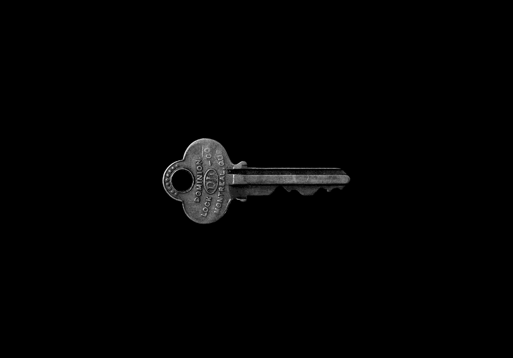

# Chrome 可能会泄露你的用户密码

> 原文：<https://medium.com/codex/chrome-might-be-leaking-your-users-passwords-2d61f27b8c17?source=collection_archive---------7----------------------->

马特·阿特兹在 [Unsplash](https://unsplash.com?utm_source=medium&utm_medium=referral) 上拍摄的照片

几周前，otto-js 发表了一篇文章，内容是关于谷歌 Chrome 实现谷歌“增强拼写检查”的一个令人担忧的发现。事实上，这也影响了任何不让 Chromium 使用这一功能的浏览器，包括微软 Edge。让我们来分解这个问题，它的范围，以及我们如何在我们自己的网站中解决这个问题。

# **拼顶起**