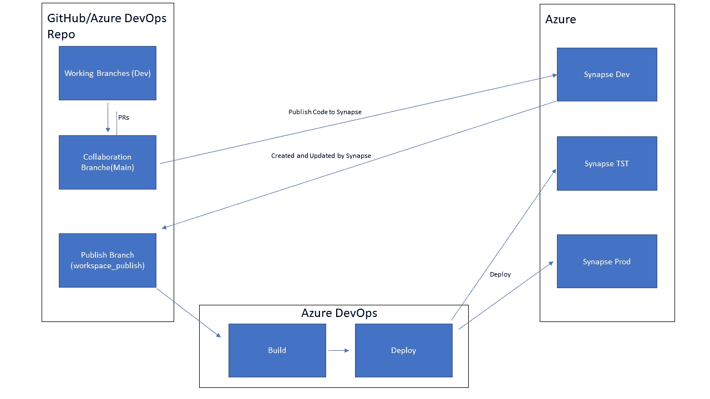

# Azure Synapse 分析管道与 Azure DevOps yaml 管道的 CI/CD(第 1 部分)

> 原文：<https://medium.com/codex/ci-cd-for-azure-synapse-analytics-pipelines-with-azure-devops-yaml-pipelines-ef0933b4ac4a?source=collection_archive---------3----------------------->

在这个小故事中，我将向您展示如何使用 Azure DevOps 实现 Synapse Analytics CI/CD 管道。这也非常类似于 Azure Data Factory 的方法，但不是 100%相同。

丹尼尔·肖斯塔克在 [Unsplash](https://unsplash.com?utm_source=medium&utm_medium=referral) 上拍摄的照片

*与此同时，有一种新的更好的方法来实现本文的目标，你可以在这里找到更多详细信息* [*新方法——使用 Azure DevOps yaml 管道的 Synapse 分析管道的 CI/CD(第 1.1 部分)|作者 Stefan Graf | 2023 年 2 月| Medium*](https://graflinger.medium.com/new-approach-ci-cd-for-synapse-analytics-pipelines-with-azure-devops-yaml-pipelines-part-1-1-b7f73255bab5)

## 背景

在我们开始之前，我们需要澄清一些关于 CI/CD 管道如何工作的基本概念。这将是 Synapse Analytics 提供的 Azure 回购集成的基础。这使我们能够将 Synapse 工作区连接到 Azure DevOps 或 GitHub(企业)repos。

您所需要做的就是通过提供关于您的回购的基本信息来创建 git 连接，然后您就可以开始了。这种 Git 集成将取代标准的“Synapse live”代码管理。此外，您需要定义两个不同的分支，协作分支(很可能是您的主分支，您的代码的最新稳定版本位于其中)和发布分支(默认情况下称为 workspace_publish，这是一个由系统自动创建的分支，您的代码以 ARM 模板样式的方式位于其中)。

但是要注意，根据[微软文档](https://docs.microsoft.com/en-us/azure/synapse-analytics/cicd/continuous-integration-delivery)，Synapse 不再是像 ADF 那样的纯 ARM 模板。这意味着我们必须使用另一种方式来部署它，因为简单地部署 ARM 模板将不再有效。

## CI/CD 方法

如何使用 Azure Synapse 处理 CI/CD 的方法与您的标准方法有很大不同。唯一可以用来部署代码的分支是发布分支(workspace_publish)。在您完成任何更改后，当您在 Synapse UI 中按下 publish 时，将会创建/更新该分支。

实际的工作分支是协作分支(主分支)，其中集成了所有的拉请求以实现新的特性。这也是你自动化出版的基础。

CI/CD 概念突触

# Azure DevOps yaml 管道

## 海峡群岛

构建工作已经基本完成，因为一切都已经准备好作为部署就绪的解决方案。这就是为什么你只需要为了可追溯性和可重用性的目的而打包你的代码。

## 激光唱片

这个任务也非常简单，因为您可以使用一个名为“Synapse workspace deployment@2”的预定义任务。在这里，您只需要插入您的目标 Synapse 工作区，通过服务连接(订阅)进行身份验证。此外，你需要打开你的触发器来进行一个干净的构建，但是在 Azure DevOps 中也有一个预构建任务可以使用，名为“toggle-triggers-dev@2”。

## CI/CD 放在一起

现在两者都放在一个完全工作的 yaml 管道中。请记住，windows vm 是必需的，因为我们正在使用的这些预定义任务是基于 Powershell 脚本的，对我来说，这些脚本在 Ubuntu 机器上不工作。当一个新的 Synapse 模板发布到我们的发布分支时，触发器总是被触发。

请记住，这里的一切都发生在我们的 workspace_publish 分支中。这意味着您的管道也需要从这个分支手动启动。

## 结论

这个故事应该使您能够以一种更稳定的方式使用 Synapse，并在后台运行 CI/CD 管道。