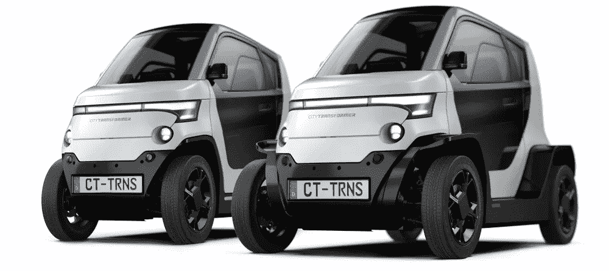

# 城市变压器的 CT-1:拓展交通的未来

> 原文：<https://medium.com/codex/city-transformers-ct-1-expanding-on-the-future-of-transportation-91bc1b3e0ee1?source=collection_archive---------7----------------------->

## 城市交通的可能性很大！

[CT-1(城市变压器媒体)](https://static.wixstatic.com/media/05766b_0f50d221a545407fabede4a2f18e8f4a~mv2.png/v1/fill/w_1000,h_446,al_c,q_90,enc_auto/CT.png)

[城市变形金刚](https://www.citytransformer.com/)，城市交通游戏中的新玩家，正在用其创新的 CT-1 交通工具改变事物。CT-1 是一款封闭式双座串联式汽车，与[雷诺双人组](/codex/introducing-the-renault-duo-the-tandem-city-ev-3952f4ac13f5)没有什么不同，旨在取代自行车和踏板车成为…