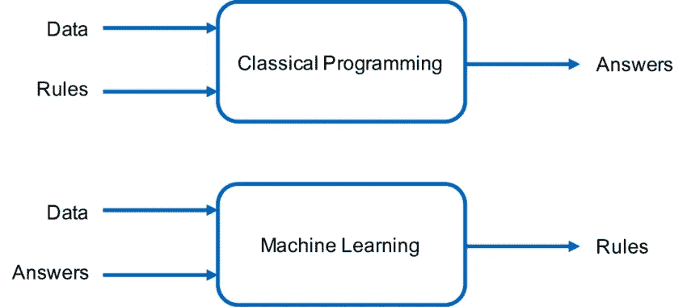

# 用通俗易懂的英语讲述经典编程与机器学习

> 原文：<https://medium.com/codex/classical-programming-vs-machine-learning-in-plain-english-3f39c56673d9?source=collection_archive---------12----------------------->

# “垃圾邮件检测”示例

> ***挑战:*你会如何把一个技术概念教给一个没有任何相关经验的朋友？**

在这篇短文中，我试图用垃圾邮件检测的例子来解释 ***监督机器学习*** 与**经典编程**的区别。

🎥还有，这里有这篇文章的视频版本:[https://youtu.be/AWvJ1pt8CxQ](https://youtu.be/AWvJ1pt8CxQ)

# 我们为什么需要机器学习？

我的许多同事问我，为什么围绕机器学习有这么多炒作。经典编程还不够好吗？有什么简单的例子可以证明机器学习优于传统编程的必要性？🤔

这就是为什么我决定写一篇**简单的**博文来用简单的英语解释什么是**机器学习**以及它与经典编程有何不同。

经典编程与机器学习

这张图片总结了经典编程和机器学习之间的核心概念差异。

我用一个**熟悉的例子来解释一下。**

假设我们想写一个程序来识别一封电子邮件是否是垃圾邮件。📧

在经典编程中，我们需要**电子邮件数据**和一套规则来对电子邮件进行分类。因此，我们需要聘请一位人类专家来确定能够识别垃圾邮件的规则。

例如，如果一封电子邮件包含“你是大赢家”或“我想给你钱”这样的短语，这样的规则可能是。另一种情况可能是，如果一封电子邮件来自一个未知的发件人，并谈到一个王子和他的巨额财富，他想与你分享，或者如果电子邮件有多个收件人在世界各地。

你说到点子上了！

💡基本上，我们需要从邮件中提取特定的特征(这些特征在 ML 术语中称为 ***特征*** )，并将我们的自定义规则应用于它们。

这些**规则**结合起来可能能够将一封电子邮件归类为垃圾邮件。但是很明显，这些规则的**手动生成**是一个复杂而痛苦的过程，因为它需要人类专家来开发它们，并且最终，我们无法确定每个规则的重要性以及我们程序的最终性能。

这就是**机器学习发挥作用的地方。**🤖

机器学习程序也是建立在数据之上的，但最核心的区别是我们事先不需要任何规则。相反，我们需要一组**预先分类的电子邮件**来使用它们训练一个机器学习模型。在训练阶段之后，机器学习模型将开发出**自己的** **规则**，它将能够自动识别一封电子邮件是否是垃圾邮件。

**综上**，经典编程和机器学习都需要数据。但主要的区别在于，**人类**必须开发经典编程中的规则，而在 ML 中，**机器**可以根据注释的数据生成规则。

非常感谢！下一场见！

# 取得联系

我希望你喜欢这篇文章。如果你有任何问题或者只是想介绍一下自己，请不要犹豫，随时联系我们！

我的名字是**Panos(Panagiotis)Papaemmanouil，**这是我的联系方式。

*   📧[papaemman.pan@gmail.com](mailto:papaemman.pan@gmail.com)
*   💬[https://www.linkedin.com/in/panagiotis-papaemmanouil/](https://www.linkedin.com/in/panagiotis-papaemmanouil/)
*   🌐 [https://dataminds.gr](https://www.dataminds.gr/)