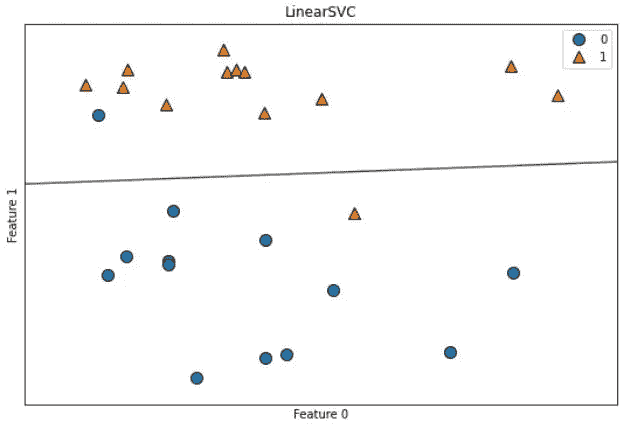
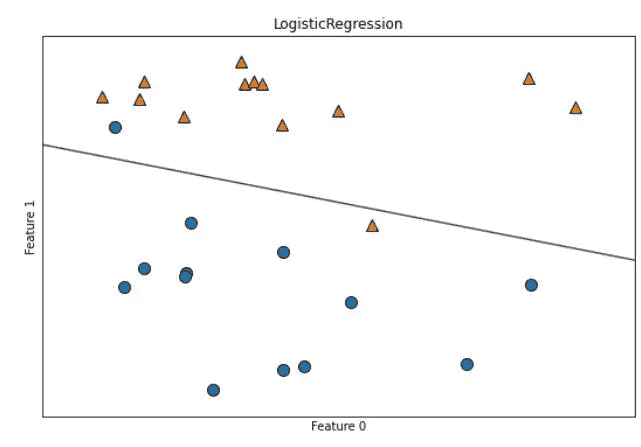
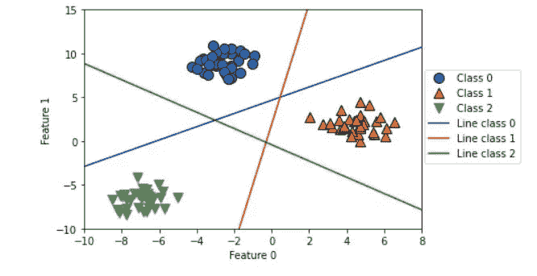

# 机器学习中使用线性模型的分类和正则化。

> 原文：<https://medium.com/codex/classification-and-regularization-using-linear-models-in-machine-learning-1554282ffd84?source=collection_archive---------5----------------------->

在这篇博客中，我们将讨论如何应用线性模型来解决机器学习中的分类问题。首先，我们将讨论二元分类，然后我们将在稍后讨论多类分类。

用于进行预测的二元分类的数学公式如下所示

ŷ= x[0]* z[0]+x[1]* z[1]+…+x[p]* z[p]+b > 0

该公式与线性回归中使用的公式非常相似，但这里只返回要素的加权和。在二元分类中，预测值的阈值被认为是零。如果该函数小于零，则该类被预测为-1，如果该函数大于零，则该类被预测为+1。这个通用规则用于所有线性模型的分类。

决策边界是输入的线性函数，这意味着线性二元分类器使用线、平面或超平面来分离两个类别。用于学习线性模型的算法主要不同于它们测量系数和截距的特定组合拟合训练数据的程度的方式，以及它们使用什么类型的正则化参数。

不同的算法遵循不同的技术来衡量如何很好地适应训练集。由于数学上的复杂性，不可能总是调整“x”和“z”来减少算法产生的错误分类的数量。对于许多应用来说，对称为损失函数的项目“1”的不同选择并不重要。

两种最常用的线性分类算法是逻辑回归和线性支持向量机。逻辑回归是一种分类算法，而不是回归算法，尽管顾名思义如此。

线性 SVM 的判定边界

逻辑回归的决策边界

位于黑线之上的任何新数据点将被分类为 1 类，而位于黑线之下的任何点将被分类为 0 类。

现在我们将讨论一下使用线性模型的多类分类。

将二进制分类算法扩展到多类分类算法的一种常用方法是 one-vs-rest 方法。这意味着，为每个试图将该类从所有其他类中分离出来的类学习二进制模型，从而产生与类一样多的二进制模型。因此，为了进行预测，所有二元分类器都在一个测试点上运行。单个类别中得分最高的分类器胜出，该类别标签作为预测值返回。

如果每个类有一个二元分类器，那么每个类就有一个系数向量(x)和一个截距(b)。此处给出的分类置信度公式的结果是最高指定类别标签的类别，如下所示—

x[0]* z[0]+x[1]* z[1]+…+x[p]* z[p]+b

多类逻辑回归背后的数学原理不同于“一对其余”方法，但它们也会为每个类生成一个系数向量和截距，并且使用相同的预测方法。

多类分类的决策边界

看看我的 jupyter 笔记本[这里](https://www.kaggle.com/salmaneunus/classification-and-regularization-in-linear-models)看看使用线性模型的二进制分类器的代码实现。

正如您将在上述代码中看到的，线性模型的主要参数是正则化参数，在回归模型中称为 alpha，在线性支持向量机和逻辑回归模型中称为 C。当α的值很大而 C 的值很小时，它指的是一个相当简单的线性模型。此外，对于回归模型，调整这些参数是非常重要的。在大多数情况下，C 和 alpha 是在对数标度上搜索的。我们需要做的另一个重要决定是我们是否要使用 L1 或 L2 正则化。如果你认为只有几个特性是重要的，你可以使用 L1，否则你应该默认使用 L2。如果模型的可解释性很重要，L1 有时也是有用的。因为 L1 将只使用少数几个特征，所以更容易描述哪些特征对模型是重要的，以及这些特征的效果是什么。

此外，在我们结束这篇博客之前，你必须知道线性模型训练速度非常快，预测速度也非常快。它们可以扩展到非常大的数据集，并且可以很好地处理稀疏数据。如果您的数据由成千上万或数百万个样本组成，您可能希望使用 LogisticRegression 和 Ridge 中的 solver='sag '选项进行调查，这可能比大型数据集的默认选项更快。其他选项有 SGDClassifier 类和 SGDRegressor 类，它们实现了更具可伸缩性的线性模型版本。线性模型的另一个优势是，它们相对更容易理解如何使用我们在上面看到的分类公式进行预测。当特征数量与样本数量相比较大时，线性模型通常表现良好。它们还经常用于非常大的数据集，因为训练其他模型是不可行的。但是，在低维空间中，其他模型可能会产生更好的泛化性能。