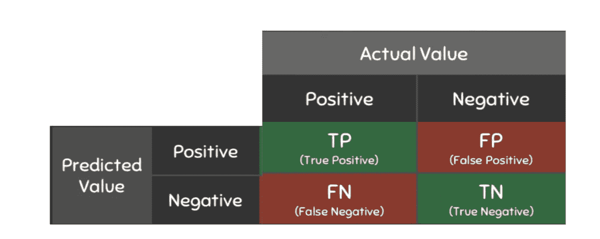

# 分类指标

> 原文：<https://medium.com/codex/classification-metrics-d869e44dd93?source=collection_archive---------9----------------------->


照片由 [Unsplash](https://unsplash.com?utm_source=medium&utm_medium=referral) 上的 [Fotis Fotopoulos](https://unsplash.com/@ffstop?utm_source=medium&utm_medium=referral) 拍摄

在常规世界中，准确度和精确度通常是可以互换的——但在机器学习方面却不是这样。准确度和精确度是用于模型评估的非常重要的指标，它们与召回率和 F1 一起构成了著名的**分类指标**。

一个**混淆矩阵**是最好的工具，可以用来完全理解为什么这四个度量对于模型评估如此重要。它看起来是这样的:



信用:[https://www . kdnugges . com/2020/04/performance-evaluation-metrics-classification . html](https://www.kdnuggets.com/2020/04/performance-evaluation-metrics-classification.html)

如果你很困惑，不要着急。很正常。这个矩阵实际上是两个表合并成一个，一个表显示预测值，另一个表显示实际值。合并两个表的结果是真阳性、真阴性、假阳性和假阴性。以下是它们各自的含义:

1.  真正值(TP):预测值和实际值都是正值。
2.  真负值(TN):预测值和实际值都是负值。
3.  假阴性(FN):实际值为正，但预测值为负。
4.  假阳性(FP):实际值为负，但预测值为正。

如您所见，该矩阵不仅有助于测量预测模型的性能，还可以显示对哪些类预测不正确或正确以及错误发生在哪里的洞察。既然我们对混淆矩阵有所了解，让我们看看它是如何帮助定义分类度量的。

# **精度**

准确度是正确预测总数(TP + TN)除以预测总数(TP + TN + FN + FP)的度量。也可以写成方程式。

```
Accuracy = (TP + TN) / (TP + TN + FN + FP)
```

**我们为什么要计算准确度？**

当所使用的数据是均匀且平衡的时，计算精度是有用的，但对于不平衡的数据是无用的。例如，如果我们有一个由 100 张图片组成的训练数据集，其中有 99 张老虎图片和 1 张犀牛图片，则该模型在对老虎进行分类时的准确度为 99%，但它无法以相同的准确度对犀牛进行分类。

# 精确

Precision 测量真阳性(TP)与所有预测阳性(TP+FP)的比率。因此，精度低意味着在所有的正预测中，只有少数是真的正预测，而精度高意味着大量的预测是真的正预测。它可以表示为一个等式:

```
Precision = TP/TP+FP
```

因为 precision 计算所有预测阳性中的真阳性数，所以它很适合不平衡的数据，因为它根据所有预测阳性中的真阳性给出分数。

# 回忆

召回率是对给定数据集中所有阳性结果中的真阳性(TP)的度量(TP + FN)。这有点像精度的反义词，记住它的最简单的方法是回忆查看数据集中真阳性的数量。召回率低意味着模型预测了更多的假阴性。在数学上，回忆可以用下面的等式来表示:

```
Recall = TP/TP+FN
```

计算召回率显示了数据集中所有阳性结果中有多少预测阴性是假阴性，并使其适用于不平衡数据。这也带来了评估模型时**精确召回曲线**的重要性。


精确回忆曲线

曲线下的大面积(蓝色阴影区域)意味着模型具有高精度和高召回率。具有如上图所示的精度-召回曲线的模型将被认为是“好的分类器”，这意味着它具有中等高的精度和召回分数。然而，查全率和查准率的提高是以牺牲其他指标为代价的——你不可能有很高的查全率和很高的查准率(图中的曲线就是如此)。

# **F1 比分**

我们知道精确度和召回率是不可兼得的。但是 F1 分数找到了精确度和召回率的完美结合，并且是这两个指标的**调和平均值**。但是等等…调和平均值是什么，为什么用它来计算 F1 的分数？与简单平均值不同，调和平均值*抵消了极值*。例如，如果分类器的精度为 1.0(其中 1.0 最高)，召回率为 0(其中 0 最低)，则 f 1 分数将为 0，而简单平均值将为 0.5。因此，F1 值为 0 意味着分类器要么具有高精度，要么具有高召回率，这意味着它不是很平衡。在处理不平衡数据时，这一指标尤其重要。用数学方法表示，F1 分数的等式如下:

```
F1 = 2(precision*recall/precision + recall)
```

这总结了我对分类标准的解释，以及为什么它们对模型评估很重要。我希望你喜欢这篇文章，并期待更多！

## 联系我了解详情、问题和更多信息！

嗨！我是 Tasfia Ara，10 年级学生，对机器学习和构建新项目充满热情。如果你喜欢这篇文章，可以看看我在 Medium 上的其他一些故事。有任何问题或想知道更多细节吗？请联系我:

[LinkedIn](https://www.linkedin.com/in/tasfia-ara/)

电子邮件:tasfia_ara@outlook.com