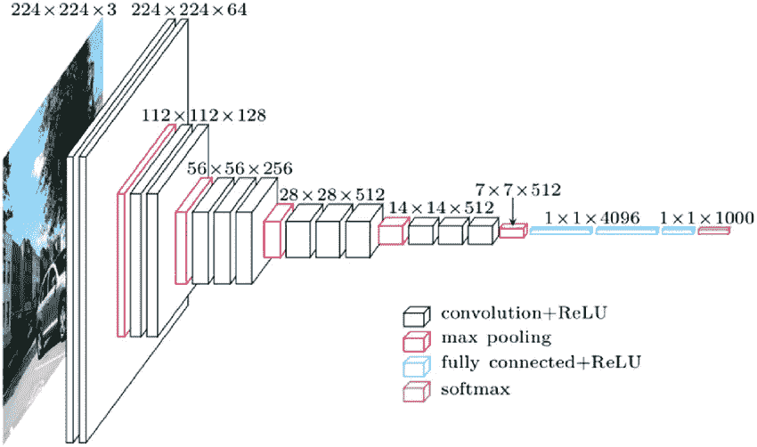
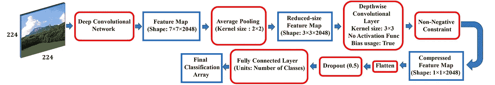
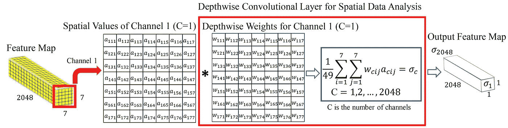
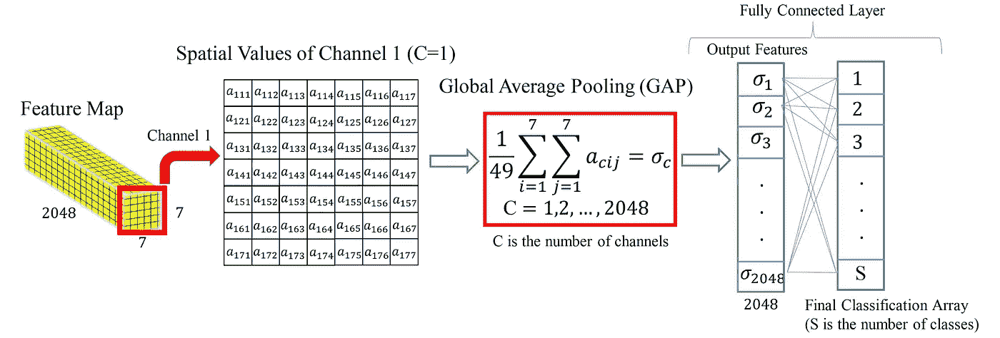
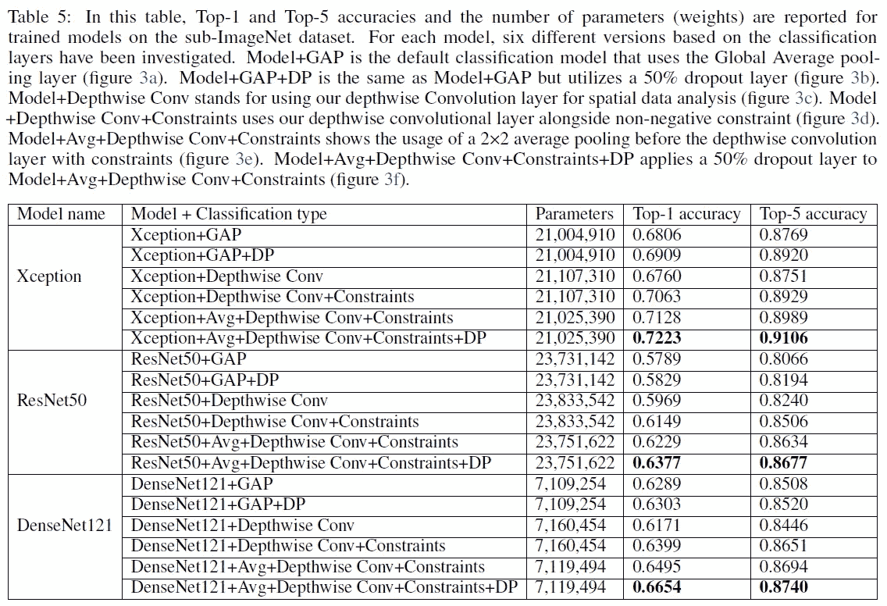
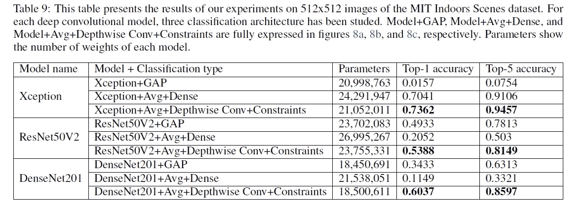

# 用 Wise-SrNet 代替全局平均池进行分类

> 原文：<https://medium.com/codex/classification-with-wise-srnet-instead-of-global-average-pooling-ccdd7c37058d?source=collection_archive---------15----------------------->

使用深度神经网络的图像分类有两个步骤:

1.  ***从输入图像中生成特征图。***
2.  ***根据生成的特征图进行分类。***

虽然特征提取是最重要的部分，并且具有更高语义值的特征图导致更准确的分类，但是通过最后几层神经网络进行分类存在一些困难。

主要问题是图像的特征图将具有很大的尺寸，例如， [**ResNet**](https://arxiv.org/abs/1512.03385) 模型从一个 ***224*224*** 图像产生一个 ***7*7*2048*** 特征图。因此，将具有此形状的要素地图提供给完全连接的图层以生成最终分类数组将显著增加模型权重的数量，尤其是当数据集中有许多类时。ImageNet 数据集包括 1000 个图像类别，因此对来自 ***7*7*2048*** 特征地图的分类部分使用全连接图层将增加 ***7*7*2048*1000=100，352，000*** 权重的模型权重数！现在，如果图像更大，权重会更大！！

> 像[**【VGG】**](https://arxiv.org/abs/1409.1556)这样的第一阶段模型使用完全连接的层来获得分类数组，这增加了几乎 **1 亿个参数**的模型权重。这是荒谬的，因为模型的主要部分(**特征提取层**)只包含 **14M** 参数，但是分类阶段(包含几层)包含 **100M** 参数！这种情况使得最初版本的 VGG 分类器未被优化并且难以训练。

VGG 架构(蓝框显示用于分类的完全连接的层)

在 VGG、ResNet 和大多数即将出现的深度卷积模型意识到它们应该在将最终特征图馈送到分类全连接层之前压缩它之后。于是，他们决定使用 [***【全球平均池(GAP)***](https://arxiv.org/abs/1312.4400) 图层对特征地图进行压缩。GAP 通过在每个通道的内核值之间求平均，将一个 **7*7*2048** 特征映射转换为一个 **1*1*2048** 数组。然而，这种方式减少了训练权重的数量，但是由于大的平均核，也导致了空间信息的丢失。时至今日，最新推出的分类器如 [EfficientNetV2](https://arxiv.org/abs/2104.00298) 仍在使用这一层进行分类。

在只有很少类的数据集中，许多研究人员仍然使用经典技术，即将整个要素地图馈送到最终的分类全连接图层，而不对其进行压缩。他们不喜欢使用间隙图层，因为在某些情况下丢失空间数据(如医疗数据集)会显著降低分类精度。

[**-**SrNet****](https://arxiv.org/abs/2104.12294)****是新推出的处理分类过程的方法。蒂耶方法像压缩间隙图层一样压缩要素地图，同时不会丢失数据，因此您可以在保留原始数据的同时训练模型，而不会面临额外的计算成本。****

****Wise-SrNet 背后的主要原理是让神经网络学习如何**明智地将特征图压缩成一个更小的数组，而不删除重要的数据。**换句话说，模型将在训练时学习一些权重，以用于压缩特征图。这类似于特征提取部分，模型学习如何从包含有用信息的输入图像中提取简短的特征图。****

****下图显示了 Wise-SrNet 的架构。它的主要核心是一个**深度方向卷积层**，其核的大小等于特征图的核，没有激活函数。作者设想，由于深度方向卷积层的大核尺寸，该模型可能面临过拟合。为了解决这个问题，他们在深度方向的卷积层上应用了一个 ***非负约束*** 来限制权重为负。他们还研究了在深度方向卷积层之前放置一个**小平均池层**，以减小深度方向卷积层的内核大小并防止过拟合。****

********

****Wise-SrNet 架构应用于使用 224x224 图像的深度神经网络。****

****下图显示了全局平均池和深度卷积层如何压缩要素地图。(所有的数字都摘自 Wise-SrNet 的论文)****

********

****深度方向卷积层，明智地压缩特征图(不丢失重要数据)****

********

****全局平均池，压缩特征图进行分类****

****下一个脚本展示了应用于 Xception 模型的 Wise-SrNet 代码。输入图像尺寸被设置为 224x224。****

****Wise-SrNet 代码应用于 224x224 图像的异常模型。****

****作者表示，使用他们的方法将提高分类精度，如下所示:****

********

****Wise-SrNet 对包含 70 个类的 ImageNet 数据集的选定部分的影响。图像尺寸调整为 **224x224** ，并且**没有使用预训练的权重**来开始训练过程。****

********

****Wise-SrNet 对使用 512x512 图像和迁移学习的麻省理工学院室内场景数据集的选定部分的影响。****

****Wise-SrNet 的作者还提出了一个有趣的结果，即在大图像上使用间隙层可能对某些模型根本不起作用。在这些情况下，唯一的选择是不使用压缩并将整个特征地图馈送到分类全连接层(显著增加模型权重的经典方法)，但现在 Wise-SrNet 通过压缩特征地图同时保留空间信息来解决这个问题。基于他们获得的结果，Wise-SrNet 有时可能是快速准确地训练分类模型的唯一解决方案。****

******Wise-SrNet 论文:**[https://arxiv.org/abs/2104.12294](https://arxiv.org/abs/2104.12294)****

**** [## Wise-SrNet:一种通过学习空间分辨率增强图像分类的新架构…

### 卷积神经网络发展以来面临的主要挑战之一是如何连接提取的神经网络

arxiv.org](https://arxiv.org/abs/2104.12294) 

**代号:**【https://github.com/mr7495/image-classification-spatial】T2

 [## GitHub-Mr 7495/image-class ification-spatial:一种用于增强图像的新型架构…

### 源论文:arxiv:2104.12294 本文旨在解决全局平均导致的空间分辨率损失问题…

github.com](https://github.com/mr7495/image-classification-spatial) 

# 参考

1-Rahimzadeh，m .，帕尔文，s .，Safi，e .和 Mohammadi，M.R .，2021。Wise-SrNet:一种通过学习特征图的空间分辨率来增强图像分类的新体系结构。 *arXiv 预印本 arXiv:2104.12294* 。

2-2013 年，林，硕士，陈，秦，闫。网络中的网络。 *arXiv 预印本 arXiv:1312.4400* 。

3-Chollet，f，2017。例外:具有深度可分卷积的深度学习。在*IEEE 计算机视觉和模式识别会议论文集*(第 1251-1258 页)。****