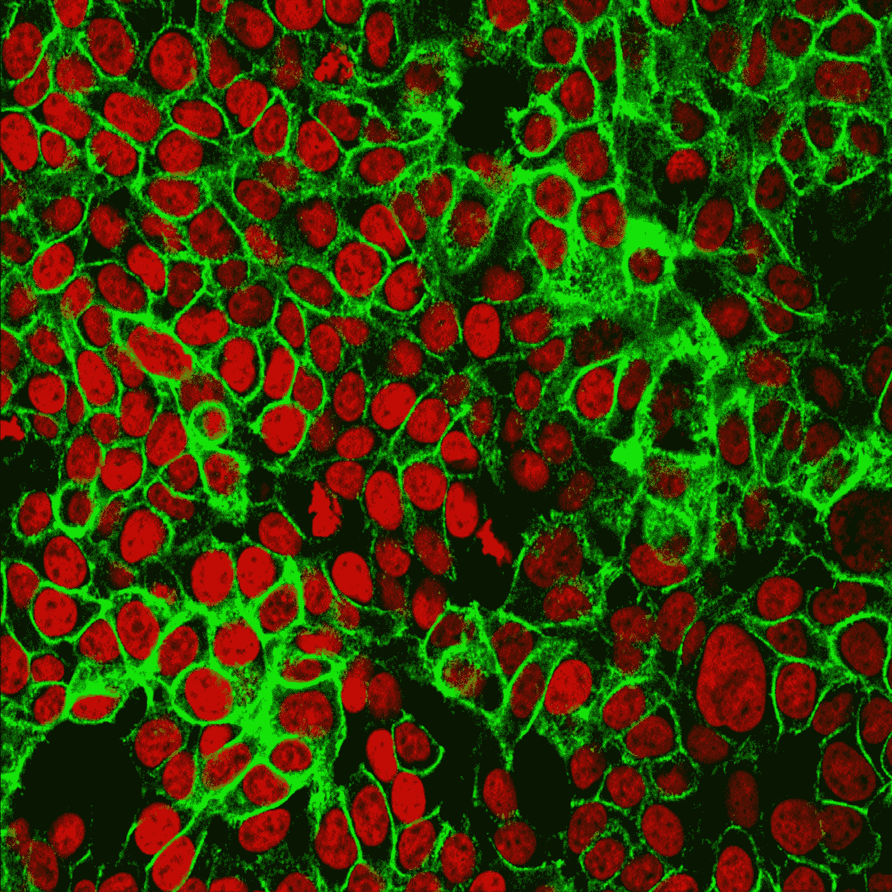
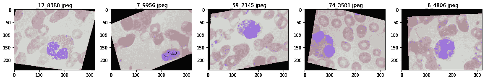

# 用张量流对血细胞图像进行分类

> 原文：<https://medium.com/codex/classifying-blood-cell-images-with-tensorflow-e70ace0ad3ea?source=collection_archive---------7----------------------->

大家好！在这篇博客中，我们将学习如何用 Python 编写一个脚本，该脚本可以对我们从 Kaggle 数据集获取的血液样本图像进行分类。



[国立癌症研究所](https://unsplash.com/@nci?utm_source=medium&utm_medium=referral)在 [Unsplash](https://unsplash.com?utm_source=medium&utm_medium=referral) 上拍摄的照片

对患者血液样本进行识别和分类是诊断血液疾病的标准部分。用于检测和分类自动化血细胞亚型的方法具有重要的医学意义。

我们将使用来自以下位置的数据集:

[](https://www.kaggle.com/paultimothymooney/blood-cells) [## 血细胞图像

### 12，500 张图像:4 种不同的细胞类型

www.kaggle.com](https://www.kaggle.com/paultimothymooney/blood-cells) 

> 该数据集(CSV)包含 12，500 张带有细胞类型标签的血细胞放大图片(JPEG)。四种细胞类型中的每一种都有大约 3000 张照片，它们被组织到四个文件夹中(根据细胞类型)。嗜酸性粒细胞、淋巴细胞、单核细胞和嗜中性粒细胞是四种细胞类型。
> 
> Kaggle，血细胞图像数据集

首先，我们将从导入所需的库开始。

我们将把数字印在 20x20 的画框里，以便提前看到图片。从数据集中，我们将训练数据的文件夹输入到脚本中，并将值存储在一个名为`test_folder`的变量中。for 循环将向我们展示来自训练集的五幅不同的图片。



这里我们声明图像的宽度和高度，并使用函数创建两个数据数组，由输入目录中的文件名信息组成。该函数还用于将图像类型转换为数组`float32`并进行归一化。

我们使用字典绘制不同类型的血细胞。

```
{'EOSINOPHIL': 0, 'LYMPHOCYTE': 1, 'MONOCYTE': 2, 'NEUTROPHIL': 3}
```

我们训练 Tensorflow Keras 模型从数据集中找到所需的图形。

我们将使用预定义数量的历元来拟合模型。我在这个例子中使用了五个纪元。您可以增加历元的数量以提高精确度。

这是完整的代码。

# 结论

终于！使用上面的方法，我们可以用 Python 编写一个用于图像分类的脚本。感谢您的阅读，我会继续添加新的说明和示例。其他文章和更新，请在 [LinkedIn](http://linkedin.com/in/bkullukcu) 上联系我。也可以在 [GitHub](https://github.com/bkullukcu) 上关注我。

# 参考

*   https://github.com/Shenggan/BCCD_Dataset 麻省理工学院许可证
*   Khandelwal，R，*为深度学习模型加载自定义图像数据集:第 1 部分*，2020 年 8 月 20 日，【www.towardsdatascience.com 