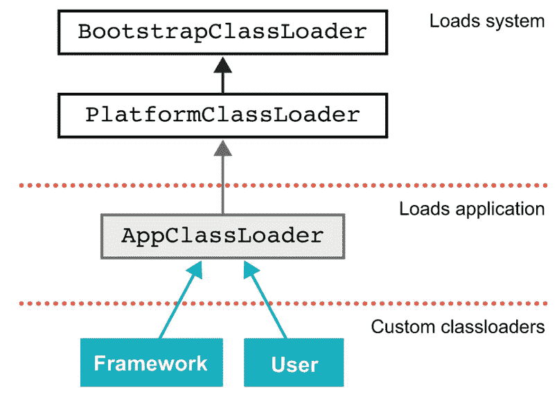

# 类加载器和反射

> 原文：<https://medium.com/codex/classloaders-and-reflection-ba60a886528a?source=collection_archive---------2----------------------->

## 文章

## *摘自本杰明·埃文斯、杰森·克拉克和马丁·韦尔伯格的《扎实的 Java 开发者》第二版*

**本文讨论 Java 中的类加载器和反射。**

*在 manning.com结账时，在折扣码框中输入 **fccevans2** ，即可享受 37%的折扣。*

*Java 是一个具有动态运行时的基本面向对象的系统。其中一个方面是，Java 的类型在运行时是活跃的，并且可以修改与运行的 Java 平台一起使用的类型系统——特别是通过添加新的类型。*

*这意味着组成 Java 程序的类型在运行时对未知类型的扩展是开放的(除非它们是`final`或新的`sealed`类之一)。*

*类加载功能对用户是公开的——Java 类和可以修改类型系统的加载器本身就是 Java 类型。在现代 Java 环境中，所有的类装入器都是模块化的——装入类总是在模块的上下文中完成。*

*该平台附带了许多典型的类加载器，这些类加载器用于在平台的启动和正常操作期间执行不同的工作。*

*`BootstrapClassLoader`又名原始类加载器——这是在启动虚拟机的早期实例化的——通常最好把它看作是虚拟机的一部分。它通常用于加载绝对基本系统-`java.base`。*

*`PlatformClassLoader`–在最小系统被引导之后，平台类加载器加载应用程序所依赖的平台模块。这个类装入器是访问任何平台类的主要接口——不管它是由这个装入器还是由引导程序装入的。*

*应用程序类加载器——这是使用最广泛的类加载器。这将加载应用程序类，并完成大多数现代 Java 环境中的大部分工作。在模块化环境中，应用程序类加载器不再是`URLClassLoader`的一个实例(就像在 Java 8 和之前的版本中一样)，而是一个内部类的实例。*

*让我们通过向`wgjd.discovery`模块添加一个名为`DisplayClassloaders`的类来看看这些新的类加载器的运行情况:*

```
*package wgjd.discovery;

 import com.sun.tools.attach.VirtualMachineDescriptor;

 public class DisplayClassloaders {
     public static void main(String[] args) {
         var clThis = DisplayClassloaders.class.getClassLoader();
         System.out.println(clThis);
         var clObj = Object.class.getClassLoader();
         System.out.println(clObj);
         var clAttach = VirtualMachineDescriptor.class.getClassLoader();
         System.out.println(clAttach);
     }
 }*
```

*这会产生以下输出:*

```
*$ java --add-exports=jdk.internal.jvmstat/sun.jvmstat.monitor=wgjd.discovery --module-path=out -m wgjd.discovery/wgjd.discovery.DisplayClassloaders
 jdk.internal.loader.ClassLoaders$AppClassLoader@5fd0d5ae
 null
 [jdk.internal.loader.ClassLoaders$AppClassLoader@5fd0d5ae](mailto:jdk.internal.loader.ClassLoaders$AppClassLoader@5fd0d5ae)*
```

*注意，`Object`(在`java.base`中)的类加载器报告为`null`。这是一个安全特性——引导类加载器不验证，并提供对它加载的每个类的完全安全访问。因此，在 Java 运行时中表示和提供类加载器是没有意义的——太多潜在的错误和/或滥用。*

*除了它们的核心角色之外，类加载器还经常用于从 JAR 文件或类路径上的其他位置加载资源(不是类的文件，比如图像或配置文件)。*

*这通常出现在与 try-with-resources 结合产生如下代码的模式中:*

```
*try (var is = TestMain.class.getResourceAsStream("/resource.csv");
      var br = new BufferedReader(new InputStreamReader(is));) {
      // ...
 }
 // Exception handling elided*
```

*类加载器以几种不同的形式提供这种机制——返回一个`File`或一个`InputStream`,但不幸的是不是一个`Path`。*

## ***自定义类加载***

*在更复杂的环境中，通常有许多额外的*自定义类加载器*——子类化`java.lang.ClassLoader`的类(直接或间接)。这是可能的，因为 classloader 类不是最终的，事实上，开发人员被鼓励编写他们自己的类加载器来满足他们的个人需求。*

***定制的类加载器被表示为 Java 类型，它们需要由一个类加载器加载——通常被称为它们的*父类加载器*。这不应该与类继承和父类混淆——相反，类装入器通过一种形式的*委托*联系起来。***

*在图 1 中，您可以看到类装入器的委托层次结构，以及不同装入器之间的关系。在一些特殊的情况下，一个定制的类加载器可能有一个不同的类加载器作为它们的父类，但是通常的情况是加载类加载器。*

**

*图一。类加载器层次结构*

*自定义机制的关键是在`ClassLoader`上定义的方法`loadClass()`和`findClass()`。主入口点是`loadClass()`，ClassLoader '中相关代码的简化形式是:*

```
*protected Class<?> loadClass(String name, boolean resolve)
         throws ClassNotFoundException
     {
         synchronized (getClassLoadingLock(name)) {
             // First, check if the class has already been loaded
             Class<?> c = findLoadedClass(name);
             if (c == null) {
                 // ...
                 try {
                     if (parent != null) {
                         c = parent.loadClass(name, false);
                     } else {
                         c = findBootstrapClassOrNull(name);
                     }
                 } catch (ClassNotFoundException e) {
                     // ClassNotFoundException thrown if class not found
                     // from the non-null parent class loader
                 }

                 if (c == null) {
                     // If still not found, then invoke findClass in order
                     // to find the class.
                     // ...
                     c = findClass(name);

                     // ...
                 }
             }
             // ...

             return c;
         }
     }*
```

*这意味着`loadClass()`机制查看类是否已经被加载，然后询问它的父类加载器。如果该类加载失败(注意围绕对`parent.loadClass(name, false)`的调用的 try-catch ),那么加载过程将委托给`findClass()`。`java.lang.ClassLoader`中`findClass()`的定义很简单——它抛出一个`ClassNotFoundException`。*

*现在，让我们回到文章开始时提出的一个问题，探索在类加载过程中可能遇到的一些异常和错误类型。*

## ***类加载异常***

*首先,`ClassNotFoundException`的意思相对简单——类加载器试图加载指定的类，但是无法完成。在请求加载时，这个类对 JVM 是未知的——JVM 也找不到它。*

*接下来是`NoClassDefFoundError`——注意这是一个*错误*而不是一个异常。这个错误表明 JVM 知道所请求的类的存在，但是没有在其内部元数据中找到它的定义。*

*让我们快速看一个例子:*

```
*public class ExampleNoClassDef {

     public static class BadInit {
         private static int thisIsFine = 1 / 0;
     }

     public static void main(String[] args) {
         try {
             var init = new BadInit();
         } catch (Throwable t) {
             System.out.println(t);
         }
         var init2 = new BadInit();
         System.out.println(init2.thisIsFine);
     }
 }*
```

*当它运行时，我们得到如下输出:*

```
*$ java ExampleNoClassDef
 java.lang.ExceptionInInitializerError
 Exception in thread "main" java.lang.NoClassDefFoundError: Could not initialize class ExampleNoClassDef$BadInit
         at ExampleNoClassDef.main(ExampleNoClassDef.java:13)*
```

*这表明 JVM 试图加载`BadInit`类，但是没有成功。然而，程序捕捉到了异常并试图继续运行。当第二次遇到该类时，JVM 的内部元数据表显示该类已经被看到——但是没有加载有效的类。*

*JVM 在失败的类加载尝试上有效地实现了*负缓存*——加载不会重试，而是抛出一个错误(`NoClassDefFoundError`)。*

*另一个常见错误是`UnsupportedClassVersionError`——当类加载操作试图加载由比运行时版本更高版本的 Java 源代码编译器编译的类文件时，就会触发该错误。*

*例如，考虑一个用 Java 11 编译的类，我们试图在 Java 8 上运行:*

```
*$ java ScratchImpl
 Error: A JNI error has occurred, please check your installation and try again
 Exception in thread "main" java.lang.UnsupportedClassVersionError: ScratchImpl has been compiled by a more recent version of the Java Runtime (class file version 55.0), this version of the Java Runtime only recognizes class file versions up to 52.0
         at java.lang.ClassLoader.defineClass1(Native Method)
         at java.lang.ClassLoader.defineClass(ClassLoader.java:763)
         at java.security.SecureClassLoader.defineClass(SecureClassLoader.java:142)
         at java.net.URLClassLoader.defineClass(URLClassLoader.java:468)
         at java.net.URLClassLoader.access$100(URLClassLoader.java:74)
         at java.net.URLClassLoader$1.run(URLClassLoader.java:369)
         at java.net.URLClassLoader$1.run(URLClassLoader.java:363)
         at java.security.AccessController.doPrivileged(Native Method)
         at java.net.URLClassLoader.findClass(URLClassLoader.java:362)
         at java.lang.ClassLoader.loadClass(ClassLoader.java:424)
         at sun.misc.Launcher$AppClassLoader.loadClass(Launcher.java:349)
         at java.lang.ClassLoader.loadClass(ClassLoader.java:357)
         at sun.launcher.LauncherHelper.checkAndLoadMain(LauncherHelper.java:495)*
```

*Java 11 格式的字节码中可能有运行时不支持的特性，继续尝试加载它是不安全的。注意，因为这是 Java 8 运行时，所以在堆栈跟踪中没有模块化条目。*

*最后，我们还应该提到`LinkageError`——它是包含`NoClassDefFoundError`、`VerifyError`和`UnsatisfiedLinkError`以及其他几种可能性的层次结构的基类。*

## ***第一个定制的类加载器***

*定制类加载的最简单形式是子类化`ClassLoader`并覆盖`findClass()`。这允许我们重用前面讨论过的`loadClass()`逻辑，并降低我们的类加载器的复杂性。*

*我们的第一个例子是`SadClassLoader`——它不做任何事情，但确保你知道它在技术上参与了这个过程，它祝你一切顺利。*

```
*public class LoadSomeClasses {

     public static class SadClassloader extends ClassLoader {
         public SadClassloader() {
             super(SadClassloader.class.getClassLoader());
         }

         public Class<?> findClass(String name) throws ClassNotFoundException {
             System.out.println("I am very concerned that I couldn't find the class");
             throw new ClassNotFoundException(name);
         }
     }

     public static void main(String[] args) {
         if (args.length > 0) {
             var loader = new SadClassloader();
             for (var name : args) {
                 System.out.println(name +" ::");
                 try {
                     var clazz = loader.loadClass(name);
                     System.out.println(clazz);
                 } catch (ClassNotFoundException x) {
                     x.printStackTrace();
                 }
             }
         }
     }
 }*
```

*在我们的示例中，我们设置了一个简单的类加载器和一些代码，使用它来尝试加载可能已经加载的类。*

*自定义类加载器的一个常见约定是提供一个 void 构造函数，该构造函数调用超类构造函数并提供加载类加载器作为参数(成为父类)。*

*许多定制的类加载器并不比我们的例子复杂多少——它们覆盖了`findClass()`来提供特定的所需功能。例如，这可以包括在网络上查找课程。在一个令人难忘的案例中，一个定制的类加载器通过 JDBC 连接到一个数据库，并访问一个加密的二进制列来获取将要使用的字节，从而加载类。这是为了在高度管控的环境中满足敏感代码的静态加密要求。*

*除了覆盖`findClass()`，还可以做更多的事情。例如，`loadClass()`不是 final，它可以被覆盖，事实上，一些定制的类加载器覆盖它，正是为了改变我们前面遇到的一般逻辑。*

*最后，还有在`ClassLoader`上定义的方法`defineClass()`。*

*这个方法是类加载的关键——因为它是执行我们在本文前面描述的“加载和链接”过程的用户可访问的方法。它接受一个字节数组，并将它们转换成一个类对象。这是用于在运行时加载类路径中不存在的新类的主要机制。*

*对`defineClass()`的调用只有在传递了正确的 JVM 类文件格式的字节缓冲区时才起作用——如果没有，那么它将无法加载——因为加载或验证步骤都会失败。*

***该方法可用于高级技术，如加载运行时生成的没有源代码表示的类。这种技术就是 lambda 表达式机制在 Java 中的工作方式。***

*`defineClass()`方法既是受保护的也是最终的，它在`java.lang.ClassLoader`上被定义为只能被`ClassLoader`的子类访问。定制类加载器总是可以访问`defineClass()`的基本功能，但是不能篡改验证或其他低级类加载逻辑。最后一点很重要——不能改变验证算法是一个有用的安全特性，因为这意味着一个写得很差的定制类加载器不能损害 JVM 提供的基本平台安全性。*

*在 HotSpot 虚拟机的情况下(这是目前最常见的 Java VM 实现)，`defineClass()`委托给本地方法`defineClass1()`，该方法执行一些基本的检查，然后调用一个名为`JVM_DefineClassWithSource()`的 C 函数。*

*这个函数是 JVM 的入口点——它提供了对 HotSpot 的 C++代码的访问。HotSpot 使用 C++ `SystemDictionary`通过 C++方法`ClassFileParser::parseClassFile()`加载新类。这是运行大部分链接过程的代码，尤其是验证算法。*

*一旦类加载完成，方法的字节码就被放入 Hotspot 的表示方法的元数据对象中(它们被称为 *methodOops* )。然后字节码解释器就可以使用它们了。这在概念上可以被认为是一个方法缓存，尽管出于性能原因，字节码被内联保存在 methodOops 中。*

*我们已经见过了`SadClassloader`，但是让我们看看另外两个定制类加载器的例子，首先看看如何使用类加载来实现*依赖注入* (DI)。*

## ***示例:依赖注入框架***

*DI 理念的核心是两个主要概念:*

*   *系统中的功能单元具有依赖关系和配置信息，它们依赖这些信息来正常运行。*
*   *许多对象系统具有难以表达或难以表达的依赖关系。*

*你头脑中的图像应该是包含行为的类，以及对象外部的配置和依赖。后一部分通常被称为对象的*运行时连接*。*

*在这个例子中，我们将讨论一个假想的 DI 框架如何利用类加载器来实现运行时连接。我们将采用的方法类似于 Spring 框架原始实现的简化版本。*

*现代的 DI 框架经常使用另一种方法，这种方法具有更高的编译时安全性——但是这种方法的复杂性和理解的认知负荷要高得多。我们的示例仅用于演示目的。*

*让我们先来看看如何在我们想象的 DI 框架下启动一个应用程序:*

```
*java -cp <CLASSPATH> org.wgjd.DIMain /path/to/config.xml*
```

*类路径必须包含 DI 框架的 JAR 文件，以及 config.xml 文件中引用的任何类(以及它们的任何依赖项)。*

*为了在 DI 下进行管理，您还需要一个配置文件，如下所示:*

```
*<beans>

   <bean id="dao" class="wgjd.ch03.PaymentsDAO">
     <constructor-arg index="0" value="jdbc:postgresql://db.wgjd.org/payments"/>
     <constructor-arg index="1" value="org.postgresql.Driver"/>
   </bean>

   <bean id="service" class="wgjd.ch03.PaymentService">
     <constructor-arg index="0" ref="dao"/>
   </bean>

 </beans>*
```

*在这种技术中，DI 框架使用配置文件来决定构建哪些对象。这个例子需要制作`dao`和`service`bean，框架调用每个 bean 的构造函数。*

*这意味着类加载发生在两个独立的阶段。第一阶段(由应用程序类加载器处理)加载类 DIMain 及其引用的任何类。然后 DIMain 开始运行，并接收配置文件的位置作为`main()`的参数。*

*此时，框架已经在 JVM 中启动并运行，但是在`config.xml`中指定的用户类还没有被触及。事实上，在`DIMain`检查配置文件之前，框架无法知道哪些类将被加载。*

***这个例子是假设性的和说明性的——完全有可能构建一个简单的 DI 框架，完全按照描述的方式工作。实际上，真正的 DI 系统的实现通常更加复杂。***

*要调出`config.xml`中指定的应用程序配置，需要进行第二阶段的类加载。这使用了一个定制的类加载器。*

*首先，检查`config.xml`文件的一致性，确保它没有错误。然后，如果一切正常，自定义类加载器尝试从`CLASSPATH`加载类型。如果其中任何一个失败，整个过程都会中止，从而导致运行时错误。*

*如果成功，DI 框架就可以按照正确的顺序实例化所需的对象，并在创建的实例上调用任何 setter 方法。最后，如果所有这些都完成了，应用程序上下文就启动了，可以开始运行了。*

## *示例:检测类加载器*

*考虑一个类加载器，它在加载类时改变类的字节码，以添加额外的插装信息。当测试用例针对转换后的代码运行时，插装代码记录测试用例测试了哪些方法和代码分支。由此，开发人员可以看到对一个类的单元测试有多彻底。*

*这种方法是 EMMA 测试覆盖工具的基础，该工具仍然可以从[http://emma.sourceforge.net/](http://emma.sourceforge.net/)获得，尽管它现在已经相当过时，并且没有跟上现代 Java 版本的发展。*

*尽管如此，经常会遇到框架和其他代码使用专门的类加载器，在加载字节码时转换字节码。*

***在加载字节码时修改字节码的技术也出现在 *java 代理*方法中，该方法用于性能监控、可观察性和其他目标——由 New Relic 等工具实现。***

*我们已经简要介绍了定制类加载的几个用例。Java 技术领域的许多其他领域都是类加载器和相关技术的大用户。以下是一些最著名的例子:*

*   *插件架构*
*   *框架(无论是供应商的还是自己开发的)*
*   *从异常位置(不是文件系统或 URL)检索类文件*
*   *Java EE*
*   *在 JVM 进程已经开始运行之后，可能需要添加新的未知代码的任何情况*

*让我们继续讨论模块系统是如何影响类加载和修改我们已经解释过的经典图片的。*

## ***模块和类加载***

*模块系统被设计成在不同于类加载的层次上运行，类加载是平台中相对较低层次的机制。模块是关于程序单元之间大规模的依赖关系，而类加载是关于小规模的依赖关系，但是理解这两种机制如何交叉以及程序启动的变化是很重要的，这些变化是由模块的到来引起的。*

*回想一下，当运行在一个模块化的 JVM 上，然后执行一个程序时，运行时首先计算一个模块图并试图满足它。这被称为*模块解析*，它导出根模块及其依赖关系的传递闭包。*

*在此过程中，会执行额外的检查(例如，没有重名的模块、没有拆分的包等)。模块图的存在意味着预计运行时类加载问题会更少——因为模块路径上丢失的 jar 现在甚至可以在进程完全开始之前就被检测到。*

*除此之外，在大多数情况下，模块系统不会改变类加载。一些高级的可能性是存在的，比如通过使用反射来动态加载服务提供者接口的模块化实现，但是这些不太可能被大多数开发人员遇到。*

## ***倒影***

*一个基础良好的 Java 开发人员应该掌握的关键技术之一是*反射*。这是一个极其强大的功能，但是许多开发人员一开始都很纠结——因为这似乎与大多数 Java 开发人员思考代码的方式格格不入。*

*反射是查询或*自省*对象并在运行时发现(和使用)它们的能力的能力。根据上下文，它可以被认为是几种不同的东西:*

*   *一种编程语言 API*
*   *编程风格或技术*
*   *支持该技术的运行时机制*
*   *语言类型系统的一个属性*

*面向对象系统中的反射是指编程环境可以将程序的类型和方法表示为对象。这只有在运行时支持它的语言中才有可能——这是语言的一个基本动态方面。*

*当使用反射式编程时，根本不用静态类型就可以操作对象。这似乎是一种倒退，但是如果我们可以在不需要知道对象的静态类型的情况下处理对象，那么这意味着我们可以构建能够处理任何类型的库、框架和工具——包括在编写处理代码时不存在的类型。*

*当 Java 还是一门年轻的语言时，反射是它带给主流的关键技术创新之一。尽管其他语言(特别是 Smalltalk)更早就引入了它，但在 Java 发布时，它并不是许多语言的共同部分。*

## ***引入反射***

*对反射的抽象描述经常看起来令人困惑或难以理解。让我们看看 JShell 中的一些简单示例，以尝试更具体地了解什么是反射:*

```
*jshell> Object o = new Object();
 o ==> java.lang.Object@a67c67e

 jshell> Class<?> clz = o.getClass();
 clz ==> class java.lang.Object*
```

*这是我们第一次看到反射——类型`Object`的类对象。事实上，`clz`的实际类型是`Class<Object>`，但是当我们从 classloading 或`getClass()`中获得一个类对象时，我们必须在泛型中使用未知类型`?`来处理它:*

```
*jshell> Class<Object> clz = Object.class;
 clz ==> class java.lang.Object

 jshell> Class<Object> clz = o.getClass();
 |  Error:
 |  incompatible types: java.lang.Class<capture#1 of ? extends java.lang.Object> cannot be converted to java.lang.Class<java.lang.Object>
 |  Class<Object> clz = o.getClass();
 |                      ^----------^*
```

*这是因为反射是一种动态的运行时机制，真正的类型`Class<Object>`对于源代码编译器来说是未知的。这给使用反射带来了不可减少的额外复杂性——因为我们不能依赖 Java 类型系统来帮助我们。*

***另一方面，这种动态性是反射的关键点——如果我们在编译时不知道某个东西是什么类型。我们必须用一种通用的方式来对待它，这种方式可以为构建一个开放的、可扩展的系统创造灵活性..反射产生了一个基本上开放的系统，这可能会与 Java 模块试图带给平台的更多封装的系统发生冲突。***

*许多熟悉的框架和开发工具严重依赖反射来实现它们的功能，比如调试器和代码浏览器。插件架构、交互式环境和 REPLs 也广泛使用反射。事实上，如果没有反射子系统，JShell 是无法用语言构建的。*

```
*jshell> class Pet {
    ...>   public void feed() {
    ...>     System.out.println("Feed the pet");
    ...>   }
    ...> }
 |  created class Pet

 jshell> var clz = Pet.class;
 clz ==> class Pet*
```

*现在我们有了一个表示 Pet 的类类型的对象，我们可以用它来做其他的动作，比如创建一个新的实例:*

```
*jshell> Object o = clz.newInstance();
 o ==> Pet@66480dd7*
```

*问题是`newInstance()`返回`Object`——这不是一个有用的类型。我们可以将`o`转换回`Pet,`，但是这需要我们提前知道我们正在处理什么类型——这与反射的动态本质相悖；让我们试试别的:*

```
*jshell> import java.lang.reflect.Method;

 jshell> Method m = clz.getMethod("feed", new Class[0]);
 m ==> public void Pet.feed()*
```

*现在我们有了一个表示方法`feed()`的对象——但是它把它表示为抽象元数据——它不附属于任何特定的实例。*

*对于表示方法的对象，最自然的做法是调用它。类`java.lang.reflect.Method`定义了一个方法`invoke()`，它的作用是调用`Method`对象所代表的方法。*

*在 JShell 中工作时，我们避免了大量的异常处理代码。当编写使用反射的常规 Java 代码时，您需要以某种方式处理可能的异常类型。*

*为了使这个调用成功，我们必须提供正确数量和类型的参数。该参数列表必须包括反射调用方法的*接收器对象*(假设该方法是实例方法)。在我们的简单示例中，情况如下:*

```
*jshell> Object ret = m.invoke(o);
 Feed the pet
 ret ==> null*
```

*除了`Method`对象，反射还提供了表示 Java 类型系统和语言中其他基本概念的对象——比如字段、注释和构造函数。这些类可以在`java.lang.reflect`包中找到——其中一些(比如`Constructor`)是泛型类型。*

*反射子系统必须升级以处理模块。因为类和方法可以被反射地对待，所以也需要一个反射 API 来处理模块。不出所料，key 类是`java.lang.Module`，它可以直接从`Class`对象中访问:*

```
*var module = String.class.getModule();
 var descriptor = module.getDescriptor();*
```

*模块的描述符属于 ModuleDescriptor 类型，并提供关于模块的元数据的只读视图，相当于 module-info.class 的内容。*

*在新的反射 API 中，诸如模块发现之类的动态功能也是可能的。这是通过 ModuleFinder 之类的接口实现的，但是如何使用模块系统进行反射式工作的详细描述超出了本文的范围。*

## ***结合类加载和反射***

*让我们看一个结合了类加载和反射的例子。我们不需要遵循通常的`findClass()`和`loadClass()`协议的完整的类加载器。相反，我们将子类化`ClassLoader`来访问受保护的`defineClass()`方法。*

*main 方法接受一个文件名列表，如果它们是 Java 类，则使用反射依次访问每个方法，并检测它是否是本机方法:*

```
*public class NativeMethodChecker {

     public static class EasyLoader extends ClassLoader {
         public EasyLoader() {
             super(EasyLoader.class.getClassLoader());
         }

         public Class<?> loadFromDisk(String fName) throws IOException {
             var b = Files.readAllBytes(Path.of(fName));
             return defineClass(null, b, 0, b.length);
         }
     }

     public static void main(String[] args) {
         if (args.length > 0) {
             var loader = new EasyLoader();
             for (var file : args) {
                 System.out.println(file +" ::");
                 try {
                     var clazz = loader.loadFromDisk(file);
                     for (var m : clazz.getMethods()) {
                         if (Modifier.isNative(m.getModifiers())) {
                             System.out.println(m.getName());
                         }
                     }
                 } catch (IOException | ClassFormatError x) {
                     System.out.println("Not a class file");
                 }
             }
         }
     }
 }*
```

*这些类型的例子对于探索 Java 平台的动态本质和学习反射 API 如何工作是很有趣的，但是对于一个有良好基础的 Java 开发人员来说，意识到在进行反射工作时可能出现的局限性和偶尔的挫折是很重要的。*

## ***反射问题***

*反射 API 从 1.1 (1996)开始就是 Java 平台的一部分，在这 25 年中，出现了许多问题和弱点。这些不便之处包括:*

*   *这是一个老的 API——到处都是数组类型(它早于 Java 集合)*
*   *确定调用哪个方法重载是很痛苦的*
*   *API 有两种不同的方法`getMethod()`和`getDeclaredMethod()`来反射性地访问方法*
*   *API 提供了可以用来忽略访问控制的`setAccessible()`方法*
*   *反射调用的异常处理是复杂的——被检查的异常被提升为运行时异常*
*   *装箱和取消装箱是进行传递或返回原语的反射调用所必需的*
*   *原始类型需要占位符类对象，例如`int.class`—`Class<Integer>`类型*
*   *`void`方法需要引入`java.lang.Void`类型*

*除了 API 中各种尴尬的角落，Java 反射总是遭受性能不佳的困扰——原因有几个，包括对 JVM 的 JIT 编译器不友好。*

*解决反射调用性能的问题是添加方法句柄 API 的主要原因之一。*

*反射的最后一个问题仍然存在，这可能更像是一个哲学问题(或反模式):开发人员经常遇到反射，这是他们在 Java 中升级时遇到的第一个真正高级的技术之一。*

*因此，它可能会被过度使用，或者成为一种*金锤*技术——用于实现过度灵活的系统，或者显示不需要的内部微型框架的系统(有时被称为*内部框架*反模式)。这种系统通常是可配置的，但代价是将领域模型编码到配置中，而不是直接编码到领域类型中。*

*反射是一项伟大的技术，是基础良好的 Java 开发人员应该拥有的工具箱中的一项技术，但是它并不适合每种情况，大多数开发人员可能只需要谨慎地使用它。*

*目前就这些。如果你想了解这本书的更多信息，你可以在曼宁的 liveBook 平台[这里](https://livebook.manning.com/book/the-well-grounded-java-developer-second-edition?origin=product-look-inside&utm_source=medium&utm_medium=organic&utm_campaign=book_evans2_wellgrounded_12_8_20)查看。*