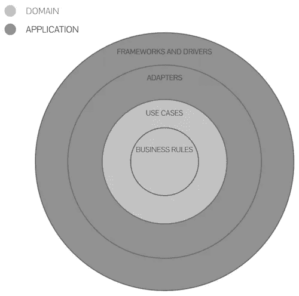
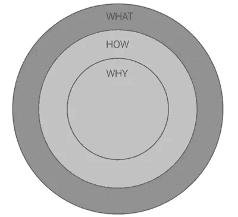
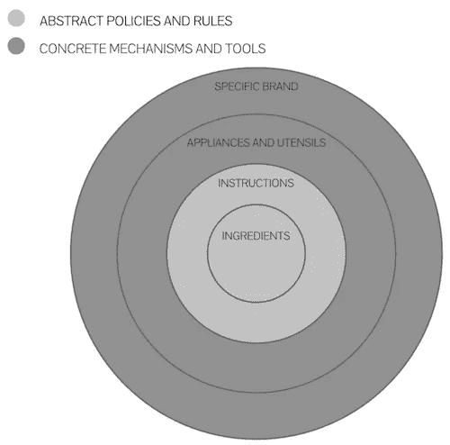

# 干净的建筑——蛋糕配方版本

> 原文：<https://medium.com/codex/clean-architecture-cake-recipe-version-8f97c5cd2616?source=collection_archive---------13----------------------->

Clean Architecture 是一种分层的类型模式，旨在帮助开发人员在规划和开发级别划分职责。下面我们有最常见的设计，你可以在网上找到它的无穷变化。

这种划分代表了领域(业务)和应用程序(技术)之间的分离。

好吧，但这意味着什么？

领域是**为什么**和**我们打算如何做某事**。
应用程序是**我们将使用它来实现这一点**。

*那样的话，对我来说，看起来和**黄金圈**差不多。

将此应用到一个例子中，让我们从一个简单的食谱的角度来考虑。
当罗伯特·c·马丁说一个概念→我们可以听到一个主语:

域→ *抽象策略和规则* 业务规则→ *成分* 用例→ *说明*

应用→ *具体机构和工具* 适配器→ *器具和用具* 框架和驱动器→ *具体品牌*

我们有抽象的指令，我们可以有不同的工具来付诸实践，对不对？

所以，我们开始吧。

**域**

> 我们想要一个草莓巧克力蛋糕。这里有我们做这个蛋糕需要的所有材料和说明。

商业规则:
1。面团→鸡蛋、面粉、牛奶、低脂原味酸奶、酵母、可可、糖
2。糖浆→奶油、巧克力
3。馅料→草莓、糖

使用案例:
1。面团→将所有材料混合后放入预热好的烤箱
2。糖浆→在炉子上用平底锅小火融化巧克力，与奶油混合
3。馅料→在低热炉上混合锅里的材料，直到它变成果冻

> 如果配料是低脂原味酸奶，而你用的是百香果蛋白酸奶，结果可能看起来很像，但它们不会完全一样，我们可能会在味道、稠度和营养成分上有所不同。这意味着如果你改变这一层，无论是配料还是说明，你都会有不同的结果，**甚至可能不是蛋糕**。

**应用**

> 在这里，我们有所有的外部工具，将有助于转变和转换原料到一个新的组合形式，能够创造出蛋糕应该有的样子。

适配器:
1。搅拌机
2。火炉
3。烤箱
4。潘
5。铲

框架和驱动:
1。x 品牌
2。y 品牌
3。z 品牌
4。…

> 如果你第一次做这道菜时用的是竹刮刀或 X 牌搅拌机，第二次用的是硅胶刮刀或 Y 牌搅拌机(效力相同)，我们肯定不会在味道、稠度和营养数据上有任何变化。这意味着您不需要太在意在某个时候是否需要更换/更新任何仪器。只需做一点研究，选择最符合您需求的**。**

**丁丁丁丁丁丁丁丁丁丁丁丁。坦坦坦坦坦坦**

> ***学分***

**[金色圆圈](https://www.youtube.com/watch?v=POfQlg0V0Cc)**

**[洁净的建筑](https://blog.cleancoder.com/uncle-bob/2012/08/13/the-clean-architecture.html)**